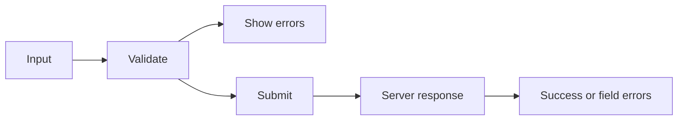

# Forms in React

## Detailed explanation
Forms in React are where user input, component state, validation, accessibility, and server mutation meet. A form can be built with controlled inputs, uncontrolled inputs, or a library such as React Hook Form that manages subscriptions and validation.

Interviewers care about forms because they reveal real production maturity. A good form handles pending submit state, prevents double submit, shows errors accessibly, maps server errors back to fields, and keeps performance acceptable as fields grow.

## 1. One-line mental model
Forms in React connect user input, validation, submission, and feedback through controlled or uncontrolled state patterns.

## 2. Problem it solves
Production forms need more than input fields. They must handle validation, error display, dirty state, touched state, async checks, server errors, loading states, resets, accessibility, and double-submit prevention.

## 3. Core idea
- Choose controlled or uncontrolled based on UI needs and performance.
- Keep validation close to the form contract.
- Show field errors accessibly.
- Treat server validation as the final authority.
- Disable or guard submit while submission is pending.

## 4. Visual / analogy
A form is like a checkpoint: collect data, validate it, show exact problems, then send accepted data forward.



## 5. Minimal example

```tsx
function LoginForm() {
  const [email, setEmail] = React.useState("");

  function handleSubmit(event: React.FormEvent<HTMLFormElement>) {
    event.preventDefault();
    console.log({ email });
  }

  return (
    <form onSubmit={handleSubmit}>
      <label htmlFor="email">Email</label>
      <input id="email" value={email} onChange={(event) => setEmail(event.target.value)} />
      <button type="submit">Login</button>
    </form>
  );
}
```

## 6. Real-world example

```tsx
const schema = z.object({
  email: z.string().email(),
  password: z.string().min(8),
});

function LoginForm() {
  const form = useForm({ resolver: zodResolver(schema) });
  const login = useMutation({ mutationFn: authApi.login });

  return (
    <form onSubmit={form.handleSubmit((values) => login.mutate(values))}>
      <input aria-invalid={Boolean(form.formState.errors.email)} {...form.register("email")} />
      <input type="password" {...form.register("password")} />
      <button disabled={login.isPending}>Sign in</button>
    </form>
  );
}
```

## 7. Common interview questions
#### How do forms work in React?
- **The Engine Mechanism (Why it behaves this way):** A React form is a collection of controlled or uncontrolled inputs wrapped in a `<form>` element with an `onSubmit` handler. When the user submits, the browser fires a native `submit` event. React's synthetic event system captures it, calls `event.preventDefault()` to prevent page navigation, and executes the handler. If inputs are controlled, their values are already in React state. If uncontrolled, values are read from the DOM via refs or `FormData`. The handler then processes the data — validating, sending to an API, or updating server state. Throughout this flow, React's render cycle manages validation states, error display, loading indicators, and success/failure UI branches.
- **The Unforgettable Mental Model:** The **Airport Check-In Counter**. Passengers (users) arrive with documents (input values). The agent (onSubmit handler) verifies everything (validation), stamps the boarding pass (processes data), and either sends them to security (success) or asks them to fix something (error). The whole process is orchestrated, not chaotic.
- **The Trap:** Forgetting `event.preventDefault()` and watching the page reload on submit. Also, trusting only client-side validation — the server is the final authority.
- **Senior Interview Playbook (Verbal Script):** "When asked this in an interview, say: Forms in React work by combining input elements — either controlled with React state or uncontrolled with refs — inside a form element with an onSubmit handler. On submit, we prevent the default browser navigation, collect the form data from state or the DOM, validate it, and send it to the server. The form UI manages loading states, error display, and success feedback, all driven by React's state management and rendering cycle."

#### Controlled vs uncontrolled forms?
- **The Engine Mechanism (Why it behaves this way):** In a controlled form, each input's value is stored in React state. Every keystroke fires `onChange` → `setState` → re-render → reconciliation → commit. React's Fiber scheduler batches rapid updates, but each field still triggers render work. In an uncontrolled form, the DOM holds values, and React only re-renders for validation errors, touched states, or form-level status changes. The reconciliation phase for controlled forms compares the entire input tree; for uncontrolled forms, only error/skeleton components are compared. This is why React Hook Form (uncontrolled) outperforms fully controlled forms with many fields.
- **The Unforgettable Mental Model:** **Live Broadcasting vs. Recorded Interview**. Controlled form = live broadcast — every word the speaker says is transmitted instantly (re-render per keystroke). Uncontrolled form = recorded interview — everything is captured, but you only review the footage when needed (read values on submit).
- **The Trap:** Defaulting to controlled for every form without considering scale. A 3-field login form? Controlled is fine. A 50-field onboarding wizard? Uncontrolled or a library is better.
- **Senior Interview Playbook (Verbal Script):** "When asked this in an interview, say: Controlled forms store every input value in React state, giving us real-time validation and reactive UI at the cost of re-renders per keystroke. Uncontrolled forms let the DOM manage values and only involve React for validation metadata and submission. I choose controlled for small forms needing live feedback, and uncontrolled for large forms where performance matters. Libraries like React Hook Form combine uncontrolled inputs with subscription-based validation for the best of both worlds."

#### How do you validate forms?
- **The Engine Mechanism (Why it behaves this way):** Validation runs either synchronously in the `onChange`/`onBlur` handler or as a derived computation during render. For controlled forms, the handler checks the new value against rules (required, pattern, length) and updates an error state object. React then re-renders, and the error state drives conditional UI — red borders, error messages, disabled submit buttons. For schema validation (Zod, Yup), the entire form values object is validated against a schema definition, producing a structured error map that maps field names to error messages. The reconciliation phase updates only the DOM nodes tied to changed error states.
- **The Unforgettable Mental Model:** The **Quality Control Assembly Line**. Each product (input value) passes through inspection stations (validation rules). If it fails any station, it gets flagged (error state) and sent back for rework. Only products passing all stations reach shipping (form submission).
- **The Trap:** Showing validation errors on every keystroke — this creates a frustrating experience where the user sees errors before they've finished typing. Validation should typically run on blur or on submit, not on every change.
- **Senior Interview Playbook (Verbal Script):** "When asked this in an interview, say: I validate forms by running checks on input values — either in onChange or onBlur handlers for controlled forms, or through a library's validation pipeline. I prefer schema validation with tools like Zod because it provides a single source of truth for validation rules that can be shared between frontend and backend. Errors are stored in state and displayed conditionally, with validation typically triggered on blur or submit rather than every keystroke to avoid a frustrating user experience."

#### What is schema validation?
- **The Engine Mechanism (Why it behaves this way):** Schema validation defines a declarative contract for what valid form data looks like. Libraries like Zod, Yup, or Joi parse the form values object against the schema during validation. The schema engine runs each rule (type checks, string patterns, number ranges, custom refinements) and produces either a validated, typed output or a structured error object mapping field paths to error messages. In React, this validation runs in the submit handler or on field blur. The error object becomes React state, and during the next render, error messages are conditionally rendered based on the error state's structure.
- **The Unforgettable Mental Model:** The **Bouncer's Guest List**. The schema is the guest list with strict rules: must be 21+, must have ID, must be on the list. Each person (form value) is checked against every rule. Anyone who fails gets a specific reason written down (error message) and is turned away.
- **The Trap:** Duplicating validation logic between frontend schema and backend. The schema should be shared or generated from the same source to prevent drift between frontend and backend validation rules.
- **Senior Interview Playbook (Verbal Script):** "When asked this in an interview, say: Schema validation is a declarative way to define the shape and rules for form data. Instead of writing individual if-statements for each field, you define a schema — like with Zod — that specifies types, required fields, patterns, and custom rules. When validated, it either returns typed, safe data or a structured error object. The big advantage is that the same schema can be shared between frontend and backend, ensuring validation consistency across the entire stack."

#### React Hook Form vs Formik?
- **The Engine Mechanism (Why it behaves this way):** React Hook Form uses uncontrolled inputs with refs and a subscription model. Each input registers with the form, and RHF reads values directly from the DOM. Only validation metadata (errors, touched, dirty) lives in React state, so typing doesn't re-render inputs. Formik traditionally uses controlled inputs — each field's value lives in Formik's state object, and every keystroke triggers a state update that re-renders all fields (unless individually memoized). Formik v3 introduced uncontrolled mode, but RHF was designed uncontrolled from the start. RHF's bundle size is also smaller (~12kb vs ~15kb for Formik), and its API is more minimal.
- **The Unforgettable Mental Model:** **Efficient Mailroom vs. Central Switchboard**. RHF = each department (input) handles its own mail, only reporting exceptions to management (validation errors). Formik = all mail goes through a central switchboard (state) that processes and redistributes every single piece.
- **The Trap:** Assuming one is universally better. Formik has a richer ecosystem and more built-in features. RHF is more performant for large forms. The choice depends on form complexity and team familiarity.
- **Senior Interview Playbook (Verbal Script):** "When asked this in an interview, say: React Hook Form uses uncontrolled inputs with a subscription model, so typing doesn't trigger re-renders — only validation state changes do. This makes it highly performant for large forms. Formik traditionally uses controlled inputs, meaning every keystroke updates state and re-renders, though it has added uncontrolled options. RHF has a smaller bundle and simpler API, while Formik has a larger ecosystem and more built-in features. For new projects with complex forms, I prefer React Hook Form for its performance characteristics."

#### How do you handle server-side validation errors?
- **The Engine Mechanism (Why it behaves this way):** After form submission, the server may reject the data with validation errors (422 Unprocessable Entity). The response contains field-specific errors that must be mapped back to the form's error state. In React, this means catching the API error, parsing the error response, and updating the form's error state object — either through React Hook Form's `setError` API, Formik's `setErrors`, or manual state. React then re-renders, and the error state drives the display of field-level error messages. The key is maintaining the same error shape between client-side and server-side validation so the UI rendering logic doesn't need to distinguish between them.
- **The Unforgettable Mental Model:** The **Second Opinion Doctor**. Your local doctor (client validation) cleared you, but the specialist (server) found additional issues. The specialist's report (server errors) needs to be integrated into your medical record (form error state) so you know exactly what to address.
- **The Trap:** Losing server errors by overwriting them with client validation on the next field change. Server errors should persist until the user modifies the specific field, at which point client validation takes over.
- **Senior Interview Playbook (Verbal Script):** "When asked this in an interview, say: When the server returns validation errors, I parse the error response and map it to the form's error state using the library's API — like React Hook Form's setError. The key is using the same error shape for both client and server validation so the UI handles them identically. Server errors should persist until the user modifies the affected field, at which point client-side validation takes over. This ensures the user sees the most relevant error at any given time."

#### How do you prevent double submit?
- **The Engine Mechanism (Why it behaves this way):** Double submit happens when a user clicks the submit button multiple times before the first request completes. The solution is to track submission state in React — typically an `isPending` or `isSubmitting` boolean. When submit starts, this state is set to `true`. During the next render, the submit button is disabled (`disabled={isPending}`) and may show a loading indicator. React's state update triggers a re-render before the async request completes, so the button is disabled almost instantly. When the request resolves or fails, the state is set back to `false`, re-enabling the button. Mutation libraries like TanStack Query or React Query manage this `isPending` state automatically.
- **The Unforgettable Mental Model:** The **One-Way Turnstile**. Once someone enters (submit starts), the turnstile locks (button disabled) until they exit on the other side (request completes). No one can squeeze through twice.
- **The Trap:** Only disabling the button visually without the `disabled` attribute. Users can still click a visually-disabled button and trigger submits. The `disabled` attribute must be set on the actual button element.
- **Senior Interview Playbook (Verbal Script):** "When asked this in an interview, say: I prevent double submit by tracking a pending state that disables the submit button during the request. When the user submits, I set isSubmitting to true, which disables the button and shows a loading indicator. The request runs, and on success or failure, I reset isSubmitting to false. Libraries like TanStack Query handle this automatically with their isPending state. I also add server-side idempotency keys as a defense-in-depth measure for critical operations."

#### How do you make forms accessible?
- **The Engine Mechanism (Why it behaves this way):** Accessible forms require proper HTML semantics that assistive technologies can interpret. Each input needs a `<label>` with a matching `htmlFor` attribute pointing to the input's `id`. Error messages need `aria-describedby` on the input pointing to the error element's `id`, and `aria-invalid="true"` when the field has errors. This creates an accessibility tree that screen readers can navigate. When an error appears, the screen reader announces it because the `aria-describedby` relationship connects the input to its error message. React's rendering cycle dynamically updates these ARIA attributes as validation state changes, ensuring the accessibility tree stays in sync with the visual UI.
- **The Unforgettable Mental Model:** The **Audio Description Track**. Just like a movie's audio description narrates visual elements for blind viewers, ARIA attributes narrate form state for screen readers. Labels describe what the field is, aria-invalid announces problems, and aria-describedby reads the error details.
- **The Trap:** Using placeholder text as a label substitute. Placeholders disappear when the user types, leaving no persistent label. They also have poor color contrast. Labels must always be visible.
- **Senior Interview Playbook (Verbal Script):** "When asked this in an interview, say: Accessible forms require visible labels linked to inputs via htmlFor and id, ARIA attributes for error states — aria-invalid and aria-describedby — and proper focus management. Error messages should be announced by screen readers through aria-describedby. I also ensure keyboard navigation works, focus moves to the first error on failed submit, and color isn't the only indicator of errors. These aren't optional enhancements — they're fundamental to making forms usable by everyone."

## 8. Active recall test
1. **What must `onSubmit` usually call?**
   - **Explanation:** `event.preventDefault()` to stop the browser's default form submission behavior, which would cause a full page reload and navigate away from the React app.
2. **Why is server validation still needed?**
   - **Explanation:** Client-side validation can be bypassed (disabled JavaScript, modified requests, API calls from other clients). Server validation is the final authority and protects data integrity. Both must agree on the validation rules.
3. **What does dirty state mean?**
   - **Explanation:** Dirty state tracks whether a field's current value differs from its initial value. It's used to determine if the form has unsaved changes, to conditionally show save/cancel buttons, or to warn users before navigating away.
4. **What does touched state mean?**
   - **Explanation:** Touched state tracks whether a user has focused and then left (blurred) a field. It controls when to show validation errors — typically errors appear only after a field is touched, not on initial render or while the user is still typing.
5. **How should field errors be connected for screen readers?**
   - **Explanation:** The input should have `aria-invalid="true"` when it has errors, and `aria-describedby` pointing to the error message element's `id`. This creates an accessibility relationship so screen readers announce the error when the user focuses the input.

## 9. Mistakes / traps
- Trusting only frontend validation.
- Forgetting labels.
- Showing errors too early.
- Re-rendering a huge form on every keystroke.
- Not handling pending submit state.
- Losing server field errors.

## 10. Compare with related concepts
- **Form state vs server state:** form state is draft user input; server state is backend-owned data.
- **Validation vs authorization:** validation checks input shape; authorization checks permission.
- **React Hook Form vs Formik:** React Hook Form favors uncontrolled subscriptions; Formik commonly uses controlled state.

## 11. Summary from memory
Explain how you would build an accessible login form with validation, pending state, and server error handling.

## 12. Spaced revision prompts
- After 1 day: Explain form submit flow.
- After 3 days: Compare controlled and uncontrolled forms.
- After 7 days: Add schema validation to a form.
- After 14 days: Explain how to handle server field errors.
