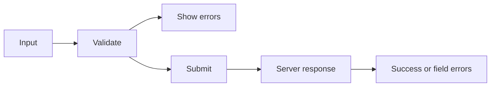

# Forms in React

## Detailed explanation
Forms in React are where user input, component state, validation, accessibility, and server mutation meet. A form can be built with controlled inputs, uncontrolled inputs, or a library such as React Hook Form that manages subscriptions and validation.

Interviewers care about forms because they reveal real production maturity. A good form handles pending submit state, prevents double submit, shows errors accessibly, maps server errors back to fields, and keeps performance acceptable as fields grow.

## 1. One-line mental model
Forms in React connect user input, validation, submission, and feedback through controlled or uncontrolled state patterns.

## 2. Problem it solves
Production forms need more than input fields. They must handle validation, error display, dirty state, touched state, async checks, server errors, loading states, resets, accessibility, and double-submit prevention.

## 3. Core idea
- Choose controlled or uncontrolled based on UI needs and performance.
- Keep validation close to the form contract.
- Show field errors accessibly.
- Treat server validation as the final authority.
- Disable or guard submit while submission is pending.

## 4. Visual / analogy
A form is like a checkpoint: collect data, validate it, show exact problems, then send accepted data forward.



## 5. Minimal example

```tsx
function LoginForm() {
  const [email, setEmail] = React.useState("");

  function handleSubmit(event: React.FormEvent<HTMLFormElement>) {
    event.preventDefault();
    console.log({ email });
  }

  return (
    <form onSubmit={handleSubmit}>
      <label htmlFor="email">Email</label>
      <input id="email" value={email} onChange={(event) => setEmail(event.target.value)} />
      <button type="submit">Login</button>
    </form>
  );
}
```

## 6. Real-world example

```tsx
const schema = z.object({
  email: z.string().email(),
  password: z.string().min(8),
});

function LoginForm() {
  const form = useForm({ resolver: zodResolver(schema) });
  const login = useMutation({ mutationFn: authApi.login });

  return (
    <form onSubmit={form.handleSubmit((values) => login.mutate(values))}>
      <input aria-invalid={Boolean(form.formState.errors.email)} {...form.register("email")} />
      <input type="password" {...form.register("password")} />
      <button disabled={login.isPending}>Sign in</button>
    </form>
  );
}
```

## 7. Common interview questions
- How do forms work in React?
- Controlled vs uncontrolled forms?
- How do you validate forms?
- What is schema validation?
- React Hook Form vs Formik?
- How do you handle server-side validation errors?
- How do you prevent double submit?
- How do you make forms accessible?

## 8. Active recall test
1. What must `onSubmit` usually call?
2. Why is server validation still needed?
3. What does dirty state mean?
4. What does touched state mean?
5. How should field errors be connected for screen readers?

## 9. Mistakes / traps
- Trusting only frontend validation.
- Forgetting labels.
- Showing errors too early.
- Re-rendering a huge form on every keystroke.
- Not handling pending submit state.
- Losing server field errors.

## 10. Compare with related concepts
- **Form state vs server state:** form state is draft user input; server state is backend-owned data.
- **Validation vs authorization:** validation checks input shape; authorization checks permission.
- **React Hook Form vs Formik:** React Hook Form favors uncontrolled subscriptions; Formik commonly uses controlled state.

## 11. Summary from memory
Explain how you would build an accessible login form with validation, pending state, and server error handling.

## 12. Spaced revision prompts
- After 1 day: Explain form submit flow.
- After 3 days: Compare controlled and uncontrolled forms.
- After 7 days: Add schema validation to a form.
- After 14 days: Explain how to handle server field errors.
