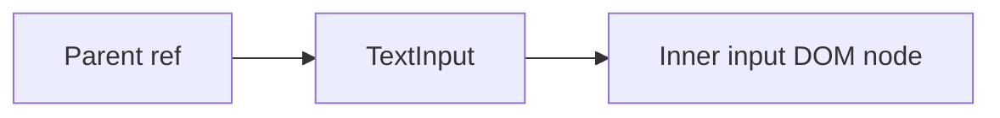

# Forward Refs

## Detailed explanation
Forward refs let a component pass a ref it receives down to a child DOM element or component. This is important for reusable components like inputs, buttons, dialogs, and custom controls that need to expose focus or measurement behavior to parents.

Without ref forwarding, a parent ref placed on a custom component refers to the component boundary, not automatically to an inner DOM node. `React.forwardRef` makes the forwarding explicit.

## 1. One-line mental model
Forward refs let parent refs reach an inner element of a child component.

## 2. Problem it solves
Reusable components often wrap DOM elements, but parents still need controlled imperative access such as focus.

## 3. Core idea
- Use `React.forwardRef`.
- The component receives `props` and `ref`.
- Attach the ref to the intended inner element.
- Type the ref target carefully.
- Use with restraint to preserve encapsulation.

## 4. Visual / analogy
Forwarding a ref is like giving a hotel front desk direct access to the correct room key instead of only the building address.



## 5. Minimal example

```tsx
const TextInput = React.forwardRef<HTMLInputElement, React.ComponentPropsWithoutRef<"input">>(
  (props, ref) => <input ref={ref} {...props} />,
);
```

## 6. Real-world example

```tsx
function ProfileForm() {
  const firstNameRef = React.useRef<HTMLInputElement>(null);
  return <TextInput ref={firstNameRef} aria-label="First name" />;
}
```

The form can focus the wrapped input when validation fails.

## 7. Common interview questions
- What is `forwardRef`?
- Why do custom components need ref forwarding?
- How do you type `forwardRef`?
- When should refs not be forwarded?
- How does `useImperativeHandle` relate?
- Can refs be passed as normal props?
- What does a forwarded ref point to?

## 8. Active recall test
1. What problem does `forwardRef` solve?
2. Where is the ref attached?
3. Why type the ref target?
4. How can forwarding refs leak implementation details?
5. What component types commonly forward refs?

## 9. Mistakes / traps
- Forgetting that `ref` is special and not a normal prop.
- Forwarding to the wrong element.
- Exposing internal DOM unnecessarily.
- Breaking ref behavior during component refactors.
- Using `any` for forwarded refs.

## 10. Compare with related concepts
- **Ref vs forwardRef:** ref stores/accesses; forwardRef passes access through a component.
- **forwardRef vs useImperativeHandle:** forwardRef passes a ref; useImperativeHandle customizes what it exposes.
- **forwardRef vs callback ref:** callback ref is another way to receive ref assignment.

## 11. Summary from memory
Explain how a design-system `Input` can expose focus behavior to a parent form.

## 12. Spaced revision prompts
- After 1 day: Define `forwardRef`.
- After 3 days: Type a forwarded input ref.
- After 7 days: Compare `forwardRef` and `useImperativeHandle`.
- After 14 days: Explain ref encapsulation trade-offs.

