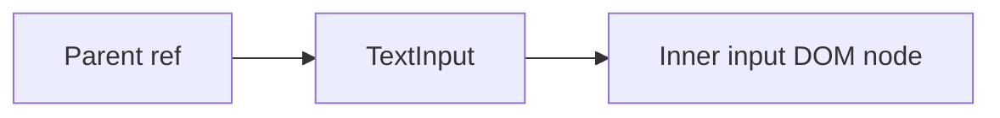

# Forward Refs

## Detailed explanation
Forward refs let a component pass a ref it receives down to a child DOM element or component. This is important for reusable components like inputs, buttons, dialogs, and custom controls that need to expose focus or measurement behavior to parents.

Without ref forwarding, a parent ref placed on a custom component refers to the component boundary, not automatically to an inner DOM node. `React.forwardRef` makes the forwarding explicit.

## 1. One-line mental model
Forward refs let parent refs reach an inner element of a child component.

## 2. Problem it solves
Reusable components often wrap DOM elements, but parents still need controlled imperative access such as focus.

## 3. Core idea
- Use `React.forwardRef`.
- The component receives `props` and `ref`.
- Attach the ref to the intended inner element.
- Type the ref target carefully.
- Use with restraint to preserve encapsulation.

## 4. Visual / analogy
Forwarding a ref is like giving a hotel front desk direct access to the correct room key instead of only the building address.



## 5. Minimal example

```tsx
const TextInput = React.forwardRef<HTMLInputElement, React.ComponentPropsWithoutRef<"input">>(
  (props, ref) => <input ref={ref} {...props} />,
);
```

## 6. Real-world example

```tsx
function ProfileForm() {
  const firstNameRef = React.useRef<HTMLInputElement>(null);
  return <TextInput ref={firstNameRef} aria-label="First name" />;
}
```

The form can focus the wrapped input when validation fails.

## 7. Common interview questions
#### What is `forwardRef`?
- **The Engine Mechanism (Why it behaves this way):** `React.forwardRef` is a higher-order function that wraps a component and enables it to receive a `ref` from its parent and pass it down to one of its children. Normally, the `ref` prop is special — it's not passed as a regular prop to the component. `forwardRef` intercepts the ref and passes it as the second argument to the wrapped component function: `(props, ref) => ...`. Internally, React sets a flag on the component type indicating it accepts refs. During reconciliation, when React encounters a `ref` on a `forwardRef` component, it passes the ref to the component's implementation instead of attaching it to the component instance.
- **The Unforgettable Mental Model:** The **Mail Forwarding Service**. Normally, mail addressed to a building (component) stays at the front desk. `forwardRef` is like a forwarding service that takes mail addressed to the building and delivers it to a specific room (inner DOM element) inside.
- **The Trap:** Thinking `ref` is a normal prop. It's not — `ref` is handled specially by React. You can't destructure it from props like `function Component({ ref })`. You must use `forwardRef` to receive it.
- **Senior Interview Playbook (Verbal Script):** "When asked this in an interview, say: `forwardRef` is a React API that lets a component receive a ref from its parent and pass it to an inner element. Normally, `ref` is not a regular prop — it's handled specially by React. `forwardRef` wraps a component and passes the ref as a second argument: `(props, ref) => ...`. This is essential for reusable components like custom inputs or buttons that need to expose DOM behavior (like focus) to their parents."

#### Why do custom components need ref forwarding?
- **The Engine Mechanism (Why it behaves this way):** When you place a `ref` on a custom component (not a host element like `<div>`), React doesn't automatically know which inner DOM node the ref should point to. Without `forwardRef`, the ref would either be ignored (in function components) or point to the component instance (in class components, which is deprecated). `forwardRef` explicitly tells React: "when a parent puts a ref on this component, pass it through to this specific inner element." This is critical for design system components that wrap native elements — a custom `<TextInput>` should let parents focus the inner `<input>`, and a custom `<Button>` should let parents measure the inner `<button>`.
- **The Unforgettable Mental Model:** The **Concierge Service**. A hotel guest (parent) wants to reach a specific room (inner DOM node). Without forwarding, the concierge (component) just says "I'm the hotel" and doesn't connect the call. With forwarding, the concierge says "I'll connect you directly to room 204."
- **The Trap:** Forwarding refs to every custom component unnecessarily. Ref forwarding should only be used when the parent has a legitimate need for imperative access — like focusing, measuring, or scrolling.
- **Senior Interview Playbook (Verbal Script):** "When asked this in an interview, say: Custom components need ref forwarding because React doesn't know which inner DOM node a parent's ref should point to. Without `forwardRef`, a ref on a function component is ignored. `forwardRef` explicitly passes the ref to a specific inner element, enabling parents to perform imperative operations like focusing an input or measuring a button. This is essential for design system components that wrap native elements and need to expose their DOM behavior."

#### How do you type `forwardRef`?
- **The Engine Mechanism (Why it behaves this way):** In TypeScript, `React.forwardRef` is a generic function that accepts two type parameters: the type of the DOM element the ref points to, and the type of the component's props. The syntax is `React.forwardRef<ElementType, PropsType>((props, ref) => ...)`. The ref type is automatically inferred as `React.RefObject<ElementType> | null`. For the most accurate typing, use `React.ComponentPropsWithoutRef<'element'>` to inherit all props from the underlying element, then extend with custom props. This ensures the forwarded component has the same props as the native element it wraps.
- **The Unforgettable Mental Model:** The **Custom-Tailored Suit**. Generic typing is like an off-the-rack suit — it fits okay but not perfectly. Properly typing `forwardRef` is like a bespoke suit — it's tailored to the exact measurements of the underlying element, ensuring every prop fits correctly.
- **The Trap:** Using `any` or `HTMLInputElement` without considering the actual element type. This loses type safety and can cause runtime errors when the ref points to a different element type.
- **Senior Interview Playbook (Verbal Script):** "When asked this in an interview, say: In TypeScript, `forwardRef` takes two generic parameters: the DOM element type and the props type. For example, `React.forwardRef<HTMLInputElement, Props>((props, ref) => ...)`. The best practice is to use `React.ComponentPropsWithoutRef<'input'>` for the props type, which inherits all native input props. This ensures the wrapped component has the same type signature as the element it wraps, providing full type safety for consumers."

#### When should refs not be forwarded?
- **The Engine Mechanism (Why it behaves this way):** Refs should not be forwarded when doing so would leak implementation details or break encapsulation. If a component's internal DOM structure is an implementation detail that may change, exposing it via a ref creates a tight coupling between parent and child. For example, a `Card` component that internally uses a `<div>` shouldn't forward a ref to that div — the parent shouldn't depend on the Card being a div. Similarly, complex composite components (like a `Select` with multiple internal elements) shouldn't forward a ref because there's no single element that makes sense to expose. Instead, these components should expose a controlled API through props.
- **The Unforgettable Mental Model:** The **Restaurant Kitchen**. Customers (parents) shouldn't have direct access to the kitchen (internal DOM). They order through the menu (props API). If the kitchen layout changes, the menu stays the same. Giving customers kitchen access creates a fragile dependency.
- **The Trap:** Forwarding refs "just in case" someone needs them. This exposes internal implementation details and makes refactoring harder. Only forward refs when there's a clear, documented use case.
- **Senior Interview Playbook (Verbal Script):** "When asked this in an interview, say: Refs should not be forwarded when they expose implementation details that parents shouldn't depend on. If a component's internal DOM structure may change, forwarding a ref creates a brittle coupling. Complex components with multiple internal elements shouldn't forward a ref because there's no single meaningful target. Instead, expose a controlled API through props. The principle: forward refs only when there's a clear imperative need (like focus) and the target element is a stable part of the component's public contract."

#### How does `useImperativeHandle` relate?
- **The Engine Mechanism (Why it behaves this way):** `useImperativeHandle` is a hook used inside a `forwardRef` component to customize what the parent sees when it accesses the ref. Instead of exposing the raw DOM node, `useImperativeHandle` lets you return a custom object with specific methods. It takes the ref and a factory function: `useImperativeHandle(ref, () => ({ focus: () => inputRef.current?.focus() }))`. This way, the parent calls `ref.current.focus()` without knowing about the inner DOM structure. Under the hood, React assigns the factory's return value to `ref.current` during the commit phase. This is useful for exposing a clean, stable API while keeping the internal implementation flexible.
- **The Unforgettable Mental Model:** The **Remote Control**. Instead of giving someone direct access to your TV's wiring (raw DOM node), you give them a remote control (`useImperativeHandle`) with specific buttons (methods). They can change the channel without knowing how the TV works internally.
- **The Trap:** Overusing `useImperativeHandle` to create imperative APIs when a declarative prop-based API would be better. Imperative APIs are harder to compose and reason about.
- **Senior Interview Playbook (Verbal Script):** "When asked this in an interview, say: `useImperativeHandle` customizes what a parent sees when it accesses a forwarded ref. Instead of exposing the raw DOM node, you return a custom object with specific methods. For example, a custom input can expose `{ focus, select }` methods without revealing its internal DOM structure. This creates a clean, stable API for the parent while keeping the implementation flexible. However, it should be used sparingly — declarative props are usually a better approach than imperative methods."

#### Can refs be passed as normal props?
- **The Engine Mechanism (Why it behaves this way):** No, `ref` is not a normal prop. React treats `ref` specially — it's extracted from the props object before the component function is called. If you try to destructure `ref` from props, it will be `undefined`. This is by design: `ref` is not part of the component's data interface; it's a mechanism for parent-child communication that bypasses the normal prop flow. To pass a ref-like value as a prop, you must use a different name (like `inputRef` or `myRef`), but this won't work with React's ref system — it's just a regular prop that happens to hold a ref object.
- **The Unforgettable Mental Model:** The **VIP Lane**. At an event, regular guests go through the main entrance (props), but VIPs have a separate lane (ref). You can't treat the VIP lane like a regular entrance — it has different rules and access.
- **The Trap:** Trying to pass `ref` as a prop like `<Component ref={myRef} />` and expecting to receive it in props. It won't work — you need `forwardRef` to receive it.
- **Senior Interview Playbook (Verbal Script):** "When asked this in an interview, say: No, `ref` is not a normal prop. React extracts it from the props object before calling the component. If you try to receive it via destructuring, it'll be undefined. To pass a ref through a component, you must use `forwardRef`, which intercepts the ref and passes it as a second argument. If you need to pass multiple refs, you can use custom prop names like `innerRef`, but these won't integrate with React's ref system — they're just regular props holding ref objects."

#### What does a forwarded ref point to?
- **The Engine Mechanism (Why it behaves this way):** A forwarded ref points to whatever the component implementation attaches it to. In a `forwardRef` component, the developer explicitly decides where the ref goes by attaching it to a specific element: `<input ref={ref} />`. The ref could point to a DOM node (like `<input>`, `<div>`, `<button>`), a class component instance (deprecated), or another forwarded ref (chaining). The key point: the ref's target is determined by the component's implementation, not by the parent. The parent provides the ref, but the child decides what it points to. This is why `forwardRef` documentation should clearly state what the ref resolves to.
- **The Unforgettable Mental Model:** The **Valet Parking**. You hand your keys (ref) to the valet (component). The valet decides which parking spot (DOM node) your car goes to. You trust the valet to park it in the right place, but you don't control the exact spot.
- **The Trap:** Assuming a forwarded ref always points to a DOM node. It points to whatever the component attaches it to — which could be another component's forwarded ref, creating a chain.
- **Senior Interview Playbook (Verbal Script):** "When asked this in an interview, say: A forwarded ref points to whatever the component implementation attaches it to. The component developer decides where the ref goes — it could be a DOM node, or it could be passed through another `forwardRef`. The parent provides the ref, but the child controls its target. This is why component documentation should clearly state what the ref resolves to. For a well-designed component, the ref should point to the most semantically meaningful DOM node — like the `<input>` in a custom input component."

## 8. Active recall test
1. **What problem does `forwardRef` solve?**
   - **Explanation:** `ref` is not a normal prop — React handles it specially. Without `forwardRef`, a ref on a function component is ignored. `forwardRef` lets a component receive a ref from its parent and pass it to an inner element, enabling imperative access like focusing.
2. **Where is the ref attached in a forwarded component?**
   - **Explanation:** The ref is attached to whatever element the component implementation specifies. The developer explicitly passes the ref to a specific inner element: `<input ref={ref} />`. The parent doesn't control the target.
3. **Why type the ref target?**
   - **Explanation:** TypeScript needs to know what type of element the ref points to so it can provide correct autocompletion and type checking. `React.forwardRef<HTMLInputElement, Props>` ensures `ref.current` has the correct type.
4. **How can forwarding refs leak implementation details?**
   - **Explanation:** Forwarding a ref exposes the internal DOM structure to the parent. If the component's implementation changes (e.g., wrapping the input in a new div), the parent's ref-based code may break. It creates a tight coupling.
5. **What component types commonly forward refs?**
   - **Explanation:** Design system components that wrap native elements: custom inputs, buttons, textareas, selects, and form controls. Any component where the parent needs imperative access to the underlying DOM node (focus, measure, scroll).

## 9. Mistakes / traps
- Forgetting that `ref` is special and not a normal prop.
- Forwarding to the wrong element.
- Exposing internal DOM unnecessarily.
- Breaking ref behavior during component refactors.
- Using `any` for forwarded refs.

## 10. Compare with related concepts
- **Ref vs forwardRef:** ref stores/accesses; forwardRef passes access through a component.
- **forwardRef vs useImperativeHandle:** forwardRef passes a ref; useImperativeHandle customizes what it exposes.
- **forwardRef vs callback ref:** callback ref is another way to receive ref assignment.

## 11. Summary from memory
Explain how a design-system `Input` can expose focus behavior to a parent form.

## 12. Spaced revision prompts
- After 1 day: Define `forwardRef`.
- After 3 days: Type a forwarded input ref.
- After 7 days: Compare `forwardRef` and `useImperativeHandle`.
- After 14 days: Explain ref encapsulation trade-offs.

