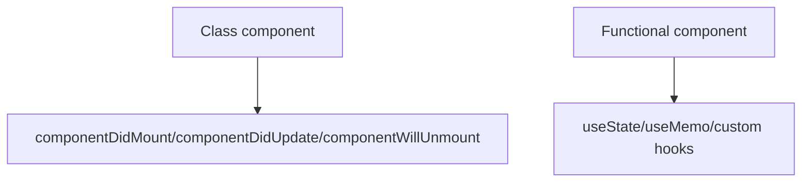

# Functional Components vs Class Components

## Detailed explanation
Class components were the original way to use state and lifecycle methods in React. They use `this`, `this.state`, `this.setState`, and methods like `componentDidMount`. Functional components are plain functions that return UI and use hooks for state, refs, memoization, and side-effect synchronization.

Modern React favors functional components because hooks make logic easier to share and organize by concern. Class components still work and appear in older codebases, and React core still uses class components for error boundaries.

## 1. One-line mental model
Functional components are JavaScript functions that return UI, while class components are ES classes that render UI through a `render` method and lifecycle methods.

## 2. Problem it solves
React originally used class components for state and lifecycle behavior. Functional components with hooks simplified component logic, reduced class boilerplate, and made behavior easier to compose.

## 3. Core idea
- Class components use `this`, `state`, `setState`, and lifecycle methods.
- Functional components use hooks like `useState`, `useReducer`, and custom hooks.
- Modern React favors functional components.
- Error boundaries still require class components unless using a library wrapper.
- Legacy codebases may contain both styles.

## 4. Visual / analogy
Class components are like older machines with many labeled levers. Functional components are simpler panels where hooks plug in the needed behavior.



## 5. Minimal example

```tsx
function Greeting({ name }: { name: string }) {
  return <h1>Hello, {name}</h1>;
}
```

Class equivalent:

```tsx
class Greeting extends React.Component<{ name: string }> {
  render() {
    return <h1>Hello, {this.props.name}</h1>;
  }
}
```

## 6. Real-world example

```tsx
function SearchPage() {
  const [query, setQuery] = React.useState("");
  const results = useSearchQuery(query);

  return <SearchResults query={query} onQueryChange={setQuery} results={results.data} />;
}
```

Hooks let state and reusable search logic live in functions.

## 7. Common interview questions
#### Functional vs class components?
- **The Engine Mechanism (Why it behaves this way):** Functional components are plain JavaScript functions that accept props and return React elements. They use hooks (`useState`, `useEffect`, etc.) to manage state and side effects. Class components are ES6 classes that extend `React.Component`, implement a `render()` method, and use `this.state`, `this.setState()`, and lifecycle methods (`componentDidMount`, `componentDidUpdate`, `componentWillUnmount`). Under the hood, React's Fiber architecture handles both types, but functional components have a simpler execution model — each render is a fresh function call with its own closure, while class components maintain a persistent `this` instance across renders.
- **The Unforgettable Mental Model:** The **Function vs. the Machine**. A functional component is like a function on a calculator — you input values, get output, and each calculation is independent. A class component is like a physical machine with dials and switches (this.state) that persist between uses.
- **The Trap:** Thinking functional components are "just functions" without understanding hooks' rules. Hooks rely on call order and closure semantics, which is a different mental model from class lifecycle methods.
- **Senior Interview Playbook (Verbal Script):** "When asked this in an interview, say: Functional components are plain functions that return UI and use hooks for state and side effects. Class components are ES6 classes with a render method, this.state, and lifecycle methods. Modern React favors functional components because hooks make logic easier to share, compose, and reason about. Classes still work and are required for error boundaries, but new code should use functional components."

#### Why did hooks become popular?
- **The Engine Mechanism (Why it behaves this way):** Hooks became popular because they solved three fundamental problems with class components: (1) Logic reuse required Higher-Order Components (HOCs) or render props, which created wrapper hell and made component trees hard to debug. Hooks allow custom hooks that extract stateful logic without changing the component hierarchy. (2) Lifecycle methods forced related logic to be split across `componentDidMount`, `componentDidUpdate`, and `componentWillUnmount`, while unrelated logic was grouped together. Hooks let you group related logic together with `useEffect`. (3) Classes confused both humans and machines — `this` binding issues, minification problems, and hot reloading limitations. Functions avoid all of these.
- **The Unforgettable Mental Model:** The **Swiss Army Knife vs. the Toolbox**. Class components were like a toolbox where you had to dig through different compartments (lifecycle methods) to find related tools. Hooks are like a Swiss Army knife — each tool (hook) is right where you need it, grouped by purpose.
- **The Trap:** Thinking hooks are just lifecycle methods renamed. Hooks are a fundamentally different model — they're about synchronizing with external systems, not about component lifecycle events.
- **Senior Interview Playbook (Verbal Script):** "When asked this in an interview, say: Hooks became popular because they solved real problems with class components. First, they made logic reuse simple through custom hooks, eliminating the wrapper hell of HOCs and render props. Second, they let us group related logic together — instead of scattering subscription logic across componentDidMount, componentDidUpdate, and componentWillUnmount, a single useEffect handles it all. Third, they eliminated the confusion around `this` binding. Hooks represent a shift from lifecycle-based thinking to synchronization-based thinking."

#### Can functional components have state?
- **The Engine Mechanism (Why it behaves this way):** Yes, through the `useState` hook. When React calls a functional component, it maintains an internal list of hook states for that component's Fiber node. Each `useState` call reads from and writes to this list in order. When the setter function is called, React schedules a re-render, and on the next render, `useState` returns the new value. The state persists across renders because React stores it in the component's Fiber node, not in the function's local scope. This is why hooks must be called in the same order every render — React uses position, not name, to match hook calls to their stored state.
- **The Unforgettable Mental Model:** The **Bank Vault**. The function is like a teller window — it opens and closes with each customer (render). But the bank vault (Fiber node) stays open between visits, keeping your money (state) safe. The teller always knows which vault slot is yours because you always visit the same window in the same order.
- **The Trap:** Expecting state to update immediately after calling the setter. State updates are batched and applied on the next render, so reading the state variable right after calling the setter returns the old value.
- **Senior Interview Playbook (Verbal Script):** "When asked this in an interview, say: Yes, functional components have state through the useState hook. When I call useState, React stores the state value in the component's internal Fiber node and returns the current value plus a setter function. When the setter is called, React schedules a re-render, and on the next render, useState returns the updated value. The state persists across renders because React tracks it by the order of hook calls, not by variable names."

#### What replaced lifecycle methods?
- **The Engine Mechanism (Why it behaves this way):** Hooks replaced lifecycle methods with a synchronization model. `useState` replaces initializing state in the constructor. `useEffect` replaces `componentDidMount`, `componentDidUpdate`, and `componentWillUnmount` — a single effect can handle setup, cleanup, and re-execution when dependencies change. `useLayoutEffect` replaces synchronous lifecycle needs. `useMemo` and `useCallback` replace performance optimizations that were done with `shouldComponentUpdate` or `PureComponent`. The key difference is that lifecycle methods organize code by *when* it runs (mount, update, unmount), while hooks organize code by *what* it does (this effect handles subscriptions, that effect handles logging).
- **The Unforgettable Mental Model:** The **Timeline vs. the Topic Binder**. Lifecycle methods organize code along a timeline (what happens at mount, what happens at update). Hooks organize code by topic (all subscription logic together, all logging logic together).
- **The Trap:** Trying to map lifecycle methods one-to-one to hooks. `useEffect` is not `componentDidMount` — it runs after every render by default, and its dependency array controls when it re-runs.
- **Senior Interview Playbook (Verbal Script):** "When asked this in an interview, say: Hooks replaced lifecycle methods with a synchronization model. useEffect handles side effects that previously lived in componentDidMount, componentDidUpdate, and componentWillUnmount — but instead of splitting related logic across three methods, I keep it together in one effect with a dependency array. useState replaces constructor state initialization. useLayoutEffect handles synchronous DOM measurements. The key shift is from thinking about 'when does this run' to 'what external system am I synchronizing with'."

#### Are class components deprecated?
- **The Engine Mechanism (Why it behaves this way):** No, class components are not deprecated. React's team has explicitly stated that class components will continue to work. They remain part of React's public API and are still used internally by React itself (error boundaries are implemented as class components). However, new features and optimizations are primarily designed for functional components with hooks. The React team's focus has shifted to hooks, Concurrent Mode, and Server Components, all of which work best with functional components.
- **The Unforgettable Mental Model:** The **Legacy Highway**. Class components are like an older highway that's still fully functional and maintained, but all new road construction (features) is happening on the newer highway (hooks).
- **The Trap:** Assuming class components will be removed in React 19 or later. The React team has committed to maintaining class component support, though they won't receive new features.
- **Senior Interview Playbook (Verbal Script):** "When asked this in an interview, say: No, class components are not deprecated. React's team has confirmed they'll continue to work and are still part of the public API. However, the React team's focus has shifted to functional components and hooks, and new features like Concurrent Mode and Server Components are designed primarily for functions. Class components are still required for error boundaries. In practice, I use functional components for new code and maintain class components in legacy codebases without rewriting them unless there's a specific need."

#### When might you still see a class component?
- **The Engine Mechanism (Why it behaves this way):** Class components appear in: (1) Legacy codebases built before React 16.8 (when hooks were introduced). (2) Error boundaries, which currently require class components because `getDerivedStateFromError` and `componentDidCatch` are only available as class methods. (3) Some third-party libraries that were written before hooks and haven't been updated. (4) Codebases with strict migration policies that prefer incremental updates over rewrites. In all cases, the class component's rendering behavior is identical to functional components — React's Fiber architecture processes both types through the same reconciliation pipeline.
- **The Unforgettable Mental Model:** The **Vintage Car**. Class components are like vintage cars — they still run perfectly, some people prefer them, and they're irreplaceable for certain tasks (error boundaries), but new models (functional components) are what everyone buys today.
- **The Trap:** Rewriting all class components to functional components as a first priority. Unless there's a specific benefit (like using a hook that simplifies logic), class components work fine and rewriting introduces risk.
- **Senior Interview Playbook (Verbal Script):** "When asked this in an interview, say: You'll still see class components in legacy codebases, in error boundaries (which require classes in React core), and in some third-party libraries. I don't rush to rewrite class components unless there's a clear benefit — they work fine and rewriting introduces risk. When I do migrate, I do it incrementally, converting one component at a time and testing thoroughly. For new code, I always use functional components with hooks."

#### How do error boundaries relate to class components?
- **The Engine Mechanism (Why it behaves this way):** Error boundaries are React components that catch JavaScript errors anywhere in their child component tree, log those errors, and display a fallback UI instead of the crashed component tree. They work by implementing `static getDerivedStateFromError()` (to update state when an error is thrown) and `componentDidCatch()` (to log the error). These lifecycle methods are only available on class components — there is currently no hook equivalent in React core. When an error occurs during rendering, in a lifecycle method, or in a constructor, React walks up the component tree looking for the nearest error boundary class component.
- **The Unforgettable Mental Model:** The **Circuit Breaker**. An error boundary is like a circuit breaker in your home's electrical panel. When a surge (error) happens, the breaker trips and cuts power to that circuit, preventing a fire (full app crash). The rest of the house (other components) keeps working.
- **The Trap:** Thinking error boundaries catch all errors. They don't catch errors in event handlers, async code, server-side rendering, or the error boundary's own code. They only catch errors during rendering, lifecycle methods, and constructors.
- **Senior Interview Playbook (Verbal Script):** "When asked this in an interview, say: Error boundaries are class components that catch rendering errors in their child tree and display a fallback UI. They implement getDerivedStateFromError to update state when an error occurs and componentDidCatch to log it. Currently, React requires class components for error boundaries because there's no hook equivalent. In practice, I use a library like react-error-boundary to get error boundary functionality in functional components, or I write a simple class component that wraps my functional components."

## 8. Active recall test
1. **How does a class component render UI?**
   - **Explanation:** A class component renders UI through its `render()` method, which returns JSX (React elements). React calls this method during the render phase, and the returned element tree is reconciled with the previous tree. The class instance (`this`) persists across renders, maintaining state and method bindings.
2. **How does a functional component hold state?**
   - **Explanation:** Through the `useState` hook. React stores state in the component's Fiber node, indexed by the order of hook calls. Each render, `useState` returns the current value and a setter. Calling the setter schedules a re-render, and the next render returns the updated value.
3. **What problem did hooks solve?**
   - **Explanation:** Hooks solved three problems: (1) Logic reuse without wrapper hell (custom hooks replace HOCs/render props), (2) grouping related logic together instead of splitting it across lifecycle methods, and (3) eliminating `this` binding confusion and class-related boilerplate.
4. **Why is `this` not needed in functional components?**
   - **Explanation:** Functional components are plain functions that receive props as arguments and use hooks for state. There's no class instance, so no `this` context. Each render is a fresh function call with its own closure, eliminating binding issues and making code more predictable.
5. **What is one remaining class component use case?**
   - **Explanation:** Error boundaries. React's `getDerivedStateFromError` and `componentDidCatch` lifecycle methods are only available on class components. While libraries like react-error-boundary provide functional wrappers, the underlying implementation still uses a class component.

## 9. Mistakes / traps
- Saying class components no longer work. They still work.
- Saying hooks are lifecycle methods with different names. They are a different model for synchronizing with external systems.
- Using class patterns like instance mutation inside functional components.
- Forgetting error boundaries are class-based in React core today.

## 10. Compare with related concepts
- **Function component vs plain function:** a function component returns renderable React output and follows React rules.
- **Class component vs JavaScript class:** a class component extends React component APIs.
- **Hooks vs lifecycle:** hooks organize logic by concern; lifecycle methods organize logic by time.

## 11. Summary from memory
Explain how you would migrate a simple class component with state to a functional component with hooks.

## 12. Spaced revision prompts
- After 1 day: Compare function and class component syntax.
- After 3 days: Explain why hooks improved reuse.
- After 7 days: Map common lifecycle methods to modern hook thinking.
- After 14 days: Explain why legacy React apps may still contain classes.
