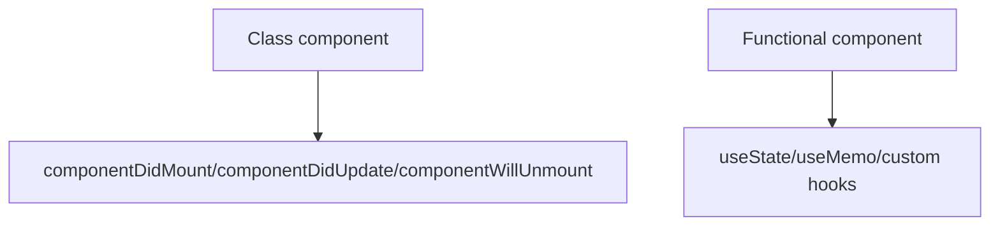

# Functional Components vs Class Components

## Detailed explanation
Class components were the original way to use state and lifecycle methods in React. They use `this`, `this.state`, `this.setState`, and methods like `componentDidMount`. Functional components are plain functions that return UI and use hooks for state, refs, memoization, and side-effect synchronization.

Modern React favors functional components because hooks make logic easier to share and organize by concern. Class components still work and appear in older codebases, and React core still uses class components for error boundaries.

## 1. One-line mental model
Functional components are JavaScript functions that return UI, while class components are ES classes that render UI through a `render` method and lifecycle methods.

## 2. Problem it solves
React originally used class components for state and lifecycle behavior. Functional components with hooks simplified component logic, reduced class boilerplate, and made behavior easier to compose.

## 3. Core idea
- Class components use `this`, `state`, `setState`, and lifecycle methods.
- Functional components use hooks like `useState`, `useReducer`, and custom hooks.
- Modern React favors functional components.
- Error boundaries still require class components unless using a library wrapper.
- Legacy codebases may contain both styles.

## 4. Visual / analogy
Class components are like older machines with many labeled levers. Functional components are simpler panels where hooks plug in the needed behavior.



## 5. Minimal example

```tsx
function Greeting({ name }: { name: string }) {
  return <h1>Hello, {name}</h1>;
}
```

Class equivalent:

```tsx
class Greeting extends React.Component<{ name: string }> {
  render() {
    return <h1>Hello, {this.props.name}</h1>;
  }
}
```

## 6. Real-world example

```tsx
function SearchPage() {
  const [query, setQuery] = React.useState("");
  const results = useSearchQuery(query);

  return <SearchResults query={query} onQueryChange={setQuery} results={results.data} />;
}
```

Hooks let state and reusable search logic live in functions.

## 7. Common interview questions
- Functional vs class components?
- Why did hooks become popular?
- Can functional components have state?
- What replaced lifecycle methods?
- Are class components deprecated?
- When might you still see a class component?
- How do error boundaries relate to class components?

## 8. Active recall test
1. How does a class component render UI?
2. How does a functional component hold state?
3. What problem did hooks solve?
4. Why is `this` not needed in functional components?
5. What is one remaining class component use case?

## 9. Mistakes / traps
- Saying class components no longer work. They still work.
- Saying hooks are lifecycle methods with different names. They are a different model for synchronizing with external systems.
- Using class patterns like instance mutation inside functional components.
- Forgetting error boundaries are class-based in React core today.

## 10. Compare with related concepts
- **Function component vs plain function:** a function component returns renderable React output and follows React rules.
- **Class component vs JavaScript class:** a class component extends React component APIs.
- **Hooks vs lifecycle:** hooks organize logic by concern; lifecycle methods organize logic by time.

## 11. Summary from memory
Explain how you would migrate a simple class component with state to a functional component with hooks.

## 12. Spaced revision prompts
- After 1 day: Compare function and class component syntax.
- After 3 days: Explain why hooks improved reuse.
- After 7 days: Map common lifecycle methods to modern hook thinking.
- After 14 days: Explain why legacy React apps may still contain classes.
