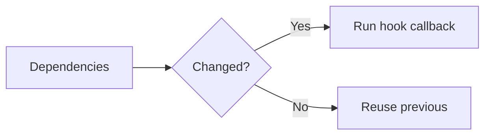

# Hook Dependency Array

## Detailed explanation
The dependency array tells React when an effect, memo, or callback should be recomputed. Dependencies should include every reactive value used inside the hook callback: props, state, and variables/functions declared in the component scope.

Missing dependencies create stale closures. Extra unstable dependencies can cause unnecessary re-runs or infinite loops. The goal is not to trick React; it is to write logic where dependencies honestly describe what the hook uses.

## 1. One-line mental model
The dependency array lists the reactive values a hook depends on.

## 2. Problem it solves
React needs to know when hook logic should run again as component values change.

## 3. Core idea
- Include all reactive values used inside the callback.
- Empty array means no reactive values are used.
- No array means run after every render for effects.
- Missing dependencies cause stale logic.
- Stabilize values only when needed.

## 4. Visual / analogy
Dependencies are ingredients for a recipe: when an ingredient changes, the recipe should be made again.



## 5. Minimal example

```tsx
React.useEffect(() => {
  document.title = title;
}, [title]);
```

## 6. Real-world example

```tsx
const filteredRows = React.useMemo(() => {
  return rows.filter((row) => row.status === status);
}, [rows, status]);
```

## 7. Common interview questions
- What is a dependency array?
- What happens with `[]`?
- What happens with no dependency array?
- Why do missing dependencies cause stale closures?
- How does the hooks ESLint rule help?
- How do you handle function dependencies?
- When should dependencies be stabilized?

## 8. Active recall test
1. What values belong in dependencies?
2. What does empty array mean?
3. What does no array mean for `useEffect`?
4. Why is omitting dependencies risky?
5. How can unstable objects cause loops?

## 9. Mistakes / traps
- Removing dependencies to silence lint.
- Adding objects/functions that are recreated every render without restructuring.
- Assuming empty array means "run once forever" safely.
- Forgetting props used inside effects.
- Depending on derived values inconsistently.

## 10. Compare with related concepts
- **Dependency array vs Rules of Hooks:** dependencies control re-run; rules control call order.
- **Dependency vs state:** dependencies are watched values, not stored values.
- **Dependency stabilization vs memoization:** stabilization can use memoization, but not every dependency needs it.

## 11. Summary from memory
Explain how to decide the dependency array for an effect that uses `userId` and `token`.

## 12. Spaced revision prompts
- After 1 day: Define dependency array.
- After 3 days: Explain empty vs missing array.
- After 7 days: Fix missing dependency bug.
- After 14 days: Explain stable function dependency.

