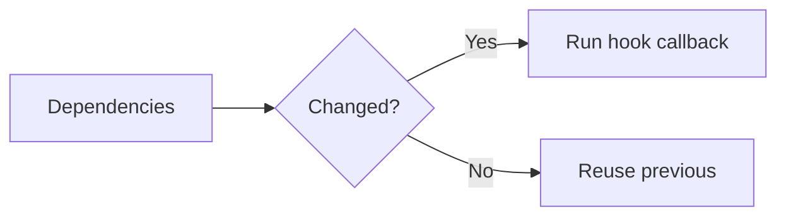

# Hook Dependency Array

## Detailed explanation
The dependency array tells React when an effect, memo, or callback should be recomputed. Dependencies should include every reactive value used inside the hook callback: props, state, and variables/functions declared in the component scope.

Missing dependencies create stale closures. Extra unstable dependencies can cause unnecessary re-runs or infinite loops. The goal is not to trick React; it is to write logic where dependencies honestly describe what the hook uses.

## 1. One-line mental model
The dependency array lists the reactive values a hook depends on.

## 2. Problem it solves
React needs to know when hook logic should run again as component values change.

## 3. Core idea
- Include all reactive values used inside the callback.
- Empty array means no reactive values are used.
- No array means run after every render for effects.
- Missing dependencies cause stale logic.
- Stabilize values only when needed.

## 4. Visual / analogy
Dependencies are ingredients for a recipe: when an ingredient changes, the recipe should be made again.



## 5. Minimal example

```tsx
React.useEffect(() => {
  document.title = title;
}, [title]);
```

## 6. Real-world example

```tsx
const filteredRows = React.useMemo(() => {
  return rows.filter((row) => row.status === status);
}, [rows, status]);
```

## 7. Common interview questions
#### What is a dependency array?
- **The Engine Mechanism (Why it behaves this way):** The dependency array is the second argument to `useEffect`, `useCallback`, and `useMemo`. React stores the previous dependency values alongside the cached result (for `useMemo`/`useCallback`) or the effect registration (for `useEffect`). On each render, React iterates through the current and previous dependency arrays in parallel, comparing each pair with `Object.is()`. If all comparisons return `true`, React reuses the cached result or skips the effect. If any comparison returns `false`, React recomputes or re-runs the effect. The dependency array is React's mechanism for knowing when hook logic needs to update.
- **The Unforgettable Mental Model:** The **Recipe Ingredient List**. The dependency array lists every ingredient the recipe uses. If any ingredient changes (new brand, different amount), you need to make the recipe again. If all ingredients are the same, the previous result is still valid.
- **The Trap:** Thinking the dependency array is optional or advisory. It's a contract — if you lie to it (omit dependencies), React will use stale data.
- **Senior Interview Playbook (Verbal Script):** "When asked this in an interview, say: The dependency array is how React knows when to re-run hook logic. It's an array of reactive values — props, state, derived variables — that the hook's callback depends on. React compares each value with its previous version using `Object.is()`. If any value changed, the hook re-runs. If all values are the same, React skips the work. The golden rule is: every reactive value used inside the hook callback must be listed as a dependency."

#### What happens with `[]`?
- **The Engine Mechanism (Why it behaves this way):** An empty dependency array `[]` tells React that the hook has no reactive dependencies. For `useEffect`, the effect runs once after mount and never re-runs (cleanup runs on unmount). For `useMemo`, the computation runs once and the result is cached forever. For `useCallback`, the function reference is created once and never changes. React still compares the empty array with the previous empty array — `Object.is()` on two empty arrays is `true` because the arrays themselves are stored internally and compared element-by-element (zero elements, so always equal).
- **The Unforgettable Mental Model:** The **Time Capsule**. You seal something once (mount) and it stays exactly the same forever. No matter what happens outside, the contents never change.
- **The Trap:** Assuming `[]` means "run once" is always safe. If the effect uses props or state that change over time, those values will be stale — captured from the initial render and never updated.
- **Senior Interview Playbook (Verbal Script):** "When asked this in an interview, say: An empty dependency array means the hook runs once on mount and never re-runs. For effects, this is like `componentDidMount` — the effect runs after the initial render and cleanup runs on unmount. For `useMemo` and `useCallback`, the value or function is computed once and cached forever. The danger is that if the hook's callback uses any props or state, those values will be frozen at their initial values. I only use `[]` when the callback genuinely uses no reactive values."

#### What happens with no dependency array?
- **The Engine Mechanism (Why it behaves this way):** Omitting the dependency array entirely means the hook runs after every render. For `useEffect`, the effect runs after every commit — the cleanup runs before each re-run and on unmount. For `useMemo`, the computation runs on every render (equivalent to not using `useMemo` at all). For `useCallback`, a new function is created on every render (equivalent to not using `useCallback`). This is the least restrictive mode and defeats the purpose of memoization hooks.
- **The Unforgettable Mental Model:** The **Groundhog Day**. Every day is the same — the effect runs, the computation runs, the function is recreated. Nothing is cached, nothing is skipped. It's as if the hook doesn't exist.
- **The Trap:** Accidentally omitting the dependency array when you meant to include one. This causes effects to fire on every render and memoization to be useless.
- **Senior Interview Playbook (Verbal Script):** "When asked this in an interview, say: Without a dependency array, the hook runs after every render. For `useEffect`, the effect fires after every commit with cleanup before each re-run. For `useMemo` and `useCallback`, it's equivalent to not using them at all — the computation runs and the function is created on every render. This defeats the purpose of these hooks. I always include a dependency array, even if it's empty, to make my intent explicit."

#### Why do missing dependencies cause stale closures?
- **The Engine Mechanism (Why it behaves this way):** When a dependency is omitted from the array, React doesn't know that the hook's callback depends on that value. So when the value changes, React doesn't re-run the hook. The callback continues to reference the value from the render when it was created — a closure over that render's scope. For `useEffect`, the effect doesn't re-run with the new value. For `useCallback`, the function keeps the old captured value. For `useMemo`, the cached result was computed with the old value. The closure is "stale" because it reads from an outdated render scope.
- **The Unforgettable Mental Model:** The **Old Map**. You're navigating with a map (closure) from last year. The roads have changed (state updated), but your map still shows the old routes. You end up in the wrong place because you didn't get the updated map (re-run with new dependencies).
- **The Trap:** Omitting a dependency to "fix" an infinite loop. This silences the symptom but creates a stale closure bug that's harder to detect. The real fix is to stabilize the dependency or restructure the code.
- **Senior Interview Playbook (Verbal Script):** "When asked this in an interview, say: Missing dependencies cause stale closures because React doesn't re-run the hook when the omitted value changes. The callback captures values from the render when it was created, and without the dependency in the array, it never gets recreated with the new values. So it reads outdated state or props. The ESLint exhaustive-deps rule catches this, but the real fix is understanding why the dependency is unstable — often it's an object or function recreated every render that should be memoized or moved inside the effect."

#### How does the hooks ESLint rule help?
- **The Engine Mechanism (Why it behaves this way):** The `eslint-plugin-react-hooks` plugin performs static analysis on your code. It parses the AST (Abstract Syntax Tree) of each hook callback, identifies every variable reference, and determines whether each reference is a reactive value (props, state, context, or a value derived from them). It then compares this list with the dependency array and flags any mismatches: missing dependencies that should be included, or unnecessary dependencies that could be removed. The rule runs at build time, catching bugs before they reach production.
- **The Unforgettable Mental Model:** The **Spell-Checker for Dependencies**. Just as a spell-checker underlines misspelled words before you send an email, the ESLint rule underlines missing dependencies before you ship code. It catches mistakes you'd otherwise only discover through debugging.
- **The Trap:** Disabling the rule with `// eslint-disable-next-line react-hooks/exhaustive-deps` without understanding why the warning fired. The warning is almost always correct — disabling it usually hides a real bug.
- **Senior Interview Playbook (Verbal Script):** "When asked this in an interview, say: The hooks ESLint rule performs static analysis to identify every reactive value used inside a hook callback and compares it with the dependency array. It flags missing dependencies that would cause stale closures and unnecessary dependencies that could cause extra re-runs. I treat these warnings as errors — they catch real bugs before production. If I need to disable the rule, I first understand why it fired and verify that the omission is intentional and safe, which is rare."

#### How do you handle function dependencies?
- **The Engine Mechanism (Why it behaves this way):** Functions declared inside a component are recreated on every render, creating a new reference each time. If such a function is used as a dependency, the hook re-runs on every render. The solution is to stabilize the function reference. Options include: (1) Move the function inside the hook callback if it's only used there. (2) Wrap it in `useCallback` to maintain a stable reference. (3) Move it outside the component if it doesn't use component state/props. (4) Use a ref to store the latest version and read from the ref inside the hook.
- **The Unforgettable Mental Model:** The **Revolving Door**. A function recreated every render is like a revolving door — every time you try to enter (use it as a dependency), it's a different door. Stabilizing it is like installing a regular door with a fixed frame.
- **The Trap:** Wrapping every function in `useCallback` to satisfy the linter. This over-memoizes and makes code harder to read. The better approach is to restructure so the function doesn't need to be a dependency.
- **Senior Interview Playbook (Verbal Script):** "When asked this in an interview, say: Function dependencies are tricky because functions declared in a component are new references every render. My approach is: first, try to move the function inside the hook callback if it's only used there — then it doesn't need to be a dependency. Second, if it's used elsewhere, wrap it in `useCallback` with its own dependencies. Third, if it doesn't use component state, move it outside the component entirely. Fourth, as a last resort, use a ref to store the latest function and read from the ref. The goal is to minimize dependencies, not to memoize everything."

#### When should dependencies be stabilized?
- **The Engine Mechanism (Why it behaves this way):** Dependencies should be stabilized when they are objects, arrays, or functions that are recreated on every render but whose contents haven't meaningfully changed. An unstable dependency causes the hook to re-run unnecessarily because `Object.is()` sees a new reference. Stabilization techniques include `useMemo` for objects/arrays, `useCallback` for functions, and lifting the value outside the component if it doesn't depend on reactive data. However, not every dependency needs stabilization — primitives (strings, numbers, booleans) are compared by value, not reference, so they don't need memoization.
- **The Unforgettable Mental Model:** The **ID Card Renewal**. If you renew your ID card every day (new object reference), security thinks you're a new person and re-checks you every time (hook re-runs). Keep the same ID card (stable reference), and security only checks when your actual details change.
- **The Trap:** Stabilizing everything "just in case." This adds memoization overhead everywhere and makes code harder to read. Only stabilize when the unstable reference causes a real problem.
- **Senior Interview Playbook (Verbal Script):** "When asked this in an interview, say: I stabilize dependencies when they're objects, arrays, or functions recreated every render that cause unnecessary hook re-runs. I use `useMemo` for objects and arrays, `useCallback` for functions, and I lift values outside the component when they don't depend on reactive data. But I don't stabilize everything by default — primitives don't need it, and over-memoization adds overhead and complexity. I stabilize only when profiling shows a problem or when an unstable dependency causes a specific bug like an infinite effect loop."

## 8. Active recall test
1. **What values belong in dependencies?**
   - **Explanation:** Every reactive value used inside the hook callback — props, state, context values, and variables/functions derived from them. If the hook reads it, it belongs in the array.
2. **What does empty array mean?**
   - **Explanation:** The hook runs once on mount and never re-runs. For effects, it's like `componentDidMount`. For memo/callback, the value/function is computed once and cached forever.
3. **What does no array mean for `useEffect`?**
   - **Explanation:** The effect runs after every render, with cleanup before each re-run and on unmount. It's equivalent to having no memoization at all.
4. **Why is omitting dependencies risky?**
   - **Explanation:** It creates stale closures — the hook's callback captures values from the render when it was created and never updates when those values change, leading to bugs with outdated data.
5. **How can unstable objects cause loops?**
   - **Explanation:** An object created inline (e.g., `{ id: userId }`) is a new reference every render. If it's a dependency, the hook re-runs every render. If the hook updates state, this triggers another render, creating an infinite loop.

## 9. Mistakes / traps
- Removing dependencies to silence lint.
- Adding objects/functions that are recreated every render without restructuring.
- Assuming empty array means "run once forever" safely.
- Forgetting props used inside effects.
- Depending on derived values inconsistently.

## 10. Compare with related concepts
- **Dependency array vs Rules of Hooks:** dependencies control re-run; rules control call order.
- **Dependency vs state:** dependencies are watched values, not stored values.
- **Dependency stabilization vs memoization:** stabilization can use memoization, but not every dependency needs it.

## 11. Summary from memory
Explain how to decide the dependency array for an effect that uses `userId` and `token`.

## 12. Spaced revision prompts
- After 1 day: Define dependency array.
- After 3 days: Explain empty vs missing array.
- After 7 days: Fix missing dependency bug.
- After 14 days: Explain stable function dependency.

