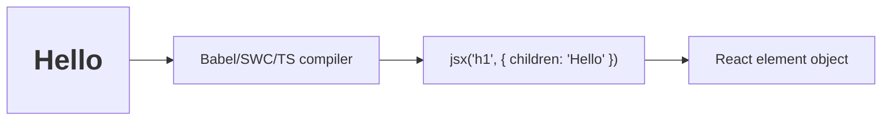

# JSX and How JSX Compiles

## Detailed explanation
JSX is a syntax extension that lets developers write React UI in a familiar tag-like form. It looks similar to HTML, but it is actually JavaScript syntax that gets compiled into function calls. Those function calls create React element objects, which React later uses to build and update the UI.

Understanding JSX compilation helps explain many React rules: why `className` is used instead of `class`, why JavaScript expressions go inside `{}`, why components must be capitalized, and why JSX values are escaped by default instead of treated as raw HTML.

## 1. One-line mental model
JSX is JavaScript syntax for writing React element descriptions in a HTML-like form.

## 2. Problem it solves
Creating UI with nested `React.createElement` calls is verbose and hard to read. JSX makes component output look close to the UI structure while still compiling to JavaScript.

## 3. Core idea
- JSX is syntax, not HTML.
- JSX compiles to function calls that create React elements.
- JavaScript expressions go inside `{}`.
- JSX attributes use JavaScript naming like `className` and `htmlFor`.
- A component must return one parent value, often a fragment.

## 4. Visual / analogy
JSX is shorthand. It is like writing `2 + 2` instead of calling `add(2, 2)`.



## 5. Minimal example

```tsx
const element = <h1 className="title">Hello</h1>;
```

Modern JSX transform compiles roughly to:

```tsx
const element = jsx("h1", {
  className: "title",
  children: "Hello",
});
```

## 6. Real-world example

```tsx
function ProductPrice({ price, currency }: { price: number; currency: string }) {
  return (
    <span>
      {new Intl.NumberFormat("en-US", {
        style: "currency",
        currency,
      }).format(price)}
    </span>
  );
}
```

JSX mixes markup structure with JavaScript expressions while keeping data escaped by default.

## 7. Common interview questions
- What is JSX?
- Is JSX required to use React?
- How does JSX compile?
- Why do we use `className` instead of `class`?
- Why must JSX return one parent?
- How do expressions work in JSX?
- Is JSX safe from XSS?
- What is the new JSX transform?

## 8. Active recall test
1. What does JSX compile to?
2. Is JSX HTML?
3. How do you render a JavaScript value inside JSX?
4. Why is `htmlFor` used?
5. What does a fragment solve?

## 9. Mistakes / traps
- Calling JSX HTML.
- Using `class` instead of `className` in React JSX.
- Putting statements like `if` directly inside JSX expression braces.
- Forgetting that objects cannot be rendered directly as children.
- Thinking JSX strings are raw HTML; React escapes values by default.

## 10. Compare with related concepts
- **JSX vs HTML:** JSX is JavaScript syntax; HTML is document markup.
- **JSX vs React element:** JSX compiles into React elements.
- **JSX vs component:** JSX is syntax; a component is a function or class that returns renderable output.
- **JSX vs template language:** JSX has full JavaScript expressions, not custom template directives.

## 11. Summary from memory
Explain what this JSX becomes after compilation: `<Button disabled>Save</Button>`.

## 12. Spaced revision prompts
- After 1 day: Define JSX and explain whether it is required.
- After 3 days: Write JSX and its compiled shape.
- After 7 days: List three JSX differences from HTML.
- After 14 days: Explain why JSX helps React stay declarative.
