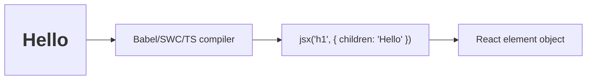

# JSX and How JSX Compiles

## Detailed explanation
JSX is a syntax extension that lets developers write React UI in a familiar tag-like form. It looks similar to HTML, but it is actually JavaScript syntax that gets compiled into function calls. Those function calls create React element objects, which React later uses to build and update the UI.

Understanding JSX compilation helps explain many React rules: why `className` is used instead of `class`, why JavaScript expressions go inside `{}`, why components must be capitalized, and why JSX values are escaped by default instead of treated as raw HTML.

## 1. One-line mental model
JSX is JavaScript syntax for writing React element descriptions in a HTML-like form.

## 2. Problem it solves
Creating UI with nested `React.createElement` calls is verbose and hard to read. JSX makes component output look close to the UI structure while still compiling to JavaScript.

## 3. Core idea
- JSX is syntax, not HTML.
- JSX compiles to function calls that create React elements.
- JavaScript expressions go inside `{}`.
- JSX attributes use JavaScript naming like `className` and `htmlFor`.
- A component must return one parent value, often a fragment.

## 4. Visual / analogy
JSX is shorthand. It is like writing `2 + 2` instead of calling `add(2, 2)`.



## 5. Minimal example

```tsx
const element = <h1 className="title">Hello</h1>;
```

Modern JSX transform compiles roughly to:

```tsx
const element = jsx("h1", {
  className: "title",
  children: "Hello",
});
```

## 6. Real-world example

```tsx
function ProductPrice({ price, currency }: { price: number; currency: string }) {
  return (
    <span>
      {new Intl.NumberFormat("en-US", {
        style: "currency",
        currency,
      }).format(price)}
    </span>
  );
}
```

JSX mixes markup structure with JavaScript expressions while keeping data escaped by default.

## 7. Common interview questions
#### What is JSX?
- **The Engine Mechanism (Why it behaves this way):** JSX is a syntax extension for JavaScript that looks like HTML but compiles to function calls. When a tool like Babel, SWC, or the TypeScript compiler processes JSX, it transforms tags like `<div className="app">Hello</div>` into `jsx("div", { className: "app", children: "Hello" })` (new JSX transform) or `React.createElement("div", { className: "app" }, "Hello")` (classic transform). The result is a plain JavaScript object — a React element — that describes what should appear on screen. JSX is not executed by the browser; it's compiled at build time.
- **The Unforgettable Mental Model:** The **Abbreviation**. JSX is like writing "ASAP" instead of "as soon as possible" — it's shorthand that humans read easily, but it expands to the full form before the computer processes it.
- **The Trap:** Calling JSX "HTML in JavaScript." JSX is not HTML — it has different attribute names (`className` vs `class`), different event handling (`onClick` vs `onclick`), and it compiles to JavaScript function calls, not DOM nodes.
- **Senior Interview Playbook (Verbal Script):** "When asked this in an interview, say: JSX is a syntax extension for JavaScript that lets me write UI in a tag-like format that looks similar to HTML. Under the hood, JSX compiles to function calls — either `jsx()` in the modern transform or `React.createElement()` in the classic transform — which produce React element objects. JSX is not required to use React, but it makes component code much more readable and expressive than nested function calls."

#### Is JSX required to use React?
- **The Engine Mechanism (Why it behaves this way):** No. JSX is purely a compile-time syntax transformation. React's runtime only needs React element objects, which can be created directly with `React.createElement(type, props, ...children)` or the `jsx()` function from `react/jsx-runtime`. The browser never sees JSX — it only receives the compiled JavaScript. You could write an entire React application using only `React.createElement` calls, though the code would be significantly more verbose and harder to read.
- **The Unforgettable Mental Model:** The **Translator**. JSX is like a translator who converts your natural language into machine code. You *could* speak machine code directly, but the translator makes communication much easier.
- **The Trap:** Thinking that removing JSX removes React's overhead. The React element objects and reconciliation engine exist regardless of whether you use JSX or `React.createElement`.
- **Senior Interview Playbook (Verbal Script):** "When asked this in an interview, say: No, JSX is not required. React works with plain JavaScript using `React.createElement` calls. JSX is just syntactic sugar that compiles to those calls. However, JSX is the standard way to write React because it makes nested UI structures readable and intuitive. Writing React without JSX is possible but impractical for anything beyond trivial examples."

#### How does JSX compile?
- **The Engine Mechanism (Why it behaves this way):** JSX compilation happens at build time through a transpiler (Babel, SWC, or TypeScript). The compiler parses JSX syntax into an Abstract Syntax Tree (AST), then transforms JSX nodes into function calls. In the modern JSX transform (introduced in React 17), `<div>Hello</div>` becomes `import { jsx } from 'react/jsx-runtime'; jsx('div', { children: 'Hello' })`. In the classic transform, it becomes `React.createElement('div', null, 'Hello')`. The compiler also handles attribute transformations: `className` stays as-is, `htmlFor` maps from `for`, and event handlers like `onClick` are passed as props.
- **The Unforgettable Mental Model:** The **Factory Assembly Line**. Raw JSX code enters one end of the factory, passes through parsing, transformation, and code generation stations, and emerges as optimized JavaScript on the other end.
- **The Trap:** Assuming JSX compiles differently in development vs production. The compilation process is the same; what differs is that development builds include extra warnings and checks.
- **Senior Interview Playbook (Verbal Script):** "When asked this in an interview, say: JSX is compiled at build time by tools like Babel, SWC, or TypeScript. The compiler transforms JSX tags into function calls — in React 17+, it uses the automatic JSX runtime which imports `jsx` from `react/jsx-runtime` and calls it with the tag type and props. For example, `<Button disabled>Save</Button>` compiles to `jsx(Button, { disabled: true, children: 'Save' })`. This means JSX is never executed by the browser directly; it's always transformed into standard JavaScript first."

#### Why do we use `className` instead of `class`?
- **The Engine Mechanism (Why it behaves this way):** JSX is JavaScript, not HTML. In JavaScript, `class` is a reserved keyword used for ES6 class declarations. Using `class` as a JSX attribute would create a syntax conflict. React uses `className` instead, which maps to the DOM's `className` property (`element.className`) rather than the HTML `class` attribute. When React commits elements to the DOM, it sets `element.className` with the value you provide.
- **The Unforgettable Mental Model:** The **Name Collision**. Imagine two people in a room named "John" — you need a way to distinguish them. In JavaScript, `class` is already taken by the class syntax, so React uses `className` to avoid the collision.
- **The Trap:** Using `class` in JSX and getting a syntax error or unexpected behavior. Some templating engines use `class`, which causes confusion when switching to React.
- **Senior Interview Playbook (Verbal Script):** "When asked this in an interview, say: We use `className` in JSX because `class` is a reserved keyword in JavaScript. JSX is JavaScript syntax, not HTML, so it must follow JavaScript's naming rules. React maps `className` to the DOM's `className` property when it creates the actual element. This is one of several JSX differences from HTML that stem from JSX being compiled JavaScript rather than markup."

#### Why must JSX return one parent?
- **The Engine Mechanism (Why it behaves this way):** A component function must return a single React element (or null, or a boolean/string/number). This is because React's reconciliation algorithm expects each component to produce one root in the element tree. If a component returned multiple sibling elements without a wrapper, React wouldn't know how to place them in the parent's children array. Fragments (`<>...</>` or `<React.Fragment>`) solve this by grouping multiple elements into a single wrapper that doesn't produce an extra DOM node.
- **The Unforgettable Mental Model:** The **Single Package**. When you mail something, it must go in one package — you can't hand the post office three loose items and expect them to arrive as one delivery. A fragment is like a box that holds multiple items but disappears when opened (no extra DOM node).
- **The Trap:** Wrapping everything in unnecessary `<div>` elements just to satisfy the single-parent rule, which creates "div soup" and breaks semantic HTML. Fragments exist specifically to avoid this.
- **Senior Interview Playbook (Verbal Script):** "When asked this in an interview, say: JSX requires a single parent because React's reconciliation algorithm expects each component to return one root element in the tree. If you need to return multiple elements without adding an extra DOM node, you use a fragment — either the shorthand `<>...</>` or `<React.Fragment>`. Fragments group children together without rendering an additional element, keeping the DOM clean and semantic."

#### How do expressions work in JSX?
- **The Engine Mechanism (Why it behaves this way):** JavaScript expressions inside JSX curly braces `{}` are evaluated during the render phase when React calls the component function. The result of the expression becomes part of the React element's props or children. Expressions can be variables, function calls, ternary operators, arithmetic, or any valid JavaScript expression that produces a renderable value (string, number, React element, array of elements, null, undefined, or boolean). Statements like `if`, `for`, and `while` cannot be used inside `{}` because they don't produce values.
- **The Unforgettable Mental Model:** The **Window in a Wall**. JSX is the wall, and `{}` is a window that lets JavaScript values pass through. Whatever you put in the window appears on the other side of the wall.
- **The Trap:** Trying to use statements inside `{}` — like `{if (isLoading) return <Spinner />}` — which causes a syntax error. Statements must be used outside JSX, while expressions go inside.
- **Senior Interview Playbook (Verbal Script):** "When asked this in an interview, say: JSX expressions are written inside curly braces and can contain any valid JavaScript expression — variables, function calls, ternaries, or arithmetic. The expression is evaluated during render and its result becomes part of the UI. Importantly, only expressions work inside `{}`, not statements. So I can write `{isLoading ? <Spinner /> : <Content />}` but I can't write an `if` statement inside braces — that needs to be outside the JSX."

#### Is JSX safe from XSS?
- **The Engine Mechanism (Why it behaves this way):** React automatically escapes all values embedded in JSX before inserting them into the DOM. When you write `<div>{userInput}</div>`, React converts special characters like `<`, `>`, `&`, `"`, and `'` to their HTML entity equivalents, preventing script injection. This escaping happens during the commit phase when React sets DOM properties. However, XSS is still possible if you use `dangerouslySetInnerHTML`, which bypasses escaping and inserts raw HTML into the DOM. Additionally, URLs in `href` or `src` attributes can be vectors for XSS if they contain `javascript:` protocols.
- **The Unforgettable Mental Model:** The **Water Filter**. React's JSX escaping is like a water filter — it removes dangerous contaminants (script tags, special characters) before the water (content) reaches the user. `dangerouslySetInnerHTML` is like bypassing the filter entirely.
- **The Trap:** Assuming JSX is 100% XSS-proof. While JSX escaping protects against most injection attacks, `dangerouslySetInnerHTML`, `javascript:` URLs, and server-side rendering with unsanitized data can still create XSS vulnerabilities.
- **Senior Interview Playbook (Verbal Script):** "When asked this in an interview, say: React provides built-in XSS protection by automatically escaping all values embedded in JSX. When I write `{userInput}`, React converts special characters to HTML entities before inserting them into the DOM, which prevents script injection. However, this protection can be bypassed with `dangerouslySetInnerHTML`, which I should only use with sanitized content. I also need to be careful with URLs in `href` attributes, as `javascript:` protocols can still execute code. So JSX is safe by default, but developers can still introduce XSS through misuse."

#### What is the new JSX transform?
- **The Engine Mechanism (Why it behaves this way):** Introduced in React 17, the new JSX transform changes how JSX compiles. Instead of requiring `import React from 'react'` in every file that uses JSX (because `React.createElement` was called directly), the new transform automatically imports `jsx`, `jsxs`, and `Fragment` from `react/jsx-runtime`. This means `<div>Hello</div>` compiles to `import { jsx } from 'react/jsx-runtime'; jsx('div', { children: 'Hello' })` without needing an explicit React import. The new transform also slightly improves bundle size by not including the entire React module when only JSX compilation is needed.
- **The Unforgettable Mental Model:** The **Auto-Import Assistant**. The old transform was like manually importing a tool before every use. The new transform is like an assistant who automatically places the right tool on your desk when you need it.
- **The Trap:** Forgetting that the new JSX transform requires React 17+ and a compatible compiler configuration. Older projects or misconfigured build tools may still use the classic transform.
- **Senior Interview Playbook (Verbal Script):** "When asked this in an interview, say: The new JSX transform, introduced in React 17, changes how JSX compiles so that you no longer need to import React in every file that uses JSX. Instead of compiling to `React.createElement`, JSX now compiles to `jsx` function calls imported automatically from `react/jsx-runtime`. This reduces boilerplate, slightly improves bundle size, and separates JSX compilation from the React runtime. It's enabled by default in Create React App, Next.js, and most modern React setups."

## 8. Active recall test
1. **What does JSX compile to?**
   - **Explanation:** JSX compiles to function calls — either `jsx()` from `react/jsx-runtime` (new transform, React 17+) or `React.createElement()` (classic transform). These calls produce React element objects, which are plain JavaScript objects describing what should render.
2. **Is JSX HTML?**
   - **Explanation:** No. JSX is a JavaScript syntax extension that looks like HTML but has key differences: `className` instead of `class`, camelCase event names (`onClick`), JavaScript expressions in `{}`, and automatic escaping of values. JSX compiles to JavaScript function calls, not to DOM nodes.
3. **How do you render a JavaScript value inside JSX?**
   - **Explanation:** Wrap the expression in curly braces: `{value}`. The expression is evaluated during render and its result is inserted into the element tree. Renderable values include strings, numbers, React elements, arrays of elements, null, undefined, and booleans.
4. **Why is `htmlFor` used?**
   - **Explanation:** `htmlFor` is used instead of `for` because `for` is a reserved keyword in JavaScript (used in for-loops). React maps `htmlFor` to the DOM's `htmlFor` property on `<label>` elements, which associates the label with its input.
5. **What does a fragment solve?**
   - **Explanation:** A fragment (`<>...</>` or `<React.Fragment>`) allows a component to return multiple sibling elements without adding an extra DOM wrapper node. This satisfies React's single-parent requirement while keeping the DOM clean and semantically correct.

## 9. Mistakes / traps
- Calling JSX HTML.
- Using `class` instead of `className` in React JSX.
- Putting statements like `if` directly inside JSX expression braces.
- Forgetting that objects cannot be rendered directly as children.
- Thinking JSX strings are raw HTML; React escapes values by default.

## 10. Compare with related concepts
- **JSX vs HTML:** JSX is JavaScript syntax; HTML is document markup.
- **JSX vs React element:** JSX compiles into React elements.
- **JSX vs component:** JSX is syntax; a component is a function or class that returns renderable output.
- **JSX vs template language:** JSX has full JavaScript expressions, not custom template directives.

## 11. Summary from memory
Explain what this JSX becomes after compilation: `<Button disabled>Save</Button>`.

## 12. Spaced revision prompts
- After 1 day: Define JSX and explain whether it is required.
- After 3 days: Write JSX and its compiled shape.
- After 7 days: List three JSX differences from HTML.
- After 14 days: Explain why JSX helps React stay declarative.
