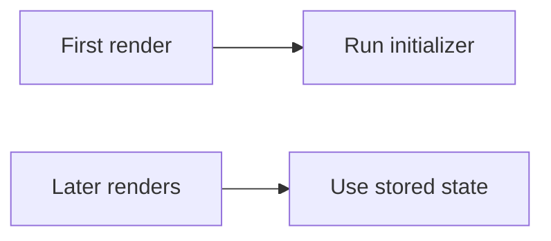

# Lazy Initialization in useState

## Detailed explanation
Lazy initialization means passing a function to `useState` so React calls it only during the initial render. This avoids repeating expensive setup work on every render.

Use it for expensive initial calculations, reading from localStorage, parsing initial data, or creating initial state objects. The initializer function should be pure enough for React development checks.

## 1. One-line mental model
Lazy initialization runs expensive initial state setup only on the first render.

## 2. Problem it solves
Expensive initial values can be recalculated on every render if passed directly.

## 3. Core idea
- Pass a function to `useState`.
- React calls it for the initial state.
- Later renders reuse stored state.
- Useful for expensive setup.
- Initializer should not cause side effects.

## 4. Visual / analogy
Lazy initialization is like making a key once, not forging it every time you open the door.



## 5. Minimal example

```tsx
const [items] = React.useState(() => createExpensiveInitialItems());
```

## 6. Real-world example

```tsx
const [theme, setTheme] = React.useState(() => {
  return window.localStorage.getItem("theme") ?? "light";
});
```

## 7. Common interview questions
- What is lazy initialization?
- Why pass a function to `useState`?
- When is lazy initialization useful?
- Does initializer run every render?
- Should initializer have side effects?
- How does StrictMode affect initializers?
- Lazy initialization vs `useMemo`?

## 8. Active recall test
1. What syntax enables lazy initialization?
2. When does initializer run?
3. Why not call expensive function directly?
4. What is a localStorage use case?
5. Why should initializer be safe?

## 9. Mistakes / traps
- Writing `useState(expensive())` instead of `useState(() => expensive())`.
- Doing network requests in initializer.
- Expecting initializer to respond to prop changes.
- Using it for cheap values unnecessarily.
- Ignoring SSR when reading `window`.

## 10. Compare with related concepts
- **Lazy init vs `useMemo`:** lazy init sets initial state once; memo recalculates when dependencies change.
- **Initializer vs setter:** initializer creates first value; setter updates later.
- **Lazy init vs effect:** initializer is render-time state setup; effect syncs external systems.

## 11. Summary from memory
Explain why reading localStorage directly inside `useState()` can be less ideal than lazy initialization.

## 12. Spaced revision prompts
- After 1 day: Define lazy initialization.
- After 3 days: Write lazy initializer syntax.
- After 7 days: Compare with `useMemo`.
- After 14 days: Explain SSR caveat.

