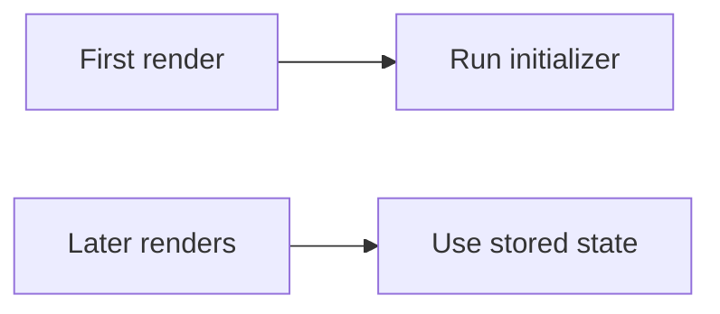

# Lazy Initialization in useState

## Detailed explanation
Lazy initialization means passing a function to `useState` so React calls it only during the initial render. This avoids repeating expensive setup work on every render.

Use it for expensive initial calculations, reading from localStorage, parsing initial data, or creating initial state objects. The initializer function should be pure enough for React development checks.

## 1. One-line mental model
Lazy initialization runs expensive initial state setup only on the first render.

## 2. Problem it solves
Expensive initial values can be recalculated on every render if passed directly.

## 3. Core idea
- Pass a function to `useState`.
- React calls it for the initial state.
- Later renders reuse stored state.
- Useful for expensive setup.
- Initializer should not cause side effects.

## 4. Visual / analogy
Lazy initialization is like making a key once, not forging it every time you open the door.



## 5. Minimal example

```tsx
const [items] = React.useState(() => createExpensiveInitialItems());
```

## 6. Real-world example

```tsx
const [theme, setTheme] = React.useState(() => {
  return window.localStorage.getItem("theme") ?? "light";
});
```

## 7. Common interview questions
#### What is lazy initialization?
- **The Engine Mechanism (Why it behaves this way):** When you pass a function to `useState`, React detects the function type during the initial render and calls it to compute the initial state value. On subsequent renders, React skips calling the initializer entirely and returns the stored state from the Fiber node's `memoizedState`. The initializer function is only invoked once during the mount phase of the component's lifecycle.
- **The Unforgettable Mental Model:** The **One-Time Spell**. A wizard casts an expensive enchantment once when the sword is forged (initial render). Every time the sword is drawn afterward (subsequent renders), the enchantment is already there — no need to recast it.
- **The Trap:** Confusing lazy initialization with `useMemo`. Lazy init runs only on mount and never again. `useMemo` re-runs when its dependencies change. They solve different problems.
- **Senior Interview Playbook (Verbal Script):** "When asked this in an interview, say: Lazy initialization is passing a function to `useState` instead of a direct value. React calls that function only during the first render to compute the initial state, then discards it. On every subsequent render, React uses the stored state value without re-invoking the initializer. This avoids repeating expensive computations on every render."

#### Why pass a function to `useState`?
- **The Engine Mechanism (Why it behaves this way):** If you pass `useState(expensiveComputation())`, the function executes during every render because JavaScript evaluates function arguments before calling the outer function. By passing `useState(() => expensiveComputation())`, you pass a function reference — not its result. React's internal logic checks if the initial state argument is a function, and only then invokes it during the mount phase. This defers execution and limits it to a single call.
- **The Unforgettable Mental Model:** The **Recipe vs. the Meal**. Passing `expensiveComputation()` is like cooking the meal before handing it to the chef — you cook it every time. Passing `() => expensiveComputation()` is like handing the chef a recipe — they only cook it once when the restaurant opens.
- **The Trap:** Using lazy initialization for cheap values like `useState(() => 0)`. The overhead of the function call outweighs any benefit. Reserve it for genuinely expensive operations.
- **Senior Interview Playbook (Verbal Script):** "When asked this in an interview, say: Passing a function to `useState` defers expensive computation to only the initial render. Without it, `useState(expensiveFn())` executes the function on every render because JavaScript evaluates arguments eagerly. The lazy initializer pattern ensures the computation runs exactly once during mount, improving performance for costly initializations like parsing large datasets or reading from storage."

#### When is lazy initialization useful?
- **The Engine Mechanism (Why it behaves this way):** Any operation that's expensive to compute and only needed for the initial state benefits from lazy initialization. This includes: parsing JSON from localStorage, constructing large initial data structures, computing date/time values, reading browser APIs, or performing complex calculations. Since React stores the result in the Fiber node's `memoizedState`, the expensive work is never repeated unless the component unmounts and remounts.
- **The Unforgettable Mental Model:** The **Museum Exhibit**. You only need to set up the exhibit (expensive initialization) once when the museum opens. Visitors (renders) come and go, but the exhibit stays in place — you don't rebuild it for every visitor.
- **The Trap:** Using lazy initialization for values that need to respond to prop changes. The initializer only runs on mount, so if a prop changes, the initial state won't update. For prop-dependent values, compute them during render or use `useMemo`.
- **Senior Interview Playbook (Verbal Script):** "When asked this in an interview, say: Lazy initialization is useful for expensive one-time setup: parsing localStorage data, building large initial arrays or objects, computing complex default values, or reading browser APIs. It's ideal when the initial value is costly to compute and doesn't need to change in response to props. If the value depends on props that change, I'd compute it during render or use `useMemo` instead."

#### Does initializer run every render?
- **The Engine Mechanism (Why it behaves this way):** No. React's `useState` implementation checks whether the component is mounting or updating. During mount, if the initial state argument is a function, React calls it and stores the result. During updates, React reads from `memoizedState` and ignores the initial state argument entirely — the function reference is passed but never invoked. This is why the initializer's code has zero performance impact on re-renders.
- **The Unforgettable Mental Model:** The **Launch Button**. You press the launch button (initializer) once to start the rocket. After liftoff, pressing the button again does nothing — the rocket is already in orbit.
- **The Trap:** In StrictMode development, React double-invokes the initializer during the mount-unmount-remount cycle. This can cause issues if the initializer has side effects (like writing to localStorage or making API calls).
- **Senior Interview Playbook (Verbal Script):** "When asked this in an interview, say: No, the initializer runs only during the initial mount. React stores the computed value in the Fiber node and reuses it on every subsequent render, completely ignoring the initializer function. The only exception is StrictMode in development, which double-invokes the mount phase to test cleanup — so the initializer runs twice there, but only in dev."

#### Should initializer have side effects?
- **The Engine Mechanism (Why it behaves this way):** The render phase in React's Fiber architecture should be pure — no side effects like network requests, DOM mutations, or external state modifications. React may call component functions multiple times (StrictMode, Concurrent Mode, error recovery), so side effects in initializers can execute unpredictably. While reading from localStorage is generally safe (idempotent read), writing to it or making API calls in an initializer violates React's purity expectations.
- **The Unforgettable Mental Model:** The **Mirror Test**. The render phase should be like looking in a mirror — you observe and describe, but you don't rearrange the room. Side effects rearrange the room while you're still describing it.
- **The Trap:** Reading `window` or `localStorage` in an initializer during SSR. These globals don't exist on the server, causing crashes. Guard with `typeof window !== 'undefined'` checks or use environment-specific initialization.
- **Senior Interview Playbook (Verbal Script):** "When asked this in an interview, say: Initializers should be side-effect-free. The render phase must be pure because React may invoke it multiple times. Reading from localStorage or computing values is fine, but writing to storage, making API calls, or mutating external state belongs in `useEffect`. For SSR compatibility, I also guard browser-only reads with environment checks."

#### How does StrictMode affect initializers?
- **The Engine Mechanism (Why it behaves this way):** In StrictMode development, React mounts the component, runs the initializer, immediately unmounts (discarding the state), then remounts and runs the initializer again. This means any side effect in the initializer — like a `console.log`, a network request, or a localStorage write — executes twice. The second mount's result is the one that persists, but the first execution's side effects still occurred.
- **The Unforgettable Mental Model:** The **Double-Check Inspector**. StrictMode is an inspector who checks your work twice. If your initialization writes something to a log, the inspector sees it written twice — even though only the second version is kept.
- **The Trap:** Assuming double-invocation means the state is doubled. It's not — the state from the second mount is what persists. Only the side effects compound.
- **Senior Interview Playbook (Verbal Script):** "When asked this in an interview, say: StrictMode double-invokes the mount phase in development, so the initializer runs twice. The state from the second mount is what persists, but any side effects from the first execution still happened. This is why initializers must be pure — if they have side effects like API calls or storage writes, those effects will execute twice in development, which can cause confusing behavior or data duplication."

#### Lazy initialization vs `useMemo`?
- **The Engine Mechanism (Why it behaves this way):** `useState(() => expensive())` runs once on mount and never again — the value is stored in `memoizedState` and only changes via `setState`. `useMemo(() => expensive(), [deps])` runs on mount AND whenever any dependency changes — the value is recomputed and stored in the Fiber's `memoizedState` for that hook slot. Lazy init is for initial state that doesn't change; `useMemo` is for derived values that update when inputs change.
- **The Unforgettable Mental Model:** The **Birth Certificate vs. the Annual Report**. Lazy init is like a birth certificate — created once, never changes. `useMemo` is like an annual report — regenerated whenever the underlying data changes.
- **The Trap:** Using `useMemo` for initial state that never needs recomputation — adding unnecessary dependency tracking overhead. Or using lazy init for values that should update when props change.
- **Senior Interview Playbook (Verbal Script):** "When asked this in an interview, say: Lazy initialization with `useState` runs exactly once on mount and the value persists until explicitly updated with `setState`. `useMemo` runs on mount and re-runs whenever its dependencies change. Use lazy init for expensive initial state that doesn't need to update. Use `useMemo` for expensive derived values that should recompute when their inputs change."

## 8. Active recall test
1. **What syntax enables lazy initialization?**
   - **Explanation:** Pass a function to `useState` instead of a direct value: `useState(() => expensiveComputation())`. React detects the function type and invokes it only during the initial render to compute the state value.
2. **When does the initializer run?**
   - **Explanation:** Only during the component's first render (mount phase). On all subsequent renders, React reads the stored state from the Fiber node's `memoizedState` and ignores the initializer function entirely. StrictMode in development runs it twice due to double-mounting.
3. **Why not call the expensive function directly?**
   - **Explanation:** JavaScript evaluates function arguments before calling the outer function. `useState(expensive())` executes `expensive()` on every render. `useState(() => expensive())` passes a function reference that React only invokes during mount, avoiding repeated computation.
4. **What is a localStorage use case?**
   - **Explanation:** Reading a saved theme preference: `const [theme, setTheme] = useState(() => localStorage.getItem('theme') ?? 'light')`. This reads from storage once on mount instead of on every render, and the stored state persists across re-renders.
5. **Why should the initializer be side-effect-free?**
   - **Explanation:** React may invoke the component function multiple times during rendering (StrictMode, Concurrent Mode). Side effects like API calls, DOM mutations, or external state writes in the initializer would execute unpredictably, causing bugs, duplicate requests, or data corruption.

## 9. Mistakes / traps
- Writing `useState(expensive())` instead of `useState(() => expensive())`.
- Doing network requests in initializer.
- Expecting initializer to respond to prop changes.
- Using it for cheap values unnecessarily.
- Ignoring SSR when reading `window`.

## 10. Compare with related concepts
- **Lazy init vs `useMemo`:** lazy init sets initial state once; memo recalculates when dependencies change.
- **Initializer vs setter:** initializer creates first value; setter updates later.
- **Lazy init vs effect:** initializer is render-time state setup; effect syncs external systems.

## 11. Summary from memory
Explain why reading localStorage directly inside `useState()` can be less ideal than lazy initialization.

## 12. Spaced revision prompts
- After 1 day: Define lazy initialization.
- After 3 days: Write lazy initializer syntax.
- After 7 days: Compare with `useMemo`.
- After 14 days: Explain SSR caveat.

