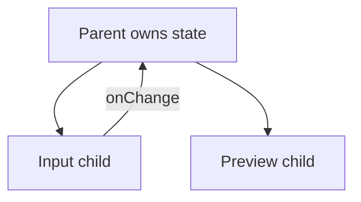

# Lifting State Up

## Detailed explanation
Lifting state up means moving state from a child component to a parent component when multiple components need to read or update the same value. The closest common parent becomes the owner, passes the value down, and passes callbacks down for updates.

This is the standard React solution for sibling coordination. It keeps one source of truth instead of duplicating the same value in multiple components.

## 1. One-line mental model
Lifting state up means moving shared state to the closest common parent of components that need it.

## 2. Problem it solves
Sibling components cannot directly share local state. If one component changes data that another component must display, the shared state needs a common owner.

## 3. Core idea
- Identify the components that need the same state.
- Find their closest common parent.
- Move the state to that parent.
- Pass the value down as props.
- Pass callbacks down so children can request updates.

## 4. Visual / analogy
Lifting state is like moving a shared whiteboard from one desk to the meeting room so everyone who needs it can see it.



## 5. Minimal example

```tsx
function Parent() {
  const [name, setName] = React.useState("");
  return (
    <>
      <input value={name} onChange={(event) => setName(event.target.value)} />
      <p>Preview: {name}</p>
    </>
  );
}
```

## 6. Real-world example

```tsx
function ProductFiltersPage() {
  const [filters, setFilters] = React.useState({ status: "all" });

  return (
    <>
      <FilterPanel filters={filters} onFiltersChange={setFilters} />
      <ProductTable filters={filters} />
    </>
  );
}
```

The filter panel changes state that the table needs for querying or filtering.

## 7. Common interview questions
#### What is lifting state up?
- **The Engine Mechanism (Why it behaves this way):** Lifting state up is the process of moving state from a child component to their closest common ancestor when multiple children need to share that state. During the render phase, the parent component holds the state via `useState`, passes the current value down as props to each child, and passes a state-updating callback (like `setState`) so children can request changes. When a child calls the callback, React updates the parent's state, triggers a re-render of the parent, and the new state flows down to all children through props. React's reconciliation then updates only the DOM nodes that changed. This ensures a single source of truth — the parent's state — instead of duplicated, potentially inconsistent state in multiple children.
- **The Unforgettable Mental Model:** The **Shared Whiteboard**. Two coworkers (sibling components) need to reference the same information. Instead of each keeping their own notes (local state) that might differ, they move the notes to a shared whiteboard in the hallway (parent state). Both can read it and write to it, and everyone always sees the same thing.
- **The Trap:** Lifting state too high — all the way to the app root — when only a nearby parent needs it. This creates unnecessary prop drilling and re-renders the entire app tree.
- **Senior Interview Playbook (Verbal Script):** "When asked this in an interview, say: Lifting state up means moving shared state from a child component to their closest common parent. When multiple siblings need to read or update the same value, keeping it in one child's local state creates inconsistency. By lifting it to the parent, we create a single source of truth. The parent passes the value down as props and a callback for updates. This is React's standard solution for sibling component coordination."

#### When should state be lifted?
- **The Engine Mechanism (Why it behaves this way):** State should be lifted when two or more components need to read or update the same value. During React's render cycle, each component has its own isolated state scope. If Component A has state that Component B needs to display, Component B cannot directly access Component A's state. The only way to share it is to move the state to a component that is an ancestor of both. React's tree structure determines the "closest common parent" — the nearest ancestor that contains both components in its subtree. Lifting state changes the data flow: instead of A owning state and B being unaware, the parent owns state and both A and B receive it through props.
- **The Unforgettable Mental Model:** The **Family Heirloom**. If two siblings (components) need access to a family heirloom (state), it doesn't make sense for one sibling to keep it locked in their house (local state). It belongs in the parent's house (common ancestor) where both can access it.
- **The Trap:** Lifting state when only one component needs it. State should stay as close to where it's used as possible (colocation). Lift only when sharing is required.
- **Senior Interview Playbook (Verbal Script):** "When asked this in an interview, say: I lift state when two or more components need to read or update the same value. If a search input's query needs to be displayed in a results list and a search counter, the query state belongs in their common parent. But if only one component uses the state, I keep it local — colocation is the default, lifting is the exception for shared needs."

#### What is the closest common parent?
- **The Engine Mechanism (Why it behaves this way):** The closest common parent is the nearest ancestor component in the React tree that contains all components needing the shared state. React's component tree is a hierarchy — each component can have children, and those children can have their own children. To find the closest common parent, you trace up from each component that needs the state until you find an ancestor they share. This is the minimal lift point — lifting any higher would pass the state through unnecessary intermediate components (prop drilling), and lifting any lower wouldn't reach all the components that need it. During reconciliation, React uses this tree structure to determine which components re-render when state changes.
- **The Unforgettable Mental Model:** The **Family Tree Meeting Point**. To find where two cousins meet, you go up the family tree from each until you find the first shared ancestor — maybe a grandparent. You don't go all the way to the great-great-grandparent (app root) if the grandparent (closest parent) is sufficient.
- **The Trap:** Not identifying the actual closest common parent and instead lifting to a much higher component. This creates unnecessary prop drilling and performance issues.
- **Senior Interview Playbook (Verbal Script):** "When asked this in an interview, say: The closest common parent is the nearest ancestor in the component tree that contains all components needing the shared state. I find it by tracing up from each component until I find their first shared ancestor. This is the minimal lift point — it avoids unnecessary prop drilling while ensuring all components that need the state can access it through props."

#### How does lifting state relate to controlled components?
- **The Engine Mechanism (Why it behaves this way):** Lifting state and controlled components use the same mechanism: parent owns state, child receives value via props, child reports changes via callback. A controlled input is essentially lifted state — the input's value is lifted from the input element (which would naturally hold it in the DOM) to the React component's state. The input becomes a "child" that displays the parent's state and fires `onChange` to request updates. When you lift state for sibling coordination, the children that display or modify that state become controlled by the parent. The pattern is identical: state lives in the parent, flows down as props, changes flow up as callbacks.
- **The Unforgettable Mental Model:** The **Puppet Strings**. The puppeteer (parent) holds the strings (state). Each puppet (child) moves based on how the puppeteer pulls the strings. The puppet doesn't decide its own position — it's controlled by the shared state above it.
- **The Trap:** Not recognizing that controlled inputs are already an instance of lifted state. Understanding this connection makes both concepts easier to reason about.
- **Senior Interview Playbook (Verbal Script):** "When asked this in an interview, say: Lifting state and controlled components are the same pattern. A controlled input lifts the input's value from the DOM to React state in the parent. The parent passes the value down and receives changes through onChange. When I lift state for sibling coordination, the children become controlled by the parent's state. Both follow the same data flow: parent owns state, children receive it as props, and request changes through callbacks."

#### What are downsides of lifting too much state?
- **The Engine Mechanism (Why it behaves this way):** When state is lifted too high in the tree, every state update triggers a re-render of the parent and all its descendants. React's default behavior re-renders every child component when a parent's state changes, regardless of whether that child uses the changed state. This creates a performance cascade: a single keystroke in a deeply nested input causes the entire subtree to re-render. Additionally, the parent component accumulates state variables and callbacks for concerns it doesn't directly care about, making it harder to read and maintain. The prop chain grows longer, and intermediate components become mere pass-throughs (prop drilling).
- **The Unforgettable Mental Model:** The **Megaphone in a Library**. One person whispers a change (state update), but because the state is at the top, everyone in the building (all descendants) gets notified via megaphone (re-render). Most people don't need to know — only the relevant few do.
- **The Trap:** Assuming lifting state is always the right answer. Sometimes context, URL state, or a state manager is more appropriate for widely-shared state.
- **Senior Interview Playbook (Verbal Script):** "When asked this in an interview, say: Lifting too much state causes performance issues because every state update re-renders the parent and all its descendants. It also creates prop drilling — intermediate components pass props they don't use — and makes the parent component a god object managing unrelated state. When state needs to be shared across distant parts of the tree, I consider context for low-frequency data, URL state for shareable filters, or a state manager for complex cross-cutting concerns."

#### How do you avoid prop drilling after lifting state?
- **The Engine Mechanism (Why it behaves this way):** After lifting state, if the child that needs it is deeply nested, the state must pass through intermediate components. Solutions include: (1) Composition — pass the child component as `children` or a named prop, so intermediate components don't need to know about the state. The intermediate component renders `{children}` without accessing the state prop. (2) Context — create a React Context with the lifted state and consume it directly in the deep child, bypassing intermediate components. Context uses React's tree traversal to deliver values directly to consumers without prop passing. (3) State management libraries — for complex apps, libraries like Zustand or Redux provide a global store that any component can subscribe to. Each solution has trade-offs: composition is simplest but only works for specific layouts, context adds indirection, and global stores add complexity.
- **The Unforgettable Mental Model:** The **Express Delivery vs. Relay Race**. Prop drilling = relay race — the package passes through five runners (intermediate components). Composition = express delivery — the package goes directly to the recipient through a dedicated channel (children prop). Context = teleportation — the package appears at the destination without traveling through intermediaries.
- **The Trap:** Reaching for Context as the first solution. Composition often solves prop drilling without adding the complexity and implicit dependencies that Context introduces.
- **Senior Interview Playbook (Verbal Script):** "When asked this in an interview, say: I avoid prop drilling first through composition — passing components as children or named props so intermediate components don't need to know about the state. If composition doesn't fit the layout, I use React Context for state that many components need. For complex cross-cutting state, I consider a state manager. The key is choosing the simplest solution that solves the problem — composition before context, context before global state."

#### When should state go to context or a store instead?
- **The Engine Mechanism (Why it behaves this way):** State should go to Context when it's needed by many components at different levels of the tree and lifting would cause excessive prop drilling. Context uses React's internal tree traversal to deliver values directly to consumers, bypassing intermediate components. However, Context triggers a re-render of all consumers when the value changes, so it's best for low-frequency updates (theme, locale, auth user). For high-frequency state (typing, scrolling), Context causes too many re-renders. A state manager (Zustand, Redux) is better when state is complex, needs middleware (logging, persistence), or when fine-grained subscriptions are needed — Zustand, for example, only re-renders components that subscribe to the specific state slice that changed.
- **The Unforgettable Mental Model:** The **Broadcast System**. Context = town square announcement — everyone hears it, good for important but infrequent news (theme change). State manager = personalized newsletter — each subscriber only gets the sections they care about (fine-grained updates). Lifted state = passing a note hand-to-hand — fine for nearby recipients, exhausting for distant ones.
- **The Trap:** Putting high-frequency state (like form input values) in broad Context. Every keystroke re-renders every Context consumer, causing severe performance issues.
- **Senior Interview Playbook (Verbal Script):** "When asked this in an interview, say: I use Context for low-frequency, widely-needed state like theme, locale, or authenticated user — things that change rarely but are consumed by many components. For high-frequency state, I avoid broad Context because every update re-renders all consumers. For complex state with middleware needs or fine-grained subscriptions, I use a state manager like Zustand. The decision tree is: can composition solve it? If not, is it low-frequency and widely needed? Context. Is it complex or high-frequency? State manager."

## 8. Active recall test
1. **Why cannot sibling components share local state directly?**
   - **Explanation:** Each component's state is scoped to that component instance. Siblings have separate state scopes with no direct access to each other. The only way to share state is through a common ancestor that can pass the value down to both as props.
2. **How do children update lifted state?**
   - **Explanation:** The parent passes a state-updating callback (like `setState` or a wrapper function) as a prop to the child. The child calls this callback with the new value, which updates the parent's state and triggers a re-render with the new value flowing back down.
3. **What is the closest common parent?**
   - **Explanation:** The nearest ancestor component in the React tree that contains all components needing the shared state. It's found by tracing up from each component until you find their first shared ancestor — the minimal lift point.
4. **What happens if state is lifted too high?**
   - **Explanation:** Every state update re-renders the parent and all its descendants, causing performance issues. It also creates prop drilling (intermediate components passing unused props) and makes the parent component a god object managing unrelated concerns.
5. **When would URL state be better than lifted state?**
   - **Explanation:** When the state represents shareable, bookmarkable information like search queries, filters, or pagination. URL state persists across page refreshes, can be shared via links, and integrates with browser navigation (back/forward buttons).

## 9. Mistakes / traps
- Lifting state all the way to the app root by default.
- Creating prop drilling for deeply nested trees.
- Lifting state that only one child needs.
- Duplicating the same state in parent and child.
- Using global state when a parent would be enough.

## 10. Compare with related concepts
- **Lifting state vs colocation:** lift only when sharing is needed; otherwise keep state local.
- **Lifting state vs context:** context avoids passing props through many levels.
- **Lifting state vs global store:** global stores are for broader cross-tree sharing.

## 11. Summary from memory
Explain how you would connect a search input and results list using lifted state.

## 12. Spaced revision prompts
- After 1 day: Define lifting state up.
- After 3 days: Find the closest common parent in a component tree.
- After 7 days: Explain the downside of lifting too high.
- After 14 days: Compare lifted state, context, and URL state.
