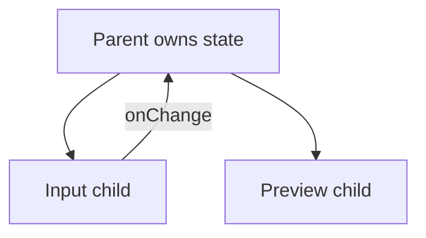

# Lifting State Up

## Detailed explanation
Lifting state up means moving state from a child component to a parent component when multiple components need to read or update the same value. The closest common parent becomes the owner, passes the value down, and passes callbacks down for updates.

This is the standard React solution for sibling coordination. It keeps one source of truth instead of duplicating the same value in multiple components.

## 1. One-line mental model
Lifting state up means moving shared state to the closest common parent of components that need it.

## 2. Problem it solves
Sibling components cannot directly share local state. If one component changes data that another component must display, the shared state needs a common owner.

## 3. Core idea
- Identify the components that need the same state.
- Find their closest common parent.
- Move the state to that parent.
- Pass the value down as props.
- Pass callbacks down so children can request updates.

## 4. Visual / analogy
Lifting state is like moving a shared whiteboard from one desk to the meeting room so everyone who needs it can see it.



## 5. Minimal example

```tsx
function Parent() {
  const [name, setName] = React.useState("");
  return (
    <>
      <input value={name} onChange={(event) => setName(event.target.value)} />
      <p>Preview: {name}</p>
    </>
  );
}
```

## 6. Real-world example

```tsx
function ProductFiltersPage() {
  const [filters, setFilters] = React.useState({ status: "all" });

  return (
    <>
      <FilterPanel filters={filters} onFiltersChange={setFilters} />
      <ProductTable filters={filters} />
    </>
  );
}
```

The filter panel changes state that the table needs for querying or filtering.

## 7. Common interview questions
- What is lifting state up?
- When should state be lifted?
- What is the closest common parent?
- How does lifting state relate to controlled components?
- What are downsides of lifting too much state?
- How do you avoid prop drilling after lifting state?
- When should state go to context or a store instead?

## 8. Active recall test
1. Why cannot sibling components share local state directly?
2. How do children update lifted state?
3. What is the closest common parent?
4. What happens if state is lifted too high?
5. When would URL state be better than lifted state?

## 9. Mistakes / traps
- Lifting state all the way to the app root by default.
- Creating prop drilling for deeply nested trees.
- Lifting state that only one child needs.
- Duplicating the same state in parent and child.
- Using global state when a parent would be enough.

## 10. Compare with related concepts
- **Lifting state vs colocation:** lift only when sharing is needed; otherwise keep state local.
- **Lifting state vs context:** context avoids passing props through many levels.
- **Lifting state vs global store:** global stores are for broader cross-tree sharing.

## 11. Summary from memory
Explain how you would connect a search input and results list using lifted state.

## 12. Spaced revision prompts
- After 1 day: Define lifting state up.
- After 3 days: Find the closest common parent in a component tree.
- After 7 days: Explain the downside of lifting too high.
- After 14 days: Compare lifted state, context, and URL state.
