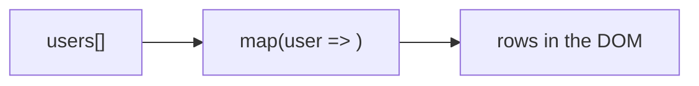

# List Rendering

## Detailed explanation
List rendering is the process of converting arrays of data into arrays of React elements. Most production screens render repeated structures: table rows, dropdown options, cards, menu items, search results, notifications, and form fields.

The main learning point is that each rendered item needs stable identity through a `key`. List rendering is not only about `map`; it is also about preserving item state, avoiding unnecessary work, and choosing pagination or virtualization when lists become large.

## 1. One-line mental model
List rendering turns an array of data into an array of React elements.

## 2. Problem it solves
Most applications display repeated data: menus, tables, cards, search results, notifications, and forms. List rendering provides a declarative way to produce UI from arrays.

## 3. Core idea
- Use `map` to transform data items into elements.
- Every sibling in a rendered list needs a stable `key`.
- Keep rendering logic small inside `map`.
- Filter and sort data before mapping when possible.
- Large lists may need pagination or virtualization.

## 4. Visual / analogy
List rendering is an assembly line: each data item goes in, one UI row comes out.



## 5. Minimal example

```tsx
function Names({ names }: { names: string[] }) {
  return (
    <ul>
      {names.map((name) => <li key={name}>{name}</li>)}
    </ul>
  );
}
```

## 6. Real-world example

```tsx
function OrdersTable({ orders }: { orders: Order[] }) {
  return (
    <tbody>
      {orders.map((order) => (
        <OrderRow key={order.id} order={order} />
      ))}
    </tbody>
  );
}
```

`OrderRow` keeps the mapping readable and gives each row a stable key.

## 7. Common interview questions
#### How do you render lists in React?
- **The Engine Mechanism (Why it behaves this way):** Lists are rendered by transforming an array of data into an array of React elements, typically using `Array.prototype.map()`. During the render phase, React calls the component function, which executes `map()` to produce an array of element objects. React then processes each element in the array as a sibling in the Virtual DOM tree. Each element must have a `key` prop so React can track its identity across renders. The `map()` callback receives the item, index, and array, allowing you to compute the element's props and content based on the data.
- **The Unforgettable Mental Model:** The **Assembly Line**. Raw materials (data items) enter one end, each goes through the same stamping process (map callback), and finished products (React elements) come out the other end.
- **The Trap:** Using `map` for side effects inside the render function. `map` should only transform data into elements — it should not mutate state, make API calls, or perform other side effects.
- **Senior Interview Playbook (Verbal Script):** "When asked this in an interview, say: I render lists by mapping over an array of data and returning a React element for each item. For example, `users.map(user => <UserRow key={user.id} user={user} />)`. Each element needs a stable key so React can track identity across renders. I keep the map callback simple — just transforming data into elements — and extract complex rendering logic into a separate component for readability."

#### Why does each list item need a key?
- **The Engine Mechanism (Why it behaves this way):** Keys are React's mechanism for matching elements between renders in a list. When a list changes (items added, removed, reordered), React uses keys to determine which elements correspond to which items from the previous render. Without keys, React falls back to matching by position (index), which can cause incorrect state preservation — an input field might retain the value of a different item after a reorder. Keys are used during the reconciliation phase when React diffs sibling elements. Keys must be stable (same value across renders for the same item), unique among siblings, and based on data identity.
- **The Unforgettable Mental Model:** The **Social Security Number**. A key is like an SSN — it uniquely identifies a person regardless of where they sit in a room. Without it, you'd identify people by their seat number, which breaks when people move.
- **The Trap:** Thinking keys are only for performance. Keys are primarily for correctness — without them, React can attach the wrong state to the wrong item, causing bugs that are hard to reproduce.
- **Senior Interview Playbook (Verbal Script):** "When asked this in an interview, say: Keys help React identify which list items have changed, been added, or been removed between renders. Without keys, React matches elements by position, which can cause state to be associated with the wrong item when the list is reordered or filtered. Keys should be stable, unique among siblings, and based on data identity — typically a database ID. They're not just a performance optimization; they're essential for correctness when list items have local state."

#### Can you use array index as key?
- **The Engine Mechanism (Why it behaves this way):** Using array index as key is only safe for static lists that never change order, never have items inserted or removed, and never filter items. When the list is dynamic, index keys cause React to match elements by position rather than by identity. For example, if you insert an item at position 0, all existing items shift down by one index, and React thinks every element is a different item — it unmounts and remounts them all, losing their local state (like input values, focus, or animation state). This also causes unnecessary DOM operations and can trigger animation bugs.
- **The Unforgettable Mental Model:** The **Seat Number Problem**. If you identify people by their seat number (index), and someone sits in front of everyone, all seat numbers shift. The person who was in seat 2 is now in seat 3, but you still call them "seat 2" — confusion ensues.
- **The Trap:** Using index as key because "it works fine" in a simple demo. It works until the list becomes dynamic — then bugs appear that are hard to trace.
- **Senior Interview Playbook (Verbal Script):** "When asked this in an interview, say: Index as key is only safe for static lists that never reorder, insert, or remove items. For dynamic lists, index keys cause React to mismatch elements — when an item is inserted, all subsequent items shift positions, and React thinks they're different elements. This loses local state like input values and focus, and causes unnecessary DOM operations. I always use a stable ID from the data as the key, and only fall back to index when the list is truly static and has no local state."

#### Where should the `key` prop go?
- **The Engine Mechanism (Why it behaves this way):** The `key` prop must be placed on the element inside the `map()` call, not inside the child component. When you write `items.map(item => <ListItem key={item.id} item={item} />)`, the `key` is on the `<ListItem />` element itself. React uses `key` during reconciliation of sibling elements — it's a special prop that React consumes and does not pass to the component. If you put `key` inside the `ListItem` component's props, React won't see it at the sibling level and reconciliation will fail.
- **The Unforgettable Mental Model:** The **Luggage Tag**. The key is like a luggage tag on the outside of a suitcase — the airline (React) reads it to route the bag. If you put the tag inside the suitcase (inside the component), the airline can't see it.
- **The Trap:** Putting `key` as a prop inside the child component and expecting React to use it for reconciliation. React consumes `key` at the sibling level — it's not accessible as `props.key` inside the component.
- **Senior Interview Playbook (Verbal Script):** "When asked this in an interview, say: The key prop goes on the element returned by the map callback, not inside the child component. For example, `items.map(item => <Item key={item.id} data={item} />)`. React uses key at the sibling level during reconciliation — it's not passed to the component as a prop. If I extract the list item into a component, the key stays on the component tag in the map, not inside the component's own JSX."

#### How do you render filtered lists?
- **The Engine Mechanism (Why it behaves this way):** Filtered lists are rendered by applying `Array.prototype.filter()` before `map()`: `items.filter(predicate).map(item => <Item key={item.id} />)`. The filter creates a new array containing only items that match the condition, and map transforms that filtered array into elements. During reconciliation, React sees that some elements from the previous render are no longer in the new tree (because they were filtered out) and removes them from the DOM. The remaining elements keep their identity through their keys, preserving their state. For performance, filtering should ideally happen before the render phase (e.g., in a memoized computation or on the server) for large datasets.
- **The Unforgettable Mental Model:** The **Sieve**. Filtering is like pouring sand through a sieve — only the grains that fit the holes (match the condition) pass through to become the final product.
- **The Trap:** Filtering and sorting inside the render function on every render without memoization. For large lists, this creates unnecessary computation on every state change, even unrelated ones.
- **Senior Interview Playbook (Verbal Script):** "When asked this in an interview, say: I render filtered lists by chaining filter before map: `items.filter(item => item.active).map(item => <Item key={item.id} />)`. The filter creates a new array with only matching items, and map transforms them into elements. For performance with large lists, I memoize the filtered result with useMemo so it only recomputes when the data or filter criteria change. I also consider server-side filtering for very large datasets to avoid processing on the client."

#### How do you optimize large lists?
- **The Engine Mechanism (Why it behaves this way):** Large lists can be optimized through several strategies: (1) Pagination — only render a subset of items per page, reducing the number of DOM nodes. (2) Virtualization (windowing) — only render items currently visible in the viewport, recycling DOM nodes as the user scrolls. Libraries like `react-window` or `react-virtualized` calculate which items are visible based on scroll position and item height, rendering only those. (3) Memoization — wrap list items in `React.memo` to prevent re-renders when individual item data hasn't changed. (4) Key stability — ensure keys don't change between renders to avoid unnecessary remounts. React's reconciliation processes every element in the list, so reducing the number of elements directly improves render performance.
- **The Unforgettable Mental Model:** The **Theater Spotlight**. Virtualization is like a spotlight on a dark stage — only the actors in the spotlight (visible items) are illuminated (rendered). The others are still there, just not visible to the audience.
- **The Trap:** Trying to optimize before measuring. Large lists aren't always slow — if items are simple and the list is under a few hundred items, React can handle it fine. Profile first, then optimize.
- **Senior Interview Playbook (Verbal Script):** "When asked this in an interview, say: For large lists, I first profile to identify the bottleneck. If rendering too many DOM nodes is the issue, I use virtualization with react-window to only render visible items. If re-renders are the issue, I memoize list items with React.memo and ensure stable keys. For very large datasets, I implement pagination or infinite scrolling to limit the number of items loaded at once. The key is to measure first — not all large lists need optimization, and premature optimization can add unnecessary complexity."

#### What is virtualization?
- **The Engine Mechanism (Why it behaves this way):** Virtualization (also called windowing) is a technique where only the items currently visible in the viewport are rendered as DOM nodes. As the user scrolls, the virtualization library calculates which items should be visible based on scroll position, container height, and item dimensions, then renders only those items plus a small buffer above and below. Items that scroll out of view are unmounted, and their DOM nodes are recycled for newly visible items. This keeps the DOM size constant regardless of the total number of items, dramatically improving rendering performance and memory usage for lists with thousands of items.
- **The Unforgettable Mental Model:** The **Conveyor Belt**. A virtualized list is like a conveyor belt in a factory — only the items currently at the workstation are being processed. Items ahead are waiting in the queue, items behind have been processed and removed. The workstation (viewport) stays the same size regardless of how many items are in the queue.
- **The Trap:** Assuming virtualization is always the answer. Virtualization adds complexity — it requires known or measurable item heights, breaks native browser features like Ctrl+F search, and can cause layout shifts if item heights vary. Use it only when necessary.
- **Senior Interview Playbook (Verbal Script):** "When asked this in an interview, say: Virtualization is a technique that only renders the items currently visible in the viewport, recycling DOM nodes as the user scrolls. This keeps the DOM size constant regardless of the total list length, which dramatically improves performance for lists with thousands of items. I use libraries like react-window or react-virtualized to implement it. However, virtualization adds complexity — it requires known item heights and breaks some native browser features — so I only use it when profiling shows that DOM node count is the actual bottleneck."

## 8. Active recall test
1. **Which array method is most commonly used for list rendering?**
   - **Explanation:** `Array.prototype.map()`. It transforms each data item into a React element, producing an array of elements that React renders as siblings. The callback receives the item, index, and array, allowing dynamic prop computation.
2. **Why is `key` required?**
   - **Explanation:** Keys allow React to track element identity across renders in a list. When items are added, removed, or reordered, keys help React determine which elements correspond to which data items, preserving local state and avoiding unnecessary DOM operations.
3. **Where should key be placed when extracting `ListItem`?**
   - **Explanation:** The key goes on the `<ListItem />` element inside the `map()` callback, not inside the ListItem component itself. React consumes key at the sibling level during reconciliation — it's not accessible as `props.key` inside the component.
4. **What should you do for 10,000 rows?**
   - **Explanation:** Use virtualization (windowing) with a library like react-window to only render visible items, keeping DOM node count constant. Alternatively, implement pagination or infinite scrolling to load and render items in batches. Profile first to confirm DOM count is the actual bottleneck.
5. **Why should render logic inside `map` stay simple?**
   - **Explanation:** Complex logic inside `map` makes the code hard to read and debug. Extracting the item rendering into a separate component improves readability, enables memoization with `React.memo`, and creates a clear rendering boundary for React's reconciliation algorithm.

## 9. Mistakes / traps
- Forgetting keys.
- Putting `key` inside the child component instead of on the mapped element.
- Using index as key for dynamic lists.
- Doing expensive sorting/filtering repeatedly without considering memoization or server-side work.
- Rendering huge lists without virtualization or pagination.

## 10. Compare with related concepts
- **List rendering vs keys:** list rendering creates elements; keys preserve identity.
- **List rendering vs conditional rendering:** lists repeat UI; conditions choose UI branches.
- **Pagination vs virtualization:** pagination limits data/page size; virtualization limits DOM nodes rendered.

## 11. Summary from memory
Explain how you would render an orders table from API data and why each row needs a key.

## 12. Spaced revision prompts
- After 1 day: Render a list from memory.
- After 3 days: Explain where `key` belongs.
- After 7 days: Compare pagination and virtualization.
- After 14 days: Explain why large list rendering can be slow.
