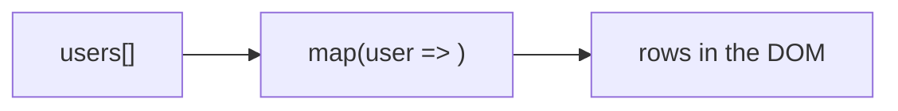

# List Rendering

## Detailed explanation
List rendering is the process of converting arrays of data into arrays of React elements. Most production screens render repeated structures: table rows, dropdown options, cards, menu items, search results, notifications, and form fields.

The main learning point is that each rendered item needs stable identity through a `key`. List rendering is not only about `map`; it is also about preserving item state, avoiding unnecessary work, and choosing pagination or virtualization when lists become large.

## 1. One-line mental model
List rendering turns an array of data into an array of React elements.

## 2. Problem it solves
Most applications display repeated data: menus, tables, cards, search results, notifications, and forms. List rendering provides a declarative way to produce UI from arrays.

## 3. Core idea
- Use `map` to transform data items into elements.
- Every sibling in a rendered list needs a stable `key`.
- Keep rendering logic small inside `map`.
- Filter and sort data before mapping when possible.
- Large lists may need pagination or virtualization.

## 4. Visual / analogy
List rendering is an assembly line: each data item goes in, one UI row comes out.



## 5. Minimal example

```tsx
function Names({ names }: { names: string[] }) {
  return (
    <ul>
      {names.map((name) => <li key={name}>{name}</li>)}
    </ul>
  );
}
```

## 6. Real-world example

```tsx
function OrdersTable({ orders }: { orders: Order[] }) {
  return (
    <tbody>
      {orders.map((order) => (
        <OrderRow key={order.id} order={order} />
      ))}
    </tbody>
  );
}
```

`OrderRow` keeps the mapping readable and gives each row a stable key.

## 7. Common interview questions
- How do you render lists in React?
- Why does each list item need a key?
- Can you use array index as key?
- Where should the `key` prop go?
- How do you render filtered lists?
- How do you optimize large lists?
- What is virtualization?

## 8. Active recall test
1. Which array method is most commonly used for list rendering?
2. Why is `key` required?
3. Where should key be placed when extracting `ListItem`?
4. What should you do for 10,000 rows?
5. Why should render logic inside `map` stay simple?

## 9. Mistakes / traps
- Forgetting keys.
- Putting `key` inside the child component instead of on the mapped element.
- Using index as key for dynamic lists.
- Doing expensive sorting/filtering repeatedly without considering memoization or server-side work.
- Rendering huge lists without virtualization or pagination.

## 10. Compare with related concepts
- **List rendering vs keys:** list rendering creates elements; keys preserve identity.
- **List rendering vs conditional rendering:** lists repeat UI; conditions choose UI branches.
- **Pagination vs virtualization:** pagination limits data/page size; virtualization limits DOM nodes rendered.

## 11. Summary from memory
Explain how you would render an orders table from API data and why each row needs a key.

## 12. Spaced revision prompts
- After 1 day: Render a list from memory.
- After 3 days: Explain where `key` belongs.
- After 7 days: Compare pagination and virtualization.
- After 14 days: Explain why large list rendering can be slow.
