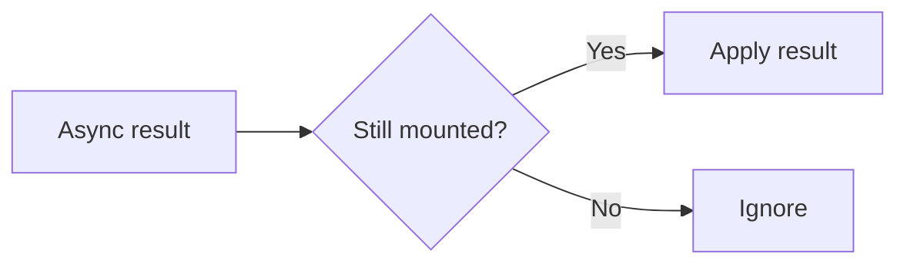

# Mounted State Tracking

## Detailed explanation
Mounted state tracking means knowing whether a component is still mounted before applying asynchronous results. Older React code often used `isMounted` flags to avoid setting state after unmount.

Modern React usually prefers cleanup, cancellation, and correct async ownership instead of broad mounted flags. Use AbortController, query libraries, and effect cleanup when possible. Mounted refs can still be useful for integrating with non-cancelable APIs.

## 1. One-line mental model
Mounted tracking checks whether a component still exists before using async results.

## 2. Problem it solves
Async callbacks may finish after the component that started them has unmounted.

## 3. Core idea
- Track mounted status in a ref.
- Set true on mount and false on cleanup.
- Check before state updates from non-cancelable async work.
- Prefer cancellation when possible.
- Avoid hiding architecture problems.

## 4. Visual / analogy
It is like checking whether someone still lives at an address before delivering a package.



## 5. Minimal example

```tsx
function useIsMounted() {
  const mounted = React.useRef(false);
  React.useEffect(() => {
    mounted.current = true;
    return () => {
      mounted.current = false;
    };
  }, []);
  return mounted;
}
```

## 6. Real-world example

```tsx
const mounted = useIsMounted();
legacyApi.load().then((result) => {
  if (mounted.current) setResult(result);
});
```

## 7. Common interview questions
#### What is mounted state tracking?
- **The Engine Mechanism (Why it behaves this way):** Mounted state tracking uses a `useRef` to store a boolean indicating whether the component is currently mounted in the DOM. The ref is set to `true` in a `useEffect` that runs on mount (empty dependency array), and set to `false` in the cleanup function that runs on unmount. Async callbacks check `ref.current` before calling `setState` to avoid updating an unmounted component. This pattern emerged before React 18's automatic handling of unmounted state updates, but is still useful for non-cancelable async operations.
- **The Unforgettable Mental Model:** The **Occupancy Sensor**. Like a hotel room's occupancy light — it tells the housekeeping staff whether someone is still in the room before they deliver fresh towels. If the room is empty, they skip the delivery.
- **The Trap:** Using mounted tracking as a band-aid for poor async architecture. The better solution is usually to cancel the async work (AbortController) or delegate to a query library, rather than checking a flag before every state update.
- **Senior Interview Playbook (Verbal Script):** "When asked this in an interview, say: Mounted state tracking uses a ref to track whether a component is still in the DOM. The ref is set to true on mount and false on unmount via effect cleanup. Async callbacks check this ref before updating state to avoid setting state on unmounted components. While React 18 no longer warns about this, the pattern is still useful for non-cancelable async APIs where you can't abort the work."

#### Why can async work finish after unmount?
- **The Engine Mechanism (Why it behaves this way):** Async operations (fetch, setTimeout, WebSocket messages, third-party SDK callbacks) run in the browser's event loop and Web APIs, completely independent of React's Fiber tree. When a component unmounts, React removes its Fiber node from the tree, but any pending async operations continue running. When they complete, their callbacks fire and may reference the component's state setters via closure. In React 18, this is a no-op (React silently ignores the update), but it still wastes resources and can mask architectural issues.
- **The Unforgettable Mental Model:** The **Phone Call After Moving**. You moved out of your apartment (unmounted), but someone still calls your old number (async callback). The call goes through, but nobody's home to answer it.
- **The Trap:** Assuming React 18's silent handling means the problem is solved. While React no longer warns, the async work still runs, consumes resources, and the closure still holds references preventing garbage collection.
- **Senior Interview Playbook (Verbal Script):** "When asked this in an interview, say: Async operations run in the browser's event loop, independent of React's rendering cycle. When a component unmounts, React removes it from the Fiber tree, but pending async operations continue. Their callbacks still fire and may try to update state. React 18 silently ignores these updates, but the work still runs and closures still hold memory. The proper fix is to cancel the async work, not just ignore its results."

#### Why prefer cancellation?
- **The Engine Mechanism (Why it behaves this way):** Cancellation (via AbortController, cleanup flags, or library APIs) stops the async work at its source, preventing it from consuming network bandwidth, CPU, or memory. Mounted tracking only prevents the state update — the async work still completes, its callback still fires, and the closure still holds references. Cancellation is more efficient because it stops the work entirely, freeing resources and eliminating the race condition at the root.
- **The Unforgettable Mental Model:** The **Cancel Order vs. Refuse Delivery**. Mounted tracking is refusing the delivery at the door — the package still arrives. Cancellation is cancelling the order — the package is never sent.
- **The Trap:** Thinking mounted tracking is "good enough" because React 18 doesn't warn. It's not — the async work still runs, the closure still prevents garbage collection, and the race condition still exists (you're just ignoring the result).
- **Senior Interview Playbook (Verbal Script):** "When asked this in an interview, say: Cancellation is better than mounted tracking because it stops the async work at the source. Mounted tracking only prevents the state update — the request still completes, the callback still fires, and the closure still holds memory. With AbortController, the network request is cancelled, bandwidth is saved, and the closure can be garbage collected. I always prefer cancellation when the API supports it."

#### How do refs help?
- **The Engine Mechanism (Why it behaves this way):** `useRef` provides a stable, mutable container that persists across renders without triggering re-renders. The mounted ref's `.current` property is set to `true` on mount and `false` on unmount. Async callbacks read `ref.current` synchronously — since refs are synchronous, the callback gets the current mounted status at the exact moment it executes. If state were used instead, the async callback would capture a stale boolean from its closure, defeating the purpose.
- **The Unforgettable Mental Model:** The **Live Switchboard**. A ref is like a live switchboard — anyone who checks it sees the current position. State is like a printed memo — it shows the position at the time it was printed, not the current position.
- **The Trap:** Using state for mounted tracking. `useState` would capture the value in the async callback's closure, making it stale. The callback would always see the value from when it was created, not the current mounted status.
- **Senior Interview Playbook (Verbal Script):** "When asked this in an interview, say: Refs are essential for mounted tracking because they provide a live, mutable value that async callbacks can read at execution time. If I used state, the callback would capture a stale boolean from its closure — always seeing the value from when the callback was created. Refs give the callback access to the current mounted status, regardless of when the callback was defined."

#### Is `isMounted` always a good pattern?
- **The Engine Mechanism (Why it behaves this way):** No. The `isMounted` pattern is a defensive check that masks the real problem: async work that should have been cancelled. Modern React best practices favor cancellation (AbortController), proper effect cleanup, and server-state libraries over mounted flags. The `isMounted` pattern can hide race conditions, prevent proper error handling, and encourage a "check everywhere" approach that clutters code. It's acceptable only for non-cancelable APIs where you truly have no other option.
- **The Unforgettable Mental Model:** The **Smoke Detector vs. the Fire Extinguisher**. `isMounted` is a smoke detector that alerts you to the problem. Cancellation is a fire extinguisher that stops the problem. You want the extinguisher, not just the alarm.
- **The Trap:** Making `isMounted` the default pattern for all async effects. This becomes a code smell — if every effect needs a mounted check, the architecture needs restructuring.
- **Senior Interview Playbook (Verbal Script):** "When asked this in an interview, say: `isMounted` is not a good default pattern. It's a defensive check that masks the real issue — async work that should have been cancelled. Modern React favors AbortController for fetch, cleanup for subscriptions, and query libraries for server state. I only use mounted tracking for non-cancelable APIs where I truly have no other option, like certain third-party SDKs or legacy WebSocket implementations."

#### How do query libraries avoid this?
- **The Engine Mechanism (Why it behaves this way):** Query libraries like TanStack Query manage the entire request lifecycle externally to the component. When a component unmounts, the library detects this and either cancels the in-flight request or marks the component as no longer interested in the result. The library's cache persists independently, so if the component remounts, it can retrieve the cached data without re-fetching. The component never needs to track its own mounted status because the library handles lifecycle management.
- **The Unforgettable Mental Model:** The **Valet Parking Service**. Instead of parking your own car (managing your own requests), you hand the keys to a valet (query library). When you leave the restaurant (unmount), the valet parks the car properly. When you return (remount), the valet has it waiting.
- **The Trap:** Thinking query libraries eliminate all mounted tracking needs. They handle server state well, but local async operations (like non-cancelable third-party SDKs) may still need mounted checks.
- **Senior Interview Playbook (Verbal Script):** "When asked this in an interview, say: Query libraries avoid mounted tracking by managing the request lifecycle externally. When a component unmounts, the library cancels in-flight requests or stops delivering results to that component. The cache persists independently, so remounted components get cached data instantly. This eliminates the need for manual mounted checks because the library handles cancellation, lifecycle, and cache consistency automatically."

#### Mounted tracking vs AbortController?
- **The Engine Mechanism (Why it behaves this way):** Mounted tracking is a passive check — it reads a boolean before updating state but doesn't stop the async work. AbortController is an active cancellation — it stops the request at the network level. Mounted tracking works with any async API (even non-cancelable ones). AbortController only works with APIs that support the signal pattern. Mounted tracking prevents stale state updates; AbortController prevents stale state updates AND saves network resources.
- **The Unforgettable Mental Model:** The **Umbrella vs. the Roof**. Mounted tracking is an umbrella — it keeps you dry (prevents bad state updates) but the rain still falls (request still runs). AbortController is a roof — it stops the rain entirely (cancels the request).
- **The Trap:** Using mounted tracking when AbortController is available. If the API supports cancellation, use it — it's more efficient and cleaner.
- **Senior Interview Playbook (Verbal Script):** "When asked this in an interview, say: Mounted tracking is a passive check that prevents state updates on unmounted components but doesn't stop the async work. AbortController actively cancels the request at the network level, saving bandwidth and freeing resources. I prefer AbortController for fetch requests since it's more complete. I only use mounted tracking for non-cancelable APIs where AbortController isn't an option."

## 8. Active recall test
1. **What does the mounted ref store?**
   - **Explanation:** A boolean indicating whether the component is currently mounted. It's `true` after the mount effect runs and `false` after the cleanup runs on unmount. Async callbacks check this before calling `setState` to avoid updating an unmounted component.
2. **When is it set to false?**
   - **Explanation:** In the cleanup function of the `useEffect` that sets it to `true`. This cleanup runs when the component unmounts, ensuring the ref accurately reflects the component's mounted status at any point in time.
3. **Why not use state for mounted tracking?**
   - **Explanation:** State values are captured in closures at the time the callback is created. An async callback would always see the state value from when it was defined, not the current value. Refs provide a live, mutable value that callbacks can read at execution time.
4. **What is better than mounted tracking for fetch?**
   - **Explanation:** AbortController. It cancels the fetch request at the network level, preventing the response from ever arriving. This is more efficient than mounted tracking because it saves bandwidth, frees the connection, and eliminates the race condition entirely.
5. **Name one non-cancelable API case.**
   - **Explanation:** Third-party SDK callbacks that don't support cancellation, like certain analytics libraries, payment gateway SDKs, or legacy WebSocket implementations. These fire callbacks independently and can't be aborted, making mounted tracking a reasonable defensive pattern.

## 9. Mistakes / traps
- Using mounted flags instead of canceling fetch.
- Treating mounted tracking as a default pattern.
- Forgetting cleanup.
- Updating state after unmount from async work.
- Hiding race conditions.

## 10. Compare with related concepts
- **Mounted tracking vs AbortController:** check-before-update vs cancel work.
- **Mounted tracking vs cleanup:** mounted tracking is one cleanup-driven flag pattern.
- **Mounted tracking vs query library:** query library manages lifecycle and cache externally.

## 11. Summary from memory
Explain when mounted tracking is acceptable and why cancellation is usually better.

## 12. Spaced revision prompts
- After 1 day: Define mounted tracking.
- After 3 days: Build `useIsMounted`.
- After 7 days: Compare with aborting fetch.
- After 14 days: Identify overuse of mounted flags.

