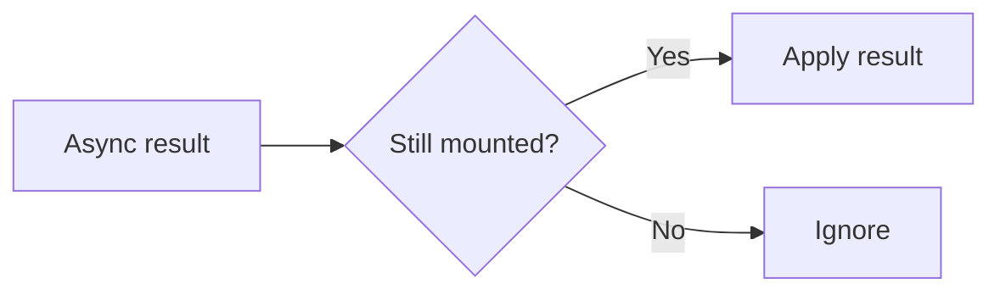

# Mounted State Tracking

## Detailed explanation
Mounted state tracking means knowing whether a component is still mounted before applying asynchronous results. Older React code often used `isMounted` flags to avoid setting state after unmount.

Modern React usually prefers cleanup, cancellation, and correct async ownership instead of broad mounted flags. Use AbortController, query libraries, and effect cleanup when possible. Mounted refs can still be useful for integrating with non-cancelable APIs.

## 1. One-line mental model
Mounted tracking checks whether a component still exists before using async results.

## 2. Problem it solves
Async callbacks may finish after the component that started them has unmounted.

## 3. Core idea
- Track mounted status in a ref.
- Set true on mount and false on cleanup.
- Check before state updates from non-cancelable async work.
- Prefer cancellation when possible.
- Avoid hiding architecture problems.

## 4. Visual / analogy
It is like checking whether someone still lives at an address before delivering a package.



## 5. Minimal example

```tsx
function useIsMounted() {
  const mounted = React.useRef(false);
  React.useEffect(() => {
    mounted.current = true;
    return () => {
      mounted.current = false;
    };
  }, []);
  return mounted;
}
```

## 6. Real-world example

```tsx
const mounted = useIsMounted();
legacyApi.load().then((result) => {
  if (mounted.current) setResult(result);
});
```

## 7. Common interview questions
- What is mounted state tracking?
- Why can async work finish after unmount?
- Why prefer cancellation?
- How do refs help?
- Is `isMounted` always a good pattern?
- How do query libraries avoid this?
- Mounted tracking vs AbortController?

## 8. Active recall test
1. What does mounted ref store?
2. When is it set false?
3. Why not use state?
4. What is better than mounted tracking for fetch?
5. Name one non-cancelable API case.

## 9. Mistakes / traps
- Using mounted flags instead of canceling fetch.
- Treating mounted tracking as a default pattern.
- Forgetting cleanup.
- Updating state after unmount from async work.
- Hiding race conditions.

## 10. Compare with related concepts
- **Mounted tracking vs AbortController:** check-before-update vs cancel work.
- **Mounted tracking vs cleanup:** mounted tracking is one cleanup-driven flag pattern.
- **Mounted tracking vs query library:** query library manages lifecycle and cache externally.

## 11. Summary from memory
Explain when mounted tracking is acceptable and why cancellation is usually better.

## 12. Spaced revision prompts
- After 1 day: Define mounted tracking.
- After 3 days: Build `useIsMounted`.
- After 7 days: Compare with aborting fetch.
- After 14 days: Identify overuse of mounted flags.

