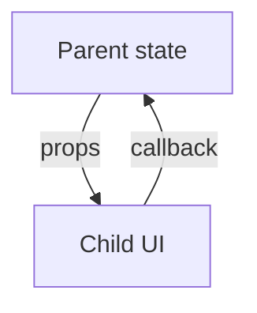

# One-Way Data Flow

## Detailed explanation
One-way data flow is React's rule that data moves from parent to child through props. Children cannot directly mutate parent state. Instead, they call callbacks provided by the parent, and the parent updates its state. The new value then flows down again.

This model makes updates traceable. When a value changes, you can find the owner of that value and inspect the callback path that requested the change.

## 1. One-line mental model
One-way data flow means data moves down from parent to child through props, while changes move up through callbacks.

## 2. Problem it solves
Two-way binding can make it unclear which part of the app changed data and why. One-way flow keeps ownership explicit and makes UI updates easier to trace.

## 3. Core idea
- Parents pass data down as props.
- Children do not mutate parent data directly.
- Children notify parents through callbacks.
- The owner updates state.
- New state flows back down through props.

## 4. Visual / analogy
One-way data flow is like a company approval chain: decisions come from the owner, requests go back to the owner.



## 5. Minimal example

```tsx
function Parent() {
  const [count, setCount] = React.useState(0);
  return <Counter count={count} onIncrement={() => setCount((value) => value + 1)} />;
}
```

## 6. Real-world example

```tsx
function CartPage() {
  const [items, setItems] = React.useState<CartItem[]>([]);

  return (
    <CartTable
      items={items}
      onQuantityChange={(id, quantity) =>
        setItems((current) => current.map((item) => item.id === id ? { ...item, quantity } : item))
      }
    />
  );
}
```

The table requests changes; the parent owns and updates cart state.

## 7. Common interview questions
- What is one-way data flow?
- How do children update parent state?
- Why does React use one-way data flow?
- How is it different from two-way binding?
- How does one-way flow help debugging?
- How does this relate to controlled components?
- Can context still follow one-way data flow?

## 8. Active recall test
1. Which direction do props flow?
2. Which direction do callbacks flow?
3. Why should children not mutate parent state?
4. What makes debugging easier?
5. How does this pattern appear in forms?

## 9. Mistakes / traps
- Mutating objects passed through props.
- Letting multiple components own the same source of truth.
- Calling callbacks during render instead of events.
- Confusing callback props with two-way binding.
- Creating hidden updates through module-level mutable state.

## 10. Compare with related concepts
- **One-way flow vs two-way binding:** one-way keeps ownership explicit; two-way syncs both sides automatically.
- **One-way flow vs props drilling:** one-way is the data rule; props drilling is a depth problem.
- **One-way flow vs Flux/Redux:** Redux formalizes one-way updates through actions and reducers.

## 11. Summary from memory
Explain how a child button can update parent state while preserving one-way data flow.

## 12. Spaced revision prompts
- After 1 day: Define one-way data flow.
- After 3 days: Draw props down and callbacks up.
- After 7 days: Explain one-way flow in a controlled input.
- After 14 days: Compare one-way flow with two-way binding.
