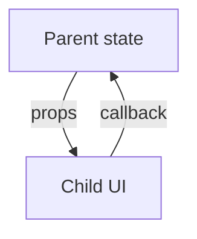

# One-Way Data Flow

## Detailed explanation
One-way data flow is React's rule that data moves from parent to child through props. Children cannot directly mutate parent state. Instead, they call callbacks provided by the parent, and the parent updates its state. The new value then flows down again.

This model makes updates traceable. When a value changes, you can find the owner of that value and inspect the callback path that requested the change.

## 1. One-line mental model
One-way data flow means data moves down from parent to child through props, while changes move up through callbacks.

## 2. Problem it solves
Two-way binding can make it unclear which part of the app changed data and why. One-way flow keeps ownership explicit and makes UI updates easier to trace.

## 3. Core idea
- Parents pass data down as props.
- Children do not mutate parent data directly.
- Children notify parents through callbacks.
- The owner updates state.
- New state flows back down through props.

## 4. Visual / analogy
One-way data flow is like a company approval chain: decisions come from the owner, requests go back to the owner.



## 5. Minimal example

```tsx
function Parent() {
  const [count, setCount] = React.useState(0);
  return <Counter count={count} onIncrement={() => setCount((value) => value + 1)} />;
}
```

## 6. Real-world example

```tsx
function CartPage() {
  const [items, setItems] = React.useState<CartItem[]>([]);

  return (
    <CartTable
      items={items}
      onQuantityChange={(id, quantity) =>
        setItems((current) => current.map((item) => item.id === id ? { ...item, quantity } : item))
      }
    />
  );
}
```

The table requests changes; the parent owns and updates cart state.

## 7. Common interview questions
#### What is one-way data flow?
- **The Engine Mechanism (Why it behaves this way):** One-way data flow is React's rule that data travels in a single direction: from parent to child through props. During the render phase, the parent component passes data values down the component tree as props. Child components receive these props as read-only inputs and render based on them. If a child needs to change the data, it cannot mutate the parent's state directly — it must call a callback function that the parent passed down. This callback triggers a state update in the parent, which schedules a re-render, and the new data flows back down through props. React's reconciliation engine processes this flow deterministically: every state change has a known origin (the component that called setState) and a known propagation path (down through the tree).
- **The Unforgettable Mental Model:** The **Waterfall**. Water (data) flows from the mountain top (root) down through each tier (child components). If a lower tier needs to affect the source, it sends a signal back up (callback), but the water itself only flows downward. You never have water flowing sideways or upstream.
- **The Trap:** Thinking one-way data flow means data can never go "up." It can — through callbacks — but the ownership of state always remains with the component that declared it. The data itself flows down; the request to change flows up.
- **Senior Interview Playbook (Verbal Script):** "When asked this in an interview, say: One-way data flow means data always travels downward from parent to child through props. Children receive data but cannot directly modify their parent's state. Instead, they invoke callback functions passed by the parent to request changes. The parent updates its state, and the new data flows back down. This unidirectional flow makes the application's data flow predictable and traceable — you can always find where a value comes from and how it changes."

#### How do children update parent state?
- **The Engine Mechanism (Why it behaves this way):** Children update parent state through callback props. During the parent's render phase, it creates a function (often wrapping `setState`) and passes it as a prop to the child. When the child needs to request a change, it calls this callback function with the new data. The callback executes in the parent's scope, calling `setState` on the parent's state. This schedules a re-render of the parent and its descendants. The new state value then flows back down to the child through props during the next render. React's event system ensures that state updates from callbacks are batched — multiple callback calls in the same event handler result in a single re-render.
- **The Unforgettable Mental Model:** The **Request Form System**. An employee (child) can't directly change the company policy (parent state). Instead, they fill out a request form (callback) and submit it to management (parent). Management reviews and updates the policy, then posts the new policy for everyone to see (re-render with new props).
- **The Trap:** Creating a new callback function on every render without memoization, which can cause unnecessary child re-renders if the child is wrapped in `React.memo`. Use `useCallback` when the callback is passed to memoized children.
- **Senior Interview Playbook (Verbal Script):** "When asked this in an interview, say: Children update parent state through callback props. The parent passes a function — typically a setState wrapper — as a prop to the child. When the child calls this function, it triggers a state update in the parent. The parent re-renders, and the new state flows back down to the child through props. This maintains one-way data flow because the child never directly modifies parent state — it only requests the change through the callback the parent provided."

#### Why does React use one-way data flow?
- **The Engine Mechanism (Why it behaves this way):** One-way data flow makes React's rendering model predictable and debuggable. When data flows in a single direction, every state change has a traceable origin: you can follow the callback chain from the user event back to the setState call, and then follow the props chain from the state owner down to every component that displays the value. This eliminates the "spaghetti state" problem of two-way binding, where any component can mutate any piece of data, making it impossible to track what changed what and when. React's Fiber scheduler also benefits from one-way flow — it can predict which parts of the tree need re-rendering based on which state changed, enabling optimizations like skipping unchanged subtrees.
- **The Unforgettable Mental Model:** The **Single-Lane Highway**. Cars (data) travel in one direction. If there's an accident (bug), you know exactly which direction to look and which on-ramp (state owner) the cars came from. A multi-lane, multi-directional highway (two-way binding) makes accident investigation chaotic.
- **The Trap:** Thinking one-way flow is a limitation. It's actually a constraint that enables predictability. The "limitation" of not being able to mutate parent state directly is what makes React apps debuggable at scale.
- **Senior Interview Playbook (Verbal Script):** "When asked this in an interview, say: React uses one-way data flow because it makes state changes predictable and traceable. When data only flows down through props and changes only happen through callbacks at the state owner, you can always answer: where does this value come from, and what changed it? This eliminates the debugging nightmare of two-way binding, where any component can mutate any data. One-way flow also enables React's rendering optimizations — it knows exactly which subtrees need updating based on which state changed."

#### How is it different from two-way binding?
- **The Engine Mechanism (Why it behaves this way):** Two-way binding (used in Angular, Vue's `v-model`, and older frameworks) automatically synchronizes data between the model and the view in both directions. When the model changes, the view updates. When the view changes (user input), the model updates automatically — no explicit callback needed. Under the hood, two-way binding sets up watchers or proxies that detect changes on both sides and propagate them. React's one-way flow requires explicit callbacks: the view reports changes through `onChange`, and the model updates through `setState`. The difference is explicitness vs. implicitness. Two-way binding is more concise for simple cases but harder to trace in complex apps. One-way flow is more verbose but always traceable.
- **The Unforgettable Mental Model:** **Walkie-Talkie vs. Intercom System**. Two-way binding = intercom — both sides can talk and listen simultaneously, conversations can overlap and get confusing. One-way flow = walkie-talkie — one person speaks (parent sends data), the other responds (child sends callback), clear turn-taking.
- **The Trap:** Trying to replicate two-way binding in React with custom hooks or wrappers. This defeats React's design and makes data flow harder to trace.
- **Senior Interview Playbook (Verbal Script):** "When asked this in an interview, say: Two-way binding automatically syncs data between model and view in both directions — change either side, and the other updates. React's one-way flow is explicit: data flows down through props, and changes flow up through callbacks. Two-way binding is more concise for simple forms but harder to debug in complex apps because any component can mutate any data. One-way flow is more verbose but always traceable — you know exactly where state lives and how it changes."

#### How does one-way flow help debugging?
- **The Engine Mechanism (Why it behaves this way):** With one-way data flow, debugging follows a clear path: (1) Find the displayed value in the UI. (2) Trace the prop chain upward to find the state owner. (3) Find the callback that updates that state. (4) Identify the event that triggers the callback. This linear trace is possible because data has a single source and a single direction of travel. React DevTools enhances this by showing the component tree, props at each level, and the state owner. When a value is wrong, you check the state owner first — not every component that might have mutated it. In two-way binding, any component with access to the data could have changed it, requiring a search through the entire codebase.
- **The Unforgettable Mental Model:** The **Crime Scene Investigation**. One-way flow = there's only one suspect (state owner) and one path (props chain) to investigate. Two-way binding = everyone in the building had access to the evidence, and you need to interview everyone.
- **The Trap:** Assuming one-way flow eliminates all debugging challenges. It eliminates state-tracing bugs, but you still need to debug render logic, effect dependencies, and memoization issues.
- **Senior Interview Playbook (Verbal Script):** "When asked this in an interview, say: One-way flow makes debugging straightforward because every value has a single source of truth. When something looks wrong on screen, I trace the props upward to find the state owner, then check the callback that updates it. There's no guessing about which component mutated the data — only the state owner can change it. React DevTools makes this even easier by showing the props chain. This predictability is invaluable in large applications where state changes can originate from many places."

#### How does this relate to controlled components?
- **The Engine Mechanism (Why it behaves this way):** Controlled components are the purest expression of one-way data flow in React. The input's value comes from React state (data flows down through the `value` prop). When the user types, the input fires `onChange` (request flows up through the callback). The parent updates state, and the new value flows back down. This is one-way data flow in its most visible form: the data loop is explicit and complete. The input element never holds its own source of truth — it's entirely driven by the parent's state. This pattern extends beyond inputs to any component that receives a value and a change handler.
- **The Unforgettable Mental Model:** The **Thermostat Loop**. The thermostat display (input) shows the temperature from the HVAC system (parent state). When you adjust the dial (user types), the thermostat sends a signal to the HVAC (onChange callback). The HVAC updates the actual temperature (setState), and the display updates to match (value prop). The display never decides the temperature itself.
- **The Trap:** Not recognizing that controlled components are one-way data flow in action. Understanding this connection makes both concepts easier to reason about and apply consistently.
- **Senior Interview Playbook (Verbal Script):** "When asked this in an interview, say: Controlled components are one-way data flow in its most visible form. The input's value flows down from React state through the value prop. User changes flow up through the onChange callback. The parent updates state, and the new value flows back down. This is the exact same pattern as one-way data flow — data down, actions up — applied to form elements. Every controlled component is an instance of one-way data flow."

#### Can context still follow one-way data flow?
- **The Engine Mechanism (Why it behaves this way):** Yes, Context follows one-way data flow. The Context Provider holds the state (or receives it from above) and provides it to the tree. During the render phase, React places the Context value in its internal registry. Consumer components read the value via `useContext` — this is still data flowing down, just through React's context mechanism instead of explicit props. When a consumer needs to change the value, it calls a callback function that was also provided through Context (e.g., `{ user, setUser }`). This callback updates the state at the Provider level, and the new value flows back down to all consumers. The direction is still one-way: data flows down from the Provider, changes flow up through callbacks.
- **The Unforgettable Mental Model:** The **Wi-Fi Router**. The router (Provider) broadcasts the internet connection (data) to all devices (consumers). Devices can't change the router's settings directly — they send requests (callbacks) to the router's admin panel. The router updates, and all devices see the new settings. Data still flows one way: router to devices.
- **The Trap:** Thinking Context breaks one-way data flow because it skips intermediate components. It doesn't — it's just a different delivery mechanism for the same downward data flow.
- **Senior Interview Playbook (Verbal Script):** "When asked this in an interview, say: Yes, Context still follows one-way data flow. The Provider holds the state and provides it to the tree. Consumers read the value through useContext — data still flows down, just through Context instead of props. When consumers need to change the value, they call a callback provided through Context, which updates state at the Provider level. The new value flows back down to all consumers. Context changes the delivery mechanism, not the direction of data flow."

## 8. Active recall test
1. **Which direction do props flow?**
   - **Explanation:** Props flow downward from parent to child. The parent passes data to children through the props object, and children receive it as read-only inputs during their render phase.
2. **Which direction do callbacks flow?**
   - **Explanation:** Callbacks flow upward from child to parent. The parent creates a callback function and passes it down as a prop. The child calls it to request a state change, effectively sending information back up the component tree.
3. **Why should children not mutate parent state?**
   - **Explanation:** Direct mutation bypasses React's state management system. React wouldn't know the state changed, so it wouldn't schedule a re-render. Additionally, mutations break the predictability of one-way data flow — you can no longer trace where changes originated.
4. **What makes debugging easier?**
   - **Explanation:** Every value has a single source of truth (the state owner). When something is wrong, you trace props upward to find the owner and check the callback that updates it. There's no guessing about which component mutated the data.
5. **How does this pattern appear in forms?**
   - **Explanation:** Controlled form inputs are one-way data flow: the input's value comes from React state (data down), user typing fires onChange (request up), parent updates state, and the new value flows back down to the input (data down again).

## 9. Mistakes / traps
- Mutating objects passed through props.
- Letting multiple components own the same source of truth.
- Calling callbacks during render instead of events.
- Confusing callback props with two-way binding.
- Creating hidden updates through module-level mutable state.

## 10. Compare with related concepts
- **One-way flow vs two-way binding:** one-way keeps ownership explicit; two-way syncs both sides automatically.
- **One-way flow vs props drilling:** one-way is the data rule; props drilling is a depth problem.
- **One-way flow vs Flux/Redux:** Redux formalizes one-way updates through actions and reducers.

## 11. Summary from memory
Explain how a child button can update parent state while preserving one-way data flow.

## 12. Spaced revision prompts
- After 1 day: Define one-way data flow.
- After 3 days: Draw props down and callbacks up.
- After 7 days: Explain one-way flow in a controlled input.
- After 14 days: Compare one-way flow with two-way binding.
