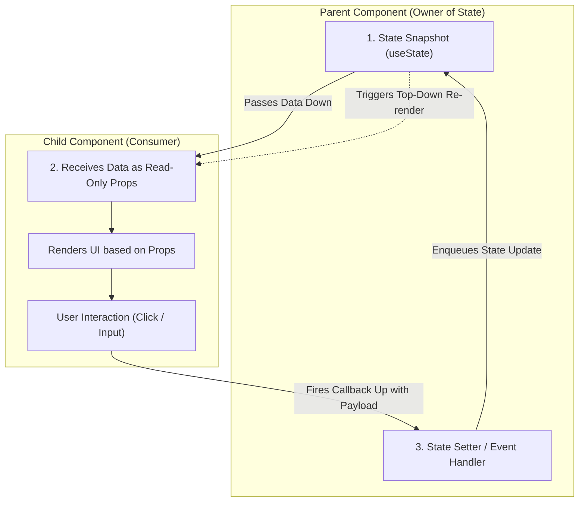

# One-Way Data Flow (Unidirectional Data Binding)

## 1. Why This Exists — The Problem First

In the early 2010s, frontend development was dominated by two-way data binding. Frameworks like AngularJS 1.x and Knockout promised what felt like magic: bind an input field directly to a JavaScript model, and whenever the user typed, the model updated automatically; whenever the model changed, the UI updated instantly without any boilerplate handlers.

In small toy apps, it looked revolutionary. In large production codebases, it became an unmaintainable nightmare.

Consider what happened in a medium-sized dashboard:
- Component A changed a user model property.
- That change triggered a watcher in Component B, which updated a status flag.
- That status flag update triggered a watcher in Component C, which modified the original user model again.
- The framework entered an infinite digest cycle, crashing the browser tab with errors like `10 $digest() iterations reached. Aborting!`.

Even worse was the debugging mystery: when a user's permission flag silently flipped from `true` to `false` during checkout, you had to inspect fifteen different components across three separate tabs. Any one of them could have directly mutated the shared object at any time. There was no single owner, no single source of truth, and no clear path of cause and effect.

React was built to kill this chaos by enforcing a strict architectural rule: **data flows in one direction only**. Components can never reach up or sideways to mutate their surroundings. Every state change has a single traceable origin, and the entire UI updates in a clean, top-down cascade.

## 2. The Analogy — Make It Obvious

Think of a busy restaurant kitchen with a Head Chef (Expediter) and several Line Cooks (grill station, salad station, pastry station).

```txt
┌────────────────────────────────────────────────────────┐
│                   HEAD CHEF (Parent)                   │
│   • Holds master order board (State)                   │
│   • Reviews incoming requests                          │
│   • Prints prep slips                                  │
└──────────────────┬──────────────────▲──────────────────┘
                   │                  │
 1. Props Flow     │                  │  2. Callback Events
    DOWN           │                  │     Trigger UP
 (Printed Slips)   ▼                  │   ("86 Ribeye!")
┌─────────────────────────────────────┴──────────────────┐
│                   LINE COOKS (Children)                │
│   • Read their assigned slips (Props)                  │
│   • Cook food and plate dishes (Render UI)             │
│   • NEVER write directly on the master board           │
└────────────────────────────────────────────────────────┘
```

- **The Master Board is Component State:** The Head Chef holds the single source of truth for every open table and order.
- **Printed Prep Slips are Props:** The Head Chef reads the master board and hands out printed slips down to each station. The grill cook gets a slip for "Medium-Rare Ribeye", and the salad cook gets a slip for "Caesar Salad".
- **Cooking the Food is Rendering UI:** The cooks read their slips and prepare the dishes. A cook cannot walk over to the master board and scribble changes on tickets, nor can they alter another station's slips. Props are read-only.
- **Calling Out is an Event Callback:** If the grill station runs out of ribeye, the grill cook doesn't secretly rewrite the restaurant's menu. Instead, they press the intercom and shout to the Head Chef: *"86 Ribeye!"* (invoking a callback function passed down to them).
- **Updating the Board and Re-printing is the Re-render:** The Head Chef hears the call, crosses ribeye off the master board (updates state via `setState`), and prints updated slips down to all stations (top-down re-render with new props).

Every station's reality comes strictly from the slips handed down from above. Every request for change goes strictly up to the chef. If an order is wrong, there is only one place to investigate: the Head Chef's master board.

## 3. How It Actually Works — The Full Explanation

React's unidirectional data flow operates in a continuous four-step cycle known as **The Unidirectional Loop**:


```mermaid
flowchart TD
    subgraph Parent["Parent Component (Owner of State)"]
        State["1. State Snapshot (useState)"]
        Handler["3. State Setter / Event Handler"]
    end

    subgraph Child["Child Component (Consumer)"]
        Props["2. Receives Data as Read-Only Props"]
        UI["Renders UI based on Props"]
        Action["User Interaction (Click / Input)"]
    end

    State -->|"Passes Data Down"| Props
    Props --> UI
    UI --> Action
    Action -->|"Fires Callback Up with Payload"| Handler
    Handler -->|"Enqueues State Update"| State
    State -.->|"Triggers Top-Down Re-render"| Props
```

### Step 1: State Flows Down via Props
A parent component declares and owns a piece of state using hooks like `useState` or `useReducer`. When the parent renders, it passes raw values or derived calculations down the component tree through `props`. To child components, props are immutable snapshots. In development mode, React freezes the props object (`Object.freeze`) to guarantee that child components cannot mutate their inputs.

### Step 2: Events Trigger Up via Callback Functions
Because a child cannot write to `props.count = 5`, how does it request a change when a user clicks a button or types in an input? The parent passes down a **callback function** as a prop alongside the data (for example, `onQuantityChange` or `onDelete`). When the user acts, the child invokes this function, passing the new requested value or event payload upward.

### Step 3: State Updates at the Owner
The callback executes in the parent component's scope. The parent takes the payload, validates it, and calls its state setter (such as `setItems(newItems)`). This state update schedules a re-render of the parent. The owner component remains the sole authority over how and when its state transitions.

### Step 4: Top-Down Re-render Cycle
React runs the parent component function again to produce a new virtual DOM representation with the updated state snapshot. This causes React to re-evaluate child components, passing the fresh data down as new props. React's reconciliation engine diffs the new tree against the old tree and applies the minimal set of changes to the real browser DOM.

### Why This Predictability Matters at Scale

1. **Directed Acyclic Graph (DAG) of State:** Data dependencies form a one-way tree. You will never have circular update loops where Component A triggers Component B, which triggers Component A again, freezing the browser.
2. **Deterministic Debugging:** If a badge displays the wrong number on screen, you don't need to search the entire project. You inspect the badge's props, follow the prop chain up to the component that owns the state, and check the handler that updates that state.
3. **Optimized Change Detection:** Because data only moves down, React knows that changing a component's state can only ever affect that component and its descendants. It never needs to re-evaluate ancestors or sibling subtrees, allowing memoization tools (`React.memo`) to skip entire subtrees cleanly.

### The Foundation of Flux and Modern State Management
This exact loop at the component level formed the blueprint for the **Flux Architecture** (and subsequently Redux, Zustand, and Pinia):

```txt
Action ──► Dispatcher ──► Store (State Owner) ──► View (Components)
   ▲                                                    │
   └────────────── User Interaction / Event ────────────┘
```

In Flux, stores own the state, views receive state snapshots, and views can only request changes by dispatching actions back to the dispatcher. It is the exact same unidirectional contract, lifted from local component trees to global application architecture.

## 4. Real Code — See It Working

Here is a complete shopping cart example demonstrating state ownership, top-down props, bottom-up callbacks, and immutable updates.

```tsx
import React, { useState } from 'react';

// Type definitions for our domain
interface CartItem {
  id: string;
  name: string;
  unitPrice: number;
  quantity: number;
}

// ─────────────────────────────────────────────────────────────
// 1. CHILD COMPONENT: Renders a single row (Presentational)
// ─────────────────────────────────────────────────────────────
interface CartRowProps {
  item: CartItem;
  // Callbacks communicate user intentions back UP to the owner
  onUpdateQuantity: (id: string, newQty: number) => void;
  onRemove: (id: string) => void;
}

function CartRow({ item, onUpdateQuantity, onRemove }: CartRowProps) {
  // Child reads props directly. It does NOT copy props into local state.
  return (
    <div style={{ display: 'flex', gap: '1rem', alignItems: 'center', margin: '0.5rem 0' }}>
      <span style={{ width: '120px' }}>{item.name}</span>
      <span>${item.unitPrice.toFixed(2)}</span>
      
      <div>
        <button
          onClick={() => onUpdateQuantity(item.id, item.quantity - 1)}
          disabled={item.quantity <= 1}
        >
          -
        </button>
        <span style={{ margin: '0 0.5rem' }}>{item.quantity}</span>
        <button
          onClick={() => onUpdateQuantity(item.id, item.quantity + 1)}
        >
          +
        </button>
      </div>

      <span style={{ width: '80px', fontWeight: 'bold' }}>
        ${(item.unitPrice * item.quantity).toFixed(2)}
      </span>

      <button onClick={() => onRemove(item.id)} style={{ color: 'red' }}>
        Remove
      </button>
    </div>
  );
}

// ─────────────────────────────────────────────────────────────
// 2. CHILD COMPONENT: Renders order total (Derived Data)
// ─────────────────────────────────────────────────────────────
interface OrderSummaryProps {
  totalAmount: number;
  itemCount: number;
}

function OrderSummary({ totalAmount, itemCount }: OrderSummaryProps) {
  return (
    <div style={{ borderTop: '2px solid #ccc', marginTop: '1rem', paddingTop: '0.5rem' }}>
      <p>Total Items: <strong>{itemCount}</strong></p>
      <p>Final Price: <strong>${totalAmount.toFixed(2)}</strong></p>
    </div>
  );
}

// ─────────────────────────────────────────────────────────────
// 3. PARENT COMPONENT: Sole owner of state and mutation logic
// ─────────────────────────────────────────────────────────────
export function ShoppingCartApp() {
  // Single source of truth for cart data
  const [items, setItems] = useState<CartItem[]>([
    { id: 'item-1', name: 'Mechanical Keyboard', unitPrice: 120, quantity: 1 },
    { id: 'item-2', name: 'Wireless Mouse', unitPrice: 60, quantity: 2 },
  ]);

  // Handler: Updates item quantity immutably
  const handleUpdateQuantity = (id: string, newQty: number) => {
    if (newQty < 1) return;
    
    // Create brand new array and object references so React detects the update
    setItems((currentItems) =>
      currentItems.map((item) =>
        item.id === id ? { ...item, quantity: newQty } : item
      )
    );
  };

  // Handler: Removes an item immutably
  const handleRemoveItem = (id: string) => {
    setItems((currentItems) => currentItems.filter((item) => item.id !== id));
  };

  // Derived state computed during render (no extra state variables needed)
  const totalAmount = items.reduce((sum, item) => sum + item.unitPrice * item.quantity, 0);
  const itemCount = items.reduce((sum, item) => sum + item.quantity, 0);

  return (
    <div style={{ padding: '1.5rem', fontFamily: 'sans-serif', maxWidth: '500px' }}>
      <h2>Shopping Cart</h2>

      {items.length === 0 ? (
        <p>Your cart is empty.</p>
      ) : (
        items.map((item) => (
          // Data flows DOWN via `item`, actions flow UP via callbacks
          <CartRow
            key={item.id}
            item={item}
            onUpdateQuantity={handleUpdateQuantity}
            onRemove={handleRemoveItem}
          />
        ))
      )}

      {/* Summary receives computed metrics as clean, downward props */}
      <OrderSummary totalAmount={totalAmount} itemCount={itemCount} />
    </div>
  );
}
```

## 5. The Interview Questions — All of Them, Done Properly

**Q: What is one-way data flow, and what exact architectural problems does it solve?**

One-way data flow (unidirectional data binding) is the design principle where data has a single source of truth and travels strictly downward through the component tree via props, while requests for modifications travel strictly upward via callback functions. 

It solves three critical issues present in two-way binding:
1. **Hidden mutations:** In two-way binding systems, any child component can silently modify a shared model reference, making it nearly impossible to determine what caused a state bug in complex views.
2. **Cyclic update loops:** When models watch views and views watch models, updates can cascade back and forth, resulting in runaway digest loops and UI freezes.
3. **Non-deterministic rendering:** With unidirectional flow, rendering is a pure projection of state at a single moment in time: `$UI = f(state)$`. Given the same state, the component tree will always produce the exact same DOM structure.

---

**Q: How do child components update state owned by a parent without breaking one-way data flow?**

Children do not modify the parent's state directly. Instead, the parent passes a callback function down to the child as a prop. When an event occurs in the child (such as a button click or form submit), the child invokes that callback with the relevant payload. 

The callback executes in the parent's execution context, where the parent calls its own `setState` function. This schedules a top-down re-render of the parent, generating fresh props that flow back down into the child. The child only ever *requests* a change; the parent retains exclusive ownership and authority over the state transition.

---

**Q: Does React's Context API violate one-way data flow since it allows deeply nested children to consume state directly?**

No. Context does not violate one-way data flow; it is simply an alternate delivery mechanism (a "teleportation pipe") for props. 

In a Context architecture:
1. The `Context.Provider` sits higher in the tree and holds or receives the state.
2. State flows **downward** from the Provider to any descendant component calling `useContext`.
3. If a consumer needs to change the context value, it calls a dispatch function or setter provided by the context value, sending the intent **upward** to the Provider level.

Data still travels top-down, and mutations still occur exclusively at the state owner. Context merely avoids manual prop drilling through intermediate components that do not need the data.

---

**Q: How does one-way data flow relate to controlled components in HTML forms?**

Controlled components are the purest micro-level implementation of one-way data flow in React:

```tsx
<input value={searchTerm} onChange={(e) => setSearchTerm(e.target.value)} />
```

1. **Data Down:** The current string in `searchTerm` state flows down to the `<input>` element through its `value` prop. The DOM input node does not maintain its own independent state.
2. **Event Up:** When the user presses a key, the browser triggers the `onChange` event, invoking `setSearchTerm` with `e.target.value`.
3. **State Updates & Re-renders:** React updates `searchTerm` state, re-renders the component, and feeds the updated string back down to the input's `value` attribute.

React remains the single source of truth for the input's value at all times.

---

**Q: How does one-way data flow improve application testability and debugging?**

Because data moves in a predictable line:
1. **Isolated Unit Testing:** Presentational child components can be tested in complete isolation. You simply provide mock props, simulate user actions, and assert that the passed callback functions were invoked with the expected arguments. You do not need to construct complex mock framework environments or watchers.
2. **Time-Travel Debugging:** Because state updates only occur at specific owner nodes and flow downward as discrete snapshots, tools like Redux DevTools or React DevTools can record, replay, or roll back state snapshots without worrying about uncontrolled side-channel mutations.
3. **Component Profiling:** Profilers can pinpoint exactly which component triggered a render and follow the dirty subtree downward.

---

**Q: What is the relationship between one-way data flow and state immutability in React?**

One-way data flow establishes *where* and *how* data travels, while immutability ensures that React can *detect* when data has changed efficiently.

When a parent updates state, it must create a new object or array reference (e.g., `[...items, newItem]`) rather than mutating the existing instance in place (`items.push(newItem)`). When this new reference flows down as props, child components and React's reconciliation engine can perform shallow equality checks (`prevProps.items !== nextProps.items`). If the reference hasn't changed, React can skip re-rendering that child subtree entirely. If you mutate objects directly, one-way flow breaks because child components hold modified data before the parent has triggered a formal render cycle.

## 6. The Traps — What Goes Wrong

### Trap 1: Mutating Prop Objects Directly Inside Children
Because JavaScript passes objects and arrays by reference, a child component technically has the ability to modify properties on an object received via props.

```tsx
// ❌ WRONG: Mutating props directly in a child
function UserProfile({ user }: { user: { name: string; age: number } }) {
  const handleBirthday = () => {
    user.age += 1; // Mutates parent's state object by reference!
    // Bug: React has no idea state changed. No re-render is scheduled.
    // Sibling components displaying `user.age` will remain stale until some
    // unrelated render forces an update.
  };

  return <button onClick={handleBirthday}>Celebrate Birthday</button>;
}

// ✅ CORRECT: Request an update through a callback
function UserProfile({ 
  user, 
  onAgeChange 
}: { 
  user: { name: string; age: number }; 
  onAgeChange: (newAge: number) => void;
}) {
  return (
    <button onClick={() => onAgeChange(user.age + 1)}>
      Celebrate Birthday
    </button>
  );
}
```

---

### Trap 2: Copying Props into Local State (The Stale State Trap)
A common mistake is copying incoming props into `useState` in a child component, expecting the local state to stay in sync when parent props update.

```tsx
// ❌ WRONG: Local state only initializes ONCE on mount
function PriceDisplay({ discountPrice }: { discountPrice: number }) {
  const [price, setPrice] = useState(discountPrice);

  // When parent re-renders with a new `discountPrice`, `useState` ignores it!
  // `price` stays locked to the initial value from the first render.
  return <div>Price: ${price}</div>;
}

// ✅ CORRECT Option A: Use the prop directly (Derived State)
function PriceDisplay({ discountPrice }: { discountPrice: number }) {
  return <div>Price: ${discountPrice}</div>;
}

// ✅ CORRECT Option B: If the child MUST own local overrides, reset with a key in parent
// <PriceDisplay key={product.id} discountPrice={product.price} />
```

---

### Trap 3: Invoking Callbacks During Render Instead of in Event Handlers
Passing a function invocation rather than a function reference causes the callback to run immediately during the render phase.

```tsx
// ❌ WRONG: Executes immediately when Parent renders Child
<button onClick={onIncrement()}>Click Me</button>
// Triggers state update -> triggers parent re-render -> runs onIncrement() again
// Error: "Too many re-renders. React limits the number of renders to prevent an infinite loop."

// ✅ CORRECT: Pass an inline arrow function or the handler reference
<button onClick={() => onIncrement()}>Click Me</button>
// OR:
<button onClick={onIncrement}>Click Me</button>
```

---

### Trap 4: Prop Drilling Fatigue Leading to Global Mutable Singletons
When a callback needs to travel through six intermediate components that don't care about the data, developers sometimes bypass one-way data flow altogether by creating a global mutable object (or attaching values to `window`).

```tsx
// ❌ WRONG: Bypassing React's tree with mutable global variables
// globalStore.ts
export const globalCart = { items: [] };

// In DeepChild.tsx:
globalCart.items.push(newItem); // Completely untracked by React!

// ✅ CORRECT: Use Component Composition, React Context, or a dedicated store
// Component composition allows passing the child directly as JSX:
<Layout sidebar={<CartWidget items={items} onRemove={handleRemove} />}>
  <MainContent />
</Layout>
```

## 7. Compare With Related Concepts

| Concept | Direction & Mechanism | State Ownership | Debugging Complexity | Primary Use Case |
| :--- | :--- | :--- | :--- | :--- |
| **One-Way Data Flow (React)** | **Data Down (Props), Events Up (Callbacks)**. Explicit loop. | The parent component declaring the state is the sole owner. | **Low**: Linear trace from displayed value to state owner. | All modern React application architecture and component design. |
| **Two-Way Binding (AngularJS `ng-model`, Vue `v-model`)** | **Bidirectional Auto-Sync**. Model and View update each other automatically. | Shared / Ambiguous. View inputs and models both mutate the value. | **High in large apps**: Watchers cascade across multiple components. | Rapid prototyping, simple CRUD forms with minimal inter-field dependencies. |
| **Props Drilling** | **Data Down through intermediary layers**. | Single parent owner at top of tree. | **Low logic bug risk, high maintenance cost**: Changing shapes breaks intermediate props. | Passing data down 1–2 levels. (Beyond that, use Context or Zustand). |
| **Flux / Redux Architecture** | **Unidirectional Global Cycle**: Action $\to$ Dispatcher $\to$ Store $\to$ View. | Centralized Store (outside React's component tree). | **Very Low**: Complete visibility via action logging and time travel. | Complex global state shared across disparate parts of the app (auth, cache, carts). |
| **Controlled vs. Uncontrolled Inputs** | **Controlled**: React owns state via one-way loop.<br>**Uncontrolled**: DOM node owns state via internal buffer. | Controlled: React state.<br>Uncontrolled: Browser DOM element (`ref`). | Controlled: Highly predictable.<br>Uncontrolled: Edge-case prone during validation. | Controlled: Standard forms.<br>Uncontrolled: Non-React integrations, massive canvas inputs. |

### Rule of Thumb for Your Architecture
- If a value needs to be displayed: **pass it down as a prop**.
- If a child needs to request a change: **pass a callback down, invoke it up**.
- If multiple sibling components need the same data: **lift state up** to their closest common ancestor.
- If intermediate components are just forwarding props without using them: **use Context or Component Composition**.

## 8. 🧠 The Memory Hook

> **Data flows down like a waterfall; requests travel up like an intercom.**
> 
> A line cook can look at the water and yell to the dam operator, but they can never push the river backwards. All state flows from a single source of truth.
