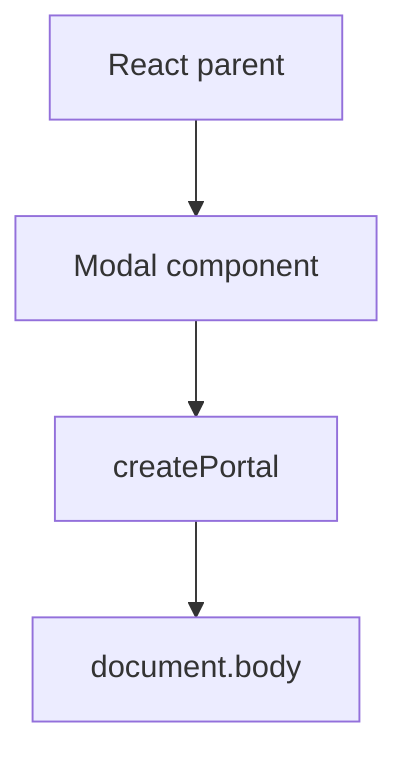

# Portals

## Detailed explanation
Portals let React render children into a DOM node outside the parent component's DOM hierarchy while keeping the React component hierarchy intact. They are commonly used for modals, tooltips, popovers, dropdowns, and toast containers.

The key idea is that visual placement in the DOM can differ from logical ownership in React. Events still bubble through the React tree, which surprises many developers.

## 1. One-line mental model
A portal renders UI somewhere else in the DOM while keeping it connected to the React tree.

## 2. Problem it solves
Overlays often need to escape parent stacking contexts, clipping, overflow hidden containers, or layout constraints.

## 3. Core idea
- Use `createPortal(children, domNode)`.
- The DOM position changes.
- React ownership remains the same.
- React event bubbling follows the React tree.
- Portals need accessibility and focus management.

## 4. Visual / analogy
A portal is like a video call: the person appears on another screen but still belongs to the same meeting.



## 5. Minimal example

```tsx
import { createPortal } from "react-dom";

function Modal({ children }: { children: React.ReactNode }) {
  return createPortal(children, document.body);
}
```

## 6. Real-world example

```tsx
function Dialog({ title, children }: Props) {
  return createPortal(
    <div role="dialog" aria-modal="true" aria-label={title}>
      {children}
    </div>,
    document.getElementById("modal-root")!,
  );
}
```

## 7. Common interview questions
- What is a portal?
- When do you use portals?
- Do portal events bubble through DOM tree or React tree?
- How do portals help modals?
- What accessibility concerns do portals have?
- Can portals render outside root?
- How do you test portals?

## 8. Active recall test
1. What function creates a portal?
2. What changes: DOM position or React ownership?
3. Why are portals useful for modals?
4. What focus behavior does a dialog need?
5. How do events bubble?

## 9. Mistakes / traps
- Forgetting focus trap and focus restoration.
- Ignoring scroll lock for modals.
- Assuming portal breaks React context.
- Not creating a stable portal root.
- Forgetting server-rendering guards for `document`.

## 10. Compare with related concepts
- **Portal vs normal render:** portal changes DOM target.
- **Portal vs iframe:** portal stays in same document and React tree.
- **Portal vs absolute positioning:** positioning alone may not escape clipping or stacking constraints.

## 11. Summary from memory
Explain why a modal often uses a portal and what accessibility work is still required.

## 12. Spaced revision prompts
- After 1 day: Define portal.
- After 3 days: Explain portal event bubbling.
- After 7 days: Design an accessible modal portal.
- After 14 days: Compare portal and absolute positioning.

