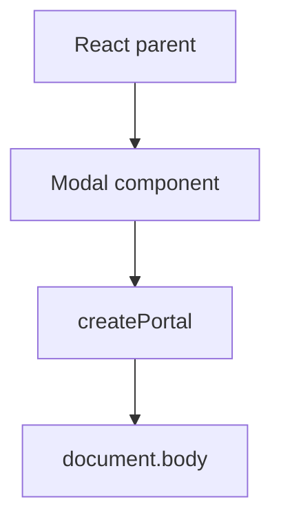

# Portals

## Detailed explanation
Portals let React render children into a DOM node outside the parent component's DOM hierarchy while keeping the React component hierarchy intact. They are commonly used for modals, tooltips, popovers, dropdowns, and toast containers.

The key idea is that visual placement in the DOM can differ from logical ownership in React. Events still bubble through the React tree, which surprises many developers.

## 1. One-line mental model
A portal renders UI somewhere else in the DOM while keeping it connected to the React tree.

## 2. Problem it solves
Overlays often need to escape parent stacking contexts, clipping, overflow hidden containers, or layout constraints.

## 3. Core idea
- Use `createPortal(children, domNode)`.
- The DOM position changes.
- React ownership remains the same.
- React event bubbling follows the React tree.
- Portals need accessibility and focus management.

## 4. Visual / analogy
A portal is like a video call: the person appears on another screen but still belongs to the same meeting.



## 5. Minimal example

```tsx
import { createPortal } from "react-dom";

function Modal({ children }: { children: React.ReactNode }) {
  return createPortal(children, document.body);
}
```

## 6. Real-world example

```tsx
function Dialog({ title, children }: Props) {
  return createPortal(
    <div role="dialog" aria-modal="true" aria-label={title}>
      {children}
    </div>,
    document.getElementById("modal-root")!,
  );
}
```

## 7. Common interview questions
#### What is a portal?
- **The Engine Mechanism (Why it behaves this way):** A portal is created with `ReactDOM.createPortal(children, container)`, which renders the `children` into the specified DOM `container` node while keeping the children within the React component hierarchy. Internally, React creates a separate Fiber subtree rooted at the portal container. The portal's children are reconciled as part of the parent component's render, but their DOM nodes are attached to the portal container instead of the parent's DOM subtree. React event propagation follows the React tree, not the DOM tree — so events from portal children bubble through the React parent components.
- **The Unforgettable Mental Model:** The **Remote-Controlled Drone**. The drone (portal content) is physically flying somewhere else in the sky (different DOM location), but the operator (React parent) still controls it and receives all its signals (events) as if it were right next to them.
- **The Trap:** Thinking portals break the React tree. They don't — the portal children remain part of the parent's React component hierarchy. Only the DOM placement changes.
- **Senior Interview Playbook (Verbal Script):** "When asked this in an interview, say: A portal is a React feature that renders children into a DOM node outside the parent's DOM hierarchy while keeping them connected to the React component tree. Created with `ReactDOM.createPortal(children, container)`, portals are commonly used for modals, tooltips, and dropdowns that need to escape parent CSS constraints like overflow hidden or z-index stacking contexts. Critically, React event bubbling follows the React tree, not the DOM tree — so events from portal children still bubble to React parent components."

#### When do you use portals?
- **The Engine Mechanism (Why it behaves this way):** Portals are used when the visual placement of an element needs to differ from its logical position in the component tree. Common scenarios include: modals and dialogs that need to render at the document body level to avoid z-index and overflow issues; tooltips and popovers that need to escape clipping containers; dropdown menus that need to overlay other content; and toast notifications that need a fixed position at the viewport level. Without portals, these elements would be constrained by their parent's CSS — overflow hidden would clip them, stacking contexts would hide them behind other elements, and layout constraints would distort their positioning.
- **The Unforgettable Mental Model:** The **Escape Artist**. A modal inside a deeply nested component is like a performer locked in a box inside a room inside a building. Portals are the escape route — the performer appears on the main stage (document body) where everyone can see them, unblocked by walls and doors.
- **The Trap:** Using portals for everything that needs positioning. Many positioning needs can be solved with CSS (`position: fixed`, `position: absolute`, proper z-index). Portals are specifically for escaping DOM hierarchy constraints, not just for overlay positioning.
- **Senior Interview Playbook (Verbal Script):** "When asked this in an interview, say: Portals are used when an element needs to render at a different DOM location than its logical React position. The most common use case is modals and dialogs — they need to render at the document body level to escape parent overflow hidden, z-index stacking contexts, and layout constraints. Other examples include tooltips, popovers, dropdowns, and toast notifications. The key insight: use portals when CSS alone can't solve the positioning problem because the parent's DOM hierarchy is creating visual constraints."

#### Do portal events bubble through DOM tree or React tree?
- **The Engine Mechanism (Why it behaves this way):** Portal events bubble through the React component tree, not the DOM tree. When an event fires inside a portal, React's event delegation system catches it at the root container and walks up the React component hierarchy — which includes the portal's parent components — invoking handlers along the way. This means a click inside a modal portal will bubble to the parent component's `onClick` handler, even though the modal's DOM node is not a child of the parent's DOM node. This behavior is intentional: it preserves the logical relationship between components regardless of where their DOM nodes are placed.
- **The Unforgettable Mental Model:** The **Family Phone Tree**. Even though your cousin lives in another city (different DOM location), when there's family news (an event), the phone tree follows the family hierarchy (React tree), not the geographic locations. The news reaches everyone in the family chain.
- **The Trap:** Assuming `event.stopPropagation()` in a portal prevents the event from reaching parent React components. It does — but only for React handlers. The native event still propagates through the DOM tree independently.
- **Senior Interview Playbook (Verbal Script):** "When asked this in an interview, say: Portal events bubble through the React component tree, not the DOM tree. When an event fires inside a portal, React walks up the React parent hierarchy to find handlers, regardless of where the portal's DOM node is located. This means a parent component can catch events from a portal child even though they're not DOM parent and child. This preserves the logical component relationship and makes portals behave predictably — the React tree is the source of truth for event propagation."

#### How do portals help modals?
- **The Engine Mechanism (Why it behaves this way):** Modals need to appear on top of all other content, centered in the viewport, without being clipped or layered incorrectly. When a modal is rendered deep in the component tree, its parent elements may have `overflow: hidden` (clipping the modal), lower `z-index` values (hiding it behind other elements), or `transform`/`filter` properties (creating new stacking contexts that trap the modal). By using a portal to render the modal at the document body level (or a dedicated modal root), the modal escapes all parent CSS constraints. It can use `position: fixed` relative to the viewport and a high `z-index` to appear on top of everything.
- **The Unforgettable Mental Model:** The **Elevator to the Penthouse**. A modal deep in the DOM is stuck on the ground floor, blocked by walls and furniture. The portal is an elevator that takes it straight to the penthouse (document body) — unobstructed view, top of the building, visible to everyone.
- **The Trap:** Portaling the modal DOM but forgetting accessibility work. The modal still needs focus trapping, focus restoration, `aria-modal`, scroll locking, and Escape key handling — portals only solve the DOM placement problem.
- **Senior Interview Playbook (Verbal Script):** "When asked this in an interview, say: Portals help modals by rendering them at the document body level, escaping parent CSS constraints. Without portals, a modal rendered deep in the component tree can be clipped by `overflow: hidden`, hidden by `z-index` stacking contexts, or distorted by parent `transform` properties. A portal places the modal's DOM at the root level, where `position: fixed` and `z-index` work correctly. But portals only solve the placement problem — you still need to handle focus trapping, scroll locking, and ARIA attributes for accessibility."

#### What accessibility concerns do portals have?
- **The Engine Mechanism (Why it behaves this way):** When a modal opens via a portal, focus management becomes critical because the DOM node is in a different location than the trigger element. The browser's focus remains on the trigger element, but visually the modal is on screen. Without focus trapping, a user pressing Tab can navigate to elements behind the modal, which is confusing and violates WCAG guidelines. Additionally, when the modal closes, focus must be restored to the trigger element so keyboard users know where they are. Screen readers also need `role="dialog"` and `aria-modal="true"` to announce the modal correctly. The portal itself doesn't handle any of this — it only moves the DOM node.
- **The Unforgettable Mental Model:** The **Stage Curtain**. When the curtain rises on a new scene (modal opens), the spotlight (focus) must move to the new scene and stay there until the curtain falls. When it falls, the spotlight returns to where it was before. Without this, the audience doesn't know where to look.
- **The Trap:** Assuming the portal handles accessibility automatically. Portals only change DOM placement. Focus trapping, focus restoration, ARIA attributes, and scroll locking must be implemented separately.
- **Senior Interview Playbook (Verbal Script):** "When asked this in an interview, say: Portals only handle DOM placement — accessibility must be implemented separately. For modal portals, you need: focus trapping (Tab cycles within the modal), focus restoration (focus returns to the trigger on close), `role='dialog'` and `aria-modal='true'` for screen readers, scroll locking (prevent background scrolling), and Escape key handling to close. Libraries like Radix UI or Headless UI provide these behaviors out of the box. If building from scratch, you need to manage all of these manually."

#### Can portals render outside the React root?
- **The Engine Mechanism (Why it behaves this way):** Yes. `createPortal` accepts any DOM node as its container, including nodes outside the React root container. The portal's children are reconciled as part of the React tree, but their DOM nodes are attached to the specified container. This means you can render into `document.body`, a node in a different part of the page, or even an iframe's document (with appropriate cross-origin considerations). The React root container and the portal container are independent — React manages both through the same reconciliation process.
- **The Unforgettable Mental Model:** The **Satellite Dish**. The satellite (portal content) is controlled by your TV (React app), but it's physically mounted on the roof (different DOM location). The TV still receives and processes the satellite's signals.
- **The Trap:** Rendering into a DOM node that doesn't exist yet. If the portal container is created by another script or loaded asynchronously, you need to ensure it exists before calling `createPortal`, or guard against `null`.
- **Senior Interview Playbook (Verbal Script):** "When asked this in an interview, say: Yes, portals can render into any DOM node, including nodes outside the React root. The `createPortal` function accepts any DOM element as its container — `document.body`, a node elsewhere on the page, or even an iframe's document. React reconciles the portal's children as part of the same component tree, but attaches their DOM nodes to the specified container. This is useful for integrating React with non-React parts of a page or rendering into dynamically created containers."

#### How do you test portals?
- **The Engine Mechanism (Why it behaves this way):** Testing portals requires the portal container to exist in the test DOM. In Jest with React Testing Library, you typically render the component and query for elements within the portal container. Since `createPortal` renders into a specific DOM node, that node must be present in the test environment. React Testing Library's `screen` queries search the entire document by default, so portal content is findable without special configuration. However, if you're using a custom portal container (like `#modal-root`), you need to create that element in the test setup or use `document.body` as the container.
- **The Unforgettable Mental Model:** The **Hidden Room Inspection**. Testing a portal is like inspecting a room that's on a different floor of the building. You need to know which floor to go to (the portal container), but once you're there, the inspection process is the same as any other room.
- **The Trap:** Assuming portal content isn't queryable because it's "outside" the component. React Testing Library queries the entire document, so portal content is findable with standard queries like `screen.getByRole('dialog')`.
- **Senior Interview Playbook (Verbal Script):** "When asked this in an interview, say: Testing portals is straightforward with React Testing Library because its queries search the entire document. Portal content is findable with standard queries like `screen.getByRole('dialog')`. The main consideration is ensuring the portal container exists in the test DOM — if you're using a custom container like `#modal-root`, you need to create it in the test setup. In most cases, rendering to `document.body` works fine without additional setup."

## 8. Active recall test
1. **What function creates a portal?**
   - **Explanation:** `ReactDOM.createPortal(children, container)` renders children into the specified DOM container while keeping them in the React component tree. The children are reconciled as part of the parent's render but attached to the portal container in the DOM.
2. **What changes: DOM position or React ownership?**
   - **Explanation:** DOM position changes — the portal's children are attached to the specified container node. React ownership stays the same — the children remain part of the parent's React component hierarchy for events, context, and state.
3. **Why are portals useful for modals?**
   - **Explanation:** Portals render modals at the document body level, escaping parent CSS constraints like overflow hidden, z-index stacking contexts, and transform-created stacking contexts that would otherwise clip or hide the modal.
4. **What focus behavior does a dialog need?**
   - **Explanation:** A dialog needs focus trapping (Tab cycles within the modal), focus restoration (focus returns to the trigger on close), and `aria-modal="true"` for screen readers. Portals don't provide these automatically.
5. **How do events bubble from a portal?**
   - **Explanation:** Events bubble through the React component tree, not the DOM tree. A click inside a portal bubbles to the React parent components, even though the portal's DOM node is not a DOM child of the parent.

## 9. Mistakes / traps
- Forgetting focus trap and focus restoration.
- Ignoring scroll lock for modals.
- Assuming portal breaks React context.
- Not creating a stable portal root.
- Forgetting server-rendering guards for `document`.

## 10. Compare with related concepts
- **Portal vs normal render:** portal changes DOM target.
- **Portal vs iframe:** portal stays in same document and React tree.
- **Portal vs absolute positioning:** positioning alone may not escape clipping or stacking constraints.

## 11. Summary from memory
Explain why a modal often uses a portal and what accessibility work is still required.

## 12. Spaced revision prompts
- After 1 day: Define portal.
- After 3 days: Explain portal event bubbling.
- After 7 days: Design an accessible modal portal.
- After 14 days: Compare portal and absolute positioning.

