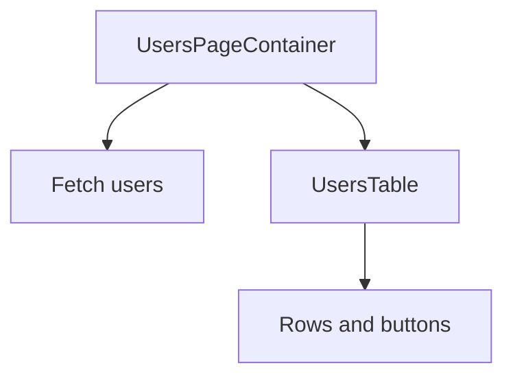

# Presentational vs Container Components

## Detailed explanation
The presentational/container pattern separates UI rendering from data and behavior orchestration. Presentational components focus on displaying props. Container components fetch data, read route params, connect to stores, manage state, or decide which UI state to show.

Hooks made this pattern less formal, but the responsibility split remains valuable. It helps keep reusable UI free from feature-specific data fetching and makes feature-level components easier to test.

## 1. One-line mental model
Presentational components focus on how UI looks, while container components focus on data, state, and behavior.

## 2. Problem it solves
Mixing data fetching, business logic, and markup in every component makes UI hard to test and reuse. Separating presentation from orchestration clarifies responsibilities.

## 3. Core idea
- Presentational components receive data and callbacks through props.
- Container components fetch data, manage state, and connect to stores or routes.
- Hooks have made the pattern less rigid, but the separation is still useful.
- Feature components often combine both when the boundary is small.
- Shared UI should usually stay presentational.

## 4. Visual / analogy
A container is the restaurant kitchen; presentational components are the plated dish. The user sees the dish, but the kitchen prepares the data.



## 5. Minimal example

```tsx
function UserName({ name }: { name: string }) {
  return <span>{name}</span>;
}
```

`UserName` is presentational because it only renders props.

## 6. Real-world example

```tsx
function UsersPage() {
  const users = useUsersQuery();
  return <UsersTable rows={users.data ?? []} isLoading={users.isLoading} />;
}

function UsersTable({ rows, isLoading }: { rows: User[]; isLoading: boolean }) {
  if (isLoading) return <TableSkeleton />;
  return <table>{rows.map((user) => <UserRow key={user.id} user={user} />)}</table>;
}
```

## 7. Common interview questions
- What are presentational components?
- What are container components?
- Is this pattern still relevant with hooks?
- Where should data fetching live?
- How does this pattern improve testing?
- What should shared UI components know?
- Can one component be both?

## 8. Active recall test
1. What does a container own?
2. What does a presentational component own?
3. Why did hooks reduce strict container/presentational separation?
4. Where should route params usually be read?
5. How does this pattern help reuse?

## 9. Mistakes / traps
- Treating the pattern as a strict rule for every file.
- Putting API calls inside shared UI components.
- Passing raw server responses too deep without shaping them.
- Making presentational components know about routes.
- Splitting tiny components unnecessarily.

## 10. Compare with related concepts
- **Presentational vs container:** rendering-focused vs orchestration-focused.
- **Container vs page:** a page is often a route-level container.
- **Presentational vs dumb:** avoid dismissive naming; presentational components still need good design and accessibility.

## 11. Summary from memory
Explain how you would split a users page into data container and reusable table components.

## 12. Spaced revision prompts
- After 1 day: Define presentational and container components.
- After 3 days: Explain how hooks changed this pattern.
- After 7 days: Refactor a data-heavy component into two parts.
- After 14 days: Decide where API fetching should live.
