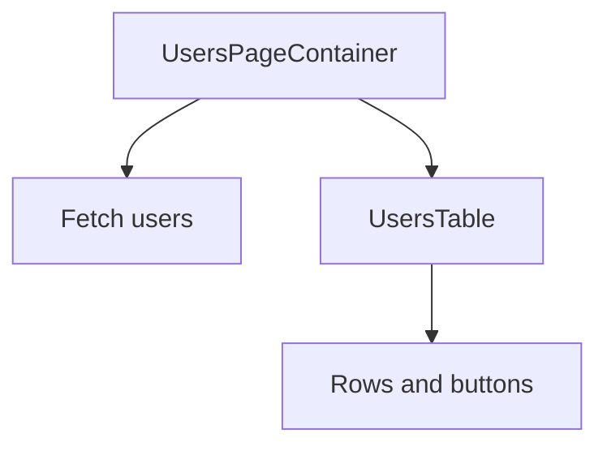

# Presentational vs Container Components

## Detailed explanation
The presentational/container pattern separates UI rendering from data and behavior orchestration. Presentational components focus on displaying props. Container components fetch data, read route params, connect to stores, manage state, or decide which UI state to show.

Hooks made this pattern less formal, but the responsibility split remains valuable. It helps keep reusable UI free from feature-specific data fetching and makes feature-level components easier to test.

## 1. One-line mental model
Presentational components focus on how UI looks, while container components focus on data, state, and behavior.

## 2. Problem it solves
Mixing data fetching, business logic, and markup in every component makes UI hard to test and reuse. Separating presentation from orchestration clarifies responsibilities.

## 3. Core idea
- Presentational components receive data and callbacks through props.
- Container components fetch data, manage state, and connect to stores or routes.
- Hooks have made the pattern less rigid, but the separation is still useful.
- Feature components often combine both when the boundary is small.
- Shared UI should usually stay presentational.

## 4. Visual / analogy
A container is the restaurant kitchen; presentational components are the plated dish. The user sees the dish, but the kitchen prepares the data.



## 5. Minimal example

```tsx
function UserName({ name }: { name: string }) {
  return <span>{name}</span>;
}
```

`UserName` is presentational because it only renders props.

## 6. Real-world example

```tsx
function UsersPage() {
  const users = useUsersQuery();
  return <UsersTable rows={users.data ?? []} isLoading={users.isLoading} />;
}

function UsersTable({ rows, isLoading }: { rows: User[]; isLoading: boolean }) {
  if (isLoading) return <TableSkeleton />;
  return <table>{rows.map((user) => <UserRow key={user.id} user={user} />)}</table>;
}
```

## 7. Common interview questions
#### What are presentational components?
- **The Engine Mechanism (Why it behaves this way):** Presentational components are React functions that receive data and callbacks exclusively through props and return JSX. During the render phase, React calls the component with its props, and the component produces a React element tree purely from those inputs. Presentational components have no direct knowledge of data fetching, routing, or global stores. They may have minimal internal UI state (like "is dropdown open"), but they don't manage business data. Because they're pure functions of props, they're highly testable — you pass props, assert on output. React's reconciliation treats them like any other component, but their simplicity means fewer re-render triggers.
- **The Unforgettable Mental Model:** The **Mannequin**. The mannequin (presentational component) doesn't decide what to wear. Someone dresses it (parent passes props), and it displays the outfit. Swap the clothes, the mannequin looks different. The mannequin never goes shopping (fetches data) itself.
- **The Trap:** Calling them "dumb" components. Presentational components still need thoughtful design, accessibility, and interaction handling. "Dumb" implies they're unimportant — they're actually the user-facing layer.
- **Senior Interview Playbook (Verbal Script):** "When asked this in an interview, say: Presentational components focus on how things look. They receive data and callbacks through props, manage minimal internal UI state, and render JSX. They don't fetch data, read routes, or connect to stores. This makes them highly reusable, easy to test, and portable across features. Examples include a UserAvatar that receives a name and image URL, or a DataTable that receives rows and column definitions."

#### What are container components?
- **The Engine Mechanism (Why it behaves this way):** Container components are React functions that handle data fetching, state management, route parameter reading, and business logic orchestration. During the render phase, they execute data queries (via hooks like `useQuery`), read from stores, process data into presentational shapes, and pass the results down to presentational components. They may also handle side effects through `useEffect` or event handlers. Container components are the "glue" between the application's data layer and its UI layer. They re-render when their data sources change — when a query refetches, when store state updates, when route params change.
- **The Unforgettable Mental Model:** The **Restaurant Kitchen**. The kitchen (container) receives orders (user actions), gathers ingredients (fetches data), prepares the dish (processes data), and hands it to the waiter (presentational component) who serves it to the customer. The customer never sees the kitchen.
- **The Trap:** Making containers do presentation. If a container component has complex JSX, conditional rendering for UI states, or styling logic, it's doing two jobs. Split it: container handles data, presentational handles rendering.
- **Senior Interview Playbook (Verbal Script):** "When asked this in an interview, say: Container components handle data and behavior — they fetch data, manage state, read route parameters, and orchestrate business logic. They shape raw data into presentational formats and pass them down to presentational components. A UsersPage container fetches users, handles loading and error states, and passes a clean array of user objects to a UsersTable presentational component. The container knows about APIs; the presentational component only knows about props."

#### Is this pattern still relevant with hooks?
- **The Engine Mechanism (Why it behaves this way):** Before hooks, the container/presentational split was enforced by class component architecture — containers were classes with lifecycle methods and state, presentational components were stateless functional components. Hooks blurred this line because any function component can now use `useState`, `useEffect`, `useQuery`, etc. However, the responsibility separation remains valuable: keeping data logic separate from rendering logic makes components easier to test, reason about, and reuse. The pattern shifted from "separate files" to "separate concerns within files" or "custom hooks as containers." A component can use a custom hook (`useUsersQuery`) that encapsulates the container logic, keeping the component itself presentational.
- **The Unforgettable Mental Model:** **Separate Rooms vs. Separate Houses**. Before hooks, containers and presentational components lived in separate houses (files). With hooks, they can live in the same house but in separate rooms (custom hooks + presentational rendering in one file). The separation of concerns remains; the physical separation is optional.
- **The Trap:** Thinking hooks eliminate the need for separation. Without discipline, components become "god components" that fetch data, manage state, handle events, and render complex UI — all in one function.
- **Senior Interview Playbook (Verbal Script):** "When asked this in an interview, say: Hooks made the strict file-level separation less necessary, but the responsibility split is still valuable. Instead of separate container and presentational files, I often use custom hooks to encapsulate data logic — useUsersQuery handles fetching, pagination, and error state, while the component focuses on rendering. The principle remains: separate data orchestration from UI rendering. Hooks just gave us a more flexible way to achieve it."

#### Where should data fetching live?
- **The Engine Mechanism (Why it behaves this way):** Data fetching should live in container components or custom hooks, not in presentational components. During the render phase, React executes hooks in order. A data-fetching hook (`useQuery`, `useSWR`) initiates the request, manages loading/error/success states, and returns the result. The component then renders based on these states. If data fetching lived in presentational components, those components would become coupled to specific APIs, making them unusable in different contexts. Additionally, presentational components are often rendered multiple times in different parts of the app — each render would trigger a new fetch if the fetching logic were embedded in them.
- **The Unforgettable Mental Model:** The **Water Main vs. the Faucet**. The water main (container/hook) connects to the city supply (API) and manages pressure, filtration, and flow. The faucet (presentational component) just lets water out when you turn the handle. You don't plumb the city connection into every faucet.
- **The Trap:** Putting fetch calls directly inside component bodies or useEffect without proper dependency management. This causes infinite refetch loops or stale data.
- **Senior Interview Playbook (Verbal Script):** "When asked this in an interview, say: Data fetching should live in container components or custom hooks, never in presentational components. I use libraries like TanStack Query or SWR through custom hooks that manage loading, error, caching, and refetching. The presentational component receives the fetched data as props and focuses on rendering. This keeps UI components portable and testable, and centralizes data-fetching concerns in one place."

#### How does this pattern improve testing?
- **The Engine Mechanism (Why it behaves this way):** Separating presentation from data makes each layer independently testable. Presentational components can be tested by rendering them with mock props and asserting on the output — no network mocking, no store setup, no async waiting. Container components can be tested by mocking their data sources (API responses, store values) and verifying they pass the correct props to presentational children. During testing, React Testing Library renders components into jsdom and queries the output. Presentational tests are fast and deterministic because they have no external dependencies. Container tests verify data transformation and state management without caring about the rendered HTML structure.
- **The Unforgettable Mental Model:** The **Car Assembly Line Testing**. Each station tests one thing: the engine station tests the engine, the paint station tests the paint, the electrical station tests the wiring. You don't test the engine by checking the paint color. Separated components let you test each concern in isolation.
- **The Trap:** Testing presentational components with real API calls or store connections. This makes tests slow, flaky, and coupled to implementation details.
- **Senior Interview Playbook (Verbal Script):** "When asked this in an interview, say: This pattern improves testing by making each layer independently testable. Presentational components are tested with mock props — I render them, query the output, and assert on what's on screen. No network mocking, no async waits. Container components are tested by mocking their data sources and verifying they pass correct props to children. This separation means presentational tests are fast and deterministic, while container tests verify data logic without caring about HTML structure."

#### What should shared UI components know?
- **The Engine Mechanism (Why it behaves this way):** Shared UI components should only know about their own props, internal UI state, and DOM interactions. During render, they produce output based solely on these inputs. They should not import API clients, read from global stores, access router context, or reference feature-specific types. If a shared component needs data, that data should be passed as props. If it needs to trigger an action, it should call a callback prop. This isolation ensures the component can be used in any context — different pages, different apps, even different projects. React's module system enforces this at the import level: if a shared component doesn't import feature-specific modules, it can't accidentally depend on them.
- **The Unforgettable Mental Model:** The **Universal Remote**. It works with any TV because it doesn't know about specific TV models. It sends standard signals (props and callbacks) that any compatible device understands. A TV-specific remote (feature-coupled component) only works with one model.
- **The Trap:** Importing a "shared" component that secretly imports from `@/features/checkout`. This creates a hidden dependency that breaks when you try to use the component elsewhere.
- **Senior Interview Playbook (Verbal Script):** "When asked this in an interview, say: Shared UI components should only know about their props, internal UI state, and how to interact with the DOM. They should never import API clients, read from stores, access router context, or reference feature-specific types. If a shared Button needs to know about loading state, that's passed as an `isLoading` prop — the Button doesn't fetch the loading state itself. The test is: can I copy this component to a completely different project and use it with just props? If yes, it's truly shared."

#### Can one component be both?
- **The Engine Mechanism (Why it behaves this way):** Yes, and in practice, many components are both — especially at the feature level. A `UsersPage` component might fetch data (container behavior) and render the table (presentational behavior) in the same function. This is acceptable when the component is small, the data logic is simple, and splitting it would add unnecessary indirection. React doesn't enforce the separation — it's an architectural guideline. The key is intentional choice: combine when the boundary is small and clear, split when the component grows complex or when the presentational part needs to be reused elsewhere. Custom hooks make this easier — the container logic lives in a hook, and the component function stays focused on rendering.
- **The Unforgettable Mental Model:** The **Studio Apartment vs. the House**. A studio (combined component) has the kitchen, bedroom, and living room in one space — fine for one person. A house (split components) has separate rooms — better for families. The right choice depends on how much space (complexity) you need.
- **The Trap:** Rigidly enforcing the split for every component, creating files that export two components where one would suffice. The pattern serves clarity, not bureaucracy.
- **Senior Interview Playbook (Verbal Script):** "When asked this in an interview, say: Yes, components can be both, and often are at the feature level. A UsersPage might fetch data and render the table in the same function. I combine them when the component is small and the presentational part isn't reused elsewhere. I split them when the presentational component is used in multiple places or when the data logic is complex enough to warrant its own custom hook. The pattern is a tool for clarity, not a rule to follow rigidly."

## 8. Active recall test
1. **What does a container own?**
   - **Explanation:** A container owns data fetching, state management, route parameter reading, business logic, and data transformation. It orchestrates how data flows into the application and shapes it for presentation.
2. **What does a presentational component own?**
   - **Explanation:** A presentational component owns how the UI looks and behaves visually — rendering JSX from props, handling user interactions through callbacks, managing minimal internal UI state (like toggle states), and ensuring accessibility.
3. **Why did hooks reduce strict container/presentational separation?**
   - **Explanation:** Before hooks, only class components could hold state and lifecycle methods, forcing a file-level split. Hooks allow any function component to use state, effects, and data-fetching hooks, so the separation became a concern-level split within a file rather than a file-level split.
4. **Where should route params usually be read?**
   - **Explanation:** Route params should be read in container components or custom hooks, not in presentational components. This keeps presentational components decoupled from the routing system and makes them reusable in non-routed contexts (like modals or embedded views).
5. **How does this pattern help reuse?**
   - **Explanation:** By separating data logic from rendering, presentational components become portable — they can be used with any data source, in any feature, because they only depend on props. Container components can also be reused when the same data is needed in different UI presentations.

## 9. Mistakes / traps
- Treating the pattern as a strict rule for every file.
- Putting API calls inside shared UI components.
- Passing raw server responses too deep without shaping them.
- Making presentational components know about routes.
- Splitting tiny components unnecessarily.

## 10. Compare with related concepts
- **Presentational vs container:** rendering-focused vs orchestration-focused.
- **Container vs page:** a page is often a route-level container.
- **Presentational vs dumb:** avoid dismissive naming; presentational components still need good design and accessibility.

## 11. Summary from memory
Explain how you would split a users page into data container and reusable table components.

## 12. Spaced revision prompts
- After 1 day: Define presentational and container components.
- After 3 days: Explain how hooks changed this pattern.
- After 7 days: Refactor a data-heavy component into two parts.
- After 14 days: Decide where API fetching should live.
