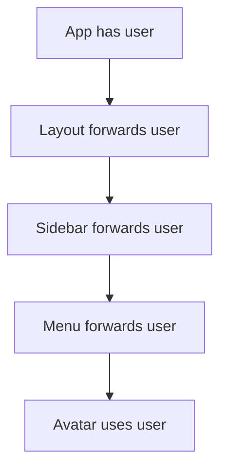

# Props Drilling

## Detailed explanation
Props drilling happens when a value is passed through several intermediate components that do not use it, only so a deeper child can receive it. It is not automatically bad, because explicit props are often simple and clear. It becomes a problem when the forwarding creates noise and makes component changes painful.

The usual solutions are composition, colocating state, context, or a state library. The correct choice depends on how widely the data is needed and how frequently it changes.

## 1. One-line mental model
Props drilling is passing props through intermediate components that do not use them just to reach deeper children.

## 2. Problem it solves
The concept names a maintainability problem in deep component trees. It helps developers identify when explicit props are becoming noisy and when another state-sharing pattern may be better.

## 3. Core idea
- Props are good for explicit parent-child communication.
- Props drilling becomes painful when many middle components only forward props.
- It can make refactoring component trees harder.
- Solutions include composition, context, colocating state, or state libraries.
- Not every multi-level prop pass is bad.

## 4. Visual / analogy
Props drilling is like passing a package through five people even though only the last person needs it.



## 5. Minimal example

```tsx
function App() {
  return <Layout user={user} />;
}

function Layout({ user }: { user: User }) {
  return <Sidebar user={user} />;
}

function Sidebar({ user }: { user: User }) {
  return <Avatar user={user} />;
}
```

## 6. Real-world example

```tsx
const AuthContext = React.createContext<User | null>(null);

function Avatar() {
  const user = React.useContext(AuthContext);
  return ;
}
```

Context can remove repeated forwarding for app-wide, low-frequency data like current user or theme.

## 7. Common interview questions
#### What is props drilling?
- **The Engine Mechanism (Why it behaves this way):** Props drilling occurs when a prop is passed through multiple intermediate components that don't use it, solely to reach a deeply nested child that does. During the render phase, each intermediate component receives the prop in its props object, includes it in its own JSX output by passing it to its child, and React includes it in the element tree for that level. The intermediate components don't read or act on the prop — they're transparent conduits. React's reconciliation processes each level normally, but the prop adds to each component's prop object and makes the component tree more tightly coupled. If the prop's type or meaning changes, every intermediate component's signature may need updating.
- **The Unforgettable Mental Model:** The **Office Mail Chain**. A letter needs to go from the CEO (top component) to an intern five floors down (deep child). It passes through four managers (intermediate components) who don't open it — they just hand it to the next person. The managers add no value; they're just forwarding.
- **The Trap:** Calling every multi-level prop pass "props drilling." If intermediate components actually use the prop, it's not drilling — it's normal data flow. Drilling is specifically about unused forwarding.
- **Senior Interview Playbook (Verbal Script):** "When asked this in an interview, say: Props drilling is when a value passes through multiple intermediate components that don't use it, just to reach a deeper child that does. It's not inherently bad — explicit props are often the clearest solution. But when the forwarding chain gets long, it makes refactoring harder and adds noise to intermediate components' APIs. It's a signal that another pattern like composition, context, or state colocation might be better."

#### Is props drilling always bad?
- **The Engine Mechanism (Why it behaves this way):** Props drilling is not always bad because explicit props are the most transparent data flow mechanism in React. During reconciliation, React processes props drilling the same way it processes any prop passing — there's no performance penalty for passing a prop through one or two intermediate levels. The readability cost is minimal when the chain is short. The problem emerges when the chain grows to 4+ levels, when intermediate components accumulate many forwarded props, or when the prop's meaning changes and requires updating every level. At that point, the maintenance cost outweighs the transparency benefit. React's design intentionally makes props explicit because implicit data flow (like global variables) is harder to debug.
- **The Unforgettable Mental Model:** The **Garden Hose**. A short hose (2-3 levels) works perfectly — water flows cleanly from source to destination. A hose stretched across the entire neighborhood (10+ levels) is messy, kinks easily, and is hard to manage. The hose itself isn't bad; the length is the problem.
- **The Trap:** Reflexively replacing all prop drilling with Context. Context introduces implicit dependencies that make components harder to understand in isolation. Short prop chains are often clearer.
- **Senior Interview Playbook (Verbal Script):** "When asked this in interview, say: No, props drilling isn't always bad. For short chains of 2-3 levels, explicit props are the clearest data flow — you can trace exactly where data comes from by reading the component signatures. It only becomes a problem when the chain gets long, when intermediates accumulate many forwarded props, or when refactoring becomes painful. I don't optimize until the drilling actually causes maintenance issues."

#### How do you avoid props drilling?
- **The Engine Mechanism (Why it behaves this way):** There are several strategies: (1) **Composition** — pass the deep child as `children` or a named prop to the intermediate component. The intermediate renders `{children}` without knowing about the prop. React's element tree places the child directly where needed, bypassing the intermediate's prop interface. (2) **Context** — wrap the tree in a Context Provider with the value, and the deep child consumes it directly via `useContext`. React's context delivery mechanism traverses the tree internally, skipping intermediate components entirely. (3) **Colocation** — move state closer to where it's used, reducing the distance it needs to travel. (4) **State managers** — for cross-cutting state, libraries like Zustand provide direct subscriptions. Each strategy changes the data flow path during React's render phase, but composition is the simplest because it uses React's existing element-passing mechanism.
- **The Unforgettable Mental Model:** The **Three Escape Routes**. Composition = take the elevator directly to the floor (bypass intermediate stops). Context = teleport to the destination (skip all floors). Colocation = move your desk closer to where you need things (reduce distance).
- **The Trap:** Using Context as the default solution. Composition often solves the problem without adding the implicit dependency overhead that Context introduces.
- **Senior Interview Playbook (Verbal Script):** "When asked this in an interview, say: I avoid props drilling first through composition — passing components as children so intermediate components don't need to know about the data. If the layout doesn't support composition, I use Context for widely-needed state. I also check if state can be colocated closer to where it's used. The key is choosing the simplest solution: composition before context, colocation before lifting."

#### When should you use Context?
- **The Engine Mechanism (Why it behaves this way):** Context should be used when a value is needed by many components at different tree levels and lifting state would create excessive prop drilling. During the render phase, a Context Provider places its value in React's internal context registry. Any descendant component that calls `useContext` reads directly from this registry, bypassing all intermediate components. However, when the Context value changes, React re-renders all components that consume that Context. This makes Context ideal for low-frequency updates (theme, locale, auth user) but problematic for high-frequency updates (typing, animation frames). React 18's `useSyncExternalStore` and selective Context patterns can mitigate re-render issues, but the fundamental behavior remains.
- **The Unforgettable Mental Model:** The **Wi-Fi Network**. Wi-Fi (Context) broadcasts a signal that any device (component) in range can connect to directly — no need to pass the signal hand-to-hand. But if too many devices stream video simultaneously (high-frequency updates), the network gets congested (re-render overload).
- **The Trap:** Using Context for high-frequency state like form input values or scroll position. Every change re-renders every consumer, causing severe performance degradation.
- **Senior Interview Playbook (Verbal Script):** "When asked this in an interview, say: I use Context for values that many components need at different tree levels and that change infrequently — theme, locale, authentication state, feature flags. These change rarely but are consumed widely, making Context's re-render behavior acceptable. I avoid Context for high-frequency state like form inputs or scroll position because every change triggers re-renders in all consumers. For those, I prefer composition, colocation, or state managers with fine-grained subscriptions."

#### How does composition reduce props drilling?
- **The Engine Mechanism (Why it behaves this way):** Composition reduces props drilling by inverting the data flow — instead of passing data down through layers, you pass the component that needs the data directly to the level where the data exists. During the render phase, the parent creates the deep child component as a React element and passes it as `children` or a named prop to the intermediate component. The intermediate component renders `{children}` without accessing the data prop. React's element tree places the child at the correct position, and the child receives its data directly from the parent's render scope. The intermediate component's props interface stays clean — it never sees the data prop.
- **The Unforgettable Mental Model:** The **Care Package**. Instead of sending ingredients through five relatives to reach the person cooking (props drilling), you send the finished meal directly to the cook (composition). The intermediates just deliver the package without opening it.
- **The Trap:** Overusing composition to the point where the component structure becomes confusing. If the composition makes the layout hard to understand, Context might be clearer.
- **Senior Interview Playbook (Verbal Script):** "When asked this in an interview, say: Composition eliminates props drilling by passing the component that needs data as a prop — usually children — to the intermediate component. The intermediate renders it without knowing about the data. For example, instead of passing a user prop through Layout → Sidebar → Menu → Avatar, I pass `<Avatar user={user} />` as children to Layout. Layout renders children without knowing about user. The data flows directly from source to consumer."

#### Context vs Redux for props drilling?
- **The Engine Mechanism (Why it behaves this way):** Both Context and Redux solve props drilling by providing a way for deep components to access state without intermediate forwarding. Context is built into React — a Provider places values in React's internal registry, and `useContext` reads them. When the Context value changes, all consumers re-render. Redux uses a separate store outside React's tree. Components subscribe to specific slices of the store state via `useSelector`. When the store updates, only components subscribed to the changed slice re-render. Redux adds middleware (thunks, sagas), dev tools, time-travel debugging, and a strict unidirectional data flow pattern. Context is simpler but less powerful; Redux is more powerful but adds boilerplate and bundle size.
- **The Unforgettable Mental Model:** **City Water vs. Bottled Water Delivery**. Context = city water system — simple, built-in, but everyone gets the same pressure (all consumers re-render). Redux = bottled water delivery — more complex setup, but each household gets exactly what they ordered (fine-grained subscriptions).
- **The Trap:** Using Redux for simple prop drilling problems that Context or composition could solve. Redux adds significant complexity and should be reserved for complex state management needs.
- **Senior Interview Playbook (Verbal Script):** "When asked this in an interview, say: Context is React's built-in solution for avoiding props drilling — it's simple and works well for low-frequency, widely-needed state. Redux is a full state management library with fine-grained subscriptions, middleware, and dev tools. I use Context for theme, auth, and locale. I consider Redux when state is complex, needs middleware for async logic, or when many components need different slices of state and re-render performance matters. For most apps, Context plus a lightweight library like Zustand is sufficient."

#### What are context performance concerns?
- **The Engine Mechanism (Why it behaves this way):** When a Context value changes, React re-renders every component that calls `useContext` for that Context, regardless of whether the component uses the changed part of the value. If the Context value is an object `{ user, theme, locale }` and only `theme` changes, all consumers re-render even if they only use `user` or `locale`. This is because React compares Context values by reference (`Object.is`), and a new object reference triggers all consumers. Solutions include: splitting Context into multiple smaller Contexts (ThemeContext, UserContext), memoizing the Context value with `useMemo`, or using `useSyncExternalStore` for fine-grained subscriptions. In React 18, the scheduler can prioritize re-renders, but it doesn't eliminate the fundamental re-render behavior.
- **The Unforgettable Mental Model:** The **Fire Alarm**. When the alarm (Context value change) sounds, everyone in the building (all consumers) evacuates (re-renders), even if the fire is only on the third floor (only one part of the value changed). Splitting Context is like having zone-specific alarms.
- **The Trap:** Putting a large object with many properties into a single Context and wondering why unrelated components re-render. Always split Context by concern and memoize values.
- **Senior Interview Playbook (Verbal Script):** "When asked this in an interview, say: The main performance concern with Context is that when the value changes, all consumers re-render — even if they only use part of the value. To mitigate this, I split Context into smaller, focused Contexts — one for theme, one for auth, one for locale. I also memoize Context values with useMemo to prevent unnecessary reference changes. For high-frequency state, I avoid Context entirely and use state managers with fine-grained subscriptions that only re-render components that depend on the changed data."

## 8. Active recall test
1. **What makes prop passing become props drilling?**
   - **Explanation:** Prop passing becomes props drilling when intermediate components receive and forward a prop without using it themselves. The key distinction is whether the intermediate component reads or acts on the prop — if it just passes it through, it's drilling.
2. **Name three ways to reduce props drilling.**
   - **Explanation:** (1) Composition — pass the deep child as `children` to bypass intermediate components. (2) Context — provide the value via Context Provider and consume it directly in the deep child. (3) Colocation — move state closer to where it's used, reducing the distance it needs to travel.
3. **Why is context not always the answer?**
   - **Explanation:** Context causes all consumers to re-render when the value changes, making it unsuitable for high-frequency state. It also creates implicit dependencies that make components harder to understand in isolation. Short prop chains are often clearer and more performant.
4. **What kind of data is good for context?**
   - **Explanation:** Low-frequency, widely-needed data like theme, locale, authentication state, and feature flags. These change rarely but are consumed by many components across the tree, making Context's re-render behavior acceptable.
5. **How can composition help?**
   - **Explanation:** Composition passes the component that needs data as a `children` or named prop to intermediate components. The intermediate renders `{children}` without accessing the data, eliminating the need to forward the prop through its interface.

## 9. Mistakes / traps
- Calling every prop pass props drilling.
- Replacing simple props with global state too early.
- Putting high-frequency changing state in broad context.
- Creating one huge app context.
- Hiding dependencies so components become harder to reuse.

## 10. Compare with related concepts
- **Props drilling vs props:** normal props are explicit and often best.
- **Props drilling vs context:** context avoids intermediate forwarding but can create implicit dependencies.
- **Props drilling vs composition:** composition can pass elements instead of data through layers.
- **Props drilling vs global state:** global state is broader and should solve a real sharing problem.

## 11. Summary from memory
Explain when props drilling becomes a problem and choose between composition, context, and a store.

## 12. Spaced revision prompts
- After 1 day: Define props drilling.
- After 3 days: Explain when context is appropriate.
- After 7 days: Refactor a prop-drilled tree with composition.
- After 14 days: Explain context performance traps.
