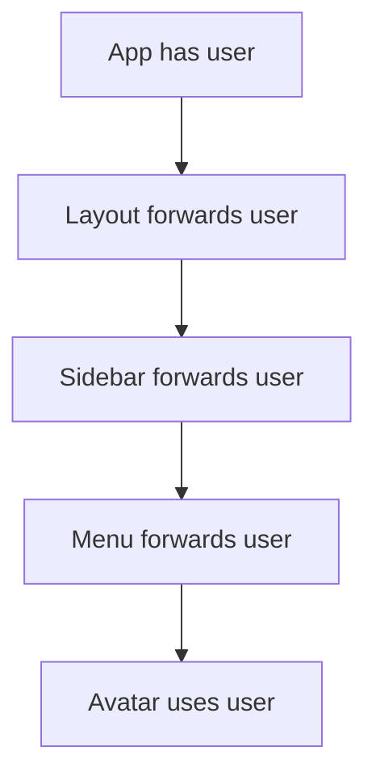

# Props Drilling

## Detailed explanation
Props drilling happens when a value is passed through several intermediate components that do not use it, only so a deeper child can receive it. It is not automatically bad, because explicit props are often simple and clear. It becomes a problem when the forwarding creates noise and makes component changes painful.

The usual solutions are composition, colocating state, context, or a state library. The correct choice depends on how widely the data is needed and how frequently it changes.

## 1. One-line mental model
Props drilling is passing props through intermediate components that do not use them just to reach deeper children.

## 2. Problem it solves
The concept names a maintainability problem in deep component trees. It helps developers identify when explicit props are becoming noisy and when another state-sharing pattern may be better.

## 3. Core idea
- Props are good for explicit parent-child communication.
- Props drilling becomes painful when many middle components only forward props.
- It can make refactoring component trees harder.
- Solutions include composition, context, colocating state, or state libraries.
- Not every multi-level prop pass is bad.

## 4. Visual / analogy
Props drilling is like passing a package through five people even though only the last person needs it.



## 5. Minimal example

```tsx
function App() {
  return <Layout user={user} />;
}

function Layout({ user }: { user: User }) {
  return <Sidebar user={user} />;
}

function Sidebar({ user }: { user: User }) {
  return <Avatar user={user} />;
}
```

## 6. Real-world example

```tsx
const AuthContext = React.createContext<User | null>(null);

function Avatar() {
  const user = React.useContext(AuthContext);
  return ;
}
```

Context can remove repeated forwarding for app-wide, low-frequency data like current user or theme.

## 7. Common interview questions
- What is props drilling?
- Is props drilling always bad?
- How do you avoid props drilling?
- When should you use Context?
- How does composition reduce props drilling?
- Context vs Redux for props drilling?
- What are context performance concerns?

## 8. Active recall test
1. What makes prop passing become props drilling?
2. Name three ways to reduce props drilling.
3. Why is context not always the answer?
4. What kind of data is good for context?
5. How can composition help?

## 9. Mistakes / traps
- Calling every prop pass props drilling.
- Replacing simple props with global state too early.
- Putting high-frequency changing state in broad context.
- Creating one huge app context.
- Hiding dependencies so components become harder to reuse.

## 10. Compare with related concepts
- **Props drilling vs props:** normal props are explicit and often best.
- **Props drilling vs context:** context avoids intermediate forwarding but can create implicit dependencies.
- **Props drilling vs composition:** composition can pass elements instead of data through layers.
- **Props drilling vs global state:** global state is broader and should solve a real sharing problem.

## 11. Summary from memory
Explain when props drilling becomes a problem and choose between composition, context, and a store.

## 12. Spaced revision prompts
- After 1 day: Define props drilling.
- After 3 days: Explain when context is appropriate.
- After 7 days: Refactor a prop-drilled tree with composition.
- After 14 days: Explain context performance traps.
