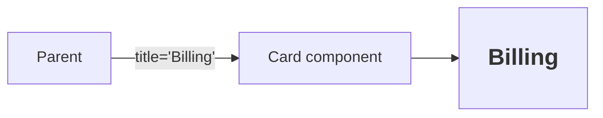

# Props in React

## Detailed explanation
Props are the inputs a parent passes to a child component. They let the same component render different output without changing the component implementation. In React's mental model, props are read-only for the receiving component; the owner of the data decides when props change.

Props are central to reuse and one-way data flow. A parent can pass values, objects, callbacks, children, or even React elements. Good prop design keeps components easy to understand and prevents invalid combinations.

## 1. One-line mental model
Props are read-only inputs passed from a parent component to a child component.

## 2. Problem it solves
Components need a way to receive data and configuration while remaining reusable. Props let the same component render different output based on parent-provided values.

## 3. Core idea
- Props flow from parent to child.
- Props should be treated as immutable by the receiving component.
- Props can be values, objects, arrays, functions, elements, or children.
- Changing props can cause a child component to re-render.
- Good prop design makes components easy to use and hard to misuse.

## 4. Visual / analogy
Props are like function arguments for UI components.



## 5. Minimal example

```tsx
function Welcome({ name }: { name: string }) {
  return <h1>Welcome, {name}</h1>;
}

<Welcome name="Asha" />;
```

## 6. Real-world example

```tsx
function InvoiceRow({ invoice, onApprove }: { invoice: Invoice; onApprove: (id: string) => void }) {
  return (
    <tr>
      <td>{invoice.number}</td>
      <td>{invoice.total}</td>
      <td><button onClick={() => onApprove(invoice.id)}>Approve</button></td>
    </tr>
  );
}
```

The row receives data and a callback without owning the whole invoice workflow.

## 7. Common interview questions
#### What are props?
- **The Engine Mechanism (Why it behaves this way):** Props (short for "properties") are the input object that React passes to a component function when it renders. When you write `<Welcome name="Asha" />`, React creates a React element with `props: { name: "Asha" }` and calls `Welcome({ name: "Asha" })`. Props are the primary mechanism for data flow in React's one-way data flow model — parents configure children through props, and children receive props as read-only inputs. During reconciliation, if a child's props change (by reference equality for objects, by value for primitives), React re-renders that child.
- **The Unforgettable Mental Model:** The **Function Arguments**. Props are exactly like arguments to a function. `function greet(name) { return "Hello, " + name; }` — the `name` parameter is like a prop. Different arguments, different output, same function.
- **The Trap:** Thinking props are only strings or numbers. Props can be any JavaScript value: objects, arrays, functions, React elements, promises, or even other components.
- **Senior Interview Playbook (Verbal Script):** "When asked this in an interview, say: Props are the inputs a parent component passes to a child component. They're like function arguments for UI components — the same component can render different output based on different props. Props flow one-way from parent to child, and the receiving component treats them as read-only. Props can be any JavaScript value: data, callbacks, React elements, or even other components."

#### Are props mutable?
- **The Engine Mechanism (Why it behaves this way):** Props should be treated as immutable by the receiving component. React's rendering model assumes that props are read-only — if a component mutates its props, it can cause unpredictable behavior because React doesn't track mutations inside prop objects. React only detects prop changes through reference equality during reconciliation. If you mutate a prop object in place, React won't know it changed and won't re-render. The parent component owns the data and decides when props change by passing new values.
- **The Unforgettable Mental Model:** The **Borrowed Book**. When you borrow a book (props) from a friend (parent), you can read it but you shouldn't write in it or tear out pages. If you need changes, you ask the friend to get you a different edition.
- **The Trap:** Mutating an object received through props and expecting React to detect the change. React compares props by reference, so in-place mutations are invisible to the reconciliation algorithm.
- **Senior Interview Playbook (Verbal Script):** "When asked this in an interview, say: Props should be treated as immutable. The receiving component should never modify its props — they're read-only inputs from the parent. If a component needs to change data, it should call a callback prop to request the parent make the change, or manage its own local state. Mutating props breaks React's rendering model because React detects prop changes through reference comparison, not deep mutation tracking."

#### How do props differ from state?
- **The Engine Mechanism (Why it behaves this way):** Props are passed *into* a component from its parent, while state is managed *within* a component. Props are controlled externally — the parent decides their values. State is controlled internally — the component decides its own state values through setter functions. When props change, React re-renders the child. When state changes, React re-renders the component and its descendants. Both trigger the render phase, but the ownership and control flow are fundamentally different. In React's Fiber architecture, props are stored on the element object, while state is stored on the Fiber node.
- **The Unforgettable Mental Model:** The **Inheritance vs. Savings**. Props are like an inheritance — someone else gives it to you, and you can't change the amount. State is like your personal savings — you earn it, spend it, and manage it yourself.
- **The Trap:** Duplicating props in state (e.g., `const [name, setName] = useState(props.name)`). This creates two sources of truth and causes the state to diverge from props when the parent updates.
- **Senior Interview Playbook (Verbal Script):** "When asked this in an interview, say: Props are inputs received from a parent component and are read-only for the receiver. State is data owned and managed by the component itself. Props change when the parent passes new values; state changes when the component calls its setter. A good rule of thumb: if a value is determined by the parent, it's a prop. If the component manages it independently, it's state. And if a value can be calculated from props or existing state, it shouldn't be stored separately at all."

#### Can props contain functions?
- **The Engine Mechanism (Why it behaves this way):** Yes, and this is the primary mechanism for child-to-parent communication. When a parent passes a function as a prop (e.g., `onClick={() => handleSave()}`), the child can call that function in response to user actions. The function executes in the parent's context, allowing the child to trigger state changes, navigation, or any other parent-side logic. During reconciliation, if the function reference changes (a new function is created each render), it counts as a prop change and may trigger a child re-render unless the child is memoized.
- **The Unforgettable Mental Model:** The **Remote Control**. A callback prop is like a remote control the parent gives to the child. The child can press the button (call the function), but the actual action happens in the parent's TV (parent's state/logic).
- **The Trap:** Creating new inline arrow functions in props passed to memoized children, which breaks memoization because the function reference changes every render. Use `useCallback` or extract the handler to avoid this.
- **Senior Interview Playbook (Verbal Script):** "When asked this in an interview, say: Yes, props can and frequently do contain functions. Callback props are the primary way children communicate with parents in React's one-way data flow. The parent passes a function, and the child calls it in response to events. For example, a Button receives an onClick prop and calls it when clicked. When passing callbacks to memoized children, I'm careful about function identity — I either define the handler outside the render or use useCallback to prevent unnecessary re-renders."

#### What are default props?
- **The Engine Mechanism (Why it behaves this way):** Default props provide fallback values when a parent doesn't pass a prop. In class components, this was done via `static defaultProps`. In functional components, the modern approach is to use JavaScript destructuring defaults: `function Button({ variant = "primary" })`. During rendering, if the parent doesn't provide a value for a prop, the default is used. This happens before the component function body executes, so the component always has a defined value. Default props are evaluated at render time, not at component definition time.
- **The Unforgettable Mental Model:** The **Default Settings**. Default props are like the factory settings on a device — if you don't customize them, the device still works with reasonable defaults.
- **The Trap:** Using `defaultProps` in functional components alongside TypeScript, which can cause type mismatches. TypeScript's type system doesn't automatically know about `defaultProps` values, so destructuring defaults are preferred.
- **Senior Interview Playbook (Verbal Script):** "When asked this in an interview, say: Default props provide fallback values when a parent doesn't pass a specific prop. In modern functional components, I use JavaScript destructuring defaults like `function Button({ variant = 'primary' })` rather than the older `defaultProps` static property. This approach works well with TypeScript and makes the defaults visible right in the function signature. Default props ensure components work correctly even when optional props are omitted."

#### What causes prop drilling?
- **The Engine Mechanism (Why it behaves this way):** Prop drilling occurs when data needs to pass through multiple intermediate components that don't use the data themselves, just to reach a deeply nested child that does. In React's tree structure, data flows only from parent to child, so if Component A needs to send data to Component D (which is nested inside B and C), A must pass it to B, B to C, and C to D. Each intermediate component must accept and forward the prop, even though it doesn't use it. This creates tight coupling between components and makes refactoring difficult.
- **The Unforgettable Mental Model:** The **Telephone Game**. Prop drilling is like passing a message through a chain of people — each person relays the message even though they don't need to know it, just to get it to the final recipient.
- **The Trap:** Reaching for Context or global state too early. Prop drilling is not inherently bad — it's explicit and easy to trace. Only extract to Context when the same prop passes through 3+ levels or when many components need the same data.
- **Senior Interview Playbook (Verbal Script):** "When asked this in an interview, say: Prop drilling happens when data needs to pass through intermediate components that don't use it, just to reach a deeply nested child. It's a natural consequence of React's one-way data flow. I don't consider it a problem until the same prop passes through three or more levels, or until many components need the same data. At that point, I consider React Context, composition patterns, or a state management library. But I avoid over-engineering — prop drilling is explicit and easy to debug, so I tolerate it for shallow trees."

#### How do prop changes affect rendering?
- **The Engine Mechanism (Why it behaves this way):** When a parent re-renders, all of its children re-render by default, regardless of whether their props changed. This is because React doesn't automatically compare props — it re-executes the entire subtree. However, if a child component is wrapped in `React.memo`, React performs a shallow comparison of props before re-rendering. If props are equal by reference (for objects/functions) or value (for primitives), React skips the child's re-render. For class components, `shouldComponentUpdate` or extending `PureComponent` provides similar optimization. The key insight: prop *changes* always trigger re-renders, but prop *sameness* doesn't automatically prevent them unless memoization is applied.
- **The Unforgettable Mental Model:** The **Domino Effect**. When a parent re-renders, it's like pushing the first domino — all children fall (re-render) by default. `React.memo` is like placing a barrier between dominos, stopping the chain reaction if nothing changed.
- **The Trap:** Assuming that unchanged props prevent re-renders. Without `React.memo`, children re-render even when their props haven't changed, because the parent's re-render cascades down the tree.
- **Senior Interview Playbook (Verbal Script):** "When asked this in an interview, say: When a parent re-renders, all its children re-render by default, even if their props haven't changed. This is React's default behavior — it's simpler and usually fast enough. If prop changes are causing performance issues, I use React.memo to skip re-renders when props are equal by shallow comparison. I also consider whether the child's props are stable — if a parent creates new objects or functions every render, memo won't help unless those values are memoized too with useMemo or useCallback."

#### How do you type props in TypeScript?
- **The Engine Mechanism (Why it behaves this way):** TypeScript types for props are defined as interfaces or type aliases and applied to the component function's parameter. For functional components: `function Button({ label, onClick }: ButtonProps)`. TypeScript then enforces that every required prop is provided, that prop values match their declared types, and that no unknown props are passed. TypeScript's structural typing means the shape of the props object matters, not the name of the interface. When combined with React's type definitions, TypeScript also catches common mistakes like passing a string to an `onClick` prop or forgetting required children.
- **The Unforgettable Mental Model:** The **Contract**. TypeScript props are like a legal contract between parent and child — the parent must provide exactly what's specified, no more and no less. If the contract is violated, the build fails.
- **The Trap:** Using `any` for props or typing children as `JSX.Element` instead of `React.ReactNode`. `JSX.Element` excludes strings, numbers, and arrays, which are valid children.
- **Senior Interview Playbook (Verbal Script):** "When asked this in an interview, say: I type props using TypeScript interfaces or type aliases applied to the function parameter. For example, `interface ButtonProps { label: string; variant?: 'primary' | 'secondary'; onClick?: () => void }`. I use optional properties with `?` for non-required props, union types for constrained values, and `React.ReactNode` for children. TypeScript catches missing props, wrong types, and invalid prop combinations at compile time, which prevents runtime errors and serves as living documentation for the component's API."

## 8. Active recall test
1. **Who owns props?**
   - **Explanation:** The parent component owns the data and decides what values to pass as props. The child component receives props as read-only inputs and cannot modify them. If the child needs to change the data, it must call a callback prop to request the parent to make the change.
2. **Can a child modify its props?**
   - **Explanation:** No. Props are read-only for the receiving component. Mutating props breaks React's rendering model because React detects changes through reference comparison, not deep mutation tracking. If a child needs mutable data, it should use local state or request changes through a callback prop.
3. **Why are callback props useful?**
   - **Explanation:** Callback props enable child-to-parent communication in React's one-way data flow. The parent passes a function, and the child calls it to notify the parent of events or request state changes. This maintains the unidirectional data flow while allowing children to influence parent state.
4. **What happens when a parent passes a new object prop every render?**
   - **Explanation:** The child component re-renders every time, even if the object's contents are identical, because React compares objects by reference, not by value. This breaks `React.memo` optimization and can cause performance issues. The solution is to memoize the object with `useMemo` or define it outside the component.
5. **How are props like function arguments?**
   - **Explanation:** Both are inputs that determine output. A function with the same arguments always returns the same result; a component with the same props always renders the same UI. Both are passed by the caller (parent/invoker) to the receiver (component/function), and both should be treated as read-only by the receiver.

## 9. Mistakes / traps
- Mutating an object received through props.
- Passing too many unrelated props instead of composing components.
- Creating new inline objects/functions unnecessarily for memoized children.
- Using props for data a component should own locally.
- Confusing props with HTML attributes.

## 10. Compare with related concepts
- **Props vs state:** props are received from parent; state is owned by the component.
- **Props vs context:** props are explicit parent-child inputs; context skips intermediate levels.
- **Props vs parameters:** props are object-like parameters for components.
- **Props vs attributes:** DOM attributes configure HTML nodes; props configure React components.

## 11. Summary from memory
Explain how props allow one `Button` component to render primary, secondary, and danger variants.

## 12. Spaced revision prompts
- After 1 day: Define props.
- After 3 days: Compare props and state.
- After 7 days: Explain callback props.
- After 14 days: Describe a prop design mistake and how to fix it.
