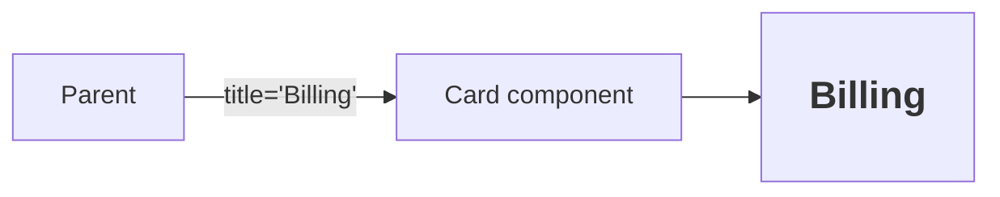

# Props in React

## Detailed explanation
Props are the inputs a parent passes to a child component. They let the same component render different output without changing the component implementation. In React's mental model, props are read-only for the receiving component; the owner of the data decides when props change.

Props are central to reuse and one-way data flow. A parent can pass values, objects, callbacks, children, or even React elements. Good prop design keeps components easy to understand and prevents invalid combinations.

## 1. One-line mental model
Props are read-only inputs passed from a parent component to a child component.

## 2. Problem it solves
Components need a way to receive data and configuration while remaining reusable. Props let the same component render different output based on parent-provided values.

## 3. Core idea
- Props flow from parent to child.
- Props should be treated as immutable by the receiving component.
- Props can be values, objects, arrays, functions, elements, or children.
- Changing props can cause a child component to re-render.
- Good prop design makes components easy to use and hard to misuse.

## 4. Visual / analogy
Props are like function arguments for UI components.



## 5. Minimal example

```tsx
function Welcome({ name }: { name: string }) {
  return <h1>Welcome, {name}</h1>;
}

<Welcome name="Asha" />;
```

## 6. Real-world example

```tsx
function InvoiceRow({ invoice, onApprove }: { invoice: Invoice; onApprove: (id: string) => void }) {
  return (
    <tr>
      <td>{invoice.number}</td>
      <td>{invoice.total}</td>
      <td><button onClick={() => onApprove(invoice.id)}>Approve</button></td>
    </tr>
  );
}
```

The row receives data and a callback without owning the whole invoice workflow.

## 7. Common interview questions
- What are props?
- Are props mutable?
- How do props differ from state?
- Can props contain functions?
- What are default props?
- What causes prop drilling?
- How do prop changes affect rendering?
- How do you type props in TypeScript?

## 8. Active recall test
1. Who owns props?
2. Can a child modify its props?
3. Why are callback props useful?
4. What happens when a parent passes a new object prop every render?
5. How are props like function arguments?

## 9. Mistakes / traps
- Mutating an object received through props.
- Passing too many unrelated props instead of composing components.
- Creating new inline objects/functions unnecessarily for memoized children.
- Using props for data a component should own locally.
- Confusing props with HTML attributes.

## 10. Compare with related concepts
- **Props vs state:** props are received from parent; state is owned by the component.
- **Props vs context:** props are explicit parent-child inputs; context skips intermediate levels.
- **Props vs parameters:** props are object-like parameters for components.
- **Props vs attributes:** DOM attributes configure HTML nodes; props configure React components.

## 11. Summary from memory
Explain how props allow one `Button` component to render primary, secondary, and danger variants.

## 12. Spaced revision prompts
- After 1 day: Define props.
- After 3 days: Compare props and state.
- After 7 days: Explain callback props.
- After 14 days: Describe a prop design mistake and how to fix it.
