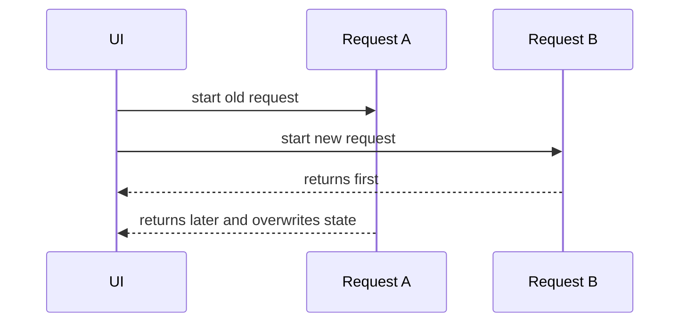

# Race Conditions Inside Effects

## Detailed explanation
A race condition inside an effect happens when multiple async operations are started, but they finish in a different order than expected. A common example is search or detail pages where request A starts, request B starts later, but request A finishes last and overwrites B's newer result.

Race conditions are fixed by cancellation, ignoring outdated responses, or delegating server state to libraries that manage request identity and cancellation.

## 1. One-line mental model
Effect race conditions happen when older async work finishes after newer async work and updates state incorrectly.

## 2. Problem it solves
Fast-changing inputs can trigger overlapping requests with out-of-order results.

## 3. Core idea
- Effects can start async work.
- Dependencies may change before work finishes.
- Old responses can overwrite new state.
- Cleanup can mark old work inactive or abort it.
- Query libraries handle this better for server state.

## 4. Visual / analogy
It is like ordering two taxis: the first one arrives late after the second, but you accidentally get into the wrong one.



## 5. Minimal example

```tsx
React.useEffect(() => {
  let active = true;
  fetchUser(id).then((user) => {
    if (active) setUser(user);
  });
  return () => {
    active = false;
  };
}, [id]);
```

## 6. Real-world example

```tsx
React.useEffect(() => {
  const controller = new AbortController();
  searchApi.search(query, { signal: controller.signal }).then(setResults);
  return () => controller.abort();
}, [query]);
```

## 7. Common interview questions
- What is a race condition in effects?
- How can API responses arrive out of order?
- How do you prevent stale response updates?
- How does cleanup help?
- How does AbortController help?
- Why are query libraries useful?
- Race condition vs stale closure?

## 8. Active recall test
1. What makes two requests race?
2. Which response should win?
3. How does cleanup ignore old work?
4. What does abort do?
5. Why is search a common example?

## 9. Mistakes / traps
- Assuming requests finish in start order.
- Updating state after component unmount.
- Ignoring dependency changes.
- Handling abort errors as real user errors.
- Reimplementing server-state caching everywhere.

## 10. Compare with related concepts
- **Race condition vs stale closure:** race is async order; stale closure is old captured value.
- **Abort vs ignore flag:** abort cancels request; flag ignores result.
- **Manual effect vs query library:** manual handles one case; library handles cache/request lifecycle.

## 11. Summary from memory
Explain how a search box can show old results and how AbortController fixes it.

## 12. Spaced revision prompts
- After 1 day: Define effect race condition.
- After 3 days: Write active flag cleanup.
- After 7 days: Use AbortController.
- After 14 days: Compare manual fetching and TanStack Query.

