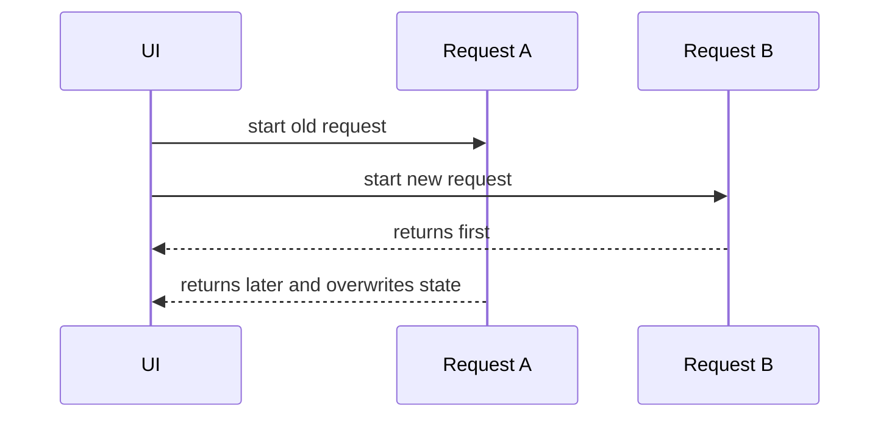

# Race Conditions Inside Effects

## Detailed explanation
A race condition inside an effect happens when multiple async operations are started, but they finish in a different order than expected. A common example is search or detail pages where request A starts, request B starts later, but request A finishes last and overwrites B's newer result.

Race conditions are fixed by cancellation, ignoring outdated responses, or delegating server state to libraries that manage request identity and cancellation.

## 1. One-line mental model
Effect race conditions happen when older async work finishes after newer async work and updates state incorrectly.

## 2. Problem it solves
Fast-changing inputs can trigger overlapping requests with out-of-order results.

## 3. Core idea
- Effects can start async work.
- Dependencies may change before work finishes.
- Old responses can overwrite new state.
- Cleanup can mark old work inactive or abort it.
- Query libraries handle this better for server state.

## 4. Visual / analogy
It is like ordering two taxis: the first one arrives late after the second, but you accidentally get into the wrong one.



## 5. Minimal example

```tsx
React.useEffect(() => {
  let active = true;
  fetchUser(id).then((user) => {
    if (active) setUser(user);
  });
  return () => {
    active = false;
  };
}, [id]);
```

## 6. Real-world example

```tsx
React.useEffect(() => {
  const controller = new AbortController();
  searchApi.search(query, { signal: controller.signal }).then(setResults);
  return () => controller.abort();
}, [query]);
```

## 7. Common interview questions
#### What is a race condition in effects?
- **The Engine Mechanism (Why it behaves this way):** A race condition occurs when an effect starts async work (like a fetch), the dependency changes before that work completes, and a new async operation starts. Both operations run concurrently, but their completion order is non-deterministic — the older, slower request may finish after the newer one and overwrite its result with stale data. The Fiber scheduler doesn't coordinate async operations across effect re-runs; each effect instance is independent.
- **The Unforgettable Mental Model:** The **Two-Courier Problem**. You send Courier A with instructions, then change your mind and send Courier B with updated instructions. If Courier A takes a longer route but arrives last, the recipient follows outdated instructions.
- **The Trap:** Assuming network requests complete in the order they were sent. Network latency, server processing time, and response size all affect completion order independently of start order.
- **Senior Interview Playbook (Verbal Script):** "When asked this in an interview, say: A race condition in effects happens when async operations started by an effect complete out of order. For example, a search input triggers request A for 'app', then request B for 'apple'. If A takes longer and finishes after B, the UI shows results for 'app' instead of 'apple'. The fix is to cancel outdated requests or ignore their responses."

#### How can API responses arrive out of order?
- **The Engine Mechanism (Why it behaves this way):** Network requests are handled by the browser's networking layer, which operates independently of JavaScript's event loop. Response time depends on server processing, network congestion, response payload size, CDN caching, and TCP connection state. A request started later can complete first if the server responds faster, the response is smaller, or a cached version is available. React has no control over this ordering — it only processes `.then()` callbacks as they arrive.
- **The Unforgettable Mental Model:** The **Multi-Lane Highway**. Cars (requests) enter the highway at different times, but traffic, speed limits, and lane changes mean they don't arrive in the same order they entered. The fastest car wins, not the first one.
- **The Trap:** Testing only on fast local networks where responses arrive in order. Race conditions surface on slower networks, with larger payloads, or when server response times vary.
- **Senior Interview Playbook (Verbal Script):** "When asked this in an interview, say: API responses arrive out of order because network timing is non-deterministic. Server processing time, network latency, response size, and caching all affect when a response completes. A later request can finish first if the server responds faster or the payload is smaller. React processes responses as they arrive via promise callbacks, with no inherent ordering guarantee."

#### How do you prevent stale response updates?
- **The Engine Mechanism (Why it behaves this way):** Two main patterns exist. The **active flag** pattern uses a `let active = true` variable in the effect scope, set to `false` in cleanup. The `.then()` callback checks `if (active)` before calling `setState`. The **AbortController** pattern passes `controller.signal` to `fetch` and calls `controller.abort()` in cleanup, which rejects the promise with an `AbortError`. Both prevent stale data from reaching state, but AbortController also cancels the network request itself, saving bandwidth.
- **The Unforgettable Mental Model:** The **Bouncer at the Club**. The active flag is like a bouncer who checks a guest list — if your name was removed (cleanup set `active = false`), you don't get in. AbortController is like calling the guest and telling them not to come at all.
- **The Trap:** Forgetting to handle the `AbortError` in the catch block. An aborted fetch rejects with a specific error that should be silently ignored, not displayed to the user as a failure.
- **Senior Interview Playbook (Verbal Script):** "When asked this in an interview, say: I prevent stale responses using either an active flag or AbortController. The active flag sets `let active = true` in the effect and checks it before state updates — simple but the request still completes. AbortController is more efficient because it cancels the network request itself, saving bandwidth. I always filter out `AbortError` in the catch block since it's expected cancellation, not a real error."

#### How does cleanup help?
- **The Engine Mechanism (Why it behaves this way):** React runs the cleanup function before re-running the effect (when dependencies change) and on unmount. This timing is critical: it gives you a hook to invalidate the previous async operation before starting the new one. The cleanup can set an active flag to `false`, call `controller.abort()`, unsubscribe from a WebSocket, or clear a timer. This ensures the previous operation can't affect the current render's state.
- **The Unforgettable Mental Model:** The **Reset Button**. Before starting a new game round (new effect), cleanup hits the reset button on the previous round — clearing the scoreboard, removing old players, and resetting the timer.
- **The Trap:** Assuming cleanup runs synchronously with the state update. Cleanup runs before the new effect, but the old async operation may still be in-flight. Cleanup invalidates it; it doesn't instantly stop it (unless using AbortController).
- **Senior Interview Playbook (Verbal Script):** "When asked this in an interview, say: Cleanup runs before the effect re-runs and on unmount, giving me a chance to invalidate previous async work. I use it to set active flags to false, abort in-flight requests, or cancel subscriptions. This prevents outdated operations from updating state after the component has moved on to new data. The key insight is that cleanup is the bridge between the old effect instance and the new one."

#### How does AbortController help?
- **The Engine Mechanism (Why it behaves this way):** `AbortController` is a browser API that creates a signal object. When passed to `fetch` via `{ signal }`, the fetch monitors the signal's `aborted` property. Calling `controller.abort()` sets `aborted` to `true` and immediately rejects the fetch promise with a `DOMException` named `AbortError`. This cancels the request at the network layer — the browser stops waiting for the response and frees the connection. In React effects, creating a new controller per effect instance and aborting in cleanup ensures only the latest request can succeed.
- **The Unforgettable Mental Model:** The **Kill Switch**. AbortController is a kill switch wired to a specific machine (request). Flip the switch (call `abort()`), and that machine stops immediately — no more processing, no more output.
- **The Trap:** Reusing a single `AbortController` across multiple requests. Once aborted, a controller cannot be reset. Each effect run needs its own controller instance.
- **Senior Interview Playbook (Verbal Script):** "When asked this in an interview, say: AbortController cancels in-flight fetch requests at the network level. I create a new controller inside the effect, pass its signal to fetch, and call `controller.abort()` in the cleanup. This stops the old request when dependencies change, preventing stale responses. I always check for `AbortError` in the catch block and ignore it, since it's expected behavior, not a failure."

#### Why are query libraries useful?
- **The Engine Mechanism (Why it behaves this way):** Libraries like TanStack Query manage request identity through query keys. When a query key changes, the library automatically cancels the previous request, starts a new one, and ensures only the latest response updates the cache. They also handle deduplication (multiple components requesting the same data), background refetching, stale-while-revalidate caching, and error retries — all patterns that are error-prone to implement manually in effects.
- **The Unforgettable Mental Model:** The **Air Traffic Controller**. Instead of each plane (component) navigating independently and risking collisions (race conditions), a central controller (query library) manages all flights, ensures proper spacing, and handles cancellations and redirects.
- **The Trap:** Thinking query libraries are only for caching. Their race condition handling, request deduplication, and lifecycle management are equally valuable even for non-cached data.
- **Senior Interview Playbook (Verbal Script):** "When asked this in an interview, say: Query libraries like TanStack Query solve race conditions automatically through query key identity — when the key changes, the old request is cancelled and only the latest response updates the cache. Beyond that, they handle request deduplication, background refetching, caching, retries, and error states. For any shared server data, I prefer a query library over manual effects because it eliminates an entire class of bugs."

#### Race condition vs stale closure?
- **The Engine Mechanism (Why it behaves this way):** A race condition is about async timing — multiple operations complete in unexpected order, and stale data overwrites fresh data. A stale closure is about lexical scoping — a function captures variables from its defining render and continues to reference those old values even after the component re-renders with new values. Race conditions are fixed with cancellation or ignore flags. Stale closures are fixed with functional updates, refs, or correct dependency arrays.
- **The Unforgettable Mental Model:** The **Two Different Thieves**. Race condition: Thief A steals the treasure, but Thief B already replaced it with a fake — you get the fake. Stale closure: Thief A has an old map that points to where the treasure USED to be, not where it is now.
- **The Trap:** Confusing the two and applying the wrong fix. Adding an active flag won't fix a stale closure, and using a functional update won't fix a race condition.
- **Senior Interview Playbook (Verbal Script):** "When asked this in an interview, say: Race conditions and stale closures are different bugs with different fixes. A race condition is about async operations completing out of order — the old response overwrites the new one. Fixed with AbortController or active flags. A stale closure is about a function capturing old variable values from a previous render — it reads outdated data. Fixed with functional state updates, refs for mutable values, or correct dependency arrays. They can coexist in the same code, so I diagnose which one is causing the symptom."

## 8. Active recall test
1. **What makes two requests race?**
   - **Explanation:** When an effect starts an async request, dependencies change before it completes, and a new request starts. Both run concurrently, and the older one may finish after the newer one, overwriting fresh data with stale results. Network timing is non-deterministic, so order of completion doesn't match order of initiation.
2. **Which response should win?**
   - **Explanation:** The most recent request's response should win — the one corresponding to the current dependency values. Older requests are outdated and their results should be discarded or cancelled to prevent stale data from appearing in the UI.
3. **How does cleanup ignore old work?**
   - **Explanation:** Cleanup runs before the effect re-runs. It can set a boolean flag (`active = false`) that the async callback checks before updating state, or it can call `controller.abort()` to cancel the request entirely. Both prevent the old response from affecting current state.
4. **What does abort do?**
   - **Explanation:** `controller.abort()` cancels the in-flight fetch at the network layer, rejects the promise with an `AbortError`, and frees the browser connection. This prevents the response from ever arriving, saving bandwidth and eliminating the race condition entirely.
5. **Why is search a common example?**
   - **Explanation:** Search inputs change rapidly as users type. Each keystroke can trigger a new API request. If the network is slow, early requests (for shorter queries) may finish after later requests (for longer queries), showing irrelevant results. This makes search the textbook example of effect race conditions.

## 9. Mistakes / traps
- Assuming requests finish in start order.
- Updating state after component unmount.
- Ignoring dependency changes.
- Handling abort errors as real user errors.
- Reimplementing server-state caching everywhere.

## 10. Compare with related concepts
- **Race condition vs stale closure:** race is async order; stale closure is old captured value.
- **Abort vs ignore flag:** abort cancels request; flag ignores result.
- **Manual effect vs query library:** manual handles one case; library handles cache/request lifecycle.

## 11. Summary from memory
Explain how a search box can show old results and how AbortController fixes it.

## 12. Spaced revision prompts
- After 1 day: Define effect race condition.
- After 3 days: Write active flag cleanup.
- After 7 days: Use AbortController.
- After 14 days: Compare manual fetching and TanStack Query.

