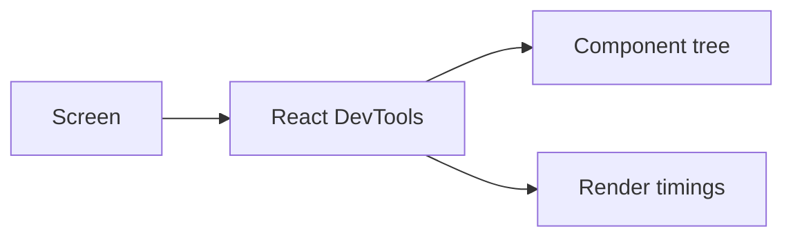

# React DevTools

## Detailed explanation
React DevTools is the official browser extension and profiling tool for inspecting React component trees. It helps developers inspect props, state, hooks, context providers, component hierarchy, and performance behavior.

For interviews and production debugging, React DevTools matters because it shows whether a component re-rendered, why it rendered, and where time is spent. The Profiler tab is especially useful for performance work.

## 1. One-line mental model
React DevTools lets you inspect and profile the React component tree.

## 2. Problem it solves
Complex React apps are hard to debug from DOM inspection alone because the DOM does not show component state, props, hooks, or render cost.

## 3. Core idea
- Inspect component hierarchy.
- View props, state, hooks, and context.
- Use Profiler to record renders.
- Identify expensive components.
- Debug provider nesting and memoization issues.

## 4. Visual / analogy
DevTools is like an X-ray for React: it shows the component structure behind the visible UI.



## 5. Minimal example

```txt
Open browser DevTools -> Components tab -> select component -> inspect props/state.
```

## 6. Real-world example

```txt
Profiler workflow:
1. Start profiling.
2. Perform the slow interaction.
3. Stop profiling.
4. Check which components rendered and how long they took.
5. Optimize the confirmed bottleneck.
```

## 7. Common interview questions
#### What is React DevTools?
- **The Engine Mechanism (Why it behaves this way):** React DevTools is an official browser extension (Chrome, Firefox, Edge) that provides deep inspection into React's internal component tree. It connects to the React runtime via the `__REACT_DEVTOOLS_GLOBAL_HOOK__` which React populates during initialization. The extension reads Fiber node data to display the component hierarchy, props, state, hooks, and context values. It operates as a bridge between the React runtime and the browser's DevTools panel, allowing real-time inspection and editing of React-specific data that isn't visible in the standard Elements panel.
- **The Unforgettable Mental Model:** The **X-Ray Machine**. Browser DevTools shows you the skin (DOM), but React DevTools shows you the skeleton (component tree). You can see how components are structured, what data they hold, and how they're connected — things invisible in the normal DOM inspector.
- **The Trap:** Confusing React DevTools with browser DevTools. They are separate tools — browser DevTools inspects the DOM, network, and JavaScript runtime; React DevTools inspects React's component tree and internal state.
- **Senior Interview Playbook (Verbal Script):** "When asked this in an interview, say: React DevTools is an official browser extension that lets you inspect the React component tree, view props, state, hooks, and context values, and profile render performance. It connects to React's internal Fiber architecture through a global hook, giving you visibility into how your app is structured and how components are rendering. It's essential for debugging component hierarchies, understanding re-render patterns, and identifying performance bottlenecks."

#### How do you inspect component props and state?
- **The Engine Mechanism (Why it behaves this way):** In the Components tab of React DevTools, you can click on any component in the tree to view its current props and state in the right panel. Props are displayed as key-value pairs showing what the parent passed down. State shows the current values from `useState`, `useReducer`, or class component state. You can also edit these values live by double-clicking on them, which triggers a re-render with the new values. The hook values are listed separately, showing each hook's current value in the order they were called. This works because React DevTools reads directly from the Fiber node's `memoizedProps`, `memoizedState`, and hook list.
- **The Unforgettable Mental Model:** The **Dashboard Gauges**. Each component is like a machine with dials and gauges. The Components tab lets you look at the dashboard and see exactly what each gauge (prop, state, hook) is set to right now. You can even turn the dials to see what happens.
- **The Trap:** Expecting to see props that were destructured and renamed. DevTools shows the original prop names as passed from the parent, not the local variable names in the component.
- **Senior Interview Playbook (Verbal Script):** "When asked this in an interview, say: In the Components tab, click on any component to see its props, state, and hooks in the right panel. Props show what the parent passed down, state shows current values, and hooks are listed in order. You can double-click values to edit them live and trigger a re-render. This is useful for debugging unexpected values, testing edge cases without modifying code, and understanding data flow through the component tree."

#### What is React Profiler?
- **The Engine Mechanism (Why it behaves this way):** The Profiler tab in React DevTools records render performance by wrapping the React tree with a `React.Profiler` component internally. When you start profiling, React measures the duration of each component's render phase — from when the component function starts executing to when it returns its element tree. It tracks both "actual duration" (time spent rendering this component) and "self duration" (time excluding children). After recording, it presents data as a flamegraph (stacked bars showing render depth and duration) or a ranked view (components sorted by render time). Each commit is recorded as a separate bar, allowing you to see which interactions triggered expensive renders.
- **The Unforgettable Mental Model:** The **Stopwatch Race**. Imagine putting a stopwatch on every runner (component) in a relay race. When the race starts, each stopwatch measures how long that runner takes. After the race, you can see who was slowest, who ran multiple times, and where the bottlenecks were.
- **The Trap:** Profiling in development mode without considering that development builds are significantly slower than production. Always profile in production or at least be aware that dev timings are inflated.
- **Senior Interview Playbook (Verbal Script):** "When asked this in an interview, say: React Profiler is a tool in React DevTools that measures render performance. It records how long each component takes to render, showing both actual duration and self duration (excluding children). It presents data as a flamegraph or ranked view, with each commit shown as a separate bar. This lets you identify which components are expensive, which interactions trigger re-renders, and where optimization efforts should be focused. It's the primary tool for data-driven React performance optimization."

#### How do you find unnecessary re-renders?
- **The Engine Mechanism (Why it behaves this way):** In the Profiler tab, unnecessary re-renders appear as components that rendered but had no visual change. React DevTools highlights these with a yellow/orange border in the flamegraph. You can also enable "Highlight updates when components render" in the DevTools settings, which flashes a colored overlay on components as they render — green for infrequent, yellow for moderate, red for frequent. To diagnose the cause, look at the component's props in the Components tab to see which prop changed between renders. Common causes include: new object/array references from parent, inline function creation, context value changes, or missing `React.memo`/`useMemo`/`useCallback`.
- **The Unforgettable Mental Model:** The **Motion Sensor Lights**. Imagine hallway lights that turn on whenever someone walks by. If a light turns on but no one is there, something is triggering it unnecessarily. React DevTools is the motion sensor log — it shows you which lights (components) turned on and helps you figure out what triggered them.
- **The Trap:** Optimizing every re-render you see. Not all re-renders are bad — React is fast enough that many unnecessary renders don't impact user experience. Focus on components that are both rendering unnecessarily AND are expensive.
- **Senior Interview Playbook (Verbal Script):** "When asked this in an interview, say: I use the Profiler tab to record renders and look for components that rendered without meaningful changes. I enable 'Highlight updates when components render' to see real-time rendering activity. Then I investigate the cause: checking if new object references are being passed as props, if inline functions are recreating on each render, or if context values are changing unnecessarily. I focus optimization on components that are both re-rendering frequently and are expensive, rather than optimizing every re-render."

#### What are flamegraphs?
- **The Engine Mechanism (Why it behaves this way):** A flamegraph in React Profiler is a visual representation of the component tree where each bar represents a component. The width of the bar represents render duration (wider = slower), and the vertical stacking represents the component hierarchy (parents above children). The color indicates render frequency — warm colors (red/orange) for frequently rendered components, cool colors (blue/green) for infrequent ones. Clicking on a bar shows detailed timing information for that component. The flamegraph makes it easy to spot bottlenecks: wide bars at the top of the stack are the most impactful optimization targets because they represent slow components that also have expensive children.
- **The Unforgettable Mental Model:** The **Layer Cake**. Each layer is a component, wider layers took longer to bake, and layers stacked on top of each other show parent-child relationships. The widest layer on top is where you'd want to start if you wanted to make the whole cake faster.
- **The Trap:** Focusing on narrow bars at the bottom of the flamegraph. These are fast leaf components — optimizing them has minimal impact. Focus on wide bars, especially those high in the tree.
- **Senior Interview Playbook (Verbal Script):** "When asked this in an interview, say: A flamegraph is a visual representation of render performance in React Profiler. Each bar is a component — width shows duration, vertical position shows hierarchy, and color shows frequency. Wide bars indicate slow components, and bars high in the tree with wide widths are the best optimization targets because they affect their entire subtree. I use flamegraphs to quickly identify where to focus optimization efforts rather than guessing which components might be slow."

#### How do you debug context re-renders?
- **The Engine Mechanism (Why it behaves this way):** Context re-renders occur when a context provider's value changes — all consumers of that context re-render, regardless of whether they use the changed part of the value. In React DevTools, you can debug this by: (1) using the Profiler to see which components re-rendered when context changed, (2) checking the Components tab to see the context value for each consumer, and (3) looking for components that re-rendered but only use a small part of a large context object. The fix is usually to split the context into smaller, focused contexts or use `useMemo` to stabilize the provider value. React DevTools shows context values in the component's right panel under a "Context" section.
- **The Unforgettable Mental Model:** The **Town Crier**. When the town crier (context provider) announces something, everyone in town (all consumers) hears it and reacts — even if the announcement only affects a few people. Splitting the context is like having different criers for different topics.
- **The Trap:** Putting all app state in a single context. When any part of the context value changes, every consumer re-renders, even if they only use a small piece of the data.
- **Senior Interview Playbook (Verbal Script):** "When asked this in an interview, say: I debug context re-renders by profiling the app and looking for components that re-render when context changes. In the Components tab, I check what context values each consumer receives. If a component re-renders but only uses a small part of a large context object, that's a sign the context should be split. The fix is to create focused contexts for related data or use `useMemo` to stabilize the provider value. I also check if the provider is creating a new object on every render, which would trigger unnecessary consumer re-renders."

#### How do DevTools help with memoization?
- **The Engine Mechanism (Why it behaves this way):** React DevTools helps verify whether `React.memo`, `useMemo`, and `useCallback` are working as intended. In the Profiler, a memoized component that correctly skips re-rendering will not appear in the flamegraph for that commit. If a `React.memo`-wrapped component still appears, it means its props changed (reference inequality). You can compare props between renders in the Components tab to see which prop reference changed. For `useMemo` and `useCallback`, the Profiler shows whether the computation was actually skipped by checking if the component's self duration decreased after memoization was added.
- **The Unforgettable Mental Model:** The **Quality Inspector**. You add memoization like adding insulation to a house. DevTools is the thermal camera that shows you whether the insulation is actually working — if heat (re-renders) is still leaking through, the insulation isn't doing its job.
- **The Trap:** Adding memoization everywhere without measuring. DevTools often reveals that memoization had no effect because the component wasn't the bottleneck, or props were still changing references.
- **Senior Interview Playbook (Verbal Script):** "When asked this in an interview, say: I use DevTools to verify memoization actually works. In the Profiler, a properly memoized component won't appear in the flamegraph when its parent re-renders. If it does appear, I check the Components tab to see which prop changed — usually it's a new object or function reference. For `useMemo` and `useCallback`, I compare render times before and after to confirm the optimization had an effect. The key principle: measure first, optimize second, and verify with DevTools that the optimization actually worked."

## 8. Active recall test
1. **Which tab shows component props?**
   - **Explanation:** The Components tab. Click on any component in the tree to see its props, state, hooks, and context values in the right panel. You can also edit values live by double-clicking.
2. **Which tool records render performance?**
   - **Explanation:** The Profiler tab. It records render durations for each component, showing actual and self duration. Data is displayed as flamegraphs or ranked views, with each commit shown as a separate bar.
3. **Why is DOM inspection not enough for React debugging?**
   - **Explanation:** DOM inspection shows the rendered HTML but not the React component structure, props, state, hooks, or context values. React DevTools reveals the component hierarchy and internal data that drives the DOM, which is essential for understanding why the UI looks the way it does.
4. **How do you verify a memo optimization works?**
   - **Explanation:** Use the Profiler to record renders. A properly memoized component (`React.memo`) won't appear in the flamegraph when its parent re-renders. If it does appear, check the Components tab to see which prop reference changed, indicating why memoization didn't prevent the re-render.
5. **What does a flamegraph show?**
   - **Explanation:** A flamegraph shows the component tree visually: bar width = render duration, vertical position = hierarchy (parents above children), color = render frequency. Wide bars indicate slow components; wide bars high in the tree are the best optimization targets.

## 9. Mistakes / traps
- Guessing performance problems without profiling.
- Confusing browser Performance panel with React Profiler.
- Optimizing components that are not actually expensive.
- Ignoring context provider changes.
- Reading DOM nodes instead of component state.

## 10. Compare with related concepts
- **React DevTools vs browser DevTools:** React DevTools understands components; browser DevTools understands DOM/network/runtime.
- **Profiler vs console logs:** profiler measures render cost and frequency more reliably.
- **Flamegraph vs ranked view:** flamegraph shows tree shape; ranked view highlights expensive components.

## 11. Summary from memory
Explain how you would use React DevTools to debug an unnecessary re-render.

## 12. Spaced revision prompts
- After 1 day: Explain Components tab.
- After 3 days: Explain Profiler workflow.
- After 7 days: Use DevTools to verify memoization.
- After 14 days: Compare React Profiler and browser Performance panel.

