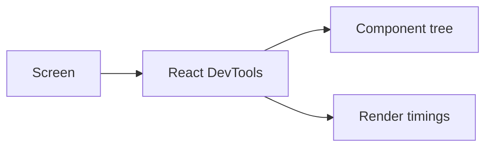

# React DevTools

## Detailed explanation
React DevTools is the official browser extension and profiling tool for inspecting React component trees. It helps developers inspect props, state, hooks, context providers, component hierarchy, and performance behavior.

For interviews and production debugging, React DevTools matters because it shows whether a component re-rendered, why it rendered, and where time is spent. The Profiler tab is especially useful for performance work.

## 1. One-line mental model
React DevTools lets you inspect and profile the React component tree.

## 2. Problem it solves
Complex React apps are hard to debug from DOM inspection alone because the DOM does not show component state, props, hooks, or render cost.

## 3. Core idea
- Inspect component hierarchy.
- View props, state, hooks, and context.
- Use Profiler to record renders.
- Identify expensive components.
- Debug provider nesting and memoization issues.

## 4. Visual / analogy
DevTools is like an X-ray for React: it shows the component structure behind the visible UI.



## 5. Minimal example

```txt
Open browser DevTools -> Components tab -> select component -> inspect props/state.
```

## 6. Real-world example

```txt
Profiler workflow:
1. Start profiling.
2. Perform the slow interaction.
3. Stop profiling.
4. Check which components rendered and how long they took.
5. Optimize the confirmed bottleneck.
```

## 7. Common interview questions
- What is React DevTools?
- How do you inspect component props and state?
- What is React Profiler?
- How do you find unnecessary re-renders?
- What are flamegraphs?
- How do you debug context re-renders?
- How do DevTools help with memoization?

## 8. Active recall test
1. Which tab shows component props?
2. Which tool records render performance?
3. Why is DOM inspection not enough?
4. How do you verify a memo optimization?
5. What does a flamegraph show?

## 9. Mistakes / traps
- Guessing performance problems without profiling.
- Confusing browser Performance panel with React Profiler.
- Optimizing components that are not actually expensive.
- Ignoring context provider changes.
- Reading DOM nodes instead of component state.

## 10. Compare with related concepts
- **React DevTools vs browser DevTools:** React DevTools understands components; browser DevTools understands DOM/network/runtime.
- **Profiler vs console logs:** profiler measures render cost and frequency more reliably.
- **Flamegraph vs ranked view:** flamegraph shows tree shape; ranked view highlights expensive components.

## 11. Summary from memory
Explain how you would use React DevTools to debug an unnecessary re-render.

## 12. Spaced revision prompts
- After 1 day: Explain Components tab.
- After 3 days: Explain Profiler workflow.
- After 7 days: Use DevTools to verify memoization.
- After 14 days: Compare React Profiler and browser Performance panel.

