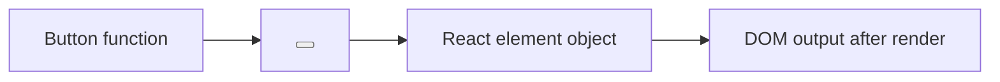

# React Elements vs Components

## Detailed explanation
A React component is the reusable definition: usually a function that accepts props and returns UI. A React element is the object created when JSX is evaluated, such as `<Button />` or `<div />`. React elements describe what should appear; components are called to produce those descriptions.

This distinction matters for reconciliation. React compares trees of elements, not the source code of components. When a component renders, React receives element objects that describe types, props, keys, and children.

## 1. One-line mental model
A component is a reusable UI factory, while a React element is the plain object describing one UI result from that factory.

## 2. Problem it solves
Developers often confuse the function that defines UI with the object React receives after JSX is evaluated. Understanding the difference clarifies rendering, props, composition, and reconciliation.

## 3. Core idea
- A component is a function or class.
- An element is a JavaScript object describing what should be rendered.
- JSX like `<Button />` creates an element.
- React calls components to get more elements.
- Reconciliation compares element trees, not component source code.

## 4. Visual / analogy
A component is a cookie cutter. An element is one cookie made from it.



## 5. Minimal example

```tsx
function Button() {
  return <button>Save</button>;
}

const element = <Button />;
```

`Button` is the component. `element` is a React element.

## 6. Real-world example

```tsx
const menuItems = routes.map((route) => (
  <NavItem key={route.path} href={route.path} label={route.label} />
));
```

`NavItem` is the component. Each `<NavItem />` result is a React element in an array.

## 7. Common interview questions
#### What is a React element?
- **The Engine Mechanism (Why it behaves this way):** A React element is a plain JavaScript object that describes what should appear on screen. When JSX like `<div className="app">Hello</div>` is evaluated, it produces an object with properties like `type` (the tag name or component function), `props` (attributes and children), `key`, and `ref`. React elements are immutable — once created, they cannot be changed. During reconciliation, React compares element trees from consecutive renders to determine what DOM updates are needed. Elements are the fundamental unit of React's Virtual DOM.
- **The Unforgettable Mental Model:** The **Photograph**. A React element is like a photograph of a scene — it captures a moment in time and can't be edited. If the scene changes, you take a new photograph (create a new element) rather than altering the old one.
- **The Trap:** Confusing React elements with DOM nodes. A React element is a lightweight description object; a DOM node is an actual browser object that takes up memory and can be manipulated. React elements are cheap to create; DOM nodes are expensive.
- **Senior Interview Playbook (Verbal Script):** "When asked this in an interview, say: A React element is a plain JavaScript object that describes what should appear on screen. It has a type (like 'div' or a component function), props, and optionally a key and ref. Elements are immutable — once created, they don't change. React uses these element objects to build a Virtual DOM tree, and during reconciliation, it compares element trees to determine the minimal DOM updates needed. Elements are lightweight descriptions, not actual DOM nodes."

#### What is a React component?
- **The Engine Mechanism (Why it behaves this way):** A React component is a reusable definition — typically a JavaScript function (or class) that accepts props as input and returns a React element tree. When React encounters a component in the element tree, it calls the function with the provided props, and the function's return value becomes part of the element tree. Each component invocation creates a new execution context with its own hooks, state, and effects. React tracks each component instance internally through Fiber nodes, which store the component's state, effects, and rendering metadata.
- **The Unforgettable Mental Model:** The **Recipe**. A component is like a recipe — it's the instructions for making a dish. Each time you follow the recipe (call the component), you get a new dish (element tree), but the recipe itself never changes.
- **The Trap:** Thinking a component is the same as its rendered output. The component is the factory; the elements it returns are the products. The component function can be called many times with different props, producing different elements each time.
- **Senior Interview Playbook (Verbal Script):** "When asked this in an interview, say: A React component is a reusable function that accepts props and returns a React element tree describing what should render. Components are the building blocks of React applications — they encapsulate rendering logic, state, and behavior. When React renders, it calls each component function, collects the returned elements, and recursively processes any child components. The component is the definition; the elements it produces are the descriptions of the UI."

#### What is the difference between element and component?
- **The Engine Mechanism (Why it behaves this way):** The difference is fundamental: a component is a *function* (or class) that defines how to produce UI, while an element is an *object* that describes a specific piece of UI. When React processes `<Button label="Save" />`, `Button` is the component (the function), and the result of evaluating that JSX is an element (the object `{ type: Button, props: { label: "Save" } }`). React calls components to get elements, and it compares elements during reconciliation. Components are reusable definitions; elements are one-time descriptions.
- **The Unforgettable Mental Model:** The **Cookie Cutter vs. Cookie**. The component is the cookie cutter (the reusable tool), and the element is one cookie produced by it (the specific result). You use the same cutter to make many cookies, just as you use the same component to render many elements.
- **The Trap:** Saying "`<Button />` is a component." Technically, `<Button />` is JSX that creates a React element *from* the Button component. The component is the `Button` function; the element is the object produced by evaluating `<Button />`.
- **Senior Interview Playbook (Verbal Script):** "When asked this in an interview, say: A component is a function that defines how to produce UI, while an element is an object that describes a specific piece of UI. The component is the blueprint; the element is the description of one instance built from that blueprint. When I write `<Button label='Save' />`, Button is the component function, and the JSX evaluates to a React element object. React calls components to produce elements, and it compares elements during reconciliation to determine DOM updates."

#### Is JSX an element or component?
- **The Engine Mechanism (Why it behaves this way):** JSX is syntax that, when evaluated, *produces* a React element. `<div>Hello</div>` is not itself an element or a component — it's JavaScript syntax that the compiler transforms into a function call (`jsx('div', { children: 'Hello' })`), and that function call returns a React element object. When JSX references a capitalized identifier like `<Button />`, it creates an element whose `type` property points to the Button component function. So JSX is the *mechanism* for creating elements, not the elements themselves.
- **The Unforgettable Mental Model:** The **Code vs. the Output**. JSX is like source code — it's the text you write. The element is like the compiled binary — it's what the code produces when executed.
- **The Trap:** Treating JSX as a runtime construct. JSX doesn't exist at runtime — it's fully compiled away before the code runs. The browser only sees the compiled JavaScript and the React element objects it produces.
- **Senior Interview Playbook (Verbal Script):** "When asked this in an interview, say: JSX is syntax that produces React elements when evaluated. It's not an element itself, and it's not a component — it's the notation we use to describe elements. When the compiler processes `<Button label='Save' />`, it generates a function call that returns a React element object. So JSX is the authoring format; elements are the runtime objects."

#### Can elements be stored in variables?
- **The Engine Mechanism (Why it behaves this way):** Yes. Since React elements are plain JavaScript objects, they can be stored in variables, passed as arguments, returned from functions, and placed in arrays. This is exactly what JSX does under the hood — `const element = <div>Hello</div>` stores the element object in a variable. You can also store elements in state, pass them as props, or create arrays of elements for list rendering. However, storing elements in state is generally discouraged because elements are tied to a specific render snapshot and don't update when props or state change.
- **The Unforgettable Mental Model:** The **Snapshot**. Storing an element in a variable is like taking a photograph — it captures the UI at one moment. If the underlying data changes, the photograph doesn't update; you need to take a new one.
- **The Trap:** Storing elements in state expecting them to update automatically. Elements are immutable snapshots — if the data they depend on changes, the stored element becomes stale.
- **Senior Interview Playbook (Verbal Script):** "When asked this in an interview, say: Yes, React elements are plain JavaScript objects, so they can be stored in variables, passed as props, or placed in arrays. For example, `const header = <Header />` stores an element in a variable. However, I avoid storing elements in state because elements are immutable snapshots of a specific render. If the data they depend on changes, the stored element won't update. Instead, I store the data in state and create elements during render."

#### Why are elements considered immutable descriptions?
- **The Engine Mechanism (Why it behaves this way):** React elements are immutable because React's reconciliation algorithm relies on comparing entire element trees from different renders. If elements were mutable, React couldn't reliably determine what changed between renders — a mutated element from a previous render could look identical to a newly created one. By treating elements as immutable, React can use reference equality (`===`) as a fast-path optimization: if the same element object appears in both the old and new tree, React knows nothing changed and skips that subtree.
- **The Unforgettable Mental Model:** The **Frozen Frame**. Each element is a frozen frame in a film strip. You can't edit a frame — if you want a different image, you create a new frame. This makes it easy to compare frames side by side and spot differences.
- **The Trap:** Trying to mutate element properties directly (e.g., `element.props.children = 'new'`). This breaks React's reconciliation assumptions and leads to unpredictable behavior.
- **Senior Interview Playbook (Verbal Script):** "When asked this in an interview, say: React elements are immutable because React's reconciliation algorithm compares entire element trees between renders. If elements were mutable, React couldn't reliably detect changes. By keeping elements immutable, React can use reference equality as a fast optimization — if the same element object appears in both trees, it skips that subtree. When data changes, React doesn't mutate existing elements; it creates entirely new element trees and diffs them against the old ones."

#### What does React compare during reconciliation?
- **The Engine Mechanism (Why it behaves this way):** During reconciliation, React compares the new element tree with the previous element tree node by node. It starts at the root and walks down: if the `type` of two elements differs (e.g., `div` vs `span`, or `Button` vs `Card`), React destroys the entire old subtree and builds a new one. If the types match, React updates the props and recurses into children. For lists, React uses `key` props to match elements between renders. This diffing happens during the render phase and produces a list of mutations that are applied in the commit phase. React never compares component source code — it only compares the element objects that components produce.
- **The Unforgettable Mental Model:** The **Spot-the-Difference Game**. React plays spot-the-difference with two pictures (element trees). If a section is completely different, it replaces the whole section. If only a small detail changed, it updates just that detail.
- **The Trap:** Thinking React does a deep comparison of every property. React's diffing is actually quite simple: it compares types first, and if types differ, it replaces the entire subtree without looking deeper. This is a heuristic that works well in practice because UI components rarely change type.
- **Senior Interview Playbook (Verbal Script):** "When asked this in an interview, say: During reconciliation, React compares the new element tree with the previous one starting from the root. It compares element types first — if the type changes, React replaces the entire subtree. If the type is the same, React updates the props and recurses into children. For sibling lists, React uses keys to match elements across renders. This diffing produces a minimal set of DOM mutations that are applied in the commit phase. React never compares component source code — it only compares the element objects that result from calling components."

## 8. Active recall test
1. **In `<Card title="A" />`, what is the component?**
   - **Explanation:** `Card` is the component — it's the function that defines how to render a card. `<Card title="A" />` is JSX that creates a React element from the Card component.
2. **What does JSX produce?**
   - **Explanation:** JSX produces React element objects — plain JavaScript objects with `type`, `props`, `key`, and `ref` properties that describe what should appear on screen. These objects are created by `jsx()` or `React.createElement()` calls at runtime.
3. **Can a component return another component directly?**
   - **Explanation:** No. A component must return a React element (or null, or a primitive), not a component function. Returning `<OtherComponent />` (an element) is correct; returning `OtherComponent` (the function) would cause React to treat the function as the render output, which is incorrect.
4. **Why are elements considered immutable descriptions?**
   - **Explanation:** Elements are immutable because React's reconciliation algorithm compares entire element trees between renders. Immutability allows React to use reference equality as a fast optimization and ensures that previous render snapshots aren't accidentally modified.
5. **What does React do with an element tree?**
   - **Explanation:** React traverses the element tree during the render phase, comparing it with the previous tree to compute the minimal set of DOM mutations. It then applies those mutations in the commit phase, updating the real browser DOM to match the new element tree.

## 9. Mistakes / traps
- Saying `<Button />` is the component. It is an element created from the component.
- Mutating element objects manually.
- Thinking a component instance is the same as a DOM node.
- Confusing component props with DOM attributes.

## 10. Compare with related concepts
- **Element vs component:** object description vs reusable definition.
- **Element vs DOM node:** React description vs browser-created node.
- **Component vs instance:** function/class definition vs mounted work tracked internally by React.
- **JSX vs element:** JSX is syntax that creates elements.

## 11. Summary from memory
Explain the path from `function Button()` to `<Button />` to the final `<button>` in the DOM.

## 12. Spaced revision prompts
- After 1 day: Define element and component.
- After 3 days: Identify elements and components in a JSX snippet.
- After 7 days: Explain why elements are used in reconciliation.
- After 14 days: Compare React element and DOM node.
