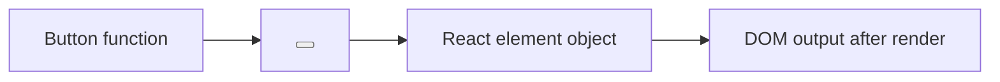

# React Elements vs Components

## Detailed explanation
A React component is the reusable definition: usually a function that accepts props and returns UI. A React element is the object created when JSX is evaluated, such as `<Button />` or `<div />`. React elements describe what should appear; components are called to produce those descriptions.

This distinction matters for reconciliation. React compares trees of elements, not the source code of components. When a component renders, React receives element objects that describe types, props, keys, and children.

## 1. One-line mental model
A component is a reusable UI factory, while a React element is the plain object describing one UI result from that factory.

## 2. Problem it solves
Developers often confuse the function that defines UI with the object React receives after JSX is evaluated. Understanding the difference clarifies rendering, props, composition, and reconciliation.

## 3. Core idea
- A component is a function or class.
- An element is a JavaScript object describing what should be rendered.
- JSX like `<Button />` creates an element.
- React calls components to get more elements.
- Reconciliation compares element trees, not component source code.

## 4. Visual / analogy
A component is a cookie cutter. An element is one cookie made from it.



## 5. Minimal example

```tsx
function Button() {
  return <button>Save</button>;
}

const element = <Button />;
```

`Button` is the component. `element` is a React element.

## 6. Real-world example

```tsx
const menuItems = routes.map((route) => (
  <NavItem key={route.path} href={route.path} label={route.label} />
));
```

`NavItem` is the component. Each `<NavItem />` result is a React element in an array.

## 7. Common interview questions
- What is a React element?
- What is a React component?
- What is the difference between element and component?
- Is JSX an element or component?
- Can elements be stored in variables?
- Why are elements immutable?
- What does React compare during reconciliation?

## 8. Active recall test
1. In `<Card title="A" />`, what is the component?
2. What does JSX produce?
3. Can a component return another component directly?
4. Why are elements considered immutable descriptions?
5. What does React do with an element tree?

## 9. Mistakes / traps
- Saying `<Button />` is the component. It is an element created from the component.
- Mutating element objects manually.
- Thinking a component instance is the same as a DOM node.
- Confusing component props with DOM attributes.

## 10. Compare with related concepts
- **Element vs component:** object description vs reusable definition.
- **Element vs DOM node:** React description vs browser-created node.
- **Component vs instance:** function/class definition vs mounted work tracked internally by React.
- **JSX vs element:** JSX is syntax that creates elements.

## 11. Summary from memory
Explain the path from `function Button()` to `<Button />` to the final `<button>` in the DOM.

## 12. Spaced revision prompts
- After 1 day: Define element and component.
- After 3 days: Identify elements and components in a JSX snippet.
- After 7 days: Explain why elements are used in reconciliation.
- After 14 days: Compare React element and DOM node.
