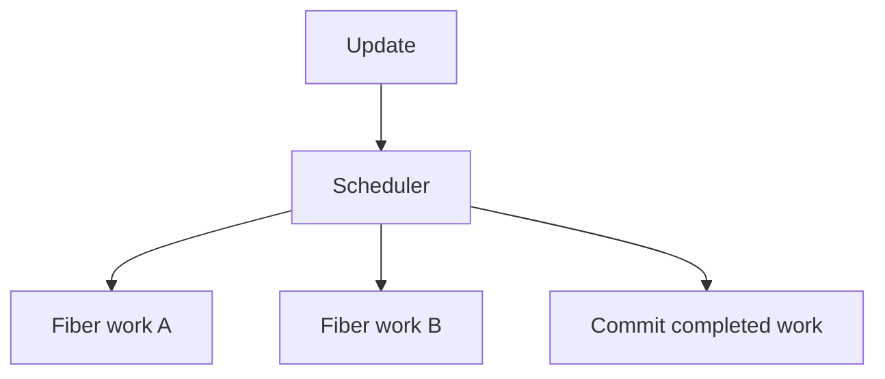

# React Fiber Architecture

## Detailed explanation
React Fiber is React's internal architecture for organizing, scheduling, pausing, resuming, and committing rendering work. Before Fiber, React rendering work was harder to interrupt. Fiber enables modern capabilities like concurrent rendering, prioritization, and better scheduling.

A Fiber is an internal unit of work associated with a component or host element. Most developers do not interact with Fiber directly, but understanding it helps explain why React can split rendering work and prioritize urgent updates.

## 1. One-line mental model
Fiber is React's internal work system that lets rendering be scheduled and prioritized.

## 2. Problem it solves
Large synchronous renders can block the main thread and make apps feel unresponsive during expensive updates.

## 3. Core idea
- Fiber breaks rendering into units of work.
- React can prioritize urgent updates.
- Work can be paused and resumed in concurrent rendering.
- Commit still applies changes consistently.
- Fiber is internal; app code uses public React APIs.

## 4. Visual / analogy
Fiber is like a task manager that splits one huge task into smaller tasks and chooses what must happen first.



## 5. Minimal example

```tsx
startTransition(() => {
  setSearchResults(expensiveFilter(items, query));
});
```

Transitions use modern React scheduling behavior built on Fiber concepts.

## 6. Real-world example

```tsx
const [isPending, startTransition] = React.useTransition();

function handleQueryChange(query: string) {
  setInput(query);
  startTransition(() => setDeferredQuery(query));
}
```

Urgent input stays responsive while non-urgent list updates can be scheduled differently.

## 7. Common interview questions
#### What is React Fiber?
- **The Engine Mechanism (Why it behaves this way):** React Fiber is the internal reimplementation of React's reconciliation engine, introduced in React 16. It replaces the recursive stack-based traversal of the old reconciler with a linked-list-based Fiber tree. Each component or DOM element is represented by a Fiber node — a JavaScript object containing the component's type, state, props, and pointers to its child, sibling, and parent. This structure allows React to split rendering work into discrete units, pause execution at any node, prioritize urgent work, and resume later. Fiber also maintains two trees: the "current" tree (what's on screen) and the "work-in-progress" tree (what's being built).
- **The Unforgettable Mental Model:** The **Linked-List Task Queue**. The old React was like a recursive function call stack — once started, it had to finish or crash. Fiber is like a to-do list where each item knows what comes next. You can stop at any item, handle something more urgent, and come back to the exact spot you left off.
- **The Trap:** Thinking Fiber is a public API you can import. Fiber is entirely internal — developers interact with it through public APIs like `useState`, `useTransition`, and `startTransition`, never directly with Fiber nodes.
- **Senior Interview Playbook (Verbal Script):** "When asked this in an interview, say: React Fiber is the internal architecture that reimagines how React schedules and performs rendering work. Instead of using a recursive call stack that must run to completion, Fiber represents each component as a node in a linked list. This allows React to split rendering into discrete units of work, pause and resume at any point, and prioritize urgent updates over less critical ones. Fiber also maintains a work-in-progress tree alongside the current tree, enabling React to prepare the next UI state without affecting what's visible."

#### Why was Fiber introduced?
- **The Engine Mechanism (Why it behaves this way):** Before Fiber, React's reconciler used a recursive algorithm that built the entire Virtual DOM tree in a single, uninterrupted pass. For large component trees, this could take tens or hundreds of milliseconds, blocking the main thread and causing dropped frames, janky animations, and unresponsive inputs. The browser's event loop cannot process user input or paint while JavaScript is running. Fiber solves this by breaking rendering into small units of work that can be yielded back to the browser between units, allowing the browser to handle user input, paint frames, and run other tasks.
- **The Unforgettable Mental Model:** The **Monologue vs. Conversation**. Pre-Fiber React was like a speaker who talks for 10 minutes without letting anyone respond — the audience gets restless and can't ask questions. Fiber is like a conversation where the speaker pauses after each sentence, lets others speak, and then continues. The result is a responsive, interactive experience.
- **The Trap:** Thinking Fiber was about making React "faster." Fiber's goal was making React more *responsive* — not reducing total render time, but distributing it so the UI stays interactive during expensive updates.
- **Senior Interview Playbook (Verbal Script):** "When asked this in an interview, say: Fiber was introduced to solve main-thread blocking during large renders. The old reconciler used recursion, which meant rendering had to run to completion without yielding to the browser. For large trees, this caused dropped frames and unresponsive UI. Fiber breaks rendering into small, interruptible units of work. React can pause rendering, let the browser handle user input or paint, and then resume. This enables features like concurrent rendering, where React can prioritize urgent updates like typing over less urgent ones like data fetching."

#### How does Fiber relate to concurrent rendering?
- **The Engine Mechanism (Why it behaves this way):** Concurrent rendering is a set of features (like `useTransition`, `useDeferredValue`, and Suspense) that allow React to prepare multiple versions of the UI simultaneously and switch between them based on priority. Fiber is the underlying architecture that makes this possible. Because Fiber nodes are discrete units of work with priority lanes, React can: (1) start rendering a low-priority update, (2) interrupt it when a high-priority update arrives, (3) complete the high-priority update and commit it, and (4) resume the low-priority update from where it left off. The work-in-progress tree holds the in-progress state without affecting the current tree on screen.
- **The Unforgettable Mental Model:** The **Multi-Track Recording Studio**. A producer can work on a background track (low priority) while the vocalist records a lead vocal (high priority). If the vocalist needs another take, the producer pauses the background track, focuses on the vocal, and returns to the background track later. Both tracks exist simultaneously but are worked on at different priorities.
- **The Trap:** Thinking concurrent rendering means multi-threading. React still runs on a single main thread. "Concurrent" means React can interleave work from different updates within that single thread, not that it runs on multiple threads.
- **Senior Interview Playbook (Verbal Script):** "When asked this in an interview, say: Fiber is the architecture that enables concurrent rendering. Because Fiber breaks rendering into interruptible units of work, React can pause low-priority rendering, handle urgent updates like user input, and then resume. Concurrent rendering features like `useTransition` and `useDeferredValue` work by assigning different priority lanes to updates. Fiber's scheduler processes high-priority lanes first, interrupting lower-priority work. The work-in-progress tree allows React to maintain multiple UI versions simultaneously without affecting what's on screen."

#### What is a unit of work?
- **The Engine Mechanism (Why it behaves this way):** A unit of work in Fiber corresponds to processing a single Fiber node. For each node, React performs several steps: it calls the component function (or renders the host element), compares the output with the previous render (diffing), creates or updates child Fiber nodes, and marks the node with effect tags if DOM mutations are needed. Each unit of work is small enough that React can complete it in a few milliseconds and then check if there's higher-priority work waiting. If so, React yields to the browser and resumes later from the next node in the linked list.
- **The Unforgettable Mental Model:** The **Bricklayer**. Instead of trying to build an entire wall in one go, the bricklayer lays one brick at a time. After each brick, they can pause to answer a question, grab more mortar, or switch to a different wall. Each brick is a unit of work — small, self-contained, and independently completable.
- **The Trap:** Thinking a unit of work corresponds to a full component render. It does — but "render" here means processing one Fiber node, which may include calling the component function, diffing children, and creating child nodes. It's one node, not the whole tree.
- **Senior Interview Playbook (Verbal Script):** "When asked this in an interview, say: A unit of work in Fiber is the processing of a single Fiber node. For each node, React calls the component function, diffs the output against the previous render, creates or updates child nodes, and marks any needed DOM mutations. Each unit is small enough to complete in a few milliseconds, allowing React to check for higher-priority work between units. If urgent work arrives, React yields to the browser and resumes from the next node in the Fiber linked list."

#### Does Fiber mean DOM updates are partial?
- **The Engine Mechanism (Why it behaves this way):** No. While Fiber makes the *render phase* interruptible (React can pause and resume building the work-in-progress tree), the *commit phase* is always synchronous and atomic. Once React has a completed work-in-progress tree, it commits all changes to the real DOM in a single, uninterrupted pass. The user never sees a partially updated screen. This is because the commit phase involves actual DOM mutations, and showing an inconsistent intermediate state would be worse than showing a brief delay. Fiber's interruptibility applies only to the calculation phase, not the application phase.
- **The Unforgettable Mental Model:** The **Magician's Reveal**. The magician can take as long as they want behind the curtain (render phase — interruptible, pausable), but when they pull back the curtain (commit phase), the trick is fully complete. You never see the magician halfway through the trick.
- **The Trap:** Confusing interruptible render with partial DOM updates. Fiber allows React to pause rendering work, but once commit starts, all DOM changes happen at once. The user always sees a consistent UI.
- **Senior Interview Playbook (Verbal Script):** "When asked this in an interview, say: No, DOM updates are never partial. Fiber makes the render phase interruptible — React can pause building the new UI tree and resume later. But the commit phase, where DOM changes are actually applied, is always synchronous and atomic. Once React finishes computing the new tree, it applies all DOM mutations in a single, uninterrupted pass. This ensures the user always sees a consistent UI state, never a partially updated screen."

#### How does Fiber help responsiveness?
- **The Engine Mechanism (Why it behaves this way):** Fiber improves responsiveness through its scheduler, which assigns priority lanes to updates. User-initiated updates (clicks, typing, focus) get the highest priority and are processed immediately. Background updates (data fetching, deferred computations) get lower priority and can be deferred. When a high-priority update arrives while low-priority work is in progress, React interrupts the low-priority work, processes the high-priority update, commits it, and then resumes the low-priority work. This ensures that user interactions feel instant even during expensive background renders. The `requestIdleCallback` API (or React's own scheduler implementation) determines when the browser has idle time for low-priority work.
- **The Unforgettable Mental Model:** The **Emergency Room Triage**. In an ER, a patient with a heart attack (high priority — user input) is treated immediately, even if the doctor was in the middle of treating a patient with a sprained ankle (low priority — background render). The sprained ankle patient isn't abandoned — they're resumed after the emergency is handled.
- **The Trap:** Assuming Fiber eliminates all performance issues. Fiber helps with responsiveness during concurrent updates, but it doesn't fix inherently slow components, unnecessary re-renders, or large initial renders.
- **Senior Interview Playbook (Verbal Script):** "When asked this in an interview, say: Fiber improves responsiveness through priority-based scheduling. Updates are assigned to priority lanes — user interactions like clicks and typing get the highest priority, while background work like data fetching gets lower priority. When a high-priority update arrives during low-priority rendering, React interrupts the low-priority work, handles the urgent update, commits it to the DOM, and then resumes the background work. This ensures the UI stays responsive to user input even during expensive rendering operations."

#### Do developers use Fiber APIs directly?
- **The Engine Mechanism (Why it behaves this way):** No. Fiber is entirely internal to React and is not exposed as a public API. The Fiber node structure, the scheduler, and the work-in-progress tree are implementation details that React may change between versions without breaking changes. Developers interact with Fiber's capabilities through public APIs: `useState` and `useReducer` for state updates, `useTransition` and `startTransition` for low-priority updates, `useDeferredValue` for deferred rendering, and `Suspense` for loading states. React's internal `__SECRET_INTERNALS_DO_NOT_USE_OR_YOU_WILL_BE_FIRED` object exposes some Fiber internals, but using it is explicitly discouraged and will break with future React versions.
- **The Unforgettable Mental Model:** The **Car Engine**. You don't interact with the engine's pistons, fuel injectors, or timing belt directly — you use the steering wheel, pedals, and gear shift. The engine's internals are abstracted behind a user-friendly interface. Similarly, Fiber is the engine; React hooks are the steering wheel.
- **The Trap:** Accessing Fiber internals through undocumented APIs or the `__SECRET_INTERNALS` object. This creates fragile code that breaks with React upgrades and violates React's abstraction boundaries.
- **Senior Interview Playbook (Verbal Script):** "When asked this in an interview, say: No, Fiber is entirely internal and not exposed as a public API. Developers interact with Fiber's capabilities through React's public APIs — hooks like `useTransition` for concurrent rendering, `useDeferredValue` for deferred updates, and `Suspense` for loading states. Fiber's internal structures, like Fiber nodes and the scheduler, are implementation details that React may change between versions. Accessing Fiber internals directly is discouraged and will break with future React releases."

## 8. Active recall test
1. **What problem did Fiber solve?**
   - **Explanation:** Pre-Fiber React used recursive rendering that blocked the main thread during large renders, causing dropped frames and unresponsive UI. Fiber breaks rendering into interruptible units of work, allowing React to yield to the browser and handle user input between units.
2. **What is a unit of work?**
   - **Explanation:** A unit of work is the processing of a single Fiber node — calling the component function, diffing output, creating child nodes, and marking effect tags. Each unit is small enough to complete in a few milliseconds.
3. **How does prioritization help UI?**
   - **Explanation:** Updates are assigned priority lanes. High-priority updates (user input) interrupt low-priority work (background renders). React handles the urgent update first, commits it, then resumes the low-priority work, keeping the UI responsive.
4. **Is Fiber a public API?**
   - **Explanation:** No. Fiber is entirely internal. Developers use public APIs like `useTransition`, `useDeferredValue`, and `Suspense` to leverage Fiber's capabilities without accessing internal structures.
5. **How does Fiber relate to transitions?**
   - **Explanation:** `useTransition` and `startTransition` mark updates as low-priority. Fiber's scheduler processes these updates in idle time, interrupting them when high-priority updates arrive. This keeps urgent interactions responsive while background renders proceed.

## 9. Mistakes / traps
- Treating Fiber as something developers import.
- Saying Fiber makes every update asynchronous.
- Confusing interruptible render with partial committed DOM.
- Overexplaining internals without connecting to user experience.
- Assuming Fiber removes the need for performance work.

## 10. Compare with related concepts
- **Fiber vs Virtual DOM:** Virtual DOM is UI description; Fiber is internal work structure.
- **Fiber vs reconciliation:** Fiber is architecture; reconciliation is comparison work.
- **Fiber vs concurrent rendering:** Fiber enables concurrent features; concurrent rendering is behavior built on it.

## 11. Summary from memory
Explain why Fiber helps React keep apps responsive during expensive rendering.

## 12. Spaced revision prompts
- After 1 day: Define Fiber.
- After 3 days: Explain unit of work.
- After 7 days: Connect Fiber to transitions.
- After 14 days: Compare Fiber and Virtual DOM.

