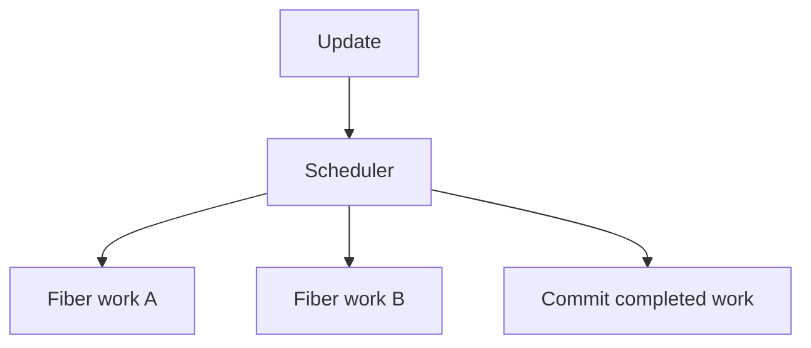

# React Fiber Architecture

## Detailed explanation
React Fiber is React's internal architecture for organizing, scheduling, pausing, resuming, and committing rendering work. Before Fiber, React rendering work was harder to interrupt. Fiber enables modern capabilities like concurrent rendering, prioritization, and better scheduling.

A Fiber is an internal unit of work associated with a component or host element. Most developers do not interact with Fiber directly, but understanding it helps explain why React can split rendering work and prioritize urgent updates.

## 1. One-line mental model
Fiber is React's internal work system that lets rendering be scheduled and prioritized.

## 2. Problem it solves
Large synchronous renders can block the main thread and make apps feel unresponsive during expensive updates.

## 3. Core idea
- Fiber breaks rendering into units of work.
- React can prioritize urgent updates.
- Work can be paused and resumed in concurrent rendering.
- Commit still applies changes consistently.
- Fiber is internal; app code uses public React APIs.

## 4. Visual / analogy
Fiber is like a task manager that splits one huge task into smaller tasks and chooses what must happen first.



## 5. Minimal example

```tsx
startTransition(() => {
  setSearchResults(expensiveFilter(items, query));
});
```

Transitions use modern React scheduling behavior built on Fiber concepts.

## 6. Real-world example

```tsx
const [isPending, startTransition] = React.useTransition();

function handleQueryChange(query: string) {
  setInput(query);
  startTransition(() => setDeferredQuery(query));
}
```

Urgent input stays responsive while non-urgent list updates can be scheduled differently.

## 7. Common interview questions
- What is React Fiber?
- Why was Fiber introduced?
- How does Fiber relate to concurrent rendering?
- What is a unit of work?
- Does Fiber mean DOM updates are partial?
- How does Fiber help responsiveness?
- Do developers use Fiber APIs directly?

## 8. Active recall test
1. What problem did Fiber solve?
2. What is a unit of work?
3. How does prioritization help UI?
4. Is Fiber a public API?
5. How does Fiber relate to transitions?

## 9. Mistakes / traps
- Treating Fiber as something developers import.
- Saying Fiber makes every update asynchronous.
- Confusing interruptible render with partial committed DOM.
- Overexplaining internals without connecting to user experience.
- Assuming Fiber removes the need for performance work.

## 10. Compare with related concepts
- **Fiber vs Virtual DOM:** Virtual DOM is UI description; Fiber is internal work structure.
- **Fiber vs reconciliation:** Fiber is architecture; reconciliation is comparison work.
- **Fiber vs concurrent rendering:** Fiber enables concurrent features; concurrent rendering is behavior built on it.

## 11. Summary from memory
Explain why Fiber helps React keep apps responsive during expensive rendering.

## 12. Spaced revision prompts
- After 1 day: Define Fiber.
- After 3 days: Explain unit of work.
- After 7 days: Connect Fiber to transitions.
- After 14 days: Compare Fiber and Virtual DOM.

