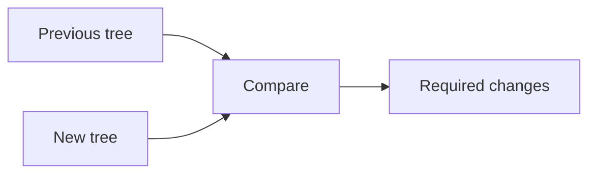

# Reconciliation

## Detailed explanation
Reconciliation is React's process of comparing the newly rendered element tree with the previous tree to decide what changed. It is the step between calculating UI output and committing updates to the DOM.

React uses heuristics to make this comparison practical: different element types produce different subtrees, and keys help identify stable children in lists. Reconciliation is why React can offer declarative rendering without replacing the entire DOM every time.

## 1. One-line mental model
Reconciliation is React comparing old UI description with new UI description.

## 2. Problem it solves
React needs to know which DOM operations are required after a render without manually written update instructions.

## 3. Core idea
- React renders a new element tree.
- It compares that tree with the previous one.
- Element type changes usually replace a subtree.
- Stable keys preserve list item identity.
- The result is a set of changes for the commit phase.

## 4. Visual / analogy
Reconciliation is like comparing two versions of a document to see which paragraphs changed.



## 5. Minimal example

```tsx
return isError ? <p role="alert">Error</p> : <p>Ready</p>;
```

React compares the previous `<p>` output with the next `<p>` output and updates changed props/text.

## 6. Real-world example

```tsx
orders.map((order) => <OrderRow key={order.id} order={order} />);
```

Stable keys let reconciliation match the same order rows after filtering, sorting, or insertion.

## 7. Common interview questions
- What is reconciliation?
- How is reconciliation different from rendering?
- How do keys affect reconciliation?
- What happens when element types change?
- Does reconciliation update the DOM directly?
- How is reconciliation related to Fiber?
- What makes reconciliation efficient?

## 8. Active recall test
1. What two things are compared?
2. What does React do when element type changes?
3. Why do keys matter?
4. Is reconciliation the same as commit?
5. What output does reconciliation produce?

## 9. Mistakes / traps
- Saying reconciliation is the same as Virtual DOM.
- Saying reconciliation directly paints the screen.
- Ignoring keys in list reconciliation.
- Thinking React deeply compares every prop object.
- Assuming reconciliation prevents all performance problems.

## 10. Compare with related concepts
- **Reconciliation vs render:** render creates new output; reconciliation compares it.
- **Reconciliation vs diffing:** diffing is the comparison technique; reconciliation is the broader React process.
- **Reconciliation vs commit:** commit applies changes.

## 11. Summary from memory
Explain how React reconciles a list when one item is inserted at the beginning.

## 12. Spaced revision prompts
- After 1 day: Define reconciliation.
- After 3 days: Explain keys in reconciliation.
- After 7 days: Compare reconciliation and commit.
- After 14 days: Explain type-change replacement.

