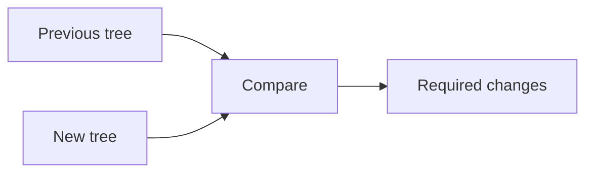

# Reconciliation

## Detailed explanation
Reconciliation is React's process of comparing the newly rendered element tree with the previous tree to decide what changed. It is the step between calculating UI output and committing updates to the DOM.

React uses heuristics to make this comparison practical: different element types produce different subtrees, and keys help identify stable children in lists. Reconciliation is why React can offer declarative rendering without replacing the entire DOM every time.

## 1. One-line mental model
Reconciliation is React comparing old UI description with new UI description.

## 2. Problem it solves
React needs to know which DOM operations are required after a render without manually written update instructions.

## 3. Core idea
- React renders a new element tree.
- It compares that tree with the previous one.
- Element type changes usually replace a subtree.
- Stable keys preserve list item identity.
- The result is a set of changes for the commit phase.

## 4. Visual / analogy
Reconciliation is like comparing two versions of a document to see which paragraphs changed.



## 5. Minimal example

```tsx
return isError ? <p role="alert">Error</p> : <p>Ready</p>;
```

React compares the previous `<p>` output with the next `<p>` output and updates changed props/text.

## 6. Real-world example

```tsx
orders.map((order) => <OrderRow key={order.id} order={order} />);
```

Stable keys let reconciliation match the same order rows after filtering, sorting, or insertion.

## 7. Common interview questions
#### What is reconciliation?
- **The Engine Mechanism (Why it behaves this way):** Reconciliation is the process React runs during the render phase to compare the newly produced element tree with the previous tree. React walks both trees simultaneously, comparing nodes at each position. It uses two heuristics: (1) different element types trigger a full subtree replacement, and (2) for siblings, the `key` prop provides identity matching. The output is a list of mutations — create, update, move, or delete — that the commit phase will apply to the real DOM.
- **The Unforgettable Mental Model:** The **Version Control Diff**. Like running `git diff` between two commits to see exactly which lines were added, removed, or modified, reconciliation produces a "UI diff" between two renders — a precise patch of what needs to change on screen.
- **The Trap:** Saying reconciliation updates the DOM. It does not. Reconciliation only computes what changed. The commit phase applies those changes.
- **Senior Interview Playbook (Verbal Script):** "When asked this in an interview, say: Reconciliation is React's comparison process that runs after rendering. When state changes, React re-renders components to produce a new element tree. Reconciliation compares this new tree with the previous one using heuristics — type comparison and key-based matching — to identify exactly what changed. It produces a set of mutations that the commit phase applies to the real DOM. Reconciliation is what makes React's declarative model work: you describe the desired UI, and React computes the minimal work to achieve it."

#### How is reconciliation different from rendering?
- **The Engine Mechanism (Why it behaves this way):** Rendering is the process of calling component functions (or class `render` methods) to produce React element objects. It is a top-down traversal: React starts at the root, calls each component, collects the returned elements, and recursively renders children. Reconciliation happens alongside rendering — as each new element is produced, React compares it with the corresponding element from the previous render. In the Fiber architecture, rendering builds the "work-in-progress" Fiber tree while reconciliation compares it with the "current" Fiber tree.
- **The Unforgettable Mental Model:** The **Writer vs. the Editor**. Rendering is the writer producing a new draft of a document. Reconciliation is the editor comparing the new draft with the previous version and marking up what changed. The writer creates; the editor compares.
- **The Trap:** Using "render" and "reconcile" interchangeably. They are distinct operations: rendering produces output, reconciliation compares it. A component can render without reconciliation producing any DOM changes (if the output is identical).
- **Senior Interview Playbook (Verbal Script):** "When asked this in an interview, say: Rendering and reconciliation are distinct phases. Rendering is calling component functions to produce a new element tree — it's about generating output. Reconciliation is comparing that new tree with the previous tree to find differences — it's about computing changes. In React's architecture, these happen together: as each component renders, React immediately reconciles its output against the previous render. The key distinction: rendering creates, reconciliation compares."

#### How do keys affect reconciliation?
- **The Engine Mechanism (Why it behaves this way):** During reconciliation of a component's children, React builds a map from the previous render's keys to their corresponding Fiber nodes. When processing the new children, React looks up each new key in this map. If found, React reuses the existing Fiber node (preserving state and DOM). If not found, React creates a new Fiber node. After processing all new children, any keys in the old map that weren't matched are marked for deletion. Without keys, React matches children by index position, which breaks when items are reordered.
- **The Unforgettable Mental Model:** The **Coat Check System**. When you hand in your coat, you get a numbered ticket (key). When you return, the attendant uses the ticket to find your exact coat — not the coat hanging in the same spot. Without tickets, they'd just guess based on position, often giving you someone else's coat.
- **The Trap:** Thinking keys are just for suppressing console warnings. Keys are a core reconciliation mechanism that directly affects component state preservation and DOM reuse efficiency.
- **Senior Interview Playbook (Verbal Script):** "When asked this in an interview, say: Keys are React's identity mechanism for list children during reconciliation. React builds a map of old keys to Fiber nodes, then uses new keys to look up and reuse existing nodes. This preserves component state and avoids unnecessary DOM operations when items are reordered, inserted, or deleted. Without keys, React falls back to position-based matching, which causes state bugs and wasted re-renders whenever the list order changes."

#### What happens when element types change?
- **The Engine Mechanism (Why it behaves this way):** When reconciliation encounters a different element type at the same tree position, React marks the entire old subtree for deletion and schedules a new subtree for creation. This means all DOM nodes in the old subtree are removed, all component instances are unmounted (running `componentWillUnmount` and `useEffect` cleanup functions), and all local state is destroyed. React then creates fresh DOM nodes and mounts new component instances. This aggressive replacement happens because React assumes different types represent fundamentally incompatible UI structures.
- **The Unforgettable Mental Model:** The **Species Swap**. If you have a dog in a kennel and swap it for a cat, you don't just change the name tag — you replace the entire animal, its food bowl, its toys, and its training. The old dog's state (tricks learned, habits) doesn't transfer to the cat.
- **The Trap:** Expecting state to persist across type changes. Even if the new element looks identical and has the same children, a type change destroys all state because React creates a completely new component instance.
- **Senior Interview Playbook (Verbal Script):** "When asked this in an interview, say: When the element type changes at a position, React performs a full subtree replacement. It unmounts every component in the old subtree, destroys all associated DOM nodes, and creates an entirely new subtree. All local state is lost because React creates new component instances. This is by design — React assumes that different types represent different UI semantics and shouldn't share state. If you need to preserve state across visual changes, keep the same component type and change props instead."

#### Does reconciliation update the DOM directly?
- **The Engine Mechanism (Why it behaves this way):** No. Reconciliation produces a list of side effects (mutations) stored as effect tags on Fiber nodes. These tags include Placement (insert), Update (modify props/children), and Deletion (remove). The actual DOM manipulation happens in the commit phase, which walks the list of effected Fiber nodes and applies the mutations in a specific order: deletions first, then insertions and updates, then lifecycle methods. This separation allows the render phase (including reconciliation) to be interruptible and restartable, while the commit phase runs to completion once started.
- **The Unforgettable Mental Model:** The **Surgeon's Plan vs. the Surgery**. Reconciliation is the surgeon studying scans and planning exactly where to cut — no blood is spilled yet. The commit phase is the actual surgery — the plan is executed, and the patient's body is changed.
- **The Trap:** Thinking reconciliation and DOM updates happen simultaneously. They are strictly separated: reconciliation computes, commit applies. This separation is what enables Concurrent Mode.
- **Senior Interview Playbook (Verbal Script):** "When asked this in an interview, say: No, reconciliation does not touch the DOM. It only computes what needs to change by comparing element trees and marking Fiber nodes with effect tags. The actual DOM updates happen in a separate commit phase that runs after reconciliation completes. This separation is critical: it allows React to pause, resume, or discard reconciliation work without affecting the visible UI. Only the commit phase mutates the DOM, and once it starts, it runs to completion."

#### How is reconciliation related to Fiber?
- **The Engine Mechanism (Why it behaves this way):** Fiber is the data structure and scheduling system that implements reconciliation. Each component or DOM element is represented by a Fiber node — a JavaScript object with fields for the component's state, props, type, and linked-list pointers to child, sibling, and parent. Reconciliation traverses this Fiber tree, comparing each node with its previous version. Fiber enables reconciliation to be interruptible because each node represents a discrete unit of work. React can stop after processing any node, handle higher-priority work, and resume from where it left off.
- **The Unforgettable Mental Model:** The **Linked-List Assembly Line**. Instead of processing the entire tree recursively (which can't be paused), Fiber arranges all nodes in a linked list. Each node is one station on the assembly line. The manager can pause at any station, switch to a more urgent line, and come back later — because each station knows exactly where to pick up.
- **The Trap:** Thinking Fiber replaced reconciliation. Fiber didn't replace it — it reimplemented it. Reconciliation is still the comparison process; Fiber is just the architecture that makes it interruptible and schedulable.
- **Senior Interview Playbook (Verbal Script):** "When asked this in an interview, say: Fiber is the internal architecture that implements reconciliation. Each component maps to a Fiber node — a JavaScript object with linked-list pointers forming the tree structure. Reconciliation walks this Fiber tree, comparing nodes and marking effects. Fiber's key innovation is making reconciliation interruptible: each node is a discrete unit of work, so React can pause at any point, handle urgent updates, and resume. Fiber also maintains a work-in-progress tree alongside the current tree, enabling React to prepare the next UI state without affecting what's on screen."

#### What makes reconciliation efficient?
- **The Engine Mechanism (Why it behaves this way):** Reconciliation achieves O(n) complexity — linear with the number of elements — through two heuristics that avoid the O(n³) cost of a perfect tree diff. First, type-based comparison: if two elements have different types at a position, React skips deep comparison and replaces the entire subtree immediately. Second, key-based matching: for siblings, React uses keys to match elements in O(1) lookup time via a map, rather than comparing every old element with every new element. Additionally, `React.memo` and `shouldComponentUpdate` allow components to short-circuit reconciliation entirely when props haven't changed.
- **The Unforgettable Mental Model:** The **Smart Sorter**. Instead of comparing every item in box A with every item in box B (which takes forever), the sorter first checks categories (types) — if categories differ, no need to compare contents. For items in the same category, it checks ID tags (keys) for instant matching. This turns a quadratic problem into a linear one.
- **The Trap:** Assuming reconciliation is always O(n). While the algorithm is O(n), the constant factor matters: rendering a tree with 10,000 elements still takes time, even if the diff is linear. Memoization and component boundaries are still needed for performance.
- **Senior Interview Playbook (Verbal Script):** "When asked this in an interview, say: Reconciliation is efficient because React uses two heuristics that reduce tree comparison from O(n³) to O(n). First, type comparison: different types trigger immediate subtree replacement, avoiding deep comparison. Second, key-based matching: React uses a map to match list children in O(1) time. These assumptions work well for UI because elements rarely change type at the same position, and developers provide keys for lists. Additionally, React.memo lets components skip reconciliation entirely when their props are unchanged."

## 8. Active recall test
1. **What is reconciliation?**
   - **Explanation:** Reconciliation is React's process of comparing the new element tree with the previous tree to identify what changed. It produces a set of mutations (create, update, delete, move) for the commit phase to apply to the real DOM.
2. **How does reconciliation differ from rendering?**
   - **Explanation:** Rendering calls component functions to produce element trees. Reconciliation compares those trees against the previous render. Rendering creates output; reconciliation computes differences.
3. **How do keys affect reconciliation?**
   - **Explanation:** Keys let React match list children by identity across renders using a map lookup. Without keys, React matches by position, causing state bugs and unnecessary re-renders when items are reordered.
4. **What happens when element type changes during reconciliation?**
   - **Explanation:** React unmounts the entire old subtree, destroys all DOM nodes, runs cleanup functions, and creates a brand new subtree. All component state is lost.
5. **Does reconciliation directly update the DOM?**
   - **Explanation:** No. Reconciliation only computes changes and marks Fiber nodes with effect tags. The commit phase reads these tags and applies actual DOM mutations.
6. **How is reconciliation related to Fiber?**
   - **Explanation:** Fiber is the data structure and scheduling system that implements reconciliation. Each component is a Fiber node with linked-list pointers, enabling reconciliation to be interruptible and prioritized.
7. **What makes reconciliation efficient?**
   - **Explanation:** Two heuristics: type-based comparison (different types = immediate subtree replacement) and key-based matching (O(1) map lookup for siblings). These reduce complexity from O(n³) to O(n).

## 9. Mistakes / traps
- Saying reconciliation is the same as Virtual DOM.
- Saying reconciliation directly paints the screen.
- Ignoring keys in list reconciliation.
- Thinking React deeply compares every prop object.
- Assuming reconciliation prevents all performance problems.

## 10. Compare with related concepts
- **Reconciliation vs render:** render creates new output; reconciliation compares it.
- **Reconciliation vs diffing:** diffing is the comparison technique; reconciliation is the broader React process.
- **Reconciliation vs commit:** commit applies changes.

## 11. Summary from memory
Explain how React reconciles a list when one item is inserted at the beginning.

## 12. Spaced revision prompts
- After 1 day: Define reconciliation.
- After 3 days: Explain keys in reconciliation.
- After 7 days: Compare reconciliation and commit.
- After 14 days: Explain type-change replacement.

