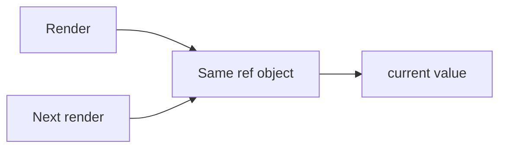

# Refs

## Detailed explanation
Refs provide a way to hold a mutable value across renders without causing re-renders, or to access a DOM node managed by React. They are commonly used for focusing inputs, measuring elements, storing timer IDs, integrating with imperative libraries, and keeping latest values for callbacks.

Refs should not be used as a replacement for state when the UI needs to update. If changing the value should change what appears on screen, use state instead.

## 1. One-line mental model
A ref is a stable mutable box whose `.current` value can change without re-rendering.

## 2. Problem it solves
Some values need to persist across renders but should not trigger rendering when they change.

## 3. Core idea
- `useRef` returns a stable object.
- `.current` can be read and written.
- DOM refs point to elements after commit.
- Changing a ref does not re-render.
- Refs are useful for imperative escape hatches.

## 4. Visual / analogy
A ref is like a sticky note kept beside the component: changing the note does not redraw the UI.



## 5. Minimal example

```tsx
function FocusInput() {
  const inputRef = React.useRef<HTMLInputElement>(null);
  return <input ref={inputRef} />;
}
```

## 6. Real-world example

```tsx
function SearchBox() {
  const inputRef = React.useRef<HTMLInputElement>(null);

  function focusSearch() {
    inputRef.current?.focus();
  }

  return <button onClick={focusSearch}>Focus search</button>;
}
```

## 7. Common interview questions
- What is a ref?
- `useRef` vs `useState`?
- Does changing ref cause re-render?
- When do you use DOM refs?
- What are imperative escape hatches?
- How do refs help with timers?
- When should refs be avoided?

## 8. Active recall test
1. What does `useRef` return?
2. What property stores the value?
3. Does ref mutation render?
4. When is state better than ref?
5. What is one DOM ref use case?

## 9. Mistakes / traps
- Using refs for UI state.
- Reading DOM refs before commit.
- Mutating refs during render for visible UI behavior.
- Forgetting refs can be null.
- Overusing imperative DOM access.

## 10. Compare with related concepts
- **Ref vs state:** ref persists silently; state triggers rendering.
- **Ref vs variable:** ref survives renders; normal variables reset each render.
- **Ref vs prop:** prop is input from parent; ref is local mutable holder or DOM access.

## 11. Summary from memory
Explain why a timer ID belongs in a ref but a counter display belongs in state.

## 12. Spaced revision prompts
- After 1 day: Define ref.
- After 3 days: Compare ref and state.
- After 7 days: Use a ref to focus input.
- After 14 days: Explain ref misuse.

