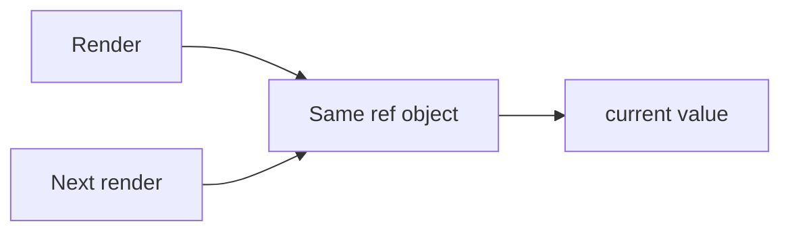

# Refs

## Detailed explanation
Refs provide a way to hold a mutable value across renders without causing re-renders, or to access a DOM node managed by React. They are commonly used for focusing inputs, measuring elements, storing timer IDs, integrating with imperative libraries, and keeping latest values for callbacks.

Refs should not be used as a replacement for state when the UI needs to update. If changing the value should change what appears on screen, use state instead.

## 1. One-line mental model
A ref is a stable mutable box whose `.current` value can change without re-rendering.

## 2. Problem it solves
Some values need to persist across renders but should not trigger rendering when they change.

## 3. Core idea
- `useRef` returns a stable object.
- `.current` can be read and written.
- DOM refs point to elements after commit.
- Changing a ref does not re-render.
- Refs are useful for imperative escape hatches.

## 4. Visual / analogy
A ref is like a sticky note kept beside the component: changing the note does not redraw the UI.



## 5. Minimal example

```tsx
function FocusInput() {
  const inputRef = React.useRef<HTMLInputElement>(null);
  return <input ref={inputRef} />;
}
```

## 6. Real-world example

```tsx
function SearchBox() {
  const inputRef = React.useRef<HTMLInputElement>(null);

  function focusSearch() {
    inputRef.current?.focus();
  }

  return <button onClick={focusSearch}>Focus search</button>;
}
```

## 7. Common interview questions
#### What is a ref?
- **The Engine Mechanism (Why it behaves this way):** A ref is a JavaScript object with a single `.current` property that persists across renders. When you call `useRef(initialValue)`, React creates an object during the initial render and returns the same object reference on every subsequent render. The `.current` property can be read and written without triggering a re-render. For DOM refs, React sets `.current` to the DOM node during the commit phase (after the DOM is updated) and to `null` when the element is unmounted. Refs are stored in the Fiber node associated with the component, which is why they survive re-renders.
- **The Unforgettable Mental Model:** The **Locker**. A ref is like a personal locker at the gym — it's always there, always yours, and you can put things in or take things out without anyone else noticing. Changing what's in the locker doesn't change your appearance (no re-render).
- **The Trap:** Thinking refs are just like regular variables. Regular variables are recreated on every render; refs persist because React stores them in the Fiber node.
- **Senior Interview Playbook (Verbal Script):** "When asked this in an interview, say: A ref is a persistent object with a `.current` property that survives across renders without triggering re-renders. Created with `useRef`, it returns the same object reference every render. For DOM refs, React sets `.current` to the DOM node after commit. For value refs, you can read and write `.current` freely. Refs are stored in the component's Fiber node, which is why they persist. The key distinction from state: changing a ref's `.current` doesn't cause a re-render."

#### `useRef` vs `useState`?
- **The Engine Mechanism (Why it behaves this way):** Both `useRef` and `useState` persist values across renders, but they behave differently. `useState` triggers a re-render when its setter is called because React schedules an update on the Fiber node, which triggers reconciliation. `useRef` does not trigger a re-render when `.current` is modified — it's a plain property assignment on an object that React doesn't track for updates. `useState` is for values that affect the UI; `useRef` is for values that don't. Additionally, `useState`'s setter is stable across renders, while `useRef` returns a mutable object whose `.current` can be changed directly.
- **The Unforgettable Mental Model:** The **Billboard vs. the Notebook**. `useState` is like a billboard — when you change it, everyone sees the update (re-render). `useRef` is like a personal notebook — you can write in it, but nobody else sees the changes unless you explicitly show them (read `.current` during render).
- **The Trap:** Using `useRef` for values that should trigger UI updates. If changing a value should change what's on screen, use `useState`. Using `useRef` for UI state means the UI won't update when the value changes.
- **Senior Interview Playbook (Verbal Script):** "When asked this in an interview, say: Both persist values across renders, but `useState` triggers a re-render when updated while `useRef` does not. Use `useState` for values that affect the UI — if changing the value should change what's on screen, it's state. Use `useRef` for values that don't affect rendering — timer IDs, DOM node references, previous prop values, or flags that track whether something has happened. The rule of thumb: if the UI depends on it, use state; if it's just for your logic, use a ref."

#### Does changing a ref cause a re-render?
- **The Engine Mechanism (Why it behaves this way):** No. Modifying `ref.current` is a plain JavaScript property assignment. React does not track `.current` for changes and does not schedule an update when it changes. The ref object is stored in the Fiber node, but React only reads from it — it doesn't observe mutations. A re-render will only occur if something else triggers it (a state change, a parent re-render, or a context change). At that point, the component function runs again and can read the updated `ref.current` value. This is why refs are useful for storing values that need to persist but shouldn't drive rendering.
- **The Unforgettable Mental Model:** The **Secret Diary**. Writing in your diary doesn't change your outward appearance — nobody knows you wrote something unless you tell them. Similarly, changing `ref.current` doesn't change the UI unless you explicitly use the new value during a re-render triggered by something else.
- **The Trap:** Expecting the UI to update after changing `ref.current`. It won't. If you need the UI to reflect the new value, you must either use `useState` or trigger a re-render through another mechanism.
- **Senior Interview Playbook (Verbal Script):** "When asked this in an interview, say: No, changing `ref.current` does not cause a re-render. It's a plain property assignment that React doesn't track. The value persists across renders, but the UI won't update until something else triggers a re-render. If you need the UI to reflect a value change, use `useState` instead. Refs are for values that persist but don't drive rendering — like timer IDs, DOM references, or flags that track whether an effect has run."

#### When do you use DOM refs?
- **The Engine Mechanism (Why it behaves this way):** DOM refs are used when you need imperative access to a DOM element that React manages. Common use cases include: focusing an input element (`ref.current.focus()`), measuring element dimensions (`ref.current.getBoundingClientRect()`), integrating with third-party libraries that require a DOM node (charts, maps, animations), scrolling to an element (`ref.current.scrollIntoView()`), and reading form values directly (though controlled components are preferred). The ref is attached via the `ref` prop on a JSX element, and React sets `.current` to the DOM node during the commit phase, after the DOM has been updated.
- **The Unforgettable Mental Model:** The **Backstage Pass**. React manages the stage performance (declarative rendering), but sometimes you need to go backstage and adjust the lighting or sound manually (imperative DOM access). DOM refs are your backstage pass — use them sparingly and only when the declarative approach can't do what you need.
- **The Trap:** Using DOM refs for things that can be done declaratively. For example, reading an input's value via `ref.current.value` instead of using a controlled component with `useState`. Declarative is almost always preferred.
- **Senior Interview Playbook (Verbal Script):** "When asked this in an interview, say: DOM refs are used for imperative operations that can't be done declaratively. Common cases include focusing inputs, measuring element dimensions, integrating with third-party libraries that need a DOM node, and scrolling to elements. The key principle: use refs only when there's no declarative alternative. For form values, prefer controlled components with state. For animations, prefer CSS or React animation libraries. Refs are an escape hatch, not the default approach."

#### What are imperative escape hatches?
- **The Engine Mechanism (Why it behaves this way):** Imperative escape hatches are ways to interact with the DOM or external systems directly, bypassing React's declarative rendering model. Refs are the primary escape hatch — they give you direct access to DOM nodes for operations like `focus()`, `scrollIntoView()`, or `getBoundingClientRect()`. Other escape hatches include `useEffect` for side effects, `useLayoutEffect` for synchronous DOM measurements after mutations, and `ReactDOM.createPortal` for rendering outside the React tree. These are called "escape hatches" because they let you escape React's declarative model when you need imperative control. They should be used sparingly because they bypass React's guarantees about UI consistency.
- **The Unforgettable Mental Model:** The **Emergency Exit**. React's declarative model is the main entrance — it's the intended, safe way in and out. Escape hatches are the emergency exits — you use them when the main entrance can't handle your specific need, but you don't want to live in the emergency exit.
- **The Trap:** Overusing escape hatches, making the codebase imperative and hard to reason about. Every escape hatch is a place where React's guarantees don't apply.
- **Senior Interview Playbook (Verbal Script):** "When asked this in an interview, say: Imperative escape hatches are ways to bypass React's declarative model for direct control. Refs are the main escape hatch — they give you direct DOM access for operations like focusing, measuring, or integrating with third-party libraries. `useEffect` and `useLayoutEffect` are escape hatches for side effects. Portals are escape hatches for DOM placement. The key principle: use escape hatches only when the declarative approach can't solve your problem. They're necessary but should be minimized because they bypass React's consistency guarantees."

#### How do refs help with timers?
- **The Engine Mechanism (Why it behaves this way):** Timer IDs from `setTimeout`, `setInterval`, or `requestAnimationFrame` need to persist across renders so they can be cleared later (e.g., in a cleanup function). Storing a timer ID in state would trigger unnecessary re-renders every time the ID changes. Storing it in a ref keeps it accessible without causing renders. The typical pattern is: store the timer ID in `ref.current` when starting the timer, and clear it in a `useEffect` cleanup function using `clearTimeout(ref.current)` or `clearInterval(ref.current)`. This ensures the timer is cleaned up when the component unmounts or when dependencies change.
- **The Unforgettable Mental Model:** The **Parking Ticket**. When you park your car, you get a ticket with a number (timer ID). You don't announce the ticket number to everyone (no re-render), but you keep it in your pocket (ref) so you can find your car later (clear the timer).
- **The Trap:** Forgetting to clear timers in cleanup. This causes memory leaks and bugs where timers fire on unmounted components, attempting to update state on components that no longer exist.
- **Senior Interview Playbook (Verbal Script):** "When asked this in an interview, say: Refs are ideal for storing timer IDs because they persist across renders without triggering re-renders. You store the ID from `setTimeout` or `setInterval` in `ref.current`, then clear it in a `useEffect` cleanup function. This prevents memory leaks and ensures timers don't fire on unmounted components. Using state for timer IDs would cause unnecessary re-renders, and using a plain variable would lose the ID on the next render."

#### When should refs be avoided?
- **The Engine Mechanism (Why it behaves this way):** Refs should be avoided when the value they hold affects the UI. If changing a value should cause the screen to update, that value belongs in state, not a ref. Refs should also be avoided for derived values that can be computed during render (use `useMemo` instead), for values that need to trigger effects (use state so the effect dependency array can track changes), and for form input values (use controlled components with state). Overusing refs leads to code that's hard to debug because the UI can become out of sync with the underlying data — the ref holds a value that the UI doesn't reflect.
- **The Unforgettable Mental Model:** The **Hidden Ledger**. If you keep financial records in a hidden ledger (refs) instead of the public dashboard (state), nobody can see the real numbers. The dashboard shows outdated information while the ledger has the truth. Eventually, decisions are made based on wrong data.
- **The Trap:** Using refs to "optimize" away re-renders that are actually necessary. This creates stale UI where the screen doesn't reflect the current data.
- **Senior Interview Playbook (Verbal Script):** "When asked this in an interview, say: Refs should be avoided when the value affects the UI — if changing it should update the screen, use state. They should also be avoided for derived values (use `useMemo`), values that need to trigger effects (use state), and form input values (use controlled components). The anti-pattern is using refs to avoid re-renders that are actually necessary. This creates stale UI where the screen doesn't match the data. Refs are for values that truly don't affect rendering — timer IDs, DOM references, and flags."

## 8. Active recall test
1. **What does `useRef` return?**
   - **Explanation:** `useRef` returns a mutable object with a `.current` property. The object is created once and returned on every render, so the reference is stable across renders. The `.current` property can be read and written without triggering re-renders.
2. **What property stores the ref value?**
   - **Explanation:** The `.current` property. For DOM refs, React sets `.current` to the DOM node during commit. For value refs, you manually set `.current` to whatever value you need to persist.
3. **Does ref mutation trigger a re-render?**
   - **Explanation:** No. Modifying `ref.current` is a plain property assignment that React doesn't track. The value persists, but the UI won't update until something else triggers a re-render.
4. **When is state better than ref?**
   - **Explanation:** State is better when the value affects the UI — if changing it should cause the screen to update. State is also better when the value needs to trigger effects or when it's a form input value that should be controlled.
5. **What is one DOM ref use case?**
   - **Explanation:** Focusing an input element imperatively: `inputRef.current.focus()`. This is a common case where declarative React can't achieve the desired behavior — there's no JSX attribute for "focus this element on mount."

## 9. Mistakes / traps
- Using refs for UI state.
- Reading DOM refs before commit.
- Mutating refs during render for visible UI behavior.
- Forgetting refs can be null.
- Overusing imperative DOM access.

## 10. Compare with related concepts
- **Ref vs state:** ref persists silently; state triggers rendering.
- **Ref vs variable:** ref survives renders; normal variables reset each render.
- **Ref vs prop:** prop is input from parent; ref is local mutable holder or DOM access.

## 11. Summary from memory
Explain why a timer ID belongs in a ref but a counter display belongs in state.

## 12. Spaced revision prompts
- After 1 day: Define ref.
- After 3 days: Compare ref and state.
- After 7 days: Use a ref to focus input.
- After 14 days: Explain ref misuse.

