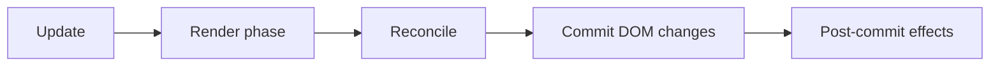

# Rendering Flow in React

## Detailed explanation
Rendering flow is the sequence React follows after data changes. A state update schedules work. React calls components to calculate the next UI description. It reconciles that output with the previous tree. Then it commits the necessary changes to the host environment, usually the browser DOM.

Understanding this flow is essential for debugging re-renders, memoization, StrictMode behavior, layout effects, and performance issues. A render does not automatically mean the DOM changed; it means React recalculated UI output.

## 1. One-line mental model
React rendering flow is update scheduled, components called, changes compared, DOM committed.

## 2. Problem it solves
Without a clear rendering model, developers confuse state updates, component renders, DOM updates, and effects, which leads to wrong performance fixes.

## 3. Core idea
- State/props/context updates schedule render work.
- Render phase calculates React elements.
- Reconciliation compares new and old output.
- Commit phase applies DOM changes.
- Post-commit work runs after the DOM is updated.

## 4. Visual / analogy
Rendering is like drafting, reviewing, then publishing a document.



## 5. Minimal example

```tsx
setCount((count) => count + 1);
```

This schedules React to render the component again; the DOM updates later during commit if output changed.

## 6. Real-world example

```tsx
function ProductPage({ product }: { product: Product }) {
  const priceLabel = formatCurrency(product.price);
  return <h1>{product.name} - {priceLabel}</h1>;
}
```

When `product` changes, React renders this component to calculate the new heading before committing DOM changes.

## 7. Common interview questions
#### What happens after `setState`?
- **The Engine Mechanism (Why it behaves this way):** Calling `setState` (or a `useState` setter) does not immediately update the DOM. Instead, it schedules a re-render in React's Fiber scheduler. React adds the update to a queue and, during the next render cycle, processes all queued updates together (batching). React then enters the **render phase**: it calls the component function with the new state, produces a new React element tree, and runs the reconciliation algorithm to diff the new tree against the previous one. If differences are found, React enters the **commit phase**: it applies the minimal set of DOM mutations in a single synchronous burst. After commit, `useLayoutEffect` callbacks fire synchronously (before the browser paints), then `useEffect` callbacks fire asynchronously (after paint). The entire process is asynchronous from the caller's perspective — the state variable doesn't change until the next render.
- **The Unforgettable Mental Model:** The **Restaurant Order System**. You place an order (setState) — it doesn't appear on your table instantly. The kitchen (React) queues it, prepares all orders together (batching), cooks the meal (render phase), plates it (reconciliation), and serves it (commit phase). Only then do you see the food (DOM update).
- **The Trap:** Expecting the state variable to have the new value immediately after calling setState. It doesn't — the variable updates on the next render. Use the functional updater form or effects to work with the new value.
- **Senior Interview Playbook (Verbal Script):** "When asked this in an interview, say: setState doesn't update the DOM immediately. It schedules a re-render in React's Fiber scheduler. React batches the update with others, enters the render phase to calculate the new UI tree, reconciles it against the previous tree, and then commits the DOM changes in a single batch. After commit, layout effects fire synchronously, then effects fire asynchronously. The state variable itself only updates on the next render, not immediately after the setState call."

#### Does render always update the DOM?
- **The Engine Mechanism (Why it behaves this way):** No. Render means React called the component function and calculated a new React element tree. The DOM only updates if reconciliation finds differences between the new and previous trees. If the new tree is identical to the previous one (same element types, same props, same structure), React skips the DOM mutations entirely. This is why a component can render without visible changes — the render phase happened, but the commit phase found nothing to update. React's reconciliation algorithm compares element types first (fast check), then props (deeper check), and only marks nodes for DOM mutation if something changed. `React.memo` can prevent the render phase entirely if props haven't changed.
- **The Unforgettable Mental Model:** The **Editor's Draft Review**. An editor (React) reviews a revised manuscript (render output). If the revision is identical to the previous version, the editor stamps "no changes needed" and sends it back without printing (no DOM update). Only actual changes go to print.
- **The Trap:** Assuming that if a component renders, the DOM must have changed. This leads to incorrect performance optimizations — developers try to prevent renders when they should be preventing unnecessary work in the render function itself.
- **Senior Interview Playbook (Verbal Script):** "When asked this in an interview, say: No, render doesn't always update the DOM. Render means React called the component and calculated the new UI tree. The DOM only updates if reconciliation finds differences between the new and previous trees. If the output is identical, React skips DOM mutations. This is an important distinction: render is calculation, commit is DOM update. A component can render many times without any visible change to the screen."

#### What is render phase?
- **The Engine Mechanism (Why it behaves this way):** The render phase is React's calculation stage where it determines what the UI should look like. React starts from the component where state changed and walks the Fiber tree, calling each component function to produce React element objects. This phase is pure — components should not perform side effects, mutate state, or interact with the DOM. The render phase can be paused, interrupted, and restarted by React's Concurrent Mode scheduler. If a higher-priority update arrives (like a user click), React can discard the current render work and start fresh. The output of the render phase is a new Fiber tree representing the desired UI state, which is then compared with the current Fiber tree during reconciliation.
- **The Unforgettable Mental Model:** The **Architect's Draft**. The architect (React) draws a new blueprint (element tree) based on the client's updated requirements (state change). This draft can be revised, discarded, or redrawn multiple times before construction begins. No actual building happens during drafting.
- **The Trap:** Performing side effects during render — API calls, DOM manipulation, or state updates. These execute every time React renders, which can be multiple times in Concurrent Mode, causing duplicate requests and infinite loops.
- **Senior Interview Playbook (Verbal Script):** "When asked this in an interview, say: The render phase is where React calculates what the UI should look like. It calls component functions, builds a new element tree, and reconciles it against the previous tree. This phase is pure and can be paused or interrupted by React's scheduler. No side effects should happen during render — no API calls, no DOM mutations, no state updates. The render phase produces a description of the desired UI, not the actual DOM changes."

#### What is commit phase?
- **The Engine Mechanism (Why it behaves this way):** The commit phase is where React applies the calculated changes to the actual DOM. After reconciliation identifies the differences between the new and previous Fiber trees, React walks the tree and performs the necessary DOM operations: creating new nodes, updating properties, removing old nodes, and reordering elements. The commit phase is synchronous and cannot be interrupted — once React starts committing, it finishes all DOM mutations before yielding to the browser. After DOM mutations, React fires `useLayoutEffect` callbacks synchronously (allowing DOM measurements before the browser paints), then schedules `useEffect` callbacks to fire asynchronously after the browser paint. The commit phase is the only phase where the actual DOM changes.
- **The Unforgettable Mental Model:** The **Construction Crew**. After the architect's blueprint is finalized (render phase), the construction crew (commit phase) arrives and makes the actual changes to the building. They work continuously without stopping (synchronous, non-interruptible). Once they're done, the inspectors (effects) check the work.
- **The Trap:** Doing heavy computation during the commit phase or in useLayoutEffect. Since commit is synchronous and blocks the browser, expensive work here causes visible jank and freezes the UI.
- **Senior Interview Playbook (Verbal Script):** "When asked this in an interview, say: The commit phase is where React applies DOM changes. After reconciliation identifies what changed, React synchronously creates, updates, or removes DOM nodes. This phase cannot be interrupted — React completes all DOM mutations before yielding. After DOM updates, useLayoutEffect fires synchronously for DOM measurements, then useEffect fires asynchronously. The commit phase is the only phase where the actual browser DOM changes, and it should be fast to avoid blocking the browser."

#### When do effects run?
- **The Engine Mechanism (Why it behaves this way):** Effects run after the commit phase, but at different times depending on the effect type. `useLayoutEffect` fires synchronously immediately after DOM mutations but before the browser paints — this allows you to measure DOM layout (element sizes, positions) and make adjustments before the user sees anything. `useEffect` fires asynchronously after the browser paint — this is for side effects that don't need to block visual updates, like API calls, subscriptions, and logging. In React 18's Concurrent Mode, effects may be deferred for offscreen content. Both effect types run their cleanup functions before re-running (when dependencies change) or on unmount. The order of effect execution follows the component tree: parent effects run before child effects for layout effects, but child effects run before parent effects for regular effects.
- **The Unforgettable Mental Model:** The **Two Inspectors**. The first inspector (useLayoutEffect) checks the building immediately after construction, before anyone moves in — measuring room sizes, checking alignments. The second inspector (useEffect) comes after people move in — checking how the building performs in real use, like HVAC efficiency and noise levels.
- **The Trap:** Using useEffect for DOM measurements. By the time useEffect fires, the browser has already painted, so measuring and adjusting causes a visible flash. Use useLayoutEffect for synchronous DOM measurements.
- **Senior Interview Playbook (Verbal Script):** "When asked this in an interview, say: useLayoutEffect fires synchronously after DOM mutations but before the browser paints — use it for DOM measurements that need to happen before the user sees anything. useEffect fires asynchronously after the browser paints — use it for API calls, subscriptions, and logging. The key difference: useLayoutEffect can block visual updates, so use it sparingly. Most effects should be useEffect to keep the UI responsive."

#### Why should render be pure?
- **The Engine Mechanism (Why it behaves this way):** Render purity is essential because React's Fiber scheduler may call component functions multiple times for the same update. In Concurrent Mode, React can start rendering, pause to handle a higher-priority update, discard the partial work, and restart. If render had side effects (API calls, DOM mutations, state updates), those effects would execute during the discarded render, causing duplicate requests, corrupted DOM, or infinite loops. Additionally, StrictMode in development intentionally double-invokes render functions to detect impurity. Pure render means: given the same props and state, render always returns the same element tree with no external side effects. This enables React's concurrent features, time-slicing, and Suspense.
- **The Unforgettable Mental Model:** The **Math Equation**. The equation `2 + 2 = 4` is pure — it always produces 4, no matter how many times you evaluate it, and evaluating it doesn't change anything else in the universe. An impure equation like `random() + 2` gives different results each time and might also update a counter somewhere.
- **The Trap:** Thinking that `console.log` in render is harmless. While it doesn't mutate state, it reveals that render may be called more times than expected, which can indicate impurity or simply React's internal behavior.
- **Senior Interview Playbook (Verbal Script):** "When asked this in an interview, say: Render must be pure because React may call it multiple times — during concurrent rendering, StrictMode, or error recovery. If render has side effects, those effects execute during discarded renders, causing duplicate API calls, corrupted DOM, or infinite loops. Pure render means: same props and state always produce the same output, with no external side effects. This purity enables React's concurrent features and makes components predictable and testable."

#### How does batching affect rendering?
- **The Engine Mechanism (Why it behaves this way):** Batching is React's optimization of combining multiple state updates into a single re-render. In React 18, automatic batching groups all state updates — whether they occur in event handlers, promises, setTimeout, or native event handlers — into a single render pass. During an event handler, if you call `setCount(c => c + 1)` three times, React queues all three updates and processes them together in one render. The component renders once with the final state, not three times with intermediate states. This reduces the render work from three render phases + three commit phases to one of each. Batching happens at the scheduler level — React collects updates until the current execution context completes, then processes them together.
- **The Unforgettable Mental Model:** The **Bus System**. Instead of sending three separate cars (individual renders) for three passengers (state updates), the bus (batching) waits until all passengers are ready and takes them together in one trip. One trip is more efficient than three.
- **The Trap:** Expecting state to update immediately after setState within the same function. Because of batching, the state variable still holds the old value until the next render. Use the functional updater form or `flushSync` (rarely needed) for immediate updates.
- **Senior Interview Playbook (Verbal Script):** "When asked this in an interview, say: Batching combines multiple state updates into a single re-render for performance. In React 18, all state updates are automatically batched — whether in event handlers, promises, or timeouts. If I call setState three times in a row, React processes all three updates in one render pass instead of three separate renders. This significantly reduces render work. The trade-off is that the state variable doesn't update immediately — it updates on the next render. For cases where I need the latest state within the same function, I use the functional updater form."

## 8. Active recall test
1. **What schedules a render?**
   - **Explanation:** A state update (useState setter, useReducer dispatch), a prop change from a parent re-render, or a context value change schedules a render. React's Fiber scheduler queues the update and processes it in the next render cycle, batching multiple updates together.
2. **What is calculated during render?**
   - **Explanation:** During render, React calls component functions with the current props and state to produce a new React element tree (Virtual DOM). This tree describes what the UI should look like. No DOM changes happen during render — it's purely a calculation phase.
3. **When does the DOM change?**
   - **Explanation:** The DOM changes during the commit phase, which happens after the render phase and reconciliation. React applies the minimal set of mutations identified by reconciliation in a single synchronous burst. This is the only phase where the actual browser DOM is modified.
4. **Why can a component render without visible DOM changes?**
   - **Explanation:** Because render calculates the new element tree, but the DOM only updates if reconciliation finds differences. If the new tree is identical to the previous one (same elements, same props), React skips DOM mutations entirely. The component rendered, but nothing changed on screen.
5. **Where does reconciliation fit?**
   - **Explanation:** Reconciliation happens between the render phase and the commit phase. After React calculates the new element tree (render), reconciliation compares it with the previous tree to identify what changed. The commit phase then applies only those identified changes to the DOM.

## 9. Mistakes / traps
- Saying every render changes the DOM.
- Doing side effects during render.
- Measuring layout before commit.
- Assuming state updates are synchronous variable mutations.
- Optimizing before identifying actual expensive render work.

## 10. Compare with related concepts
- **Render vs commit:** render calculates; commit applies.
- **Render vs paint:** React commit updates DOM; browser paint draws pixels.
- **Render vs reconciliation:** render creates output; reconciliation compares output.

## 11. Summary from memory
Explain the full path from a button click state update to updated text on screen.

## 12. Spaced revision prompts
- After 1 day: Draw update → render → commit.
- After 3 days: Explain why render must be pure.
- After 7 days: Compare React commit and browser paint.
- After 14 days: Explain a render that does not change DOM.

