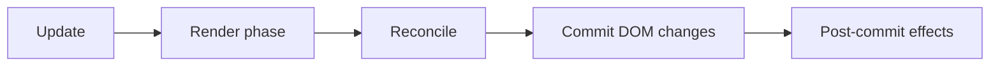

# Rendering Flow in React

## Detailed explanation
Rendering flow is the sequence React follows after data changes. A state update schedules work. React calls components to calculate the next UI description. It reconciles that output with the previous tree. Then it commits the necessary changes to the host environment, usually the browser DOM.

Understanding this flow is essential for debugging re-renders, memoization, StrictMode behavior, layout effects, and performance issues. A render does not automatically mean the DOM changed; it means React recalculated UI output.

## 1. One-line mental model
React rendering flow is update scheduled, components called, changes compared, DOM committed.

## 2. Problem it solves
Without a clear rendering model, developers confuse state updates, component renders, DOM updates, and effects, which leads to wrong performance fixes.

## 3. Core idea
- State/props/context updates schedule render work.
- Render phase calculates React elements.
- Reconciliation compares new and old output.
- Commit phase applies DOM changes.
- Post-commit work runs after the DOM is updated.

## 4. Visual / analogy
Rendering is like drafting, reviewing, then publishing a document.



## 5. Minimal example

```tsx
setCount((count) => count + 1);
```

This schedules React to render the component again; the DOM updates later during commit if output changed.

## 6. Real-world example

```tsx
function ProductPage({ product }: { product: Product }) {
  const priceLabel = formatCurrency(product.price);
  return <h1>{product.name} - {priceLabel}</h1>;
}
```

When `product` changes, React renders this component to calculate the new heading before committing DOM changes.

## 7. Common interview questions
- What happens after `setState`?
- Does render always update the DOM?
- What is render phase?
- What is commit phase?
- When do effects run?
- Why should render be pure?
- How does batching affect rendering?

## 8. Active recall test
1. What schedules a render?
2. What is calculated during render?
3. When does the DOM change?
4. Why can a component render without visible DOM changes?
5. Where does reconciliation fit?

## 9. Mistakes / traps
- Saying every render changes the DOM.
- Doing side effects during render.
- Measuring layout before commit.
- Assuming state updates are synchronous variable mutations.
- Optimizing before identifying actual expensive render work.

## 10. Compare with related concepts
- **Render vs commit:** render calculates; commit applies.
- **Render vs paint:** React commit updates DOM; browser paint draws pixels.
- **Render vs reconciliation:** render creates output; reconciliation compares output.

## 11. Summary from memory
Explain the full path from a button click state update to updated text on screen.

## 12. Spaced revision prompts
- After 1 day: Draw update → render → commit.
- After 3 days: Explain why render must be pure.
- After 7 days: Compare React commit and browser paint.
- After 14 days: Explain a render that does not change DOM.

