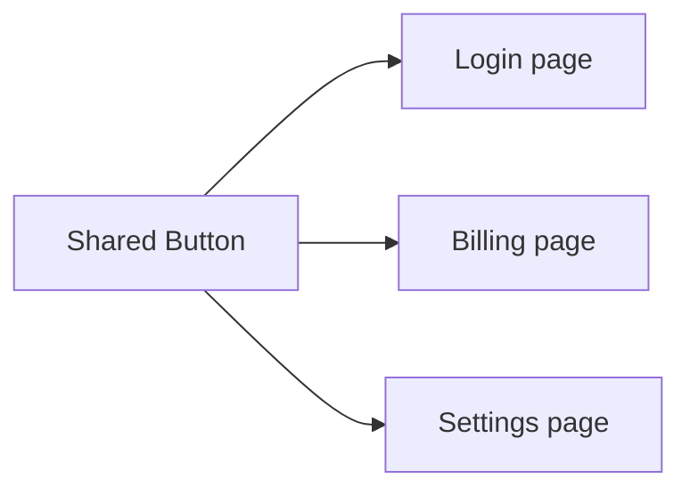

# Reusable Components

## Detailed explanation
A reusable component captures a repeated UI concept behind a stable API. Reuse is not about making the most generic component possible; it is about identifying a real shared pattern and giving it a clear contract. Examples include buttons, inputs, modals, empty states, cards, tables, and form fields.

Good reusable components handle accessibility, variants, disabled/loading states, and common behavior consistently. Bad reusable components become prop-heavy and domain-specific, which makes them harder to use than copying the markup.

## 1. One-line mental model
A reusable component has a stable purpose, clear API, and enough flexibility to be used in multiple places without copying or rewriting it.

## 2. Problem it solves
Repeated UI creates inconsistent behavior, duplicated bugs, and slow development. Reusable components centralize common UI patterns and make screens more consistent.

## 3. Core idea
- Reuse should come from a real repeated concept, not visual coincidence.
- Props should express intent.
- Accessibility should be built in.
- Styling variants should be controlled and documented.
- The component should hide internal details but not block valid use cases.

## 4. Visual / analogy
A reusable component is like a standard electrical socket: many devices can use it because the contract is stable.



## 5. Minimal example

```tsx
function Button({ children, variant = "primary" }: { children: React.ReactNode; variant?: "primary" | "secondary" }) {
  return <button data-variant={variant}>{children}</button>;
}
```

## 6. Real-world example

```tsx
type ButtonProps = React.ComponentPropsWithoutRef<"button"> & {
  variant?: "primary" | "danger" | "ghost";
  isLoading?: boolean;
};

function Button({ variant = "primary", isLoading, disabled, children, ...props }: ButtonProps) {
  return (
    <button disabled={disabled || isLoading} data-variant={variant} {...props}>
      {isLoading ? "Loading..." : children}
    </button>
  );
}
```

## 7. Common interview questions
#### What makes a component reusable?
- **The Engine Mechanism (Why it behaves this way):** A reusable component is one whose rendering output and behavior are parameterized through props rather than hardcoded. During the render phase, React calls the component function with different props, and the component produces different output based on those inputs. The component doesn't import feature-specific data, hardcode API endpoints, or reference specific route paths. Its state is limited to internal UI concerns (open/closed, loading, focused), not business data. This makes the component portable — it can be imported and used anywhere in the app because its dependencies are expressed entirely through its props interface.
- **The Unforgettable Mental Model:** The **Universal Power Adapter**. It works in any country (any page/feature) because it doesn't assume a specific outlet shape (hardcoded data). You just plug it in (pass props) and it works. A country-specific adapter (non-reusable component) only works in one place.
- **The Trap:** Assuming that extracting a component after seeing it used once makes it reusable. True reusability emerges from observing a pattern repeated 2-3 times with different data and contexts. Premature abstraction creates components that are flexible in the wrong ways.
- **Senior Interview Playbook (Verbal Script):** "When asked this in an interview, say: A reusable component has a clear, stable purpose and accepts all its varying data and behavior through props. It doesn't know about specific pages, API endpoints, or business logic. It handles its own accessibility, loading states, and variants consistently. I only extract a component as reusable after seeing the same pattern appear two or three times — premature abstraction leads to overly generic components that are harder to use than the original markup."

#### How do you design component props?
- **The Engine Mechanism (Why it behaves this way):** Props are the component's public API — the contract between the component and its consumers. During TypeScript compilation and React's render phase, props are validated against the component's type definition. Well-designed props express intent (`variant="danger"` not `isRed={true}`), extend native element props (`React.ComponentPropsWithoutRef<"button">`), and avoid boolean prop combinations that create conflicting states. React doesn't enforce prop design — it just passes whatever object you provide. Good prop design is a developer experience concern that affects how easily the component can be used correctly and how hard it is to misuse.
- **The Unforgettable Mental Model:** The **Restaurant Menu**. A good menu has clear categories, descriptive names, and no confusing combinations. You don't list every ingredient — you describe the dish. A bad menu has items like "Food Option 1 with or without stuff" — unclear and overwhelming.
- **The Trap:** Creating mutually exclusive boolean props (`isPrimary` and `isSecondary` both true) or props that conflict with each other. Use a discriminated union variant prop instead.
- **Senior Interview Playbook (Verbal Script):** "When asked this in an interview, say: I design props by first identifying what varies across use cases — content, appearance variants, behavior callbacks. I use descriptive prop names that express intent, extend native element props for HTML attributes, and avoid boolean prop combinations that can conflict. For variants, I use a single discriminated union prop like `variant='primary' | 'danger' | 'ghost'` instead of multiple booleans. The goal is a props API that's intuitive to use and hard to misuse."

#### How do you avoid over-abstraction?
- **The Engine Mechanism (Why it behaves this way):** Over-abstraction happens when a component tries to handle too many use cases through configuration, making it complex and hard to understand. During reconciliation, an over-abstracted component has many conditional branches in its render function, making the element tree harder for React to diff efficiently. The component's internal logic becomes a maze of `if` statements checking various prop combinations. The solution is to keep components focused on a single responsibility and compose them rather than configure them. If a component has more than 3-4 variant props, it's likely over-abstracted and should be split.
- **The Unforgettable Mental Model:** The **Swiss Army Knife vs. Chef's Knife Set**. A Swiss Army knife (over-abstracted component) does 20 things poorly. A chef's knife set (focused components) has a tool for each task, and each tool does one thing excellently. You compose the right tools for the job.
- **The Trap:** Abstracting based on visual similarity rather than behavioral similarity. Two cards that look alike may have completely different data requirements and interaction patterns.
- **Senior Interview Playbook (Verbal Script):** "When asked this in an interview, say: I avoid over-abstraction by waiting until a pattern appears at least two or three times before extracting it. I keep components focused on a single responsibility and use composition instead of configuration to handle variation. If a component needs more than three boolean flags to control its behavior, I split it into smaller components or use composition. The test is simple: if a new developer can't understand the component's purpose in 30 seconds, it's probably over-abstracted."

#### What belongs in a shared UI component?
- **The Engine Mechanism (Why it behaves this way):** Shared UI components should contain presentation logic, accessibility patterns, and common interaction behavior — not business data or feature-specific logic. During render, a shared component receives data through props and renders it consistently. It should handle its own focus management, keyboard navigation, ARIA attributes, loading states, and error states. It should not import API clients, read URL parameters, access global stores directly, or contain feature-specific conditional logic. The component's element tree should be purely a function of its props and minimal internal UI state.
- **The Unforgettable Mental Model:** The **Stage Crew**. The stage crew (shared component) handles lighting, curtains, microphones, and stage setup — the infrastructure that makes any performance possible. They don't write the script (business logic) or play the roles (feature-specific data).
- **The Trap:** Putting business logic in shared components "just this once." This creates hidden dependencies that make the component unusable in other contexts without modification.
- **Senior Interview Playbook (Verbal Script):** "When asked this in an interview, say: Shared UI components should own presentation, accessibility, and common interaction patterns — things like focus management, keyboard navigation, ARIA attributes, and visual variants. They should not contain business logic, API calls, route dependencies, or feature-specific data. A shared Button handles loading states and disabled behavior; it doesn't know about the checkout flow. The rule is: if the component can't be used in a completely different feature without modification, it doesn't belong in shared UI."

#### How do design-system components differ from domain components?
- **The Engine Mechanism (Why it behaves this way):** Design-system components are the foundational building blocks — Button, Input, Modal, Select — with strict APIs, comprehensive documentation, versioning, and accessibility guarantees. They are published as a package and consumed by domain components. Domain components are feature-specific compositions of design-system components — `ProductCard`, `CheckoutForm`, `UserSettingsPanel`. During render, design-system components are the leaf nodes that produce actual DOM elements, while domain components compose them into feature-specific layouts. Design-system components must be backward-compatible across versions; domain components can change freely with their feature.
- **The Unforgettable Mental Model:** The **Bricks vs. the House**. Design-system components are the standardized bricks, windows, and doors — consistent, tested, and interchangeable. Domain components are the rooms and floors built from those materials — each unique to the house's design.
- **The Trap:** Mixing design-system and domain concerns — adding feature-specific logic to a Button or making an Input component that knows about the checkout form. This pollutes the foundation.
- **Senior Interview Playbook (Verbal Script):** "When asked this in an interview, say: Design-system components are the foundational UI primitives — Button, Input, Modal — with strict APIs, accessibility guarantees, and versioning. They're product-agnostic and used across the entire application. Domain components are feature-specific compositions built from design-system components — like a ProductCard or CheckoutForm. Design-system components change rarely and require careful versioning; domain components change with their feature. The key separation is: design-system handles how things look and behave; domain handles what data they show and what business rules they enforce."

#### How do you handle variants?
- **The Engine Mechanism (Why it behaves this way):** Variants are different visual or behavioral modes of a component, controlled by a prop (usually `variant`). During the render phase, the component reads the variant prop and applies different CSS classes, styles, or renders different sub-elements. The variant prop should be a discriminated union type (`"primary" | "secondary" | "danger"`) so TypeScript catches invalid values at compile time. The component maps each variant to its corresponding style configuration — often through a lookup object or CSS class mapping. React's reconciliation handles variant changes efficiently because the component's element type stays the same; only the className or style props change.
- **The Unforgettable Mental Model:** The **Chameleon**. Same animal (component), different colors (variants) depending on the environment. The underlying structure doesn't change — just the surface appearance.
- **The Trap:** Adding variants endlessly without a design system rationale. Each variant should correspond to a real design need, not a one-off request. Use composition for truly different structures.
- **Senior Interview Playbook (Verbal Script):** "When asked this in an interview, say: I handle variants through a single discriminated union prop — like `variant: 'primary' | 'secondary' | 'danger'` — that maps to specific style configurations. This keeps the API clean and TypeScript catches invalid values. Variants should reflect the design system's actual needs, not one-off requests. If a variant requires significantly different structure or behavior, it's probably a different component, not a variant."

#### How do you test reusable components?
- **The Engine Mechanism (Why it behaves this way):** Reusable components are tested by rendering them with various props and asserting on their output and behavior. Testing libraries like Testing Library render the component into a virtual DOM (jsdom), then query the resulting DOM tree to verify rendered content, ARIA attributes, and interaction behavior. Tests cover: default rendering, all variants, disabled/loading states, event handlers (click, change, submit), accessibility (keyboard navigation, screen reader labels), and edge cases (empty children, long text, missing props). Each test creates an isolated render — React mounts the component, runs its render function, commits to the test DOM, and the test asserts on the result. Tests don't verify implementation details (state, hooks) — only observable output and behavior.
- **The Unforgettable Mental Model:** The **Car Crash Test Dummy**. You don't test by opening the hood and checking each wire (implementation). You test by driving the car into a wall and seeing if the airbag deploys (observable behavior). Same with components — test what the user sees and does.
- **The Trap:** Testing implementation details — checking if a specific hook was called, if state has a certain value, or if a CSS class exists for styling reasons. Tests should verify user-visible output and behavior.
- **Senior Interview Playbook (Verbal Script):** "When asked this in an interview, say: I test reusable components by rendering them with different props and asserting on user-visible output and behavior. I test all variants, disabled and loading states, event handlers, and accessibility — keyboard navigation and ARIA attributes. I use Testing Library because it encourages testing from the user's perspective: what's on screen, what can be clicked, what gets announced. I avoid testing implementation details like internal state or specific hook calls, because those are implementation concerns that shouldn't break when I refactor."

## 8. Active recall test
1. **When should duplication become a reusable component?**
   - **Explanation:** After seeing the same UI pattern appear 2-3 times across different features with different data. One occurrence is coincidence; two is a pattern; three is a rule. Extracting after a single use often leads to over-abstraction.
2. **What should reusable components not know about?**
   - **Explanation:** Reusable components should not know about specific pages, API endpoints, route parameters, global stores, or feature-specific business logic. Their only dependencies should be their props and minimal internal UI state.
3. **Why should accessibility be built in?**
   - **Explanation:** If accessibility is an afterthought, each consumer must remember to add ARIA attributes, keyboard handlers, and focus management. Building it in ensures every instance of the component is accessible by default, reducing bugs and ensuring consistency.
4. **What is prop explosion?**
   - **Explanation:** Prop explosion is when a component accumulates too many props (especially boolean flags) trying to handle every possible variation. It makes the API confusing, creates conflicting prop combinations, and makes the component's render logic a maze of conditionals.
5. **How do variants help reuse?**
   - **Explanation:** Variants let a single component serve multiple visual or behavioral needs through a controlled API (`variant="primary" | "danger"`). Instead of creating separate ButtonPrimary and ButtonDanger components, one Button component handles both, reducing duplication while maintaining consistency.

## 9. Mistakes / traps
- Abstracting after only one usage.
- Creating generic names like `CommonComponent`.
- Adding many boolean props that conflict.
- Baking feature-specific business logic into shared UI.
- Ignoring keyboard and screen reader behavior.

## 10. Compare with related concepts
- **Reusable vs shared:** shared means available; reusable means the API is actually useful in multiple contexts.
- **Reusable vs generic:** reusable still has a clear purpose.
- **Reusable vs design-system:** design-system components require stronger standards, docs, and versioning.

## 11. Summary from memory
Explain how you would design a reusable `Button` component for a product app.

## 12. Spaced revision prompts
- After 1 day: Define reusable component.
- After 3 days: List bad signs in a reusable API.
- After 7 days: Design variants for a button.
- After 14 days: Decide whether a component belongs in `shared/ui`.
