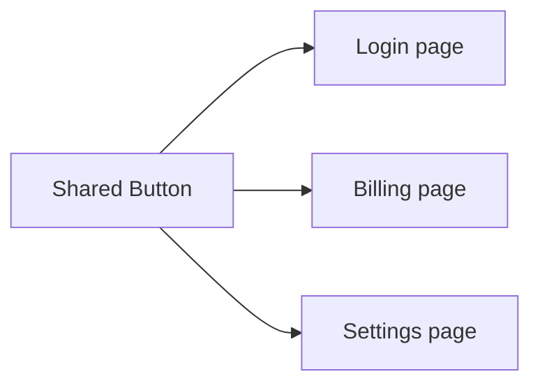

# Reusable Components

## Detailed explanation
A reusable component captures a repeated UI concept behind a stable API. Reuse is not about making the most generic component possible; it is about identifying a real shared pattern and giving it a clear contract. Examples include buttons, inputs, modals, empty states, cards, tables, and form fields.

Good reusable components handle accessibility, variants, disabled/loading states, and common behavior consistently. Bad reusable components become prop-heavy and domain-specific, which makes them harder to use than copying the markup.

## 1. One-line mental model
A reusable component has a stable purpose, clear API, and enough flexibility to be used in multiple places without copying or rewriting it.

## 2. Problem it solves
Repeated UI creates inconsistent behavior, duplicated bugs, and slow development. Reusable components centralize common UI patterns and make screens more consistent.

## 3. Core idea
- Reuse should come from a real repeated concept, not visual coincidence.
- Props should express intent.
- Accessibility should be built in.
- Styling variants should be controlled and documented.
- The component should hide internal details but not block valid use cases.

## 4. Visual / analogy
A reusable component is like a standard electrical socket: many devices can use it because the contract is stable.



## 5. Minimal example

```tsx
function Button({ children, variant = "primary" }: { children: React.ReactNode; variant?: "primary" | "secondary" }) {
  return <button data-variant={variant}>{children}</button>;
}
```

## 6. Real-world example

```tsx
type ButtonProps = React.ComponentPropsWithoutRef<"button"> & {
  variant?: "primary" | "danger" | "ghost";
  isLoading?: boolean;
};

function Button({ variant = "primary", isLoading, disabled, children, ...props }: ButtonProps) {
  return (
    <button disabled={disabled || isLoading} data-variant={variant} {...props}>
      {isLoading ? "Loading..." : children}
    </button>
  );
}
```

## 7. Common interview questions
- What makes a component reusable?
- How do you design component props?
- How do you avoid over-abstraction?
- What belongs in a shared UI component?
- How do design-system components differ from domain components?
- How do you handle variants?
- How do you test reusable components?

## 8. Active recall test
1. When should duplication become a reusable component?
2. What should reusable components not know about?
3. Why should accessibility be built in?
4. What is prop explosion?
5. How do variants help reuse?

## 9. Mistakes / traps
- Abstracting after only one usage.
- Creating generic names like `CommonComponent`.
- Adding many boolean props that conflict.
- Baking feature-specific business logic into shared UI.
- Ignoring keyboard and screen reader behavior.

## 10. Compare with related concepts
- **Reusable vs shared:** shared means available; reusable means the API is actually useful in multiple contexts.
- **Reusable vs generic:** reusable still has a clear purpose.
- **Reusable vs design-system:** design-system components require stronger standards, docs, and versioning.

## 11. Summary from memory
Explain how you would design a reusable `Button` component for a product app.

## 12. Spaced revision prompts
- After 1 day: Define reusable component.
- After 3 days: List bad signs in a reusable API.
- After 7 days: Design variants for a button.
- After 14 days: Decide whether a component belongs in `shared/ui`.
