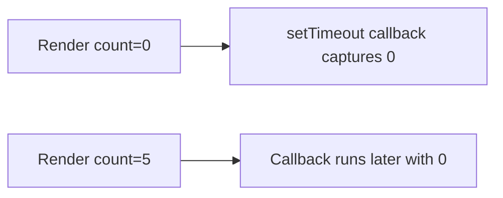

# Stale Closures

## Detailed explanation
A stale closure happens when a function captures an old value from a previous render and later runs with that outdated value. This often appears in timers, event listeners, async callbacks, effects with missing dependencies, and memoized callbacks.

React components are functions. Each render creates a new scope with its own props and state values. Closures created during that render see those values forever unless recreated with updated dependencies or written using functional updates/refs.

## 1. One-line mental model
A stale closure is a callback reading values from an old render.

## 2. Problem it solves
The concept explains bugs where handlers, timers, or async code seem to use old state even after the UI updated.

## 3. Core idea
- Every render has its own values.
- Functions close over the values from their render.
- Missing dependencies keep old closures alive.
- Functional updates avoid stale previous state.
- Refs can store latest mutable values when appropriate.

## 4. Visual / analogy
A stale closure is like reading yesterday's newspaper to know today's weather.



## 5. Minimal example

```tsx
setTimeout(() => {
  setCount(count + 1);
}, 1000);
```

If `count` changes before timeout runs, this callback may use the old value.

## 6. Real-world example

```tsx
setCount((current) => current + 1);
```

Functional update reads the latest state React provides instead of captured `count`.

## 7. Common interview questions
#### What is a stale closure?
- **The Engine Mechanism (Why it behaves this way):** A stale closure is a function that captures (closes over) variables from a specific render's scope and later executes with those outdated values. In React, each render creates a new execution context with its own props and state values. When a function is created during render — an event handler, effect callback, or timer — it captures the values from that render's context. If the function executes later (after a timeout, async response, or event), and the component has re-rendered with new values in the meantime, the function still sees the old captured values. The closure is "stale" because it references a snapshot of state from a previous render.
- **The Unforgettable Mental Model:** The **Photograph vs. the Live Feed**. A closure is a photograph — it captures a moment in time. State updates are a live video feed — they keep changing. When you look at the photograph later, you see what was true then, not what's true now.
- **The Trap:** Thinking closures are a React-specific problem. They're a fundamental JavaScript concept — React just makes them more visible because each render is a new function invocation with new variable bindings.
- **Senior Interview Playbook (Verbal Script):** "When asked this in an interview, say: A stale closure is a function that captures values from a previous render and later executes with those outdated values. In React, each render creates a new scope with its own props and state. Functions created during that render close over those specific values. If the function runs later — after a timeout, async callback, or event — and the component has re-rendered with new values, the function still sees the old captured values. This is a JavaScript closure behavior that becomes particularly visible in React's render-per-update model."

#### Why do stale closures happen in React?
- **The Engine Mechanism (Why it behaves this way):** React components are functions. Each render is a new function invocation with new local variables for props and state. When you create a function inside a component — whether it's an event handler, an effect callback, or a `setTimeout` callback — that function captures the current render's variables in its closure scope. React doesn't update existing closures when state changes; it creates new closures on the next render. If an old closure is still referenced (by a timer, event listener, or promise), it continues to reference the old render's variables. This is by design — it's what makes React's snapshot-based rendering model predictable.
- **The Unforgettable Mental Model:** The **Snapshot Camera**. Every time React renders, it takes a snapshot of all values. Functions created during that render hold onto that snapshot. When state changes, React takes a new snapshot, but the old functions still hold the old snapshot.
- **The Trap:** Assuming that `count` inside a callback always reflects the current state. It reflects the state at the time the callback was created, not the current state.
- **Senior Interview Playbook (Verbal Script):** "When asked this in an interview, say: Stale closures happen because React's rendering model creates a new scope on every render. Each render has its own props and state values, and functions created during that render capture those specific values in their closure. When state changes, React creates a new render with new values, but any functions from the previous render still reference the old values. This is fundamental to how JavaScript closures work — React just makes it more visible because every render is a new function call. The solution is to either recreate the function with new dependencies, use functional state updates, or use refs to access the latest values."

#### How do dependency arrays relate?
- **The Engine Mechanism (Why it behaves this way):** Dependency arrays control when React recreates a function or re-runs an effect. When all dependencies are listed, React recreates the function with fresh values from the current render whenever any dependency changes. When a dependency is missing, React doesn't recreate the function, so it continues to use the closure from the render when it was originally created. The dependency array is React's mechanism for keeping closures fresh — it tells React which values, when changed, should trigger the creation of a new closure with updated values.
- **The Unforgettable Mental Model:** The **Subscription Renewal**. The dependency array is your subscription auto-renewal list. When any item on the list changes, your subscription (closure) renews with the latest information. If you remove an item from the list, you stop getting updates about it — you're stuck with old information.
- **The Trap:** Removing dependencies to stop an effect from re-running. This "fixes" the re-run problem but creates a stale closure — the effect now uses outdated values.
- **Senior Interview Playbook (Verbal Script):** "When asked this in an interview, say: Dependency arrays are the primary mechanism for preventing stale closures. When you list all reactive values as dependencies, React recreates the function or re-runs the effect whenever any of those values change, ensuring the closure always has fresh values. When you omit a dependency, React doesn't recreate the function, so it keeps using the old closure with stale values. The ESLint exhaustive-deps rule enforces this by flagging missing dependencies. The fix for stale closures is almost always to add the missing dependency or restructure the code so the dependency isn't needed."

#### How do functional updates fix stale state?
- **The Engine Mechanism (Why it behaves this way):** Functional updates pass a function to the state setter: `setState(prev => prev + 1)`. React stores this function in the hook's update queue. When processing updates during the render phase, React calls the function with the most recent state value — not the value captured in the closure. This works because React's update queue processes functions sequentially, passing the result of each update as the input to the next. Even if the closure captured an old state value, the functional update receives the current state from React's internal `memoizedState`, bypassing the stale closure entirely.
- **The Unforgettable Mental Model:** The **Conveyor Belt Recipe**. Instead of saying "add 1 to the number on the table" (which might be outdated), you hand the worker a recipe card: "take whatever is currently on the belt and add 1." The worker always uses the freshest item on the belt.
- **The Trap:** Thinking functional updates only matter for batched updates. They also matter for any closure that captures an old state value — timers, async callbacks, and event handlers.
- **Senior Interview Playbook (Verbal Script):** "When asked this in an interview, say: Functional updates fix stale state by bypassing the closure entirely. Instead of reading a captured state value, you pass a function to the setter that receives the latest state as an argument. React calls this function during update processing with the current `memoizedState`, so you always get the freshest value. This is essential for timers, intervals, and async callbacks where the closure might capture an old render's state. `setCount(prev => prev + 1)` always increments from the latest count, regardless of what `count` was when the callback was created."

#### When should refs be used for latest values?
- **The Engine Mechanism (Why it behaves this way):** A ref can store the latest value of a prop or state by updating `ref.current` on every render. Because the ref object is stable across renders, any closure that references the ref always reads from the same object. When you update `ref.current` during render, all closures — even old ones — see the new value because they all reference the same object. This is useful when you need the latest value inside a callback but can't or don't want to include the value as a dependency (e.g., to avoid re-creating a timer or re-subscribing).
- **The Unforgettable Mental Model:** The **Shared Whiteboard**. Every render writes the current value on the same whiteboard (ref). Any callback, no matter when it was created, can look at the whiteboard and see the latest value. The whiteboard is shared across all renders.
- **The Trap:** Using refs for everything to avoid dependency arrays. This defeats React's declarative model and makes code harder to reason about. Refs should be a targeted solution, not a blanket workaround.
- **Senior Interview Playbook (Verbal Script):** "When asked this in an interview, say: I use refs for latest values when I need access to current state or props inside a callback but can't include them as dependencies without causing problems — like re-creating a timer or re-subscribing to an event. The pattern is: update `ref.current` on every render, then read from the ref inside the callback. This gives the callback access to the latest value without recreating it. Common use cases are interval callbacks, WebSocket message handlers, and event listeners that need current state but should only be set up once."

#### How do timers create stale closures?
- **The Engine Mechanism (Why it behaves this way):** When you call `setTimeout` or `setInterval` inside a component or effect, the callback captures the state values from the render when the timer was created. If the component re-renders before the timer fires, the timer callback still references the old state values. For `setInterval`, this is especially problematic — the callback fires repeatedly, always with the same stale values from the initial render, because the interval was set up once and never recreated. The timer's callback closure is frozen at creation time.
- **The Unforgettable Mental Model:** The **Delayed Mail**. You write a letter (timer callback) with today's news (current state) and mail it with a 5-day delay (setTimeout). If the news changes during those 5 days, the letter still contains the old news when it arrives.
- **The Trap:** Using `setInterval` with state: `setInterval(() => setCount(count + 1), 1000)`. The `count` is captured from the initial render and never updates, so the interval sets the same value repeatedly.
- **Senior Interview Playbook (Verbal Script):** "When asked this in an interview, say: Timers create stale closures because the callback captures state values from the render when the timer was created. If the component re-renders before the timer fires, the callback still sees the old values. For `setInterval`, this is especially bad — the callback fires repeatedly with the same stale values. The fix is to use functional state updates: `setCount(prev => prev + 1)` instead of `setCount(count + 1)`. Or, use a ref to store the latest value and read from the ref inside the timer callback. For intervals, I also make sure to clear and restart the interval when relevant dependencies change."

#### How do async requests create stale closures?
- **The Engine Mechanism (Why it behaves this way):** When you make an async request (fetch, API call) inside an effect, the response callback captures state values from the render when the request was initiated. If the component re-renders before the response arrives — because props changed, the user navigated, or the component unmounted — the response callback still references the old state. This can cause race conditions where an older request's response overwrites a newer request's result, or state updates on an unmounted component. The async callback's closure is frozen at the time of the request, not the time of the response.
- **The Unforgettable Mental Model:** The **Out-of-Order Delivery**. You order Package A, then Package B. Package B arrives first, but Package A's delivery person still shows up later and tries to deliver to the old address. The deliveries arrive out of order, and the old one might overwrite the new one.
- **The Trap:** Not handling component unmount or request cancellation. If the component unmounts before the response arrives, calling `setState` in the callback causes a memory leak warning and potentially crashes.
- **Senior Interview Playbook (Verbal Script):** "When asked this in an interview, say: Async requests create stale closures because the response callback captures state from when the request was made, not when it completes. If the component re-renders or unmounts before the response arrives, the callback uses outdated values or tries to update an unmounted component. I handle this with three patterns: first, use `AbortController` to cancel in-flight requests on cleanup. Second, use a flag or ref to check if the component is still mounted before updating state. Third, for race conditions, I track the latest request with a ref or use a library like TanStack Query that handles caching and cancellation automatically."

## 8. Active recall test
1. **What does a closure capture?**
   - **Explanation:** The values of variables from the render's execution scope at the time the function was created. These values are frozen — they don't update when the component re-renders with new values.
2. **Why does each render have different values?**
   - **Explanation:** Each render is a new function invocation. Props and state are local variables in that function call. A new invocation creates new local variables with new values, independent of previous renders.
3. **How does functional update help?**
   - **Explanation:** It bypasses the closure by passing a function to the setter that receives the latest state from React's internal queue. `setState(prev => prev + 1)` always uses the freshest state, not the captured value.
4. **How can missing dependencies create stale closures?**
   - **Explanation:** When a dependency is omitted, React doesn't recreate the function when that value changes. The function continues to use the closure from the render when it was created, reading outdated values.
5. **Give one timer example.**
   - **Explanation:** `setInterval(() => setCount(count + 1), 1000)` — `count` is captured from the initial render and never updates. Fix: `setInterval(() => setCount(prev => prev + 1), 1000)` uses functional update to always increment from the latest value.

## 9. Mistakes / traps
- Disabling exhaustive-deps.
- Assuming state variables mutate in place.
- Using old state inside delayed callbacks.
- Adding refs everywhere instead of fixing dependencies.
- Not canceling async work.

## 10. Compare with related concepts
- **Stale closure vs stale server data:** closure is old render value; server data is old backend snapshot.
- **Functional update vs dependency update:** functional update fixes previous-state updates; dependencies recreate logic.
- **Ref vs closure:** ref can hold latest mutable value; closure holds render-time value.

## 11. Summary from memory
Explain why `setInterval` often shows stale state and how to fix it.

## 12. Spaced revision prompts
- After 1 day: Define stale closure.
- After 3 days: Fix stale timeout state.
- After 7 days: Explain closure per render.
- After 14 days: Compare refs and functional updates.

