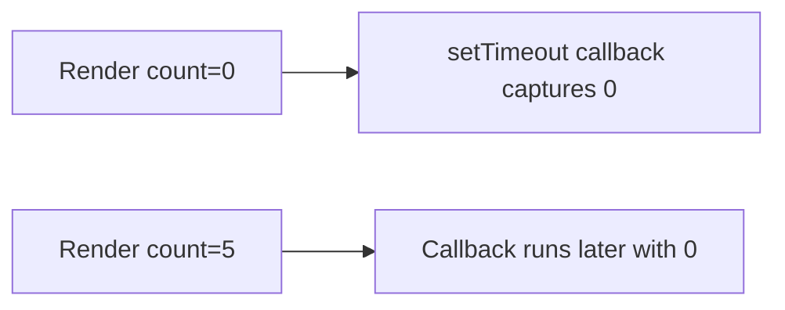

# Stale Closures

## Detailed explanation
A stale closure happens when a function captures an old value from a previous render and later runs with that outdated value. This often appears in timers, event listeners, async callbacks, effects with missing dependencies, and memoized callbacks.

React components are functions. Each render creates a new scope with its own props and state values. Closures created during that render see those values forever unless recreated with updated dependencies or written using functional updates/refs.

## 1. One-line mental model
A stale closure is a callback reading values from an old render.

## 2. Problem it solves
The concept explains bugs where handlers, timers, or async code seem to use old state even after the UI updated.

## 3. Core idea
- Every render has its own values.
- Functions close over the values from their render.
- Missing dependencies keep old closures alive.
- Functional updates avoid stale previous state.
- Refs can store latest mutable values when appropriate.

## 4. Visual / analogy
A stale closure is like reading yesterday's newspaper to know today's weather.



## 5. Minimal example

```tsx
setTimeout(() => {
  setCount(count + 1);
}, 1000);
```

If `count` changes before timeout runs, this callback may use the old value.

## 6. Real-world example

```tsx
setCount((current) => current + 1);
```

Functional update reads the latest state React provides instead of captured `count`.

## 7. Common interview questions
- What is a stale closure?
- Why do stale closures happen in React?
- How do dependency arrays relate?
- How do functional updates fix stale state?
- When should refs be used for latest values?
- How do timers create stale closures?
- How do async requests create stale closures?

## 8. Active recall test
1. What does a closure capture?
2. Why does each render have different values?
3. How does functional update help?
4. How can missing dependencies create stale closures?
5. Give one timer example.

## 9. Mistakes / traps
- Disabling exhaustive-deps.
- Assuming state variables mutate in place.
- Using old state inside delayed callbacks.
- Adding refs everywhere instead of fixing dependencies.
- Not canceling async work.

## 10. Compare with related concepts
- **Stale closure vs stale server data:** closure is old render value; server data is old backend snapshot.
- **Functional update vs dependency update:** functional update fixes previous-state updates; dependencies recreate logic.
- **Ref vs closure:** ref can hold latest mutable value; closure holds render-time value.

## 11. Summary from memory
Explain why `setInterval` often shows stale state and how to fix it.

## 12. Spaced revision prompts
- After 1 day: Define stale closure.
- After 3 days: Fix stale timeout state.
- After 7 days: Explain closure per render.
- After 14 days: Compare refs and functional updates.

