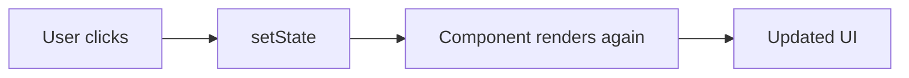

# State in React

## Detailed explanation
State is data a component owns and remembers between renders. When state changes, React schedules another render so the UI can reflect the new value. Examples include input text, selected tab, open modal state, expanded rows, and local counters.

State should be minimal, colocated, and immutable. If a value can be calculated from props or existing state, it usually should not be stored separately. This avoids duplicated state and keeps rendering predictable.

## 1. One-line mental model
State is component-owned data that can change over time and cause React to render updated UI.

## 2. Problem it solves
Interactive UIs need to remember things: input values, open panels, selected tabs, fetched results, and user choices. State gives React a structured way to store changing data and update the screen when it changes.

## 3. Core idea
- State belongs to the component that owns the behavior.
- Updating state schedules a re-render.
- State should be treated immutably.
- Derived values should usually be calculated during render, not duplicated in state.
- State should live as close as possible to where it is used.

## 4. Visual / analogy
State is the component's memory.



## 5. Minimal example

```tsx
function Counter() {
  const [count, setCount] = React.useState(0);
  return <button onClick={() => setCount(count + 1)}>{count}</button>;
}
```

## 6. Real-world example

```tsx
function Tabs({ tabs }: { tabs: Tab[] }) {
  const [activeId, setActiveId] = React.useState(tabs[0].id);

  return (
    <>
      {tabs.map((tab) => (
        <button key={tab.id} onClick={() => setActiveId(tab.id)}>
          {tab.label}
        </button>
      ))}
      <TabPanel tab={tabs.find((tab) => tab.id === activeId)} />
    </>
  );
}
```

The selected tab is state because it changes through interaction.

## 7. Common interview questions
- What is state in React?
- How is state different from props?
- Why should state be immutable?
- Why does state not update immediately?
- What is derived state?
- Where should state live?
- What is state colocation?
- When should state be lifted up?

## 8. Active recall test
1. What happens when state is updated?
2. Why should arrays and objects in state not be mutated?
3. What is duplicated state?
4. When should state move to a parent?
5. Why is state called component memory?

## 9. Mistakes / traps
- Mutating state directly.
- Storing values that can be derived from existing state or props.
- Putting all state in a global store.
- Expecting state variables to change immediately after calling the setter.
- Keeping state too high in the tree and causing extra re-renders.

## 10. Compare with related concepts
- **State vs props:** state is owned locally; props are received.
- **State vs ref:** state changes re-render; ref changes do not.
- **State vs derived value:** state is stored; derived value is calculated.
- **State vs server cache:** server cache mirrors backend-owned data.

## 11. Summary from memory
Explain how state drives a tab component and why the active tab should not be hardcoded in the DOM.

## 12. Spaced revision prompts
- After 1 day: Define state and props.
- After 3 days: Explain immutable updates.
- After 7 days: Identify duplicated state in an example.
- After 14 days: Explain state colocation and lifting state up.
