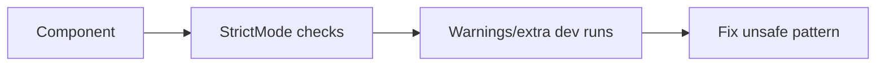

# StrictMode

## Detailed explanation
`StrictMode` is a development-only React tool that helps detect unsafe patterns. It can intentionally double-invoke render-related behavior and remount components in development to reveal side effects, missing cleanup, and code that depends on mounting only once.

StrictMode does not affect production behavior directly. Its value is making bugs visible earlier, especially as React supports more concurrent and interruptible rendering patterns.

## 1. One-line mental model
StrictMode is a development checker that intentionally stresses components to expose unsafe code.

## 2. Problem it solves
Components can accidentally rely on impure rendering, missing cleanup, deprecated APIs, or mount-only assumptions that break under modern React behavior.

## 3. Core idea
- Enabled with `<React.StrictMode>`.
- Runs only in development.
- Helps find unsafe side effects.
- May double-run certain logic to expose bugs.
- Does not render duplicate UI in production.

## 4. Visual / analogy
StrictMode is like a fire drill: inconvenient during practice, valuable before real failure.



## 5. Minimal example

```tsx
root.render(
  <React.StrictMode>
    <App />
  </React.StrictMode>,
);
```

## 6. Real-world example

```tsx
function AppRoot() {
  return (
    <React.StrictMode>
      <QueryClientProvider client={queryClient}>
        <RouterProvider router={router} />
      </QueryClientProvider>
    </React.StrictMode>
  );
}
```

## 7. Common interview questions
#### What is StrictMode?
- **The Engine Mechanism (Why it behaves this way):** `StrictMode` is a React component (`<React.StrictMode>`) that enables additional development-only checks for its descendants. During development, it intentionally double-invokes certain functions: component functions (render), `useState` initializer functions, `useReducer` initializer functions, `useMemo` computefunctions, `useRef` initializer functions, class component constructors, `render` methods, `getDerivedStateFromProps`, and the body of function components. It also double-invokes effects (mount → unmount → mount). These checks help identify components with unsafe patterns like impure renders, missing effect cleanup, or assumptions about mount frequency. StrictMode has no effect in production builds.
- **The Unforgettable Mental Model:** The **Stress Test**. StrictMode is like shaking a newly built shelf twice as hard as normal to see if it falls apart. If it survives the stress test, it'll handle everyday use fine. The extra shaking doesn't happen in production — it's just a development safety check.
- **The Trap:** Thinking StrictMode changes production behavior. It doesn't. All double-invocations and extra checks are stripped out in production builds.
- **Senior Interview Playbook (Verbal Script):** "When asked this in an interview, say: StrictMode is a development-only tool that helps detect unsafe patterns in React components. It intentionally double-invokes render functions, effect setup/cleanup, and state initializers to surface bugs related to impure rendering, missing cleanup, or assumptions about mount frequency. It has zero impact on production builds — all extra checks are removed. Think of it as a stress test that makes bugs visible during development so they don't reach users."

#### Does StrictMode run in production?
- **The Engine Mechanism (Why it behaves this way):** No. StrictMode's extra checks are completely stripped from production builds. React's build process (via `process.env.NODE_ENV === 'production'`) removes all StrictMode-specific code paths. This includes the double-invocation of renders, effects, and initializers. The `<React.StrictMode>` component still exists in production but acts as a no-op passthrough — it renders its children without any additional behavior. This design ensures that development-time checks don't impact production performance or user experience.
- **The Unforgettable Mental Model:** The **Training Wheels**. StrictMode is like training wheels on a bike — they help you learn and catch problems while practicing, but they come off when you're riding for real (production).
- **The Trap:** Removing StrictMode from development because the double-rendering is annoying. This hides bugs that will still exist in production, even if they're harder to reproduce.
- **Senior Interview Playbook (Verbal Script):** "When asked this in an interview, say: No, StrictMode does not run in production. All of its extra checks — double-rendering, double-effect invocation, state initializer checks — are completely removed from production builds. The `<React.StrictMode>` component becomes a no-op passthrough. This is intentional: the checks exist only to surface bugs during development, not to affect production performance or behavior."

#### Why does React render twice in development?
- **The Engine Mechanism (Why it behaves this way):** React double-renders components in StrictMode to detect impure render functions. A pure render function should produce the same output given the same inputs (props and state). If a component has side effects in its render body (like mutating state, making API calls, or using `Math.random()` without seeding), the second render will produce different results or cause errors. By rendering twice, React surfaces these impurities immediately. Additionally, React double-invokes effects (mount → unmount → mount) to verify that cleanup functions properly tear down side effects. If cleanup is missing, the second mount will reveal duplicate subscriptions, memory leaks, or stale state.
- **The Unforgettable Mental Model:** The **Proofread**. When you write an important document, you read it twice to catch mistakes. The first read finds obvious errors; the second read catches things you missed. React's double-render is the same — it reads your component twice to catch impurities that a single pass might miss.
- **The Trap:** Thinking the double-render is a bug or that it happens in production. It's an intentional development check. Writing code that only works on the first render is a bug in your code, not in React.
- **Senior Interview Playbook (Verbal Script):** "When asked this in an interview, say: React renders twice in StrictMode development to detect impure render functions. A pure render should always produce the same output for the same inputs. If a component has side effects in its render body — like mutating state, making API calls, or using random values — the second render will expose the problem. React also double-invokes effects (mount, unmount, remount) to verify that cleanup functions work correctly. This catches missing cleanup that would cause memory leaks or duplicate subscriptions in production when components remount."

#### Why does effect cleanup matter in StrictMode?
- **The Engine Mechanism (Why it behaves this way):** In StrictMode, React mounts effects, immediately unmounts them (running cleanup), then mounts them again. This simulates a scenario where a component unmounts and remounts, which can happen in real applications due to Suspense boundaries, concurrent rendering, or conditional rendering. If an effect doesn't properly clean up (e.g., doesn't remove an event listener, disconnect an observer, or abort a fetch), the cleanup-less unmount leaves behind stale subscriptions. When the component remounts, a new subscription is created, resulting in duplicates. The second mount will then have two listeners firing for the same event, causing bugs like double API calls, memory leaks, or stale closures.
- **The Unforgettable Mental Model:** The **Hotel Room Turnover**. When a guest checks out, housekeeping must clean the room before the next guest arrives. If they don't (missing cleanup), the next guest finds the previous guest's belongings still there. When both guests' things are in the room, chaos ensues.
- **The Trap:** Writing effects that work fine without StrictMode but fail when it's enabled. This doesn't mean StrictMode is broken — it means your effect has a latent cleanup bug that would surface in production under Suspense or concurrent rendering.
- **Senior Interview Playbook (Verbal Script):** "When asked this in an interview, say: StrictMode mounts effects, unmounts them (running cleanup), then remounts them. This simulates real-world scenarios where components unmount and remount due to Suspense or concurrent rendering. If your effect doesn't clean up properly — like removing event listeners or aborting fetches — the unmount leaves behind stale subscriptions. The remount creates duplicates, causing bugs like double API calls or memory leaks. Proper cleanup ensures your effect is resilient to remounting, which is essential for concurrent React."

#### Should you remove StrictMode to fix duplicate logs?
- **The Engine Mechanism (Why it behaves this way):** No. Removing StrictMode doesn't fix the underlying issue — it just hides it. Duplicate logs in development are a symptom of missing effect cleanup or impure renders. These bugs still exist in production; they're just harder to notice because effects only mount once in production (unless the component actually remounts due to Suspense, key changes, or conditional rendering). The correct fix is to add proper cleanup to effects, ensure renders are pure, and make components resilient to remounting. Removing StrictMode is like turning off a smoke detector instead of putting out the fire.
- **The Unforgettable Mental Model:** The **Check Engine Light**. When your car's check engine light comes on, you don't remove the bulb — you fix the engine. StrictMode's duplicate logs are the check engine light for your React code.
- **The Trap:** Blaming StrictMode for "causing" duplicate API calls. StrictMode doesn't cause the bug — it reveals it. In production, the bug may still occur when components remount due to navigation, Suspense, or state changes.
- **Senior Interview Playbook (Verbal Script):** "When asked this in an interview, say: No, you should never remove StrictMode to fix duplicate logs. The duplicates are a symptom of missing effect cleanup or impure renders — bugs that exist in your code, not in React. Removing StrictMode hides the problem but doesn't fix it. In production, these bugs can still surface when components remount due to Suspense, key changes, or conditional rendering. The correct fix is to add proper cleanup to effects, ensure renders are pure, and make components resilient to remounting."

#### What bugs does StrictMode reveal?
- **The Engine Mechanism (Why it behaves this way):** StrictMode reveals several categories of bugs: (1) **Impure renders**: side effects in render functions (API calls, DOM mutations, state mutations) that produce different results on each render. (2) **Missing effect cleanup**: effects that don't return cleanup functions, leading to duplicate subscriptions, memory leaks, or stale closures when components remount. (3) **Deprecated API usage**: warnings about legacy patterns like `findDOMNode`, string refs, or legacy context. (4) **Unsafe lifecycle methods**: warnings about `componentWillMount`, `componentWillReceiveProps`, and `componentWillUpdate` which are incompatible with async rendering. (5) **Unexpected side effects**: code that assumes components mount only once or that effects run only once.
- **The Unforgettable Mental Model:** The **X-Ray Machine**. StrictMode is like an X-ray that reveals hidden fractures in your code. The fractures were always there, but you couldn't see them without the right tool.
- **The Trap:** Assuming that if code works without StrictMode, it's correct. Code can appear to work in simple cases but fail under concurrent rendering or Suspense.
- **Senior Interview Playbook (Verbal Script):** "When asked this in an interview, say: StrictMode reveals several categories of bugs: impure renders with side effects, missing effect cleanup that causes duplicate subscriptions or memory leaks, deprecated API usage, unsafe lifecycle methods, and code that incorrectly assumes components mount only once. These bugs may not cause issues in simple production scenarios, but they will surface under concurrent rendering, Suspense boundaries, or when components remount due to navigation or state changes."

#### How does StrictMode relate to concurrent rendering?
- **The Engine Mechanism (Why it behaves this way):** StrictMode prepares your code for concurrent rendering by enforcing patterns that are safe under React's concurrent features. In concurrent mode, React can pause, resume, and restart rendering work. Components may render multiple times before committing, and effects may run multiple times as components mount and unmount. StrictMode's double-invocation in development simulates this behavior, ensuring your components are resilient to multiple renders and effect invocations. Code that works correctly under StrictMode will work correctly under concurrent rendering. Code that fails StrictMode checks will likely have bugs when concurrent features are used.
- **The Unforgettable Mental Model:** The **Flight Simulator**. StrictMode is like a flight simulator that practices emergency procedures. Pilots train for scenarios that rarely happen but are critical when they do. Concurrent rendering is the real flight — if you've trained with the simulator (StrictMode), you're prepared for anything.
- **The Trap:** Thinking StrictMode is only for catching bugs in current code. It's also a forward-compatibility tool that ensures your code works with React's concurrent features.
- **Senior Interview Playbook (Verbal Script):** "When asked this in an interview, say: StrictMode prepares your code for concurrent rendering by simulating the conditions that concurrent features create. In concurrent mode, React can pause and restart rendering, causing components to render multiple times and effects to run multiple times. StrictMode's double-invocation in development mimics this behavior, ensuring your components are resilient. If your code passes StrictMode checks, it will work correctly with `useTransition`, `useDeferredValue`, Suspense, and other concurrent features. If it fails, those features will expose the same bugs."

## 8. Active recall test
1. **Is StrictMode production behavior?**
   - **Explanation:** No. StrictMode is development-only. All its extra checks (double-rendering, double-effect invocation, state initializer checks) are stripped from production builds. In production, `<React.StrictMode>` acts as a no-op passthrough.
2. **Why can logs appear twice in StrictMode?**
   - **Explanation:** StrictMode intentionally double-invokes component functions, effects, and state initializers in development. This detects impure renders and missing effect cleanup. Effects are mounted, unmounted, then remounted, so any console.log in an effect body runs twice.
3. **What does remounting reveal?**
   - **Explanation:** Remounting reveals missing effect cleanup. If an effect doesn't properly clean up (remove listeners, abort fetches, disconnect observers), the unmount leaves behind stale subscriptions. The remount creates duplicates, causing double API calls, memory leaks, or stale closures.
4. **Should render have side effects?**
   - **Explanation:** No. Render functions must be pure — given the same props and state, they should always produce the same output. Side effects (API calls, DOM mutations, state mutations) belong in `useEffect` or event handlers, not in the render body.
5. **What should effect cleanup do?**
   - **Explanation:** Effect cleanup should reverse everything the effect set up: remove event listeners, abort pending fetches, disconnect observers (IntersectionObserver, ResizeObserver), clear timers, and unsubscribe from external stores. This ensures no stale subscriptions persist when the component unmounts or the effect re-runs.

## 9. Mistakes / traps
- Removing StrictMode instead of fixing unsafe code.
- Assuming double development behavior happens in production.
- Writing non-idempotent render logic.
- Forgetting cleanup for subscriptions.
- Treating duplicate API calls in dev as always a production bug.

## 10. Compare with related concepts
- **StrictMode vs linter:** StrictMode checks runtime development behavior; linter checks code statically.
- **StrictMode vs production:** StrictMode extra checks are development-only.
- **StrictMode vs concurrent rendering:** StrictMode prepares code for modern rendering assumptions.

## 11. Summary from memory
Explain why StrictMode can make code run twice in development and why that is useful.

## 12. Spaced revision prompts
- After 1 day: Define StrictMode.
- After 3 days: Explain double rendering in development.
- After 7 days: Debug missing cleanup exposed by StrictMode.
- After 14 days: Explain why not to remove StrictMode casually.

