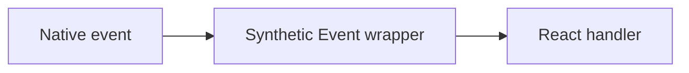

# Synthetic Events

## Detailed explanation
Synthetic Events are React's cross-browser wrapper around native browser events. They provide a consistent event API across browsers and integrate with React's event delegation and update system.

In modern React, event pooling has been removed, so Synthetic Event objects are less surprising than in older React versions. Still, the concept matters because interviewers often ask how React event handling differs from direct DOM events.

## 1. One-line mental model
A Synthetic Event is React's normalized wrapper around a browser event.

## 2. Problem it solves
Browsers have historically had event differences, and React needs a consistent event system that works with component rendering.

## 3. Core idea
- React handlers receive Synthetic Event objects.
- They expose familiar methods like `preventDefault`.
- They wrap native events.
- React uses event delegation internally.
- Modern React no longer pools events.

## 4. Visual / analogy
Synthetic Events are adapters: different browser plugs go into one React socket.



## 5. Minimal example

```tsx
function Form() {
  function handleSubmit(event: React.FormEvent<HTMLFormElement>) {
    event.preventDefault();
  }

  return <form onSubmit={handleSubmit} />;
}
```

## 6. Real-world example

```tsx
function TextField() {
  function handleChange(event: React.ChangeEvent<HTMLInputElement>) {
    const value = event.currentTarget.value;
    trackInput(value);
  }

  return <input onChange={handleChange} />;
}
```

## 7. Common interview questions
- What are Synthetic Events?
- Why does React use Synthetic Events?
- Are Synthetic Events pooled?
- How do you access the native event?
- What is event delegation?
- How do `target` and `currentTarget` differ?
- How do you prevent default behavior?

## 8. Active recall test
1. What does Synthetic Event wrap?
2. Why did React introduce it?
3. What method stops default form reload?
4. Are modern events pooled?
5. What does `currentTarget` mean?

## 9. Mistakes / traps
- Giving old answers that events are still pooled in modern React.
- Confusing `target` and `currentTarget`.
- Forgetting event propagation.
- Accessing DOM directly when event data is enough.
- Using wrong TypeScript event types.

## 10. Compare with related concepts
- **Synthetic Event vs native event:** wrapper vs original browser event.
- **Event delegation vs direct listener:** delegated handling attaches fewer listeners.
- **Event handling vs state updates:** events trigger logic; state updates cause rendering.

## 11. Summary from memory
Explain how React normalizes a form submit event and why `preventDefault` is used.

## 12. Spaced revision prompts
- After 1 day: Define Synthetic Event.
- After 3 days: Explain pooling history.
- After 7 days: Compare `target` and `currentTarget`.
- After 14 days: Explain event delegation.

